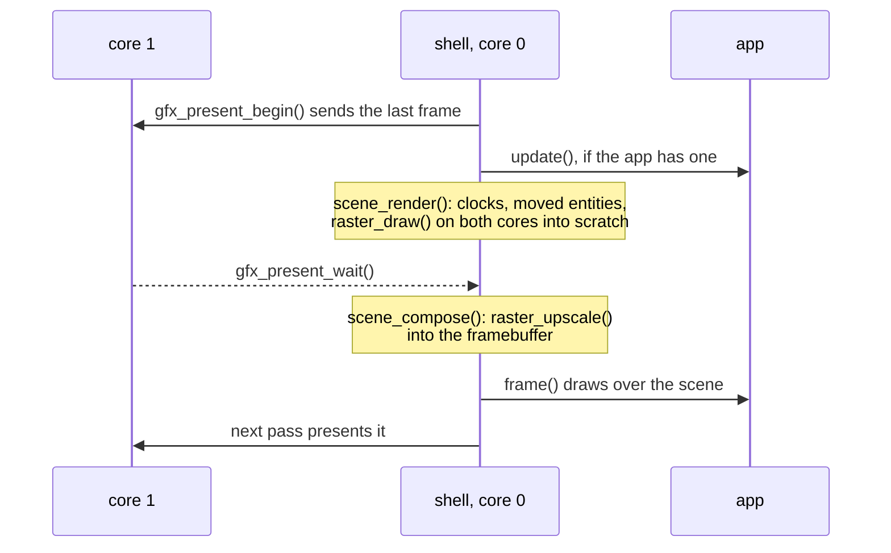

# Scene manager

Scenes are engine machinery the shell drives. An app loads a scene by name and
activates a camera; the shell advances every loaded scene and draws through the
active camera each frame, so an app never calls draw. The code is
`launcher/main/scene/`; [Building-a-Scene.md](Building-a-Scene.md#6-draw-it)
shows an app using it.

## What a scene holds

A scene is one allocation of packed component arrays indexed by a small integer
entity id (`scene_entity_t`). Nothing is allocated per entity.

| Array | One per | Holds |
|---|---|---|
| `transforms[]` | entity | where it stands: a 3x3 and a position, what the raster reads |
| `flags[]` | entity | enabled, and moved since the last draw |
| `renderers[]` | entity that draws | a view of its lit mesh in the asset pack, its entity id, and the placement built from its transform |
| `cameras[]` | camera | lens, optional glTF path, render scale, clear colour, its entity id |
| `instances[]` | renderer | the list the raster draws this frame, refilled from `renderers[]` and `transforms[]` |
| names | entity | the generated table's const strings, looked up only by `scene_find()` |

Array lengths come from the generated `scene_def_t`
([Scene-Files.md](Scene-Files.md#the-scene-table)). Lights are baked offline
and are not carried. Mesh views point into the asset pack, so on the board they
read flash in place and cost no RAM.

## What an app calls

| Call | Meaning |
|---|---|
| `scene_load(name, &why)` | loads the scene beside any already loaded; NULL on failure, and `why` (which may be NULL) says what failed: no such scene, the manager full, no memory, or a mesh the pack could not open, with its id and the pack's status |
| `scene_unload(scene)` | frees it; its camera, if active, is deactivated |
| `scene_find(scene, name)` | the entity with that name |
| `scene_entity_set_transform()` / `_set_enabled()` | move an entity, hide or show a renderer |
| `scene_activate(scene, camera)` | makes that camera (NULL: the first) the one active camera |
| `scene_deactivate()` / `scene_set_paused()` | stop drawing, or hold the scene in place for an app that draws its own full screen |
| `scene_set_render_scale()` | the active camera's render size as a share of the screen |
| `scene_stats()` | triangles and clusters the last draw kept |

Exactly one camera is active engine-wide, and it draws the enabled renderers of
its own scene. Several scenes may be loaded at once; activating another scene's
camera changes what is seen.

## Each frame

`scene_render()` touches no framebuffer, so it runs while the last frame is
still being sent. `scene_compose()` writes the framebuffer and runs once the
send is done; if `scene_render()` did not run (the first frame after
activating), it draws first. An app gets this overlap whenever a camera is
active, with or without `update()`. With no camera active the loop is the plain
one. Every frame redraws the whole picture, a static scene included. A camera
needs the full-framebuffer layout; in band mode the scene is drawn into the
scratch but there is nothing to upscale it into.

`scene_render()` advances the clock of every loaded scene, then rebuilds the
placement of each renderer whose entity moved, fills `instances[]` from the
enabled renderers and draws. The raster's scratch block is the engine's, sized
for the largest enabled mesh and the render size, and grown only when a bigger
one is drawn.

## Ownership

A scene belongs to the app running when it was loaded. When an app exits the
shell runs its systems' `app_exit` phase, which for scenes is
`scene_unload_all()`: it unloads every scene and frees the
scratch, so nothing an app loaded outlives it. An app may unload a scene itself
sooner.

Scenes are not taken from the app arena: it gives memory back only in the
reverse order it was taken, and scenes unload in any order. Meshes are opened
from an `asset_pack_t`; `scene_load_from()` takes the pack, so a test can load
from one it builds.

## Beneath it

The raster API (`raster_draw()`, `raster_upscale()`) is what host tools and
tests call. `r3d_scene_camera_at()` samples the active camera's path.

The shell's half of the API (the two frame halves and the unload on exit) is
`scene/scene_shell.h`; apps and generated tables include only `scene/scene.h`.
The shell does not call it by name: `shell/scene_system.c` registers it as the
engine system `scene`, at `SHELL_ORDER_SCENE`
([Firmware-Architecture.md](../Firmware-Architecture.md#engine-systems)).
