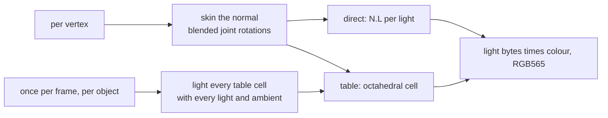
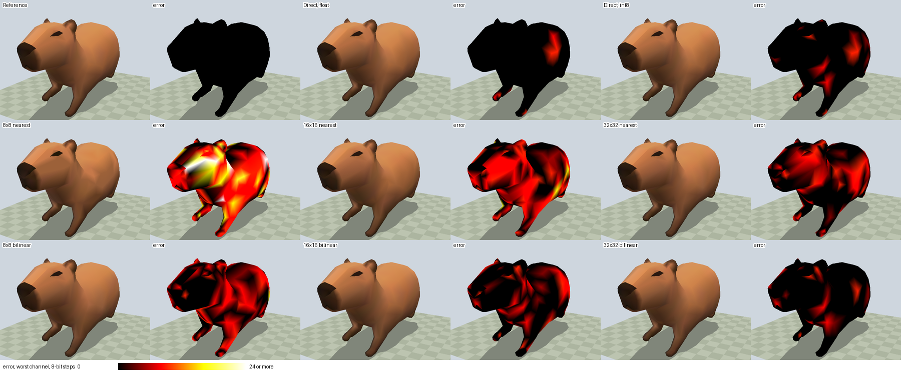

# Skinned-Mesh Lighting

A skinned mesh bends at run time, so its light cannot be baked into its vertex
colours the way a static mesh's is. This page measures two ways to light it
every frame, on the host, before the path is built: direct N.L per vertex, and
a per-object lookup table indexed by the skinned normal.



| Variant | Per vertex |
|---|---|
| Reference | float bind normal, skinned, renormalised, N.L per light |
| Direct | skinned, not renormalised, N.L per light; bind normal as float or int8 per axis |
| Table, nearest | int8 bind normal, skinned, its octahedral point (`vec3f_octahedral`, any length) picks one cell |
| Table, bilinear | the same point blends the four nearest cell centres with 8-bit weights |

Each table cell holds the light of its centre's direction as three bytes. A
cell's direction is fixed, so the directions are one table shared by every
object; the light bytes are rebuilt per object per frame. Every variant ends in
the same integer stage, so only the light bytes differ. Lights are four
directional lights plus ambient in object space; the 1- and 2-light rows use
the first of them.

## Results

The mesh is a glTF export of the capybara (`render_lab/assets/capybara.blend`),
four influences per vertex, every frame of every clip at 30 fps. `mul`, `add`,
`div` and `sqrt` count float operations per vertex, read off each kernel in
[skin_light_bench.c](../../launcher/tools/r3d/skin_light/skin_light_bench.c),
as the board's proxy: host nanoseconds do not carry over to the S3's FPU, where
a divide or square root costs several instructions.

Per-vertex cost, the table's build excluded:

<!-- generated: skin-light-cost sha256=19282ac02079b48437b12ce568dcf267c201e05dd6c3e2da2b41b413c651906a -->
613 vertices x 242 frames, median of 15 runs; host compiler 16.1.0.

| Variant | Lights | mul | add | div | sqrt | other | int mul | ns/vertex |
|---|---:|---:|---:|---:|---:|---:|---:|---:|
| Skin only (shared) | any | 45 | 33 | 0 | 0 | 0 | 0 | 6.5 |
| Reference: float normal, renormalised | 1 | 57 | 40 | 1 | 1 | 7 | 0 | 10.0 |
| Reference: float normal, renormalised | 2 | 63 | 45 | 1 | 1 | 8 | 0 | 11.1 |
| Reference: float normal, renormalised | 4 | 75 | 55 | 1 | 1 | 10 | 0 | 14.2 |
| Direct: float normal | 1 | 51 | 38 | 0 | 0 | 7 | 0 | 7.6 |
| Direct: float normal | 2 | 57 | 43 | 0 | 0 | 8 | 0 | 8.5 |
| Direct: float normal | 4 | 69 | 53 | 0 | 0 | 10 | 0 | 10.3 |
| Direct: int8 normal | 1 | 51 | 38 | 0 | 0 | 10 | 0 | 8.3 |
| Direct: int8 normal | 2 | 57 | 43 | 0 | 0 | 11 | 0 | 9.3 |
| Direct: int8 normal | 4 | 69 | 53 | 0 | 0 | 13 | 0 | 11.7 |
| Table 8x8 nearest: int8 normal | any | 49 | 39 | 1 | 0 | 13 | 0 | 9.4 |
| Table 16x16 nearest: int8 normal | any | 49 | 39 | 1 | 0 | 13 | 0 | 9.4 |
| Table 32x32 nearest: int8 normal | any | 49 | 39 | 1 | 0 | 13 | 0 | 9.4 |
| Table 8x8 bilinear: int8 normal | any | 51 | 41 | 1 | 0 | 21 | 18 | 16.4 |
| Table 16x16 bilinear: int8 normal | any | 51 | 41 | 1 | 0 | 21 | 18 | 16.6 |
| Table 32x32 bilinear: int8 normal | any | 51 | 41 | 1 | 0 | 21 | 18 | 16.6 |
<!-- /generated: skin-light-cost -->

The table's build, per object per frame, and what it adds per vertex at the
capybara's vertex count and at 1500:

<!-- generated: skin-light-build sha256=a5b002f55a317fb9a365d9af3c58e198fca39be7ae991f28df709c6173e29e88 -->
| Table | Cells | Bytes per object | Shared direction bytes | Lights | mul | add | div | sqrt | other | int mul | Build us/frame | Build ns/vertex, 613 vertices | Build ns/vertex, 1500 vertices |
|---|---:|---:|---:|---:|---:|---:|---:|---:|---:|---:|---:|---:|---:|
| 8x8 | 64 | 256 | 768 | 1 | 384 | 320 | 0 | 0 | 448 | 0 | 0.12 | 0.2 | 0.1 |
| 8x8 | 64 | 256 | 768 | 2 | 768 | 640 | 0 | 0 | 512 | 0 | 0.16 | 0.3 | 0.1 |
| 8x8 | 64 | 256 | 768 | 4 | 1536 | 1280 | 0 | 0 | 640 | 0 | 0.24 | 0.4 | 0.2 |
| 16x16 | 256 | 1024 | 3072 | 1 | 1536 | 1280 | 0 | 0 | 1792 | 0 | 0.42 | 0.7 | 0.3 |
| 16x16 | 256 | 1024 | 3072 | 2 | 3072 | 2560 | 0 | 0 | 2048 | 0 | 0.57 | 0.9 | 0.4 |
| 16x16 | 256 | 1024 | 3072 | 4 | 6144 | 5120 | 0 | 0 | 2560 | 0 | 0.88 | 1.4 | 0.6 |
| 32x32 | 1024 | 4096 | 12288 | 1 | 6144 | 5120 | 0 | 0 | 7168 | 0 | 1.56 | 2.6 | 1.0 |
| 32x32 | 1024 | 4096 | 12288 | 2 | 12288 | 10240 | 0 | 0 | 8192 | 0 | 2.26 | 3.7 | 1.5 |
| 32x32 | 1024 | 4096 | 12288 | 4 | 24576 | 20480 | 0 | 0 | 10240 | 0 | 3.55 | 5.8 | 2.4 |
<!-- /generated: skin-light-build -->

Error against the reference over every vertex of every frame. Light byte is the
0-255 light of one channel; RGB565 step is one step of a 5- or 6-bit output
channel:

<!-- generated: skin-light-quality sha256=d83a7e95025cd3f03196e60eb3c677384541122647cde9cc2cefc3cfc7670549 -->
| Variant | Lights | Light byte max | Light byte mean | RGB565 max step | RGB565 mean step | Vertices changed |
|---|---:|---:|---:|---:|---:|---:|
| Direct: float normal | 1 | 65 | 0.14 | 3 | 0.010 | 2.5% |
| Direct: float normal | 2 | 63 | 0.19 | 4 | 0.013 | 3.4% |
| Direct: float normal | 4 | 63 | 0.38 | 4 | 0.030 | 7.0% |
| Direct: int8 normal | 1 | 65 | 0.26 | 3 | 0.019 | 5.2% |
| Direct: int8 normal | 2 | 63 | 0.34 | 4 | 0.023 | 6.2% |
| Direct: int8 normal | 4 | 63 | 0.52 | 4 | 0.038 | 9.5% |
| Table 8x8 nearest: int8 normal | 1 | 88 | 6.87 | 10 | 0.540 | 41.1% |
| Table 8x8 nearest: int8 normal | 2 | 88 | 8.23 | 10 | 0.632 | 53.0% |
| Table 8x8 nearest: int8 normal | 4 | 68 | 7.50 | 8 | 0.566 | 58.0% |
| Table 16x16 nearest: int8 normal | 1 | 47 | 3.50 | 6 | 0.271 | 35.8% |
| Table 16x16 nearest: int8 normal | 2 | 47 | 4.24 | 6 | 0.315 | 45.5% |
| Table 16x16 nearest: int8 normal | 4 | 40 | 3.96 | 5 | 0.278 | 44.5% |
| Table 32x32 nearest: int8 normal | 1 | 23 | 1.72 | 3 | 0.137 | 25.8% |
| Table 32x32 nearest: int8 normal | 2 | 23 | 2.11 | 3 | 0.164 | 31.2% |
| Table 32x32 nearest: int8 normal | 4 | 20 | 2.02 | 3 | 0.148 | 31.6% |
| Table 8x8 bilinear: int8 normal | 1 | 46 | 3.11 | 5 | 0.238 | 37.0% |
| Table 8x8 bilinear: int8 normal | 2 | 46 | 3.74 | 5 | 0.282 | 45.3% |
| Table 8x8 bilinear: int8 normal | 4 | 42 | 3.31 | 5 | 0.254 | 46.5% |
| Table 16x16 bilinear: int8 normal | 1 | 22 | 1.08 | 3 | 0.082 | 18.0% |
| Table 16x16 bilinear: int8 normal | 2 | 22 | 1.35 | 3 | 0.101 | 21.8% |
| Table 16x16 bilinear: int8 normal | 4 | 22 | 1.39 | 3 | 0.105 | 24.4% |
| Table 32x32 bilinear: int8 normal | 1 | 12 | 0.34 | 2 | 0.027 | 7.0% |
| Table 32x32 bilinear: int8 normal | 2 | 12 | 0.46 | 2 | 0.035 | 8.6% |
| Table 32x32 bilinear: int8 normal | 4 | 11 | 0.51 | 1 | 0.039 | 10.5% |
<!-- /generated: skin-light-quality -->

One gallop frame under four lights; the error tiles compare the RGB565 output
with the reference's:



## Recommendation

- **A 16x16 table, bilinear.** Its per-vertex cost is flat in the light
  count and close to direct lighting with four lights once its build is
  spread over the capybara's vertices. Nearest lookup at 16x16 bands
  visibly; 32x32 nearest only matches 16x16 bilinear's error at four times
  the build and the memory; 32x32 bilinear is the most accurate but its
  build costs more per vertex than the lighting it replaces at this vertex
  count.
- **int8 bind normals.** They add less error than the RGB565 output already
  has.
- **No renormalising.** The octahedral map ignores length, so the table path
  never needs it. Direct lighting without it has the worst maximum error of
  any direct row: linear blending shortens the normal where joints of
  different rotation meet, which darkens those vertices (the hip in the
  sheet).

The board check prices what the host cannot: the divide in the octahedral map
and the bilinear blend's integer multiplies against the build's float work.

## Reproduce

From the repository root, with a glTF export of the capybara (Blender's glTF
exporter: deform bones, every action as an animation, four influences):

```sh
launcher/tools/r3d/skin_light/report_skin_light.sh capybara.glb
```

It builds and runs the benchmark, redraws the sheet and rewrites the three
tables above.
