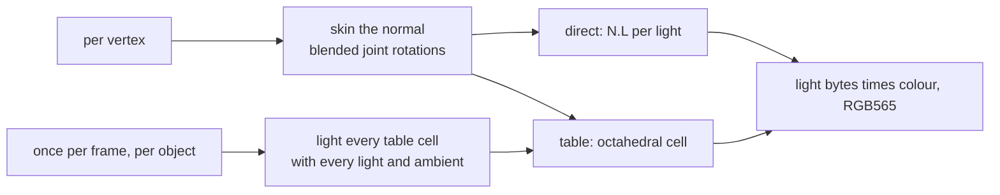

# Skinned-Mesh Lighting

A skinned mesh bends at run time, so its light cannot be baked into its vertex
colours the way a static mesh's is. This page measures two ways to light it
every frame, on the host: direct N.L per vertex, and a per-object lookup table
indexed by the skinned normal.



| Variant | Per vertex |
|---|---|
| Reference | float bind normal, skinned, renormalised, N.L per light |
| Direct | skinned, not renormalised, N.L per light; bind normal as float or int8 per axis |
| Table, nearest | int8 bind normal, skinned, its octahedral point (`vec3f_octahedral`, any length) picks one cell |
| Table, bilinear | the same point blends the four nearest cell centres with 8-bit weights |

Each table cell holds the light of its centre's direction as three bytes, padded to
four. A cell's direction is fixed, so the directions are one table shared by
every object; the light bytes are rebuilt per object per frame. Every variant ends in
the same integer stage, so only the light bytes differ. Lights are
directional lights plus ambient in object space; each light-count row uses
the first lights of `LIGHTS` in the benchmark.

## Results

The mesh is the hand-rigged capybara's glTF export, the cached bake
`python launcher/tools/bake/bake.py path capybara.glb` prints, passed to
`report_skin_light.sh`:
four influences per vertex, every frame of every clip. `mul`, `add`,
`div` and `sqrt` count float operations per vertex, read off each kernel in
[skin_light_bench.c](../../launcher/tools/r3d/skin_light/skin_light_bench.c),
as the board's proxy: host nanoseconds do not carry over to the S3's FPU, where
a divide or square root costs several instructions.

Per-vertex cost, the table's build excluded:

<!-- generated: skin-light-cost sha256=0230fcd048f963d58473099bf7c659d0c563c90aebe08d5985e009788ac43922 -->
613 vertices x 242 frames, median of 15 runs; host compiler 16.1.0.

| Variant | Lights | mul | add | div | sqrt | other | int mul | ns/vertex |
|---|---:|---:|---:|---:|---:|---:|---:|---:|
| Skin only (shared) | any | 45 | 33 | 0 | 0 | 0 | 0 | 6.1 |
| Reference: float normal, renormalised | 1 | 57 | 40 | 1 | 1 | 7 | 0 | 9.3 |
| Reference: float normal, renormalised | 2 | 63 | 45 | 1 | 1 | 8 | 0 | 10.6 |
| Reference: float normal, renormalised | 4 | 75 | 55 | 1 | 1 | 10 | 0 | 13.9 |
| Reference: float normal, renormalised | 8 | 99 | 75 | 1 | 1 | 14 | 0 | 20.9 |
| Direct: float normal | 1 | 51 | 38 | 0 | 0 | 7 | 0 | 7.5 |
| Direct: float normal | 2 | 57 | 43 | 0 | 0 | 8 | 0 | 8.4 |
| Direct: float normal | 4 | 69 | 53 | 0 | 0 | 10 | 0 | 9.9 |
| Direct: float normal | 8 | 93 | 73 | 0 | 0 | 14 | 0 | 12.9 |
| Direct: int8 normal | 1 | 51 | 38 | 0 | 0 | 10 | 0 | 7.6 |
| Direct: int8 normal | 2 | 57 | 43 | 0 | 0 | 11 | 0 | 8.4 |
| Direct: int8 normal | 4 | 69 | 53 | 0 | 0 | 13 | 0 | 10.5 |
| Direct: int8 normal | 8 | 93 | 73 | 0 | 0 | 17 | 0 | 13.7 |
| Table 8x8 nearest: int8 normal | any | 49 | 39 | 1 | 0 | 13 | 0 | 8.8 |
| Table 16x16 nearest: int8 normal | any | 49 | 39 | 1 | 0 | 13 | 0 | 8.8 |
| Table 32x32 nearest: int8 normal | any | 49 | 39 | 1 | 0 | 13 | 0 | 8.8 |
| Table 8x8 bilinear: int8 normal | any | 51 | 41 | 1 | 0 | 21 | 18 | 16.3 |
| Table 16x16 bilinear: int8 normal | any | 51 | 41 | 1 | 0 | 21 | 18 | 16.3 |
| Table 32x32 bilinear: int8 normal | any | 51 | 41 | 1 | 0 | 21 | 18 | 16.3 |
<!-- /generated: skin-light-cost -->

The table's build, per object per frame, and what it adds per vertex at the
capybara's vertex count and at a larger mesh's (`LARGE_MESH`):

<!-- generated: skin-light-build sha256=3be8439a05172d66dc570d6d8ebaca6d4e1416567b4c59eb393948609cabb2c1 -->
| Table | Cells | Bytes per object | Shared direction bytes | Lights | mul | add | div | sqrt | other | int mul | Build us/frame | Build ns/vertex, 613 vertices | Build ns/vertex, 1500 vertices |
|---|---:|---:|---:|---:|---:|---:|---:|---:|---:|---:|---:|---:|---:|
| 8x8 | 64 | 256 | 768 | 1 | 384 | 320 | 0 | 0 | 448 | 0 | 0.10 | 0.2 | 0.1 |
| 8x8 | 64 | 256 | 768 | 2 | 768 | 640 | 0 | 0 | 512 | 0 | 0.14 | 0.2 | 0.1 |
| 8x8 | 64 | 256 | 768 | 4 | 1536 | 1280 | 0 | 0 | 640 | 0 | 0.21 | 0.3 | 0.1 |
| 8x8 | 64 | 256 | 768 | 8 | 3072 | 2560 | 0 | 0 | 896 | 0 | 0.37 | 0.6 | 0.2 |
| 16x16 | 256 | 1024 | 3072 | 1 | 1536 | 1280 | 0 | 0 | 1792 | 0 | 0.40 | 0.6 | 0.3 |
| 16x16 | 256 | 1024 | 3072 | 2 | 3072 | 2560 | 0 | 0 | 2048 | 0 | 0.55 | 0.9 | 0.4 |
| 16x16 | 256 | 1024 | 3072 | 4 | 6144 | 5120 | 0 | 0 | 2560 | 0 | 0.85 | 1.4 | 0.6 |
| 16x16 | 256 | 1024 | 3072 | 8 | 12288 | 10240 | 0 | 0 | 3584 | 0 | 1.49 | 2.4 | 1.0 |
| 32x32 | 1024 | 4096 | 12288 | 1 | 6144 | 5120 | 0 | 0 | 7168 | 0 | 1.55 | 2.5 | 1.0 |
| 32x32 | 1024 | 4096 | 12288 | 2 | 12288 | 10240 | 0 | 0 | 8192 | 0 | 2.26 | 3.7 | 1.5 |
| 32x32 | 1024 | 4096 | 12288 | 4 | 24576 | 20480 | 0 | 0 | 10240 | 0 | 3.54 | 5.8 | 2.4 |
| 32x32 | 1024 | 4096 | 12288 | 8 | 49152 | 40960 | 0 | 0 | 14336 | 0 | 6.39 | 10.4 | 4.3 |
<!-- /generated: skin-light-build -->

Error against the reference over every vertex of every frame. Light byte is the
0-255 light of one channel; RGB565 step is one step of a 5- or 6-bit output
channel:

<!-- generated: skin-light-quality sha256=35b7fdbca2f282d1985104ac1033ec11e65c91a45ffff04af2c0a26ade01abb4 -->
| Variant | Lights | Light byte max | Light byte mean | RGB565 max step | RGB565 mean step | Vertices changed |
|---|---:|---:|---:|---:|---:|---:|
| Direct: float normal | 1 | 65 | 0.14 | 3 | 0.010 | 2.5% |
| Direct: float normal | 2 | 63 | 0.19 | 4 | 0.013 | 3.4% |
| Direct: float normal | 4 | 63 | 0.38 | 4 | 0.030 | 7.0% |
| Direct: float normal | 8 | 60 | 0.46 | 4 | 0.033 | 7.4% |
| Direct: int8 normal | 1 | 65 | 0.26 | 3 | 0.019 | 5.2% |
| Direct: int8 normal | 2 | 63 | 0.34 | 4 | 0.023 | 6.2% |
| Direct: int8 normal | 4 | 63 | 0.52 | 4 | 0.038 | 9.5% |
| Direct: int8 normal | 8 | 60 | 0.60 | 4 | 0.042 | 10.1% |
| Table 8x8 nearest: int8 normal | 1 | 88 | 6.87 | 10 | 0.540 | 41.1% |
| Table 8x8 nearest: int8 normal | 2 | 88 | 8.23 | 10 | 0.632 | 53.0% |
| Table 8x8 nearest: int8 normal | 4 | 68 | 7.50 | 8 | 0.566 | 58.0% |
| Table 8x8 nearest: int8 normal | 8 | 60 | 7.21 | 8 | 0.539 | 61.8% |
| Table 16x16 nearest: int8 normal | 1 | 47 | 3.50 | 6 | 0.271 | 35.8% |
| Table 16x16 nearest: int8 normal | 2 | 47 | 4.24 | 6 | 0.315 | 45.5% |
| Table 16x16 nearest: int8 normal | 4 | 40 | 3.96 | 5 | 0.278 | 44.5% |
| Table 16x16 nearest: int8 normal | 8 | 42 | 3.95 | 5 | 0.285 | 47.9% |
| Table 32x32 nearest: int8 normal | 1 | 23 | 1.72 | 3 | 0.137 | 25.8% |
| Table 32x32 nearest: int8 normal | 2 | 23 | 2.11 | 3 | 0.164 | 31.2% |
| Table 32x32 nearest: int8 normal | 4 | 20 | 2.02 | 3 | 0.148 | 31.6% |
| Table 32x32 nearest: int8 normal | 8 | 21 | 2.03 | 3 | 0.149 | 31.9% |
| Table 8x8 bilinear: int8 normal | 1 | 46 | 3.11 | 5 | 0.238 | 37.0% |
| Table 8x8 bilinear: int8 normal | 2 | 46 | 3.74 | 5 | 0.282 | 45.3% |
| Table 8x8 bilinear: int8 normal | 4 | 42 | 3.31 | 5 | 0.254 | 46.5% |
| Table 8x8 bilinear: int8 normal | 8 | 42 | 3.44 | 5 | 0.261 | 47.3% |
| Table 16x16 bilinear: int8 normal | 1 | 22 | 1.08 | 3 | 0.082 | 18.0% |
| Table 16x16 bilinear: int8 normal | 2 | 22 | 1.35 | 3 | 0.101 | 21.8% |
| Table 16x16 bilinear: int8 normal | 4 | 22 | 1.39 | 3 | 0.105 | 24.4% |
| Table 16x16 bilinear: int8 normal | 8 | 22 | 1.41 | 3 | 0.108 | 25.7% |
| Table 32x32 bilinear: int8 normal | 1 | 12 | 0.34 | 2 | 0.027 | 7.0% |
| Table 32x32 bilinear: int8 normal | 2 | 12 | 0.46 | 2 | 0.035 | 8.6% |
| Table 32x32 bilinear: int8 normal | 4 | 11 | 0.51 | 1 | 0.039 | 10.5% |
| Table 32x32 bilinear: int8 normal | 8 | 11 | 0.52 | 2 | 0.039 | 10.4% |
<!-- /generated: skin-light-quality -->

One gallop frame under the sheet's light count (`SHEET_LIGHTS`); the error
tiles compare the RGB565 output
with the reference's:


## Recommendation

The host and the float-operation counts disagree, and the board decides
between them:

- **On the host, direct N.L is faster than every bilinear table at every light
  count measured**; only nearest lookup overtakes it as lights are added, at
  the faceted error the sheet shows. Its mean error is lower than any 16x16
  table's. Only its maximum error is worse: linear blending shortens the
  normal where joints of different rotation meet and darkens those vertices
  (the hip in the sheet), and renormalising costs a square root and a divide
  per vertex.
- **In float operations the table wins from four lights up**, because its
  lookup does not grow with the light count and its build is spread over
  the mesh's vertices; what it adds instead, a divide and the bilinear
  blend's integer multiplies, is what only the board can price.

If the board confirms the float counts, build **a 16x16 table, bilinear**:
nearest lookup at 16x16 shows faceted error in the sheet, 32x32 nearest only
comes near 16x16 bilinear's error at four times the build and the memory,
and 32x32 bilinear's build costs more per vertex than the lighting it
replaces at the capybara's vertex count. The table path never renormalises,
because the octahedral map ignores length. Otherwise light directly, and
renormalise if the darkened joints show.

Either way, **int8 bind normals**: they leave the maximum RGB565 error
unchanged and add a fraction of one step on average.

## Reproduce

From the repository root, with the committed glTF export that
`report_skin_light.sh` names:

```sh
launcher/tools/r3d/skin_light/report_skin_light.sh ASSET.glb gallop
```

It builds and runs the benchmark, redraws the sheet and rewrites the three
tables above.
