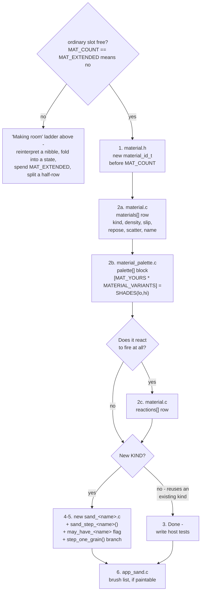

# Adding a Material

A practical checklist for extending `main/apps/sand/`'s material table. Read
[`Sand-Simulation.md`](Sand-Simulation.md) first if you have not - this
assumes you already know what `material_t`, `material_kind_t`, and the main
sweep's no-double-move guarantee are.

---

## The map: two independent axes

A material is two orthogonal decisions, and confusing them is the most
common way to over-build. **How it moves** is `materials[]`. **How it
reacts** is `reactions[]`. Neither constrains the other.

**Lava is the clearest proof the axes are independent** - its own comment
in `material.c` says exactly that: `KIND_LIQUID`, the same kind as
ordinary water, and simultaneously a heat source that ignites its
neighbours and flares, with not one line of movement code anywhere
knowing about the combination. A `KIND_POWDER` material that is also
flammable needs a `reactions[]` row and *nothing else* - no new pass, no
movement code, no branch anywhere.

---

## The two-part question

Every material decomposes into the same two questions, and they are
independent of each other:

1. **Does it move like something that already exists?** `KIND_POWDER`
   (falls, piles at an angle of repose) and `KIND_LIQUID` (falls, spreads
   flat as an amount) are the two shapes on offer, plus `KIND_GAS`
   (rises, disperses) and `KIND_STATIC` (never moves). If your material's
   movement is genuinely one of these, reusing the existing kind and
   just giving it its own row in `materials[]` - different density,
   slip, repose, scatter - is the *entire* implementation. This is the
   common case, and the reason the material table is designed the way
   it is: "adding a material is a row here rather than a branch in the
   movement code" (`material.h`'s own header comment).

2. **Does it need a new KIND?** `material_kind_t` has exactly five values
   - `NONE`/`STATIC`/`POWDER`/`LIQUID`/`GAS` - and only one of them,
   `KIND_GAS`, was ever added after the founding three (sand, water,
   stone) established the first three. Every ordinary and extended
   material shipped since has reused one of the existing four. That is
   the honest odds: a genuinely new movement shape is rare, and it is the
   harder path - a new file, a second sweep pass, and real performance
   work, covered below.

If your answer to (1) is yes, stop reading here and go do that - a new
row in `materials[]` plus a palette entry (see "The mechanical part"
below) is the whole job.

---

## Where your change actually lands

[`Architecture.md`](Architecture.md#one-step-in-order) has the full step
pipeline; the rule that matters here is narrower. Every pass a new `KIND`
needs runs **after** the main sweep and **before** `finalize_settling()`,
gated behind its own `may_have_<kind>` flag - checked inside the pass as a
cheap early-out, and once the pass is measured, at its call site in
`sand_step()` too, so a material that never appears on the grid costs
nobody's frame budget. The ordering is not cosmetic: `BLOCK_ACTIVE` has to
reflect the *whole* step, not just whichever pass ran first - see the
comment at the call site in `sand.c`.

---

## Design questions worth working through before writing code

Not all of these apply to every new material, but check each one -
skipping one silently is how a material ships broken in a way host tests
might not catch.

**Does the no-double-move guarantee hold for this material's own primary
direction?** The main sweep sweeps *against* gravity, so a gravity-ward
move (even partial, like a liquid's fall-then-slide) can join it. Anything
else - anti-gravity, like gas, or some other fixed direction - needs its
**own pass**, swept so that direction's moves land in already-visited
territory. Get this wrong and a grain that should move one cell a step
teleports across the grid, because the sweep re-visits a cell it just
moved into.

**Can it reuse the existing movement primitives, direction-inverted?**
`try_fall_or_scatter()`/`try_slide()` (`sand_priv.h`, wrappers in
`sand.c`) take a plain `(dx, dy)` and are not hardcoded to "down", so a
negated direction gives correct rise-and-slide for free. That covers
rising/falling plus diagonal sliding under friction, but **not** flat
spreading - `equalise_liquids()`/`equalise_gas()`'s own second sub-pass
does that, and skipping it is a real trap. Gas itself has since moved off
this route to a biased random walk instead (`gas_walk_once()`,
`sand_gas.c` - the exhaustive primitives cost more exactly when the grid
is full and every candidate is blocked), kept reachable via
`sand_set_gas_walk(false)` for comparison. If nothing existing fits,
think hard about whether the material is really a new `KIND`.

**Whole-grain or mass-based?** `KIND_POWDER` swaps whole grains
(`move_to()`); `KIND_LIQUID` moves an amount per cell
(`give_mass()`/`pour_into()`, 1-15 via `CELL_VARIANT`). Whole-grain is
the smaller diff when reusing an existing kind, but reads as discrete
grains rather than a thinning cloud - a real visual decision.

**What is its density, relative to every other material?** `can_enter()`
only ever admits a *strictly* denser mover into a `KIND_LIQUID` or
`KIND_GAS` target - never a powder or a static, regardless of density.
Pick a density that makes every displacement relationship you want come
out true - gas's `10` (between empty's `0` and water's `30`) lets sand
and water sink through it for free, purely because that rule already
runs in the main sweep. The current ladder (movement density,
`materials[]` - not an extended static's own `dislodge_density`, see
"Making room" below):

```
empty 0 < steam 5 < smoke 7 < gas 10 < fire 15 = snow 15 < oil 22 <
water 30 < acid 38 < lava 45 < gunpowder 50 < sand 60 < dirt 62 <
glass 121 < wood 141 < stone 181
```

Oil and lava straddle water deliberately - oil floats, lava sinks, both
free from the one rule. Gunpowder sits between lava and sand: it sinks in
every liquid, and sand/dirt rest on it rather than mixing in, since a
powder never sinks through another powder at rest (`can_enter()` only
admits liquid/gas targets) - the gap to sand only matters under an
impulse, where a blast sorts the heavier grit out.

The mechanism a kind goes through decides whether a relationship needs
code at all: a **powder**'s "lighter than water" already means "floats",
for free, through `can_enter()`; a **liquid** never consults
`can_enter()` at all, which is why oil floating on water needed its own
rule. **Check the mechanism before assuming a density gap is enough.**
Two consequences worth knowing, both real limitations rather than bugs:

- **Equal density blocks, it does not mix.** `can_enter()` needs
  *strictly* greater density - steam (5) and smoke (7) keep a deliberate
  gap for exactly this reason.
- **Mobility is not expressible in `can_enter()`.** Steam cannot enter
  standing water (the rule wants a denser mover) and water cannot fall
  into steam either (`room_in()` refuses a cell holding a different
  material outright) - `try_bubble()` (`sand_gas.c`) is the fix, a
  straight two-cell swap living in the warm tier. When a rule cannot
  express what you need, extending the cold or warm pass is usually
  right; teaching the hot predicate is usually wrong.
- **Two liquids of different density need a reversed pass, and it is not
  free.** Phrasing a fix as "the denser one moves DOWN" inherits the main
  sweep's no-double-move guarantee; "the lighter one rises" needs its own
  pass - `float_lighter_liquids()` (`sand_liquid.c`). What it costs is the
  ordering guarantee: sweep order protects the mover, never the cell it
  displaces, so budget for the displaced cell.

**Does it need `slip`/`repose` at "no resistance", like a liquid, even
if whole-grain?** Gas copies water's `slip = 255`/`repose = 0` even
though it moves through the powder primitives - those values already
mean "never held back" to `slide_chance()`/`driven_by_gravity()`.

**Does the movement direction interact with `driven_by_gravity()`
correctly?** Its friction check is a dot product against the *real*
gravity vector - if a material's primary direction is not gravity itself
(gas's is the negation of it), its slide vectors need checking against a
matching negated vector too, or the dot product is negative for every
slide and the material never slides. `sand_gas.c` builds its own
`driven_gas[][]` table against `(-gx, -gy)` for this reason.

**Can a player actually build the scene this material needs?** The
question that has cost the most rework, twice, in the same shape. A rule
specified as reaching exactly one conductor cell is unbuildable through
the real brush - a hand drag is never one cell thick
(`POUR_RADIUS_PX`/`ERASE_RADIUS_PX` in `app_sand.c`, 10/16 px, ~5 cells
radius at the finest 2 px/cell zoom). The fix that generalises: an
*attenuating* walk (crossing `d` cells succeeds at `(conducts/256)^d`)
instead of a hard "exactly N", so thickness costs time rather than being
a wall. A walk like that still needs a cost cap
(`CONDUCT_REACH`, 32 cells, `sand_reactions.c`) - which is a statement
about cost, not physics: size it past anything the brush can build, so
the probability curve is what limits the result, never the cap itself.
If you cannot tell which one is biting in your own test, the cap is too
tight. Before finalising a constant that describes a distance in cells:
look up the real brush radii, assume the sloppiest plausible
construction, and build the fixture at that thickness.

**Does a predicate named after a physical concept mean what you think in
the state the feature actually runs in?** `touches_air()` counts a cell
as air if empty *or* `KIND_GAS` - because a flame resting on the fuel it
just ignited is not empty space, and the naive reading would make the
flame's own presence hide its own fuel from ever reading as exposed.

**When a reaction turns one material into another, do the new
material's movement rules still make sense for what just happened?**
Wood catching fire could not simply become `MAT_FIRE`: fire is
`KIND_GAS`, so a burning log would rise and drift away instead of
staying put to ignite its neighbour - why burning is a *state* of wood
(`reaction_t.burn_decay`), not a transition. See "Making room" below.

**When two materials differ mainly in appearance, does a test assert
the appearance?** `MAT_STEAM` and `MAT_SMOKE` share almost the same
`materials[]` row and were one material at first - wrong, because the
overlap is real in the physics and false in the picture (a fire burning
out with nothing to boil should not puff obvious kettle-steam). The
palette is what makes them tellable apart, so here it is load-bearing:
`test_steam_and_smoke_are_told_apart_by_brightness` pins steam at ≥89
luminance brighter than smoke at equal life, with the *ranges* never
overlapping at all (freshest smoke, 122, still dimmer than dying steam,
132).

---

## Making room: the material-slot ladder

A cell is one byte: four bits of material, four of variant. Zero is empty,
so there are 15 material slots, and **zero ordinary ones are free** - 14
materials plus `MAT_EXTENDED`, the doorway below. Five ways to make more
room, cheapest first, two of which mostly do not and one that looks like a
way and is not:

**1. Reinterpret a nibble.** Free, and already the pattern: liquids read
the variant as fill, transients as life remaining, glass and stone as
temperature, wood as burn progress. A material needing two small
quantities can read its own nibble *by state* - one range meaning one
thing, a disjoint range meaning another - the way dirt does (variant 0-7 a
dry tone, 8-14 moisture 1-7). This adds no slot, it removes the *need* for
one. Always ask this first, since the answer costs nothing to try.

**2. Make a material a state of another one - possible only when the
VARIANT can carry it.** The tables are indexed by the material nibble
alone, so two states of one material share `density`, `slip`, `repose`
and `scatter`. What decides it is which table the differences live in,
and whether the variant is free to name the state. Ember is the worked
example: it differs from wood in seven fields, only one (`decay`) in the
movement table, and wood's variant was free to name it - so ember is a
state of wood (`burn_decay` non-zero, `cell_is_burning()`), and water
puts a log out and leaves the log. The rule: what forces a slot is
needing a different row in the
table the sweep reads, or having no spare variant bits to name the
state. Steam and smoke fail this test on both counts - identical
reaction rows, but five differing *movement* fields, and both already
spend their variant on life remaining.

**3. Spend the extended range on anything stateless** - built, and mostly
used up. `MAT_EXTENDED` (id 15) is a doorway: a cell carrying it reads its
low nibble as naming one of `MATERIAL_EXTENDED_COUNT` (8) further
materials, sharing one `density`/`kind`/`slip`/`repose`/`scatter` row and
one entry each in `palette[256]` and `reactions[]` (read only by the cold
pass, where decoding the extended id costs nothing that matters). What an
extended static cannot have is anything the *hot* path would need to
read - its own physics, or a variant. A plant is the case that proves this
is narrower than "inert solids only": its growth is *spatial* (more
cells, not a counter), so it needs no bits at all, and it moves in the
cold pass rather than the shared `KIND_STATIC` row, under a rule that only
moves a cell into empty space. The trade the extended range actually
offers is not "no state" but *state you are willing to re-derive from the
grid, in the cold pass, every time you need it*. Today: `MATX_ICE`,
`MATX_PLANT`, `MATX_LEAF`, `MATX_METAL`, `MATX_ROOT` used, 3 codes spare.

**4. Split an extended half-row** - built, for gunpowder, and the
expensive option once (3) runs out. A nibble has a top bit like any other
value: split `MAT_EXTENDED`'s low nibble by bit 3, and the two halves
become two independent rows in a doubled `materials[]` (`MATERIAL_ROWS`,
32, indexed by `cell >> 3`; `TWIN_ROW()` in `material.c` writes every
ordinary material into both of its twin rows, so this is invisible to
the fourteen ordinary materials). `0xF0`-`0xF7` stays the
extended-statics doorway, unchanged; `0xF8`-`0xFF` becomes one ordinary
material with its own density, slip, repose, scatter, and a real 3-bit
variant to spend on a state split exactly like dirt's. The cost: half of
whatever was left of the extended range, spent on one material (5 codes
used of 16 before the split, 5 of 8 after), and a doubled hot table
(192 B of flash -> 384 B). Worth it only once no ordinary slot and no
extended code will do, and not a route to reuse casually a second time
without re-reading this section.

**5. Pack the byte** - not built. Drop the fixed 4+4 split for a flat
0-255 index with a per-material base offset, giving each material only as
many variant codes as it actually uses. The cost lands in the hottest
loop in the program: `CELL_MATERIAL`/`CELL_VARIANT` become dependent
table lookups instead of a shift and a mask. Worth doing only when slot
pressure is real enough to justify that, and only after recomputing the
actual headroom against the table as it stands - the growth/root/canopy
fields and the extended materials that use them did not exist when this
option was last costed out, so the old count is not trustworthy any more.

**What does not work: moving transients out of the grid into a side
list.** Fire, smoke, steam, gas and ember-like states are short-lived, so a
list of the active ones looks like it would free a third of the table. It
does the opposite: in the scenes that actually stress the simulation (a
screen of ignited gas, for one) transients are most of the board at once,
so a side table holding position, kind and life would need several times
the RAM the grid itself costs. They are not the rare case; they are the
case that fills the screen, which is exactly why they belong in the grid
rather than beside it.

---

## The mechanical part



1. **`material.h`**: add the new `material_id_t` enum value, before
   `MAT_COUNT`. **If no ordinary slot is free** - it currently is not -
   see "Making room" above before reaching for `MATX(k)` or a half-row
   split.
2. **`material.c`**: add a `materials[]` row. **`material_palette.c`**: add
   the matching `palette[]` block. The block needs its own designator -
   `[MAT_YOURS * MATERIAL_VARIANTS] =` followed by `SHADES(lo, hi)` - so it
   does not depend on where in the list it sits; a missing block reads as
   plain black, and `test_every_material_has_a_palette_block` catches it.
   `MATERIAL_MAX` counts nibble values, not table rows, so adding a row
   never moves it.

   **If the material reacts to fire at all** - it can catch, it is a
   heat source, it conducts, it smokes, it does something other than
   vanish when quenched, or it flares - it also needs a row in the
   *second* table, `reaction_t reactions[]` (same header, same file).
   Fields worth knowing about beyond the obvious ones: `lit_from` (the
   first variant code that counts as "burning" - wood's is 1, since its
   unlit/lit split is variant 0 vs. anything else; a material whose
   burning state shares its variant with something else, like
   gunpowder's 3-bit moisture split, sets this higher so
   `cell_is_burning()` still knows which codes mean lit); `explodes` (a
   blast radius, checked only once `burn_decay` counts out to `lit_from`
   *and* the cell is one corner of an all-lit 2x2 - ignition and heat
   write the lit code, never detonate directly); `soaked_to`/
   `soaked_chance` (what a cell *saturated* to `moist_max` has a
   chance/256 per step of becoming, rolled only once actually full); and
   `tones`/`moist_max`, which size the dry-tone/moisture split a
   `dries != 0` material's variant reads (dirt: 8 tones, moisture 1-7;
   gunpowder: 3 tones, moisture 1-4, since its variant is only 3 bits and
   the eighth code goes to `lit_from`).

   **An absent row is not neutral.** All-zero means something different
   per field: never catches, never a heat source - safe to skip - but
   also **immune to acid** and **heat stops here**, real behaviours. A
   stone vessel over a flame boils its contents; a glass one with no row
   would not, since zero also means heat stops here. Nothing distinguishes
   the feature from the bug, since neither is written anywhere - read the
   field list and say what zero means for *each* field before leaving a
   row out, in a comment even when the answer is zero, the way stone's row
   does for `dissolvable`.

   **A stage gated on the cell's material IDENTITY, rather than a
   `reaction_t` field, must be threaded into `reaction_first_stage()`
   (`sand_priv.h`) by hand, or the dispatcher never reaches it.**
   `step_one_reacting_row()`'s computed-goto dispatch
   (`sand_reactions.c`) jumps straight to the first stage a row could
   ever match, decided once per pass from each row's own fields - a
   stage that instead checks `CELL_MATERIAL(c) == MAT_YOURS` directly
   (the way the acid-rain stage checks for `MAT_GAS`/`MAT_STEAM`) needs
   its own boolean threaded through as a `reaction_first_stage()`
   parameter, mirroring `is_acid_rain_material`, or dispatch jumps clean
   past it - silently: no test goes red, the material simply never
   reacts.

   **A new `reaction_t` field costs a byte of padding and a doc row.**
   The struct is padded to a 64-byte stride (`stride_pad2`/`3`/`4`, one
   shift instead of four ALU ops in `reaction_of()`), held at exactly 64
   by a `_Static_assert` - a new field consumes a pad byte, never grows
   the struct - and needs its own row in `field_docs[]`
   (`tools/dump_reactions.c`), which asserts every byte is claimed by
   exactly one documented field. Both failures are loud, at compile time.

   **If a reaction can create this material mid-step** (ignite, quench,
   boil, flare), the creation must go through `place_reacted()` or
   `place_cell()` in `sand_reactions.c`, never a direct write to
   `s->cells[]` - those two are the only functions that latch the
   `may_have_<kind>` flags a *reaction-created* cell needs
   (`sand_set()`/`try_spawn_one()` only cover a material placed from
   outside the simulation). The failure is invisible to almost every
   test: the flag is usually already set by some other cell of that kind
   already on the grid, so only a scene with *nothing else* of the new
   kind catches it (`test_creating_steam_arms_the_gas_pass`).
   `place_reacted()` also always starts the new cell at
   `MATERIAL_VARIANTS - 1`, right for a fill level or a life count,
   wrong for a variant that *accumulates* (heat, burn progress,
   moisture) - use `place_cell()` for those and say what it starts at:

   ```c
   place_cell(s, cx, cy, at, CELL_MAKE(r->hardens_to, 0));   /* grew, not caught */
   ```

   Both go through the same latch/mark/wake either way.

3. **If reusing an existing `KIND`**: that is the whole implementation.
   Write host tests (see below) and you are done.
4. **If it needs a new `KIND`**: a new file (`sand_<name>.c`), mirroring
   `sand_liquid.c`'s or `sand_gas.c`'s shape - a `sand_step_<name>()`
   entry point declared in `sand_priv.h`, called from `sand_step()`
   after the main sweep and before `finalize_settling()`. Add a
   `may_have_<name>` flag to `sand_t` (mirrors `may_have_liquid`/
   `may_have_gas`) set wherever the material gets placed
   (`sand_set()`/`try_spawn_one()`), checked both inside the new pass
   (cheap early-out) and, once the pass exists and is measured, at its
   call site in `sand_step()` too.
5. **`step_one_grain()`** (`sand.c`): the new `KIND` needs a branch, even
   if it is just "skip - handled by its own pass", exactly like
   `KIND_GAS` is skipped there with a comment explaining why.
6. **`app_sand.c`**: add the new material to the paintable-materials
   brush list if it should be usable in the real app. Separate,
   app-level concern from the core simulation - **easy to forget, and
   nothing will tell you**: `run_tests.sh` skips every `app_*.c` by
   design, so the brush list is covered by no test at all.

---

## The reaction chain

[Reaction-Table.md](Reaction-Table.md) is the generated, complete table,
with every value.

---

## Performance: what is hot, what is cold, and what that buys you

The single most useful thing to know before optimising anything here is
which tier your code is in. They differ by orders of magnitude.

| Tier | What runs there | Cost per step | What you may spend |
|---|---|---|---|
| 🟥 **Hot** | `step_one_grain()`, `can_enter()`, `move_to()`, `material_t` field reads | every awake cell, several reads each | Almost nothing. A branch here is a real regression. |
| 🟩 **Warm** | `sand_step_liquids()`, `sand_step_gas()` | every cell of every block that could hold that kind | Modest. Gate aggressively; both already skip block-columns. |
| ⬛ **Cold** | `sand_step_reactions()`, `reaction_t` field reads | only when `may_have_burning`, only on burning cells | Freely. Neighbour scans, bounded walks, extra tables. |

**This is why `reaction_t` is a second table.** `material_t` is read
several times per cell per step from the hot tier, and its own comment
explains why keeping the row inside a 32-byte cache line matters. Every
field of `reaction_t`, however many there are today, is read only by the
cold pass. Fattening the hot table's stride to carry any of them would
cost every step that never touches fire at all - the price of the split
is that a material that both moves and burns needs two rows instead of
one, which is cheap at that exchange rate.

**Sharing a hot function across a second call site is not free.** If a
new pass reuses an existing kind's movement primitives
(`try_fall_or_scatter()`/`try_slide()`, `sand_priv.h`), keep them
`static inline` in the header so the original, hot call site stays fully
inlined, and give the new pass an ordinary, non-inline wrapper instead -
un-`static`ing the shared primitives loses inlining at the *original*
site, and duplicating the inline chain into the new translation unit
inlines a whole call graph into a place that rarely needs it as much.
`sand_gas.c` takes the wrapper route for exactly this reason (see
`sand_priv.h`'s own comment above `try_fall_or_scatter()`/`try_slide()`);
`suite_sand_perf.c` records a measured 26% regression as precedent for
sharing a hot per-call function across a translation-unit boundary the
wrong way. Flash is a cache-constrained resource here (32 KB
code/constant cache, `Sand-Simulation.md`), and a function's compiled
size at each call site is part of that budget, not just its execution
time - measure whether a second site is hot enough to need its own
inlined copy before giving it one.

---

## Measure it: the throwaway probe

Do not guess a constant, and do not ship it and hope you notice. The
simulation sources compile on the host with no ESP-IDF anywhere, so you
can build a one-off harness that sweeps a parameter and prints real
numbers in about five minutes. This is the highest-leverage habit in this
document.

```bash
gcc -std=c11 -O1 -I launcher/main -o probe.exe probe.c launcher/main/apps/sand/sand.c launcher/main/apps/sand/sand_liquid.c launcher/main/apps/sand/sand_gas.c launcher/main/apps/sand/sand_reactions.c launcher/main/apps/sand/sand_plants.c launcher/main/apps/sand/sand_impulse.c launcher/main/apps/sand/material.c launcher/main/apps/sand/row_runs.c launcher/main/util/job.c
```

Your `probe.c` needs only `#include "apps/sand/sand.h"`, a grid, and a
loop. Build the scene the way the *app* would build it (pour-brush-sized
blobs, hand-drawn thicknesses - see "Can a player actually build the
scene this material needs?" above), sweep the constant you are unsure
about, and print a table.

Keep the probe in your scratch directory, not the repo. It is a
measuring instrument, not a test: once it has told you the number, the
number goes in a comment next to the constant and the probe is disposable.

---

## Small traps that cost real time

- **The two tables key on the same material ids.** `materials[]` and
  `reactions[]` both contain `[MAT_STONE] = {`, so any search-and-replace
  or patch anchored on a bare `[MAT_X] = {` hits the movement table
  first. That has put a reaction row into `materials[]` twice now; the
  build catches it (`'material_t' has no member named 'conducts'`) but
  only after the fact. Anchor on a field that only the intended table
  has.
- **Do not draw a random number when the chance is 255.** `try_ignite_given()`
  checks `flammability == 255` *before* rolling, so materials at "always"
  consume no RNG. This is not micro-optimisation - it keeps the whole
  random stream bit-identical for every scene that does not involve the
  new material, which is what keeps existing tests and the exactly
  reproducible device frame-budget captures valid. Adding an unconditional
  roll to a shared path silently invalidates every timing number in the
  repo.
- **Never widen a shared test grid to fit one test.** `suite_sand_common.h`'s
  `WIDE_W`/`WIDE_H` grid size (32 cells across, reused by a `wide` grid in
  several `suite_sand_*.c` files) - a test needing more cells changes how
  many cells every *other* test drawing on that grid rolls random numbers
  over, cascading into unrelated failures. Give the outlier its own grid -
  see `test_conduction_stops_at_the_reach_cap`
  (`suite_sand_reaction_encoding.c`).
- **`smothered()` needs all four neighbours *strictly* denser.** Wood, at
  141, is essentially unsmotherable this way - among non-liquids, only
  stone and the extended statics that share its row (both 181) sit above
  it. Check this whenever you pick a density above sand's.
- **A material's variant may already mean something.** Liquids read it as
  fill, transients as life, glass and stone as temperature, wood as how
  much is left to burn. The suite's `GLASS`, `STONE` and `WOOD` macros have
  each been caught placing cells at a variant that used to be a shade and
  had quietly become a state - hot stone, half-melted glass, a log already
  on fire. If you give a material's variant a meaning, grep the tests for
  `CELL_MAKE(MAT_YOURS`.
- **Test overrides are wiped by `sand_init()`.** `sand_set_decay()` and
  friends must be called *after* any fixture helper that re-inits the
  grid internally.
- **`sand_set_mobility(&s, 0)` does not fully pin a gas cell.** It gates
  only sub-pass 1 of `sand_step_gas()`; `equalise_gas()`'s sideways
  spread is gated on `has_room_above()` instead. A cell with blocked "up"
  and an open side still drifts. See `test_the_boiler_end_to_end`'s
  comment.
- **Every tuned constant is a starting point.** The convention in
  `material.c` is to say so explicitly in the comment and record what the
  figure was measured against. Follow it.

---

## Testing

Follow the sand test suite's existing conventions (split across
`suite_sand_*.c`) - host-portable, direct
assertions, not visual inspection (see `docs/Testing-Guide.md` for why).
The gas tests are a reasonable template for a new `KIND`:

- Basic movement under ordinary gravity, and under at least one other
  gravity direction (inverted, and/or tilted/diagonal) - this project's
  simulation supports full 8-direction tilt-steered gravity, and a
  material's movement code needs to be genuinely direction-generic, not
  just correct for straight down.
- Blocked by a solid material with no gap (mirrors
  `test_nothing_displaces_stone`).
- Density-based displacement, both directions if both are meant to work
  (mirrors `test_sand_sinks_through_water`/`test_water_does_not_sink_through_sand`).
- Grain/mass conservation across every one of the 8 gravity directions
  in one test (mirrors `test_grains_are_never_created_or_destroyed`).
- If the material needs its own pass: a wake-propagation test confirming
  the pass explicitly wakes the blocks it moves through, with sleeping
  enabled - the class of bug that a missing `wake_block_and_neighbors()`
  call produces is invisible to every OTHER test, because the block-
  sleeping system is opt-in and most tests do not enable it.
- If the material spreads/disperses: a test confirming it actually
  spreads across more than its starting position after many steps, not
  just that it moves at all - a material that only reuses gravity-ward
  primitives without a proper spread pass will pass every "it moves"
  test while still piling into a heap instead of dispersing.
- **If a reaction creates it**: a test in a scene containing nothing else
  of its kind, asserting it still moves on the following step - the
  `place_reacted()` failure mode above.
- **If it is distinguished from another material mainly by appearance**:
  assert the appearance, not just the behaviour.
- **If its scene has to be hand-drawn**: build the fixture at the
  thickness the pour brush really produces, not a convenient
  idealisation.

Device frame-budget tests are a separate matter: **every budget in that
file is a measured figure with the measurement written beside it.** Never
add one with an invented number. If you cannot flash hardware, say so and
leave the budget to whoever can - and note that touching the reactions
pass makes the two existing fire budgets worth re-measuring.

---

## Related

- [`Sand-Simulation.md`](Sand-Simulation.md) — how the simulation works
  today, including the gas, fire-chemistry and boiler sections.
- [`Architecture.md`](Architecture.md) — both material tables as
  reference tables and the step pipeline, in one page.
- [`Shading-and-Colour.md`](Shading-and-Colour.md) — the deeper dive on
  painting an *existing* material once it has a palette block: the
  pipeline, the recurring shading mistakes, and the one item still open.
- `docs/Testing-Guide.md` — the host/device test split this guide's
  testing section assumes.
