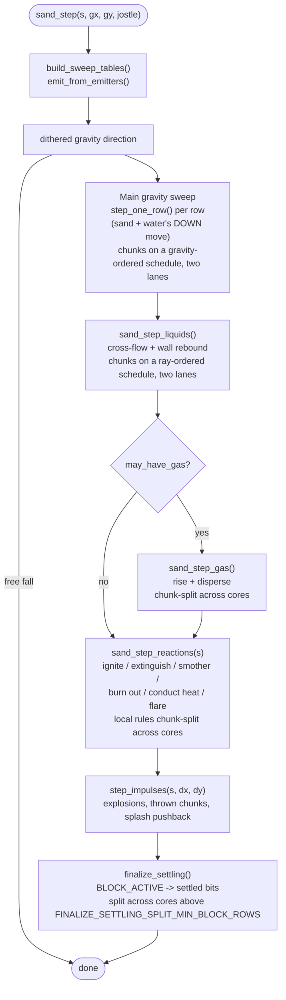
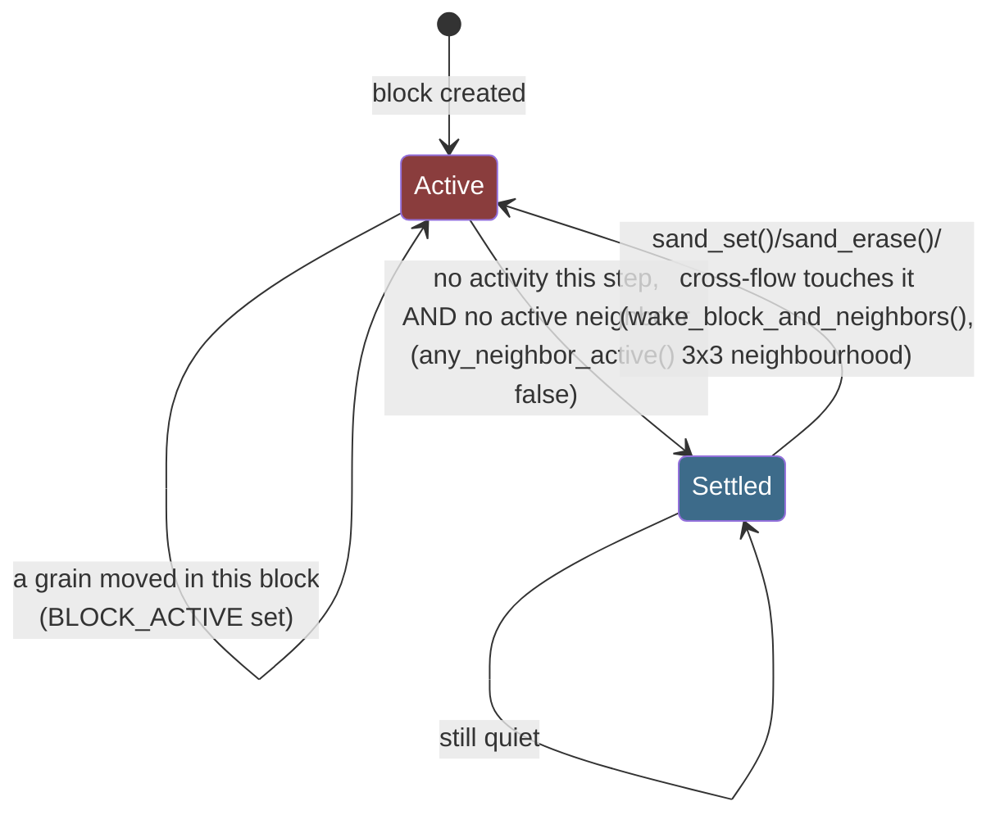

# Sand App Architecture

A single-page map of `main/apps/sand/`: the shapes, not the reasoning.
[`Sand-Simulation.md`](Sand-Simulation.md) is the "why" behind every rule
here; [`Adding-a-Material.md`](Adding-a-Material.md) is the checklist for
extending any of this; [`Reaction-Table.md`](Reaction-Table.md) is the
current, generated fire-chemistry table. This page's job is narrower than
any of those: the *shape* of the system at a glance, and where each concern
lives.

---

## The grid, in one byte

```
┌───────────────┬───────────────┐
│  material id  │    variant    │   one cell = one uint8_t
│   (4 bits)    │   (4 bits)    │
│   0-15        │   0-15        │
└───────────────┴───────────────┘
   high nibble       low nibble
```

`app_sand.c` picks a cell size of 2-8 screen pixels from the QUALITY menu
and derives the grid as `GFX_WIDTH/cell x GFX_HEIGHT/cell` - 184x224 (41 KB)
at the finest, ULTRA, setting; coarser settings shrink it. The byte layout
below is the same at every size.

The material id indexes `materials[]` (`material.c`), `const` -
memory-mapped from flash, zero bytes of RAM. What the variant *means*
depends entirely on the material sitting in that row:

| Material's `decay` | Variant means | Example |
|---|---|---|
| `0` (immortal) and `kind == KIND_POWDER` | a shade (cosmetic texture) | sand |
| `0` (immortal) and `kind == KIND_LIQUID` | fill level, 1-15 | water |
| non-zero (transient) | life remaining, counts down to 0 = gone | gas, fire |
| `heat_ramp != 0` | temperature, 0-15, resting at `SAND_AMBIENT_HEAT` (3) - and the palette index, so the cell's colour *is* its temperature | glass, stone |
| `burn_decay != 0` | how much is left to burn; `reaction_t.lit_from` says which variant codes count as "burning" | wood, gunpowder |
| `dries != 0` | read **by state**, not a fixed bit split: dry tones first, then moisture 1..`moist_max` (`reaction_t.tones`/`moist_max`, per material) | dirt (8 tones, moisture 1-7); gunpowder (3 tones, moisture 1-4, code 7 borrowed by `burn_decay` for lit) |

Reusing one nibble for several jobs is deliberate: the alternative is a
second byte per cell, and this app has no RAM to spare for that. See
[`Sand-Simulation.md`](Sand-Simulation.md#the-grid-is-one-byte-per-cell)
for the budget.

Id 15 (`MAT_EXTENDED`) is not an ordinary material - a cell carrying it
reads its own low nibble as an identity, not a variant, doubling
`materials[]` to `MATERIAL_ROWS` (32 rows, indexed by `cell >> 3` rather
than the id nibble alone). Every ordinary material lands in two identical
rows of that doubled table (`TWIN_ROW()`, `material.c`), invisible to the
hot path; only id 15 reads as two different rows depending on the nibble's
top bit. See "Getting more than sixteen materials out of one nibble" below.

## The material table, today

All 16 ordinary-id slots are spoken for: 14 ordinary materials, id 15 given
to the extended range below, id 0 empty. An empty slot is zeroed to an
inert `KIND_STATIC`/`density = 255` row, so a corrupt cell byte can never
crash anything, only sit there as an immovable block.

| Slot | Material | `kind` | Rises/falls | Notable fields |
|---|---|---|---|---|
| 0 | empty | `KIND_NONE` | - | - |
| 1 | sand | `KIND_POWDER` | falls | `repose=7` (~35°), `slip=96` |
| 2 | water | `KIND_LIQUID` | falls | `slip=255` (no resistance) |
| 3 | stone | `KIND_STATIC` | never | `density=181`, undisplaceable; carries a temperature but never melts or shatters |
| 4 | gas | `KIND_GAS` | rises | `sight=16`, `decay=6` (longest-lived), `mobility=96` |
| 5 | fire | `KIND_GAS` | rises | `sight=5`, `decay=96`; a heat source, reacts via the cold pass |
| 6 | wood | `KIND_STATIC` | never | `density=141`; fuel, does not burn on its own - its variant is burn progress |
| 7 | steam | `KIND_GAS` | rises | `sight=20`, `mobility=160`; water that got hot |
| 8 | smoke | `KIND_GAS` | rises | `sight=24` (widest), `decay=16`; fuel that burned out |
| 9 | dirt | `KIND_POWDER` | falls | `density=62`; soaks up liquid and dries out again - the state-split variant |
| 10 | oil | `KIND_LIQUID` | falls | `density=22` (floats on water); fuel, burns only where it meets air |
| 11 | lava | `KIND_LIQUID` | falls | `density=45`, `decay=0` (**must** stay 0 - a liquid's variant is fill, not life); a heat source |
| 12 | acid | `KIND_LIQUID` | falls | `density=38`, `mobility=220`; dissolves what opts in |
| 13 | glass | `KIND_STATIC` | never | `density=121`; made from sand by heat, the only thing acid cannot eat; shatters on thermal shock |
| 14 | snow | `KIND_POWDER` | falls | `density=15` (floats on water and oil); the only cold material, melts in any liquid |
| 15, `0xF0`-`0xF7` | extended statics | one shared row, `KIND_STATIC` | - | low 3 bits name one of `MATERIAL_EXTENDED_COUNT` (8) further statics: `MATX_ICE`, `MATX_PLANT`, `MATX_LEAF`, `MATX_METAL`, `MATX_ROOT`, 3 spare |
| 15, `0xF8`-`0xFF` | gunpowder | `KIND_POWDER` | falls | `density=50`; the other half of id 15's row, split off by bit 3 - see below |

Every field on `material_t` is read from the innermost loop, several times
per cell per step, which is why the struct is kept small - this chip's
cache line is 32 bytes. Full field-by-field reasoning:
[`material.h`](../../launcher/main/apps/sand/material.h)'s own header and
struct comments.

`materials[]`/`reactions[]` (movement and fire chemistry) live in
`material.c`; `material_colours()` and `palette[256]` (purely visual - see
[`Shading-and-Colour.md`](Shading-and-Colour.md)) live in
`material_palette.c` instead, so a change to how a material looks never
touches the file the hot sweep reads.

### Getting more than sixteen materials out of one nibble

With every ordinary slot spent, two further tricks each bought one more
material without widening the byte:

- **Fold a state into an existing material's variant**, when the variant
  has room. Ember is wood with `burn_decay` non-zero rather than a
  material of its own, so quenching it (water puts a fire out, leaving
  the wood) comes for free. This works whenever the two states differ
  only in fields the *cold* table reads, not the hot one.
- **Split `MAT_EXTENDED`'s low nibble by its own top bit.** `0xF0`-`0xF7`
  stays the extended-statics doorway; `0xF8`-`0xFF` is gunpowder, a
  second, ordinary `KIND_POWDER` row with real physics and a 3-bit
  variant, which is why `materials[]` has `MATERIAL_ROWS` rows. It is
  expensive - it spent half of what was left of the extended range on
  one material. `Adding-a-Material.md`'s "Making room" section has the
  full ladder of options and what each one costs, for whoever needs a
  tenth.

An extended static (`MATX(k)`) cannot have its own `density`, `kind`, or a
variant of its own - those are the row the hot path reads, shared by all
eight codes - only its own colour and reaction row. `place_reacted()` is
how a reaction produces one (a spec is either an ordinary id or a whole
`MATX(k)` byte); `sand_spawn_cell()` and its thinned sibling
`sand_spawn_cell_share()`, not `sand_spawn()`, are how a brush paints one,
since an extended material has no `material_id_t` to name it.

## The reaction table: a second table for the cold pass

Fire chemistry - flammability, what a material ignites into, whether it is
a heat source, conducts heat, smokes on burn-out, quenches to something,
dissolves or is dissolved - lives in a *second* table, `reaction_t
reactions[MATERIAL_MAX]`, not as more fields on `materials[]`. Nothing in
the movement code reads it; only `sand_reactions.c`'s cold pass does,
gated behind `may_have_burning`/`may_have_dissolver`/`may_have_temperature`.
Fattening the hot table's stride to carry these fields would cost every
step that never touches fire, for a table almost nothing reads on such a
step. The cost of the split: a material capable of burning, catching,
conducting or reacting is potentially two rows instead of one.

[`Reaction-Table.md`](Reaction-Table.md) is the generated, current table -
regenerate it with `report_reactions.sh` rather than hand-editing. Its own
"Gunpowder's fuse" section documents the four gunpowder mechanics that live
entirely at a read site in `sand_reactions.c` (the 2x2-detonation check,
the blast cooldown, moisture damping ignition, why a buried fuse is never
smothered) rather than on any `reaction_t` field a generator can walk.

A `soil` field (nonzero: plants may root in, drink from and conduct water
into this material) replaced an old `dries != 0` test at every
plant/root site. Dirt sets it; gunpowder, despite having its own moisture
codec, does not - a fuse buried in a garden bed is not something a tree
can water itself from.

### Temperature: glass, snow, and a scale with room for cold

`heat_ramp` is what makes a material's variant a temperature rather than a
shade or a life count; only glass and stone carry one, and only glass acts
on it (`heats_to` melts it to lava, `shatters_to` breaks it to sand on
shock - stone has neither, by design: nothing thermally shocks into a
material this simulation has, and a vessel that melts would leave no
container for lava at all). `SAND_AMBIENT_HEAT` sits at 3, not 0, so a
chilled cell has somewhere to go below resting - without that, "colder
than resting" would be an unreachable, uncolourable state. `cools` drains
a cell towards ambient, scaled by distance from it, so a pane gets warm
easily but stays hard to melt; `chills` does the same from a cold
neighbour (snow, ice); `conducts >> SPREAD_SHIFT` spreads a temperature
along the material itself, heavily damped, only across a gap of 2 or more,
so a wall can be hot inside and cold at the rim without going isothermal.
Shock - `shatters_to` - is instant and re-checked from both directions
(cold arriving at hot glass, in `step_one_cold_cell()`; heat arriving at
frosted glass, in `try_heat_transform()`) and, once triggered, converts the
*whole* connected run of the material at once, up to `CRACK_MAX` (256)
cells - a pane breaks as a pane, not grain by grain. See
[`Sand-Simulation.md`](Sand-Simulation.md#temperature-glass-snow-and-a-scale-that-has-room-for-cold)
for the full mechanism and every constant's reasoning.

## One step, in order



The one rule that governs the whole pipeline: **every pass has to finish
before `finalize_settling()` runs**, because `BLOCK_ACTIVE` has to reflect
the *whole* step, not just whichever pass ran first. If you add a pass, it
goes here too, before `finalize_settling()`, not after.

Most of these passes can split across both cores through the same
primitive, `job_run_core1()`/`job_wait()` (`util/job.h`) - one copied
context, run on core 1 if its worker is idle, otherwise inline. The main
sweep, the liquid cross-flow pass, both gas sub-passes and a reacting
cell's own local rules all cut the board into one grid of square chunks.
Each ranks those chunks downstream-first for its own
travel direction (`sand_chunk_sched.[ch]`) and lets two lanes walk that
order through one shared runner, each chunk waiting on the 8-neighbours
ahead of it. A caller-owned bitmap, one bit per cell
(`sand_enable_step_stamps()`), marks a grain that crossed into another
chunk so a pass still to reach it does not move it again - only for a
pass whose own order does not already rule that out - and a second
caller-owned block
(`sand_enable_lane_scratch()`) holds the private bookkeeping each lane
merges back at the join, so no pass allocates.
`finalize_settling()` splits by block row instead. Impulses, liquid
density sorting and a reaction's long-reach triggers stay serial.
Splitting cost the project its byte-for-byte determinism guarantee - a
two-core step and the serial path do not produce the same board for the
same seed - and bought back a narrower one: a two-core step is itself
deterministic, repeatable from (seed, step, cell, draw slot) alone,
checked by its own suite rather than against the serial path. See
[Sand-Simulation.md's "Two cores" section](Sand-Simulation.md#two-cores-chunk-parallel-passes-and-what-stays-serial)
for the schedule and why a fixed colouring was rejected, the reach table that decides
what can split at all, and why the rest cannot.

## Block and row sleeping



A wake buys another chance to *move*, and nothing else - the reactions pass
is not sleep-gated, so a settled block still reacts; a write that only
shifts a heat nibble one level calls `mark_rows()` and stops there, since
neither stone nor glass changes how it moves by getting warmer or colder.
Anything that changes a cell's *material*, through `place_cell()`, still
wakes.

A settled block costs one comparison per step (`BLOCK_ACTIVE` in
`finalize_settling()`) instead of a grain-by-grain sweep. Two settled bits,
not one (`BLOCK_SETTLED_NEAREST`/`BLOCK_SETTLED_OTHER`), because gravity's
direction is dithered between two ring directions each step, and a block
settled under one might not be under the other.

`block_state` carries two more bits for a different question: `BLOCK_HAS_LIQUID`
is set by the main sweep when it sees a liquid cell, and `BLOCK_LIQUID_NEAR`
expands that to a block's 8 neighbours by one pass. The cross-flow pass
skips any block-column whose `NEAR` bit is clear - liquid moves one cell in
the sweep and at most `SAND_LIQUID_SIGHT` (8) in cross-flow, so anywhere it
can arrive belongs to a neighbour of the block that was seen holding it.
See `sand_priv.h` for the invariant in full.

Block size is `SAND_BLOCK_W=16`, `SAND_BLOCK_H=32` (`sand.h`), swept across
candidate pairs on real hardware rather than guessed. `SAND_BLOCK_W` is
constrained - a power of two, no narrower than `SAND_LIQUID_SIGHT` - because
every block-level rejection spans along X in units of it, and the board is
played landscape (down is grid +X); `SAND_BLOCK_H` is only ever divided by.
See [Sand-Simulation.md](Sand-Simulation.md#performance-discipline) for the
measurements behind the current shape.

## Dirty-row and dirty-column tracking

Separate from block sleeping, and for a different purpose: block sleeping
decides what the *simulation* can skip; `dirty_rows` (`sand.h`) decides
what the *renderer* can skip. Any move marks its source and destination row
(`mark_rows()`/`mark_move()`/`mark_slide()`, `sand_priv.h`) and, on top of
that, the column(s) actually touched, into `dirty_x0[y]`/`dirty_x1[y]`
(`sand_track_dirty_cols()`), a half-open span unioned across every mark
that lands on row `y` this step. Row marking alone cannot say "which part
of this row changed" - in landscape, where a grid row runs *along*
gravity, one changed cell would otherwise resend a whole settled stack
sharing its row. `mark_depth_band()` follows the same rule, widening the
span by `MATERIAL_LIQUID_DEPTH_BAND` along whichever axis gravity actually
runs on.

A row with no column span narrowed this step (the sentinel
`dirty_x0[y] > dirty_x1[y]`) reads as "repaint this row full-width" - what
a full `gfx_mark_all_dirty()` or a portrait depth-band mark still asks for.

`app_sand.c`'s `draw_dirty_rows()` walks every row, skips the clean ones,
and for the dirty ones computes a repaint span (`row_paint_span()`): the
row's own `dirty_x0`/`dirty_x1`, widened by one column each side for
edge-softening and wood/leaf neighbour checks, and further widened to
cover whatever a periodic wake tick (shine, liquid depth, glass, wood/leaf,
the cullet colour cycle) touched this frame. `paint_row_n()` still computes
state across the row's full width - the state chain crosses columns and
rows - but only writes pixels inside that span.

## Two screens: the palette and the brush screen

The app has two full-screen overlay panels, siblings rather than pages of
one menu, opened by different buttons and never both at once
(`sand_ui_screen_t`, `sand_ui.h` - `SAND_UI_MENU`, `SAND_UI_RUNNING`,
`SAND_UI_PALETTE`, `SAND_UI_BRUSH`):

| Button | Opens | Screen | Picks |
|---|---|---|---|
| BOOT | `SAND_UI_PALETTE` | the material picker (`palette.c/.h` layout, `ui/palette_screen.c/.h` drawing) | which material the finger places |
| PWR | `SAND_UI_BRUSH` | the brush screen (`ui/brush_screen.c/.h`, layout and drawing both) | POUR/ERASE/BOOM, and that mode's radius |

Both panels split the same way: a **pure layout** module with no gfx and no
hardware header (host-tested at both real canvases, since the shell can be
under a quarter turn), a **pure state machine** in `sand_ui.c/.h` that owns
what a tap on either panel *means*, and a **drawing** module in
`apps/sand/ui/` that lays out real `mu_button()`/`mu_update_control()` hit
targets from the layout module's rects, calls into `sand_ui.c` with the
result, and draws. `app_sand.c` only brackets the call with
`ui_begin()`/`ui_end()`. See `sand_ui.h`'s own "WHO HIT-TESTS AND WHO
DECIDES": the caller hit-tests through microui, so rotation is free;
`sand_ui.c` decides what a hit means, so that logic is host-testable -
`suite_sand_ui.c` pins down the edge-ownership bugs that motivated the
split, including "the PWR press that opens the screen must not also close
it" (`sand_ui_step()` reads `ui->screen` exactly once per frame, before any
branch can change it).

**A palette entry is a cell and a share.** `sand_brush_t` (`sand_ui.h`)
carries what a tile paints plus how much of the pour disc it actually
fills. Everything is `SAND_SPAWN_SHARE_FULL` except plant, at
`SAND_BRUSH_SHARE_PLANT`: it spreads on its own, so a solid disc of it is
a thicket the player cannot undo quickly, and a share rather than a count
keeps the gesture worth the same at every grid quality.

Before a simulation exists the app shows its menu (`SAND_UI_MENU`, outside
`sand_ui_t` entirely), two screens with the same three-way split:
`ui/title_screen.c/.h` (START GAME, LOAD SAVES, OPTIONS, and a GUIDE / EXIT
footer) and `ui/options_screen.c/.h` (QUALITY, COLOR MODE, DITHER, APPLY / CANCEL), both built from the
shell's `ui/ui_widgets.h` in the one theme `ui/sand_theme.c/.h` holds, which the brush screen draws in too. Their state is `sand_menu.c/.h`: which of the two is
up, what a tap means, and the launch options as a draft the options screen
edits and APPLY commits, so an unapplied choice never reaches the next
START. LOAD SAVES and GUIDE are drawn muted and take no tap until they have
a screen behind them. EXIT asks the shell to leave the app
(`shell_request_exit()`), the on-screen twin of the home gesture.

The brush screen's own files, beyond `ui/brush_screen.c/.h` (layout and
drawing, asserted against both 368x448 and 448x368 by
`tests/suite_brush_screen.c`):

- **`icons_sand.h`** - the brush screen's POUR/ERASE/BOOM/info bitmaps and
  the menu screens' own, generated by
  `tools/gen_icons.py` from `icons/sand.png` + `icons/sand.json`, reusing
  `gfx/icon.h`'s bitmap format. Lives in the app's own folder, per "an app
  is a folder" - deleting `apps/sand/` deletes its icons with it.
- **`sand_swatch.h`** - a deterministic pattern of shade variants for the
  header's material swatch, a pure function of `(spec, col, row)` alone so
  it never forces a repaint of an otherwise-static panel.
- **`tests/suite_command_list_budget.c`** - drives every screen against a
  real `ui_init()`/`ui_begin()`, asserting each one's peak microui
  command-list use against `MU_COMMANDLIST_SIZE` with headroom to spare.

**One size per mode, not one shared slider.** POUR, ERASE and BOOM each
remember their own radius in `sand_ui_t.radius_px[SAND_MODE_COUNT]`
(`sand_ui_set_radius()`), because BOOM's default reach is five times
POUR's - a single shared value would flatten reaches that are deliberately
different. Nothing on either screen persists across an app restart.

## Indexed colour modes

`app_sand.c` renders through `gfx`'s indexed-8 pipeline in two modes,
picked on the options screen (`SAND_COLOR_256` is the default, `SAND_COLOR_16`
the alternative, `SAND_COLOR_FULL` bypassing indexed mode entirely) -
`sand_colour_state.h` tracks when a `gfx_mode_enter()`/`exit()` transition
is actually needed (entering/leaving the app, opening/closing an overlay
screen, since neither screen draws through the indexed pipeline yet).
16-colour mode drives a selectable dither; both modes suppress shading
changes the target palette cannot show, rather than spending cycles
computing a gradient step nothing will display. See
[`Shading-and-Colour.md`](Shading-and-Colour.md#indexed-colour-modes-256-and-16)
for the mechanism.

## The `sand counts` console command

`app_sand.c` declares the console prefix `sand` (`APP_CONSOLE`, `app.h`)
and answers one command under it, `counts` - so the full typed line is
`sand counts`. It tallies every cell in the live grid by material
(`sand_material_counts()`, `sand.c`) and prints one `SAND <name>=<n>` line
per material actually on the board, skipping the rest, ending with
`SAND_END` - the reply prefix is always the app's own console prefix in
capitals. Every extended cell, gunpowder included, shares one `Extended`
line - [`MAT_EXTENDED`](#the-grid-in-one-byte) above says what those are.
See
[`../tools/Autana-CLI.md`](../tools/Autana-CLI.md#adding-a-command-from-an-app)
for how a line like this reaches the app at all, and how to send it from an
interactive `autana` session.

## Verifying performance on real hardware

[`../Testing-Guide.md`](../Testing-Guide.md) is the host/device split and
the general practice; [`Testing-Sand.md`](Testing-Sand.md) is this app's
own half of it - the frame-budget capture, `runsuite`, how to read a
result, and the current state of `suite_sand_perf.c`'s frame-budget tests
on this board. Don't duplicate numbers here: a captured budget is a fact
about one build on one board at one point in time, and the last full
capture is always the honest source for it, not this page.

## Related

- [`Sand-Simulation.md`](Sand-Simulation.md) - the "why" behind every rule
  sketched here: movement, the water model, gas, fire chemistry,
  temperature, two-core execution, the performance discipline.
- [`Adding-a-Material.md`](Adding-a-Material.md) - the practical checklist
  for extending any of this with a new material, including the material
  slot budget and how to make room for one more.
- [`Reaction-Table.md`](Reaction-Table.md) - the generated, current
  material-interaction table, plus gunpowder's fuse mechanics.
- [`Shading-and-Colour.md`](Shading-and-Colour.md) - how an existing
  material's variant becomes a pixel: the flat/speckled/hatched patterns,
  the indexed colour modes, the recurring shading mistakes and their
  fixes.
- [`Impulse-Mechanics.md`](Impulse-Mechanics.md) - explosions, thrown
  chunks, a liquid's own splash: one mechanism, three call sites.
- [`Testing-Sand.md`](Testing-Sand.md) - this app's own half of the test
  guide: frame-budget captures, `runsuite`, and scoping a diagnostics build.
