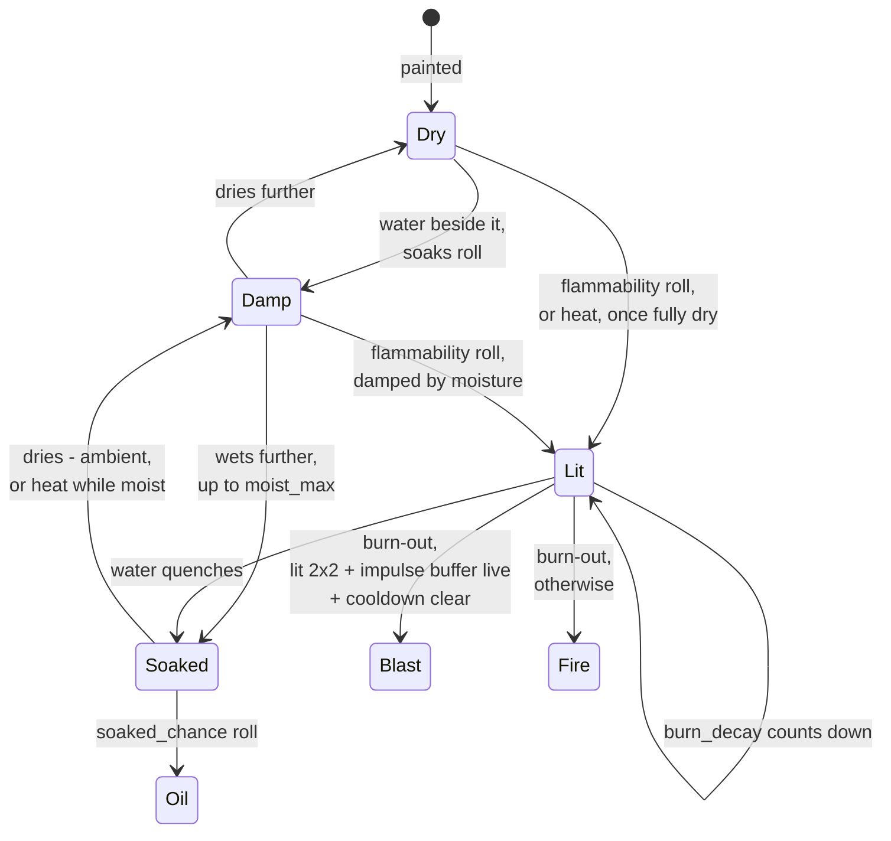
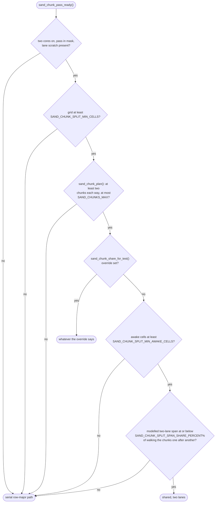
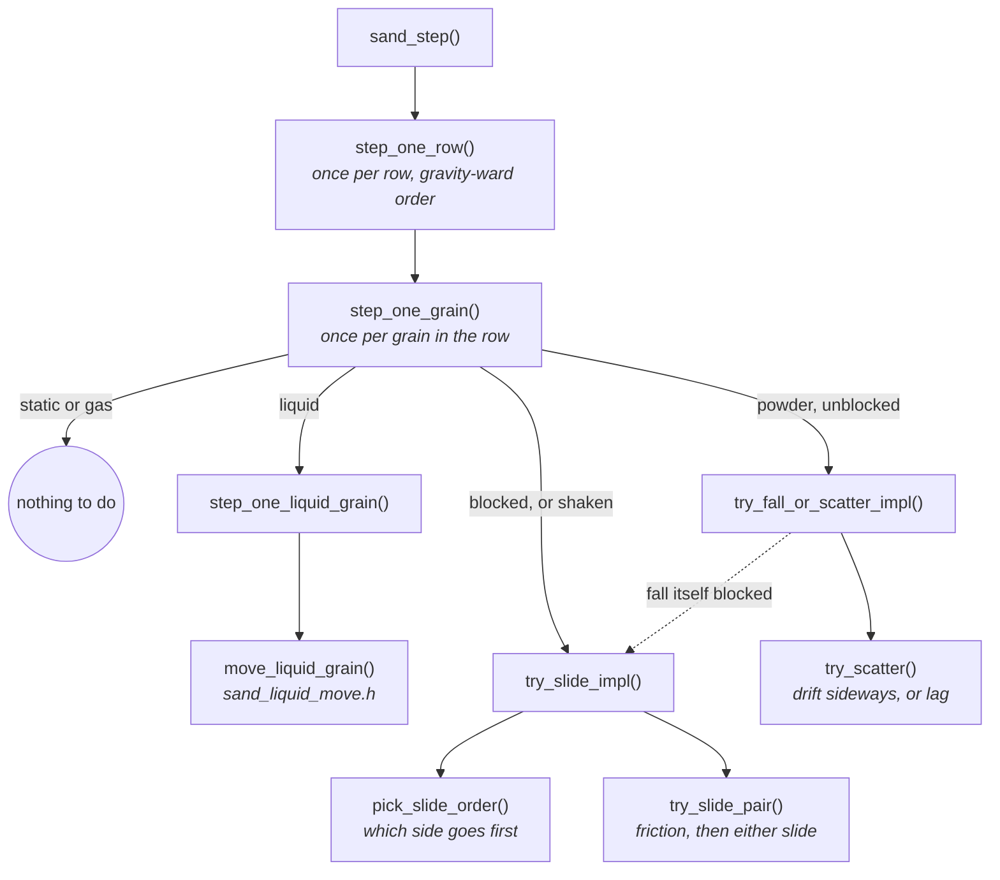
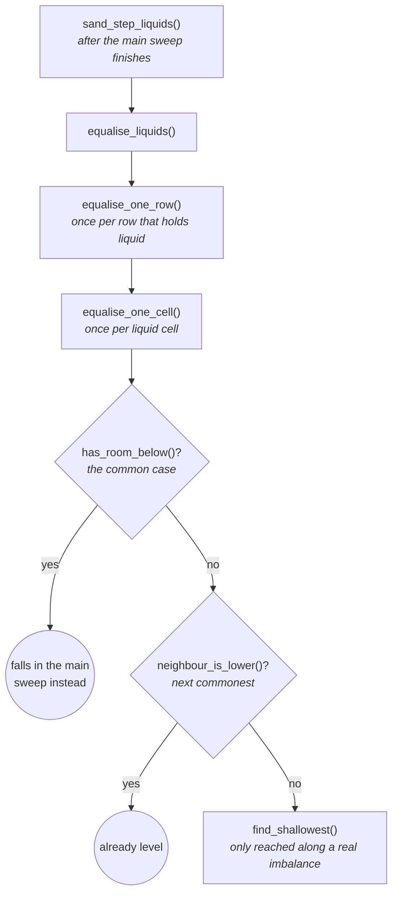

# The Falling-Sand Simulation

What `main/apps/sand/` actually is: a cellular automaton with a handful of
materials, tilt-steered by the accelerometer, that has to run inside a
memory and time budget tight enough that most of its design decisions were
forced by measurement rather than chosen for elegance.

This document is the "why" behind it - the material encoding, the movement
rules, the water model, and the performance discipline that shaped all of
them. [`Architecture.md`](Architecture.md) is the "what": a single-page map
of the same app's shape, with the byte layout, the material table and the
per-step pipeline diagram this document assumes rather than repeats.

For the app-registration mechanics (how `main/apps/*` plugs into the
shell), see `docs/Building-an-App.md`. For the hardware constraints
underneath everything here, see `docs/notes/README.md`.

---

## The grid is one byte per cell

The cell size is a quality setting on the app's boot menu, and the grid
shrinks or grows with it:

| Setting | Cell | Grid | Cells (= bytes) |
|---|---|---|---:|
| ULTRA | 2 px | 184 x 224 | 41,216 (~41 KB) |
| HIGH | 3 px | 122 x 149 | 18,178 (~18 KB) |
| NORMAL (default) | 4 px | 92 x 112 | 10,304 (~10 KB) |
| LOW | 6 px | 61 x 74 | 4,514 (~4.5 KB) |
| VERY LOW | 8 px | 46 x 56 | 2,576 (~2.5 KB) |

ULTRA's 41,216-byte grid is, in `docs/notes/Board-and-Memory.md`'s own
words, "the largest single contiguous allocation of interest" the sand app
makes.

The 322 KiB framebuffer lives entirely in PSRAM (`BOARD_FRAMEBUFFER_CAPS`,
`board.h`), so it does not compete with the sand grid, or anything else,
for internal SRAM.

Measured internal (non-PSRAM) free heap after `gfx_init()` is 130,635
bytes, in blocks of at most 51,200. A two-byte-per-cell grid at ULTRA
(82 KB) would fit the total but not any one block, so it could not be a
single contiguous allocation there.

The one-byte encoding predates that move: it was chosen when the
framebuffer still lived in the same internal pool as everything else,
leaving far less headroom to work with. The port to a PSRAM board loosened
that specific constraint, but the byte layout itself was never revisited.

Every other per-cell trick in this file - reusing the nibble, doubling
the table only where a material actually needs it - still follows the
discipline that byte was chosen under. Unwinding it for memory that is no
longer scarce would touch every material's encoding for no behavioural
gain.

[`Architecture.md`](Architecture.md#the-grid-in-one-byte) has the byte
layout itself and the full table of what the low nibble means for each
material `kind`. The short version: nothing about that nibble is fixed -
it is reused per material, on purpose, and none of the reuses are free
accidents:

- **A powder's nibble is a shade**, so a pile has texture rather than
  reading as one flat block of colour. It travels with the grain rather
  than being derived from its position, because position-derived colour
  makes a falling pile shimmer as it moves.
- **A liquid's nibble is a fill level**, 1-15 (`MASS_MAX`). This is what
  lets water level itself using only its immediate neighbours - see
  [The water model](#the-water-model) below.
- **A transient material's nibble is life remaining** (gas, fire, steam),
  counting down to nothing. Reusing the nibble is what makes that free
  instead of needing a second byte - see [Gas: a biased random
  walk](#gas-a-biased-random-walk) and [Fire
  chemistry](#fire-chemistry-wood-embers-steam-and-a-working-boiler).
- **Gunpowder splits its own nibble by its own top bit** instead of
  spending it on a shade: `0xF8`-`0xFF` is gunpowder, sharing material id
  15 (`MAT_EXTENDED`) with the extended statics but claiming the other
  half of that nibble for a real `KIND_POWDER` material. Its remaining 3
  bits are a state split like dirt's, just narrower - codes 0-2 are dry
  tones, 3-6 are moisture 1-4, and 7 is a burning state (`GUNPOWDER_LIT`).
  See [Fire chemistry](#fire-chemistry-wood-embers-steam-and-a-working-boiler)'s
  gunpowder passage for what lit does.

## Materials are a flash-resident table, not code

`materials[MATERIAL_ROWS]` (`material.c`) is `const`, so it is
memory-mapped from flash and costs **zero bytes of RAM** - confirmed via
`idf.py size`, not assumed. Adding a material is a row in that table, not
a branch in the movement code.

Every field on `material_t` - `kind`, `density`, `slip`, `repose`,
`scatter`, `decay`, `mobility`, `sight`, plus the cold `name` string - is
read from the innermost loop, several times per cell per step. That is
why the struct stays small. See `material.h`'s own header and struct
comments for the field-by-field reasoning, and
[`Architecture.md`](Architecture.md#the-material-table-today) for the
current table of all 16 material slots.

`MATERIAL_ROWS` is **32**, not 16 - doubled once gunpowder split material id
15's nibble in two. That doubled the hot table's flash footprint from 192 B
to 384 B, but left the sweep with the same one shift, one indexed load per
cell - see [`Architecture.md`'s "Getting more than sixteen materials out of
one nibble"](Architecture.md#getting-more-than-sixteen-materials-out-of-one-nibble)
for how the doubling works and what it cost.

The 256-entry colour palette (`material_palette()`) is built the same way -
16 shades per material, interpolated at compile time into another `const`
table, so drawing a cell is one array index and zero colour maths at
runtime. It lives in `material_palette.c`/`.h`, split from `material.c`/`.h`
for the same reason `sand.c`/`sand_liquid.c` are two files below - colour is
a different concern from identity and behaviour.

## Movement: one rule, and one invariant that has to be right

Every grain gets the same rule: try to move the way gravity points; failing
that, try the two directions either side of it. Angle of repose, heaps that
collapse when undermined, sand pouring through a gap - none of that is
modelled explicitly. It all falls out of those three attempts. (Gas is the
one exception - the same rule, run against a negated direction, from its
own pass - see [Gas: a biased random walk](#gas-a-biased-random-walk).)

**The sweep order is the one thing that cannot be wrong.** A grain only
ever moves into a cell in the gravity-ward half of its neighbourhood. So
sweeping the grid *against* the direction of travel guarantees a cell's
destination has already been visited this step - a grain that moves
cannot be picked up and moved again in the same frame.

Sweep the other way and a falling grain teleports to the floor in one
frame instead of falling one cell at a time. Every pass in this codebase
(the main sweep, and the liquid cross-flow pass below) is built around
this same guarantee, each with its own sweep order derived from whichever
direction *it* moves things in.

**Friction is two separate things**, because burial alone does not explain
the reported symptom (a floor of sand skating sideways on the faintest
tilt):

| Mechanism | Rule | What a liquid does instead |
|---|---|---|
| **Angle of repose** | A grain on a slope stays put until the slope exceeds the friction angle: `descent > mu * lateral`, the same test as a block on an incline. `mu` is `repose / 10`; sand's `repose = 7` is ~35 degrees. | `repose = 0` means no angle of repose exists at all - it slides sideways however level the surface is, which is what makes it a liquid. |
| **Burial** | A grain counts how many grains are stacked directly against gravity above it, and each one halves its chance of sliding (`SAND_SLIP_CHANCE = 96` in 256, halving per grain, capped hard past `SAND_LOAD_CAP = 5`). | `slip = 255` means load never holds it at all - water at the bottom of a pool flows exactly as freely as water at the top. |

**Gravity's direction is dithered, not snapped to nearest-of-eight.**
Snapping makes a slow tilt arrive in 45-degree jerks. Instead, each step
randomly picks one of the two octants bracketing the true angle, weighted so
the long-run average matches it - the same trick as dithering a colour ramp,
applied to a direction. At 60 fps the eye integrates the two directions into
one smooth angle.

## The water model

A liquid cell carries an amount, 1-15 (`MASS_MAX`), not a plain on/off
state. Two rules run in the main sweep, in order:

- **Down, then down-the-slope** (`move_liquid_grain()`, `sand_liquid.c`):
  fill the cell below if it has room, then share what is left with the two
  diagonal downhill neighbours. Still only immediate neighbours, still
  gravity-ward, so it carries the same no-double-move guarantee every other
  move in the main sweep does.
- **Cross-flow** (`equalise_liquids()`, `sand_liquid.c`): a *second*,
  separate sweep that moves mass sideways, along the surface, looking
  further than one cell.

That second rule exists because the obvious designs do not work:

| Design | Problem |
|---|---|
| Cell-count, no amount - a cell is either water or not | Two adjacent cells at "full" and "empty" have no legal move that leaves a valid state in between: a wide pool freezes into a staircase. A genuine fixed point of any rule shaped like this, not a bug in one attempt at it. |
| Local mass diffusion only - an amount per cell, shared with immediate neighbours alone | Correct per the literature, and measurably too slow: levelling a 184-cell pool by neighbour-to-neighbour diffusion takes tens of thousands of steps, because information moves only one cell per step. Measured: a real-width pool was still 6 cells proud after 5,000 steps. An `O(n^2)` bound on any rule of this shape, not a tuning problem. |
| Mass, plus a bounded surface scan - what shipped | See below. |

### Cross-flow: a cheap stand-in for pressure

`equalise_liquids()` walks up to `SAND_LIQUID_SIGHT` (8) cells along the
surface, looking for somewhere shallower, and moves half the difference in
*level* there - mass adjusted for how much deeper one cell sits than
another along gravity, not raw mass. It is deliberately not local: in real
water, pressure travels far faster than the water itself does, and this is
the cheap stand-in every falling-sand game has some version of.

**Why this cannot live in the main sweep.** The main sweep's no-double-move
guarantee depends on sweeping against gravity. Once gravity is tilted,
that pins the sweep on *both* axes, and of the two directions across the
flow, only the one the sweep has already passed is safe to use.

Water could cross a slope one way and never back: a tilted pool did not
level at all, it walked into the low corner and sat there. Cross-flow
needs its own pass, with its own sweep order chosen to fit whichever
direction it is using that step - the two alternate every step, so both
directions become available over time.

**Why 8, not more.** A longer sight distance hands mass directly to a cell
far away, skipping everything between - water visibly vanishes from one
spot and reappears in another, and because the sweep direction alternates
every step, it sloshes straight back the next. Measured residual
unevenness after settling:

| `SAND_LIQUID_SIGHT` | Residual unevenness |
|---:|---|
| 4 | 1.6 cells |
| 8 (shipped) | 0.8 cells |
| 16 | 0.5 cells (visibly wrong while getting there - "huge waves") |
| 32 | 0.2 cells |

8 is the point where a 4x reduction in cost costs only ~0.6 cells of extra
unevenness - smaller than a pixel at this grid's resolution.

### Two rays, chosen by position, not by time

A pool's true perpendicular to gravity rarely lines up with one of the
eight ring directions. Cross-flow brackets it between an **axis ray**
(perpendicular to the dominant axis) and the **diagonal ray** beside it,
and picks which one a given column takes on a fixed pattern in *space*
(`xflow_t`, `sand_priv.h`):

```
tilted pool, gravity down-and-right:

  column:     A     B     A     B     A     B
              |      \    |      \    |      \
   axis ray → |       \   |       \   |       \  ← diagonal ray
              v        v  v        v  v        v

  every column checks "is there a shallower cell along my ray";
  A-columns and B-columns disagree on which ray that is,
  but the MIX across the pool still reads as the true angle
```

Two bugs, both fixed and both worth knowing if this code is touched again.

**Bug one: picking the ray from the dithered direction flickered a
settled pool.** Gravity's direction is dithered every step (see
[Movement](#movement-one-rule-and-one-invariant-that-has-to-be-right)
above). If cross-flow's axis followed that dither, "is this level" was
asked along a different axis almost every step.

A settled pool then read as wildly unbalanced along whichever direction
it wasn't just checked against - large amounts of mass swinging back and
forth every step or two, visible as flashing and resettling. Fixed by
taking the axis from the *nearest* (non-dithered) direction instead - the
same fix friction's burial check already used. See
`test_a_settled_pool_does_not_flicker` (`suite_sand_materials.c`).

**Bug two: pinning to one ray flattened every surface to 0/45/90
degrees.** That was the correct fix for the flicker, but it had an
unpriced cost: a pool could then only settle perpendicular to one of
eight directions. The near-vertical octant lost the most - its axis ray
is horizontal, and a horizontal ray can only move mass within a row, so
that octant couldn't tilt its surface at all.

The fix shown above - dithering between the axis ray and the diagonal
beside it, by column, in space rather than in time - restored real tilt
angles without bringing the flicker back.
`test_a_pool_settles_at_the_angle_it_is_tilted_to`
(`suite_sand_materials.c`) guards the second property; the flicker test
above still guards the first. Neither alone is enough.

## Gas: a biased random walk

`MAT_GAS`/`KIND_GAS` (`sand_gas.c`) rises. Each cell takes **one draw and
one probe per step**, regardless of how boxed in it is: a draw picks an
offset around the ring direction pointing away from gravity, weighted out
of 256 (`gas_walk_weights[]`, `sand_gas.c`):

| Pick | Weight (/256) |
|---|---:|
| Straight up | 70 |
| Upper diagonal, either side | 68 each (136 total) |
| Sideways, either side | 11 each (22 total) |
| Lower diagonal, either side | 2 each (4 total) |
| Straight down | 24 |

Almost nothing is spent on the five downward-ish directions: a particle
that drifts down does so bluntly, and giving most of the ring a downward
component reads as smoke *sinking* rather than swirling.

**Why a walk rather than the inverted powder mover.** Reusing
`try_fall_or_scatter()`/`try_slide()` with the direction negated would
reflect the water model, but that mover is exhaustive: it tries each
candidate in turn, so its cost rises exactly when the grid is full and
every candidate is blocked.

The walk is O(1) per cell and looks better, since real hot gas is chaotic
rather than uniformly upward. The exhaustive mover is still reachable
through `sand_set_gas_walk(false)` so the two can be compared, which is
the only thing that still uses it.

**Buoyancy is part of the walk, not a separate pass**, and only on the
upward picks (straight up or an upper diagonal). A blocked upward pick
whose blocker is a liquid *denser* than the gas swaps through it - gas
rises through the liquid instead of sitting trapped in it, because
`can_enter()` only ever admits a liquid to something denser, never to
something lighter.

Sideways and downward picks never bubble: a bubble rises, and a downward
swap would also break the sweep's one-move-per-cell guarantee.

**Why it needs its own pass.** The main sweep's no-double-move guarantee
depends on sweeping *against* the direction things move - right for
gravity-ward materials, exactly backwards for anything moving against
gravity. `sand_step_gas()` runs after the main sweep in reverse row and
column order, so a rising move lands in already-visited territory rather
than teleporting to the ceiling in one step.

**`equalise_gas()`** is gas's counterpart to the liquid cross-flow pass,
for the same reason: rising alone piles gas against a ceiling without
ever spreading it along one.

See [`Adding-a-Material.md`](Adding-a-Material.md) for the end-to-end
walkthrough of building a material like this.

## Fire chemistry: wood, embers, steam, and a working boiler

Fire's reactions live in `sand_reactions.c`, driven by a second table -
`reaction_t reactions[]` (`material.h`) - kept separate from
`materials[]`. `materials[]` is read several times per cell per step by
the main sweep; fire chemistry is read only by the reactions pass, gated
behind `may_have_burning`. Folding `flammability`, `ignites_to`,
`conducts`, `quench_to` and the rest into the hot table would widen its
stride for every step that never touches fire.

### Being alight is a state, not a material

A lit cell keeps its own material and records the fact in its variant
nibble (`reaction_t.burn_decay`). That is what makes "water puts a log
out" expressible: the log is still there, just no longer alight.

`MAT_FIRE` is `KIND_GAS`, so a wood cell that turned *into* fire would
float away on the next `sand_step_gas()`, leaving a hole where the log
was.

Instead a lit log stays `KIND_STATIC`, igniting neighbours and counting
down, while the flame licking off it (`reaction_t.flare`) is ordinary
separate `MAT_FIRE` - there for looks and for reaching fuel stacked
above. "Burning below, flame above" falls out of two simple things
rather than one material trying to be a heat source and a moving flame
at once.

Wood's `flammability` of 6 in 256 makes catching a negotiation - roughly
43 steps of contact with a single flame - so a log burns rather than
vanishing on first touch. A lit log is essentially never `smothered()`:
that predicate needs all four cardinal neighbours *strictly* denser, and
at density 150 only stone (200) qualifies, so burying one in sand will
not put it out. Only decay or water ends it.

### Two exhausts, deliberately different materials

| | What it is | Where it comes from |
|---|---|---|
| `MAT_STEAM` | water that got hot | boiled through a conductor, or flashed off a quenched fire |
| `MAT_SMOKE` | fuel that burned out | a fire or a lit log reaching the end of its life |

Quenching costs the water a unit of its own mass, so a pot boiled dry
eventually runs dry. The two rows are nearly identical in `materials[]`;
the split is really about palettes - steam is cool and bright, smoke warm
and dim, and a fresh puff of smoke tops out dimmer than a dying wisp of
steam so they stay separable where they overlap.

The reason to keep them apart is visual, not physical: a lone fire
burning out in mid-air, nowhere near water, puffing bright kettle-steam
reads as a bug to anyone watching.
`test_quenching_makes_steam_but_burning_out_makes_smoke` guards against
re-merging them on the correct observation that their rows look the
same.

### Gas under standing liquid needs buoyancy to escape

`can_enter()` displaces in one direction only - denser displaces lighter -
so steam (density 5) cannot enter water (30) above it; and a liquid never
consults `can_enter()` at all, while `room_in()` (`sand_liquid.c`) refuses
any cell holding a different material, so the water will not fall into the
steam either. Between the two rules, a gas cell under standing liquid has
no legal move in either direction.

Both movers therefore carry a buoyancy case: `gas_walk_once()` handles it
inline for the walk, `try_bubble()` for the exhaustive mover. Each is a
two-cell swap gated on `KIND_GAS` and an *inverted* density test, so only
something lighter than the liquid rises through it, and water mass is
conserved exactly because a swap carries the liquid's variant nibble
across untouched.

It is deliberately not in `can_enter()` itself. That predicate is the
hottest thing in the project, read several times per cell per step by the
main sweep; a mobility special case there would be paid by every falling
grain of sand forever.

In the gas pass it costs one comparison, only for gas cells, only in a
pass already gated behind `may_have_gas`, and only where the ordinary
rise was already blocked. Sweep order makes it safe for free: the gas
pass sweeps so the destination is already-visited territory, and both
liquid passes ran earlier in the same `sand_step()`, so the displaced
liquid still gets exactly one move.

### Boiling happens at the heat source

`conduct_heat()` converts the very cell touching the hot conductor, and
the steam climbs out from there by itself. A pot on a hot stone reads as a
column of bubbles rising off its base.

**Building one in the app:** a wood floor, a stone basin over it as thick
as one drag of the pour brush, water poured in, and a spark. The wood
catches, chars, and its heat conducts up through the basin floor, boiling
the water above - all without the fire ever leaving the space below the
stone.

### Gunpowder: a fuse, not a detonator

Gunpowder catches and burns like wood, and it is the burning-out that can
end in a blast - there is no separate detonator mechanism. The state a
cell moves through, all recorded in its own moisture/burn nibble rather
than a separate flag:



Painted gunpowder starts `Dry` (`GUNPOWDER_CELL(0)`, `app_sand.c`). `Damp`
stands for moisture 1-3 and `Soaked` for `moist_max`; **Moisture damps
ignition** below gives each level's odds.

**Lighting the fuse.** A flame or hot lava touching dry powder ignites it
in the usual way (`flammability` 200, so it catches almost every time it
is rolled). Heat alone, with nothing burning yet, can also reach the same
trigger from the heat-transform path - lava resting beside it, or heat
conducted through stone or metal - but only once the cell is fully dry;
while it still holds moisture, the same heat dries it one level instead of
igniting it. Either ignition path writes code 7, the cell's **lit** state
(`GUNPOWDER_LIT`), in place of the plain `MAT_FIRE` a less flammable fuel
would get. A lit cell is a heat source in its own right, exactly like a
burning log:

- it ignites neighbouring dry powder, so a trail burns along, cell by
  cell
- it can boil adjacent water
- it counts down its own `burn_decay` (16, roughly sixteen steps of
  fuse) every step, via the same `tick_decay_at()` wood already uses

That countdown is generalised by `reaction_t.lit_from`, the first
variant code a `burn_decay` material treats as "burning" (wood: 1;
gunpowder: 7, since gunpowder's other six codes are already spoken for by
dry tone and moisture).

A lit cell is not smothered by its own neighbours the way a buried wood
fire would be - `explodes != 0` opts a material out of that check,
because gunpowder carries its own oxidiser and a fuse buried in the
middle of a pile has to keep burning regardless. Water quenches a lit
cell to **soaked** (moisture pinned at `moist_max`), not to the unlit
code, or it would simply relight from an adjacent lit neighbour on the
very next step.

**Burning out: the blast and its cooldown.** Only when a lit cell burns
out - its countdown reaching `lit_from` - does the blast radius
(`reaction_t.explodes`, 20 cells, `SAND_GUNPOWDER_BLAST_RADIUS`) get read
at all.

If the cell is one corner of a 2x2 whose other three cells (the board
edge counts as not-lit) are also lit gunpowder, and the impulse buffer is
live, it detonates (`sand_explode()`). Otherwise it simply becomes an
ordinary `MAT_FIRE` cell, the same no-buffer fallback the confined-gas
blast already relies on. A one-wide trail or a lone lit cell never blasts
at all - there is no lit 2x2 to be part of.

A thick pile's blasts land one at a time, spread across several frames,
rather than all going off together - guaranteed by
`SAND_GUNPOWDER_BLAST_COOLDOWN` (8, board-wide, `sand_reactions.c`), the
number of steps the board waits after a detonation before another may
fire, ticked down once per reactions pass. Raising it spreads a pile's
blasts further apart without making any one of them smaller; 0 lifts the
limit.

A blast also takes the lit cells around it out of every 2x2 they belonged
to - they are fire or flying grains by their own burn-out - which helps
the spreading-out along independently. That is a side effect of the
geometry, though, not what bounds the cost: the cooldown does that.

The trigger is a lit 2x2 because burn-out rolls are independent: a larger
block is rarely still all lit at once, and blasts would almost never fire.

**Moisture damps ignition.** For any `dries != 0` material, the ignition
roll is scaled down per moisture level: `f >>= SAND_DAMP_IGNITION_SHIFT *
moisture` (shift 2), so gunpowder's 200-in-256 base chance runs
200 -> 50 -> 12 -> 3 -> inert at moisture 4.

A fully wet charge (moisture pinned at `moist_max`, 4) cannot ignite at
all until something dries it out - either heat driving a level off as
steam (the same wet-earth stage `try_heat_transform_given()` already uses
for dirt), or simple time (`dries = 1`, half dirt's own rate of 2 -
powder holds water longer than soil does).

A saturated cell also rolls, one step in `SOAKED_CONVERT_PERIOD`
(`sand_reactions.c`), at `soaked_chance` to give up being powder
altogether and become a full `MAT_OIL` cell instead - the same "one grain
plus its water becomes one liquid cell" shape other saturation reactions
already use.

Measured on pre-saturated powder sitting under standing water: the board took 1,542 steps to lose
half its powder to oil at a chance of 8, and 835 steps at 16 - the
shipped value.

Acid dissolves gunpowder at the same rate it dissolves sand
(`dissolvable = 200`); nothing about being explosive changes how a cell
disappears once acid is what is touching it.

**Gunpowder is not soil.** Plant and root sites test `reaction_t.soil`,
not `dries != 0`, to mean ground a root can use. Dirt sets `soil = 1`;
gunpowder does not, even though it has a moisture codec of its own and
would otherwise match every one of those checks.

Moisture diffusion between same-species cells and percolation still read
`dries`, unchanged - "can this variant mean wetness" and "is this ground"
are genuinely different questions once more than one material can be wet.
A fuse sitting in a garden bed was never meant to be something a tree
could root into, drink from, or drain moisture out of.

### Heat banking on stone and glass

Stone and glass bank heat in the low nibble their `KIND_STATIC` never
otherwise needed, 0-15 with `SAND_AMBIENT_HEAT` sitting in the middle
rather than at the floor. That way a pane has somewhere to go both when
it warms and when it chills (`step_one_tempered_cell()`, `sand_reactions.c`).

Left alone, that variant relaxes back toward ambient on its own, at a
rate (`reaction_t.cools`) that gets harder to outrun the further off
ambient the cell already sits. A single brush of fire makes a pane
fragile quickly, while cooking it all the way to molten stays a long
exposure.

The full mechanism (`heat_ramp`, `cools`, `chills`, shattering) is
covered in [Temperature: glass, snow, and a scale that has room for
cold](#temperature-glass-snow-and-a-scale-that-has-room-for-cold) below;
this section is only the two reactions that touch it from outside -
quenching and lava.

**Quenching multiplies the drain, but only downhill of ambient.** A
quenching liquid (`PAIR_QUENCHES` - water and acid, never lava or oil)
sitting against a heat-ramping cell multiplies the ordinary cooling drain
by `SAND_WET_COOLING_FACTOR` (8, `sand.h`), but only in the above-ambient
half of the ramp. Pouring water on a glowing wall is what brings its
banked heat back down in a reasonable number of steps, rather than the
many dozens plain ambient cooling alone would take.

The asymmetry is deliberate: nothing about being wet can push a cell
*below* `SAND_AMBIENT_HEAT`. That is chilling's job alone (snow, ice,
`reaction_t.chills`), and letting water do it too would let an ordinary
splash thermally shock glass the same way a deliberately-placed snowbank
does.

**Lava quenched into stone can take a neighbour down with it.** The
one-touch quench any water-on-lava contact has always done
(`neighbor_quenches()`, `quench_to`).

It also rolls a small, deliberately rare chance
(`SAND_LAVA_COOLOFF_CHANCE`, sand.h, 32 in 256) to freeze one further
adjacent lava cell too, which rolls again in turn - an iterative walk
(`cool_off_chain()`, `sand_reactions.c`), bounded at
`SAND_LAVA_COOLOFF_MAX_CHAIN` (8) links so one lucky roll can never run
the whole pool to stone in a single event.

This is what lets a sustained pour eat into a pool rather than only ever
sealing its surface. Stop pouring, and the crust that formed simply sits
there - nothing about it keeps spreading on its own.

The same small chance also gates the actual *work* of melting a neighbour
into something else - sand fusing to lava, a thermal-shock crack, a real
material change, not merely banking one more level of heat (which stone
and glass do on nearly every step they touch lava, for free).

Getting this distinction right mattered enough to be its own guarded test
(`test_a_lava_pool_in_a_dry_stone_bowl_does_not_freeze_itself`,
`suite_sand_reaction_encoding.c`): gating on whether the heat-transform
probe merely *returned true*, rather than on whether `CELL_MATERIAL`
actually changed, would have made a lava pool sitting in an ordinary
stone bowl slowly self-extinguish with no water and no fuel anywhere on
the board.

### A sufficiently covered lava cell can burst

Independent of water: a lava cell with a complete gravity-relative lid
over it (`covered_at()`, `sand_priv.h`) gets a tiny, deliberately rare
per-step chance (`SAND_LAVA_BURST_CHANCE`, 1 in 256 - the rarest a
single byte-wide roll can express) to convert to `MAT_STONE` and
immediately `sand_explode()` at that spot, fire included. This reopens a
sealed pool's own crust, so a sustained pour can keep reaching lava rather
than the pour's own cool-off chain armouring the surface shut.

A lid is not the same test as `smothered()`'s all-four-cardinals rule - a
pocket with an open side still qualifies, which is what lets an ordinary
hand-drawn vessel actually reopen over time rather than needing a fully
sealed cell to do anything.

#### The shared "am I covered" primitive

`cover_mask()`/`covered_at()` (`sand_priv.h`, beside `ring_dir()`/
`ring_of()`) are a general "is there a lid over this cell" primitive, not
a burst-private helper; the confined-gas ignition check is a candidate to
migrate onto it.

The lid is the **three cells centred on anti-gravity**: the cell directly
opposite gravity and the two diagonals either side of it. A cell is
covered when **all three** are covering (non-liquid, strictly denser, in
bounds - the board edge is never a container):

```
gravity points down; the lid is the three cells marked L

        L   L   L
          \ | /
            X      <- the cell being asked about

  what is BELOW X supports it; what is BESIDE X walls it in;
  neither one covers it
```

Gravity is read from the *settled* direction (`s->last_load_dx/dy`, stable
while the board is held still), not the per-step dithered one - dithering
would swing the lid between two adjacent orientations every step a tilt
fell between two eighths, turning the rule into orientation noise.

This shape replaced an earlier five-cell **semi-disc** (the same three
cells plus the two perpendiculars, needing three covered in a contiguous
run). The perpendiculars were the defect.

A finger-drawn stone wall bulges one cell past itself every brush step,
giving its inner face a notch. Lava settling into each notch saw wall to
its side, wall on the diagonal above that side, and wall directly above -
three cells, contiguous, "sealed" - while the pool's surface sat wide
open one cell over. Every hand-drawn basin blew its own sides out as the
lava settled.

Measured: a clean one-cell wall never produced a single eligible cell in
5,000 steps (no test caught it, since every basin in the suite is drawn
clean); a brush-drawn one did within 16 steps and breached by step 62 at
natural odds. Dropping the perpendiculars removed every eligible cell in
that scene at brush radii 2-4, left the wide-pool-under-a-crust case
exactly as it was, and is cheaper besides: three probes, no count, no
contiguity walk.

The one shape it still fires on, that a player might not expect, is a
two-cell-wide overhang, where the innermost cell does have a complete
lid. See `test_lava_in_a_wall_notch_never_bursts` and
`test_cover_primitive_matches_the_exhaustive_shape_table`
(`suite_sand_lava_burial.c`).

**`sand_explode()` fills a core of radius `radius / SAND_EXPLODE_CORE_
DIVISOR` with fire before it queues a single flight entry.** At
`SAND_LAVA_BURST_RADIUS` (12) and divisor 5, that core radius is 2, so
the `MAT_STONE` this feature just wrote at the centre is immediately
overwritten by fresh fire - pinned, expected behaviour (see
`test_buried_lava_bursts_into_stone_and_fire`,
`suite_sand_lava_burial.c`), not a bug.

The radius itself moved twice before settling. It started at the
confined-gas burst's own figure (8), then was raised to 16 once a
radius-8 burst read as a barely-visible flicker on device (core radius 1,
about five cells of flame).

It was then brought back down to 12 once gunpowder existed: the one
material whose whole point is to go off (`SAND_GUNPOWDER_BLAST_RADIUS`,
20) should own the biggest reaction-driven blast on the board. 12 still
gives a core radius of 2, about thirteen cells of flame, well past the
original flicker.

Not gated on `sand_enable_impulses()` having been called: `sand_explode()`
is a documented no-op without it, so with impulses off the cell simply
becomes stone and nothing is thrown - correct, since no impulses means no
explosions anywhere else in the simulation either.

**The rate is per covered cell, per step, not per pool or per event.** A
figure that reads as vanishingly rare in isolation is common in
aggregate, because a large sealed pool has many covered cells, each
independently rolling every step it stays covered.

A stress-tested "pool under a hand-drawn floor" scene (many one-cell
dimples across a wide ceiling, packed tighter than the blast radius)
confirmed the mechanism is self-limiting rather than a runaway chain: a
burst's own explosion destroys the cover around it as it clears the
pocket, so a freshly-uncovered neighbour is usually blown open rather
than left standing and re-eligible.

At the real production chance the scene lost roughly a sixth of its lava
over 3,000 steps in a slow trickle, never more than a handful of dimples
in a single step. Pinned to the maximum chance, the same scene lost about
half its lava in the first 20 steps and then plateaued as the remaining
pockets thinned out and scattered.

The tapering is an emergent consequence of the blast itself clearing
cover, not a cap anyone added.

## Temperature: glass, snow, and a scale that has room for cold

Four fields, kept off `reactions[]`'s main table because they describe a
*quantity* a cell carries rather than a reaction that fires once. Only
glass and stone carry a temperature today (`heat_ramp != 0`); glass, snow
and ice (`MATX_ICE`) act on one - snow and ice both chill a neighbour and
thaw in any liquid, at their own separate rates.

| Field | On | Meaning |
| --- | --- | --- |
| `heat_ramp` | glass, 64 | chance/256 per step per adjacent heat source to climb one level. Non-zero is what makes the variant a temperature rather than a shade |
| `cools` | glass, 5 | chance/256 to move one level towards `SAND_AMBIENT_HEAT`, **scaled** by how far above ambient the cell already is |
| `chills` | snow, 40 | chance/256 to pull a level out of a neighbour that has a temperature, down to 0; non-zero also marks the material cold |
| `shatters_to` | glass -> sand | on contact, no roll, in either direction: at or above `SAND_SHOCK_HEAT` when something cold touches it, or at or below `SAND_SHOCK_COLD` when heat reaches it |
| `thaws` | snow, 4 | chance/256 per step per adjacent liquid cell that it gives up and becomes `heats_to` |
| `SAND_AMBIENT_HEAT` | 3 | not a field - where room temperature sits on the 0-15 scale, so cold has somewhere to go |
| `conducts >> SPREAD_SHIFT` | glass, 220>>1 = 110 | chance/256 that a cell off ambient drags a same-material neighbour one level towards itself, only across a gap of 2 or more |

**`heat_ramp` and `heat_chance` are alternatives, not partners.**
`heat_chance` is a memoryless roll - sand fuses to glass the first time it
wins one, nothing remembered between attempts. `heat_ramp` banks progress
in the cell instead, the only way to express *sustained* exposure: under
a memoryless roll, a candle lit for one step a day would melt a pane
exactly as surely as a furnace, just later.

`cools` is what makes the ramp measure duration rather than lifetime
total - without a drain, exposure would only ever accumulate.

**`chills` and `cools` do the same thing in the same units and are still
two fields**, because they sit on different materials and cannot share a
number: `cools` belongs to the hot one and drains it to nothing, `chills`
belongs to the cold one and drains a neighbour - snow's 40 against glass's
5-6 is what lets a snowbank win a race that ambient cooling alone would
lose.

**The drain scales with distance from ambient** so that one constant can
serve two jobs that pull opposite ways: getting a pane *warm* stays easy,
and getting it *molten* stays hard. A flat drain cannot do both at once -
raising it enough to make melting reachable in reasonable time also makes
a pane fragile almost the instant a flame touches it.

**Room temperature sits in the middle of the scale, not at the bottom**,
entirely so cold has somewhere to be seen: with ambient at 0, chilling a
resting pane would change no number and so no colour, and a snowbank
sitting on glass would look identical to a snowbank sitting on nothing.

With ambient at 3, 0-2 is frost - pale, near white - and it fades on its
own, because `cools` moves a cell *towards* ambient from either side, not
only downward.

Chilling is driven from the **cold** cell (the way fire reaches its
neighbours), not the warm one, so a pane at rest still gets chilled by
snow sitting on it; a warm-cell-driven design only gets a turn when the
pane is already off ambient.

**Temperature spreads along the material itself**, not only from
whatever heat source touches it - `conducts >> SPREAD_SHIFT`, applied
*within* the material rather than only to whatever is on the far side of
it, so a chilled cell drags its neighbours down and a heated one pulls
them up.

Two things keep this from erasing the mechanic it is meant to support.
It is heavily scaled down (`SPREAD_SHIFT` is 1, so 110 in 256 rather than
220 - at the full value a pane goes isothermal within a step or two, and
a wall that is all one temperature cannot be hot inside and cold at the
rim). And it is gated to a gap of 2 or more - a difference of one is left
alone, so a smooth gradient across a wall survives rather than collapsing
flat.

It is derived from `conducts` rather than given its own field because it
is the same physical property - a material that carries a fire's heat
well carries its own temperature well too.

**Chilling something above room temperature costs the cold material its
own `heats_to`**; pushing cold into something at or below room temperature
costs nothing, because nothing was absorbed. Without that asymmetry, snow
would melt on contact with ordinary cold glass at the rate tuned for
standing beside a fire, making a snowbank impossible to keep anywhere near
the material it exists to be used against.

**Shattering is instant, not gradual, and converts the whole connected
run of the material at once**, up to `CRACK_MAX` (256) cells - a pane
breaks as a pane, not grain by grain, because the stress a crack releases
belongs to the whole sheet rather than to the one cell that started it.

The crack follows material identity (two panes not touching are two
panes) and does not re-check temperature as it spreads - the test
belongs only at the cell where the crack starts.

Because the trigger is instant, and the two directions (cold-onto-hot in
`step_one_cold_cell()`, hot-onto-cold in `try_heat_transform()`) share
one threshold each, **the player has to be able to see which side of the
line a pane is on**. Glass's palette is not a smooth ramp but a flat
neutral over the safe levels that jumps into a glow right at
`SAND_SHOCK_HEAT`, so the largest colour change on the whole ramp lands
exactly on the threshold.

A `_Static_assert` ties the constant and the palette together, and a
test asserts the ramp's widest colour step still lands on it.

## Roots: how a tree stays anchored, and how the root system it grows takes shape

The plant/wood/leaf family (`MATX_PLANT`, `MAT_WOOD`, `MATX_LEAF`) is not
otherwise covered in this document - its growth, hardening and budding
rules live in the extensive comments on `extended_reactions[MATX_PLANT]`
and `reactions[MAT_WOOD]` in `material.c`, which is the source of truth
for how a tree grows tall, thickens, and buds new limbs.

This section covers one narrower piece: how a tree stays connected to
the ground it drinks from once the ground itself starts moving, and the
shape that grows out of that connection.

**The problem.** Dirt is a powder and shifts. A tree finds water by
walking down its own stem to the ground and on down into the soil
(`find_water()`, `sand_plants.c`) - and when the soil directly under the
tree's collar (where the trunk actually touches ground) slides away, that
walk finds neither more stem nor ground below it and simply returns
failure. The tree is stranded, sometimes with plenty of water two rows
down, because the one cell it needed to reach it is gone.

### How a root forms

As a plant or a trunk spends the soil moisture it grows, buds or
sprouts on, there is a small chance (`reaction_t.roots` on the PLANT/WOOD
rows, 40 in 256) that the **contact cell** - the collar itself, not
wherever the moisture actually came from - welds into a `MATX_ROOT` cell
instead of staying an ordinary grain of dirt.

A root is `KIND_STATIC`: it does not fall, slide, or get displaced the
way loose dirt does, so once a collar has rooted, nothing about the bed
shifting can carry it away from under the tree.

This roll fires **only once per tree**, gated in `spend_soil_moisture()`
to `root_depth == 0`, meaning `find_water()`'s stem walk crossed no root
at all on the way down. Once the first root exists, growth (below) takes
over shaping the system; without that gate, every later grow/bud/sprout
event would keep re-rolling here too, seeding fresh disconnected root
cells at whatever the current deepest contact happens to be, fighting the
growth rule over the same collar.

### What a root does once it exists

A root cell is not otherwise inert - it eats. Every step,
`step_one_rooting_cell()` scans its own eight neighbours for one that is
dirt and still holds moisture, rolls a small chance (`reaction_t.roots`
on `MATX_ROOT`'s own row, 8 in 256 - the same field, a second reading of
it), and converts it into more root.

The conversion *is* the water cost: `place_reacted()` overwrites the
whole cell with a fresh root byte, so the dirt's moisture nibble is
simply gone along with everything else the cell used to be, rather than
being separately debited.

```
a root eating outward:

   . . . .        . . . .        . . R .
   . R . .   -->  . R R .   -->  . R R .
   . . . .        . . . .        . . . .

   R = root, . = moist dirt      each step, one eligible
                                  neighbour rolls into root
```

Almost no direction weights are needed, because moisture itself already
has a shape: it percolates down through a bed and diffuses out from
anything drinking or pouring nearby. A root that simply reaches for
whichever neighbour still has water in it spreads wide near a wet surface
and fingers downward through a bed drying from the top.

The first cut had no weights at all on exactly that reasoning. On the
device, the sideways spread near a wet surface won so completely that
depth only happened at the angles the geometry favoured.

So there is one small skew, read off the grid with no state: a candidate
that continues **away** from the cell's own root neighbours weighs +2,
and one that reaches **gravity-ward** also weighs +2, both over a base of
1 (`ROOT_WEIGHT_AWAY`, `ROOT_WEIGHT_DOWN`, `sand_plants.c`).

A tip has one parent and keeps going the way it was going - what
`holds_line` does for a stem, without remembering anything. A junction's
neighbours partly cancel and it is free to turn. The trunk a root grew
from counts as a parent too (`clings_to`), so the very first root under a
tree heads down and out from under the wood rather than tossing a coin
along the wet surface.

Measured over thirty seeds (six was per-seed scatter of +/-10 rows): mean
deepest root 3.5 rows with the weights zeroed, 7.2-7.4 with them; systems
about twice the size (22 roots against 42), because a directed tip keeps
finding fresh moist cells instead of re-hitting the crowd.

**Depth is bounded by water, not by the weights.** Raising the gravity
term and adding the trunk term narrowed systems (mean half-width 8.5 ->
7.9) and did not deepen them (7.2 -> 7.4) - after 20,000 steps every
saturated bed in the harness was 98-99% dry and not one live tip had
moist dirt beside it.

A root can only eat moist soil, a bed watered from the top dries from the
top, and the moist front the fingers chase is gone before they reach the
floor. The weights decide which moist cell a tip takes next; how deep the
water goes decides how deep the roots can.

### The roots carry the water down

A root cell is also a **conduit** (`step_one_conducting_cell()`,
`ROOT_CONDUCT_CHANCE` 64): each step it may move one level of moisture
from the wettest soil beside or above it into the driest soil beneath it.
Moves only, never makes - the same conservation percolation keeps - and
one way only, gravity-ward, so it cannot ping-pong against diffusion.

The sink is the next cell a tip wants to eat, and a fresh tip is itself a
conduit, so the moisture front and the root front move down together:
depth is earned a level of water at a time.

Sides count as sources, not only "above" - a column has more root above
each cell, not soil, so only its top cell would ever conduct otherwise.
Drawing from the wet soil flanking each cell is what lets a whole column
drain the surface layer downward.

Measured on a dry bed watered at the collar only (the device case), ten
seeds, mean deepest root of 19 rows, for three percolation rates:

| `SOIL_PERCOLATE_CHANCE` | Conduit off | Conduit on |
|---|---:|---:|
| 15 (current) | 4.6 | 15.0 |
| 30 | 7.0 | 18.0 |
| 60 (the old value) | 5.3 | 15.1 |
| 15, on a saturated bed | 9.6 | 15.4 |

Conduction is worth roughly three times what the percolation rate is -
even the old, fast percolation only reached 5-7 rows without it - so
slowing `SOIL_PERCOLATE_CHANCE` down did not make roots shallow, and
undoing it would not make them deep.

### What actually bounds the system's size

Three things, in the order that matters:

1. **The moisture itself.** A cell with nothing to spend has nothing to
   grow into, and the total on a board is finite unless something keeps
   pouring more in.
2. **`ROOT_SURFACE_MAX`, 2.** A root already touching more than 2 other
   roots does not roll to grow at all. This is what actually gives the
   system its shape - without it, a well-watered bed converts every
   moist cell it can reach into a solid slab of root rather than a
   filigree of it.
3. **`reaction_t.roots` itself, 8 in 256 on the root's own row** - a
   small chance, the same discipline every roll in `sand_plants.c`
   follows.

`ROOT_SURFACE_MAX` was measured against a runaway scene: a root
pre-planted so the rare first-root lottery cannot confound the reading,
its collar rewatered to `SOIL_MOISTURE_MAX` every step for 20,000 steps,
root count sampled every 2,000.

At `ROOT_SURFACE_MAX = 1` the system starved itself shut at 4 cells (a
bare stub). At 3 it never stopped growing - 99 roots by step 2,000, still
climbing at 220 by step 20,000. At 2 it climbed to the low forties by
step 2,000 and then sat there **byte-identical** through the remaining
18,000 steps, seed after seed - a genuine fixed point.

No depth or spread cap turned out to be needed. An earlier walk-shaped
design (reusing `step_one_growing_cell()`'s stem-walk machinery, with its
own depth cap) was replaced by this local eating rule, because a root
does not need a stem's machinery to look like a root.

Eating rests on the same scarce-resource philosophy the rest of this
feature already uses, rather than adding depth and spread caps as a
second, separate kind of bound beside it. `ROOT_SURFACE_MAX` alone
already produces a genuine fixed point at the scale this feature runs
at.

**Eight neighbours, not four.** `step_one_rooting_cell()`'s scan walks
all eight ring directions rather than the four cardinals
`reaction_dirs[]` uses elsewhere in this file.

Compared directly, both ways, over the same six seeds: four gave a
near-straight taproot, one or two cells wide, that only fanned out where
moisture happened to pool against the stone floor; eight let a root step
diagonally as it reaches for water, producing the wandering, forking
shape a root system is supposed to have. The difference was qualitative,
not a rounding error.

### Shade follows structure, not age

A root darkens from fresh tan toward a wood-like brown (`ROOT_OLD`,
`material_palette.c`) as more root grows around it: the painter hands
`material_colours()` the count of root neighbours in the `depth` slot
only a liquid's interior otherwise reads (`material_root_neighbours()`,
`material_palette.h`), and that count picks one of `ROOT_SHADES` steps.

A tip touching one other root wears the fresh colour; a cell that has put
out children steps darker; the collar, touched on most sides, wears the
darkest.

Not a lifetime, on purpose - an age would darken the tips too, and the
tips are the part meant to stay fresh. Lose a child to rot or lava and
the parent lightens again.

The eating rule above is what makes this visible at all: a straight
column is almost entirely two-neighbour cells, while a branching system
is full of the junctions the darker steps are keyed to.

### What the growth rule adds, measured

A fixed scene (60 wide, 70 tall; stone floor; 20 rows of saturated dirt;
one seed on the surface; the 13 cells around the collar rewatered every 20
steps; 20,000 steps; `sand_step(&s, 0, 1000, 0)`), run twice - once with
only the welding rule active, once with welding plus growth:

```
                     WELDING ALONE                 WELDING + GROWTH
seed    roots depth  half-width  wood      roots depth  half-width  wood
11        7     3        7       141         0     0        0       83
909       4     2        3       82         35    19        9       88
4242      3     2        1       78         48    19       12       69
77        1     1        1       71         76    19       13       58
5150      7     2        9       148        55    19       12      298
31337     2     2        2       116        29     8        7       104
```

Welding alone gives a short column near the collar, one to seven cells,
starved by how rarely a single un-replanted tree spends soil moisture at
all. With growth, the same scene grows a genuine branching system
reaching most of the bed's own depth, spreading well past the collar.

Seed 11 growing zero roots either side is not a regression - the welding
roll (~16% per eligible spend, and a single tree spends only a few dozen
times in its life) simply missed for that seed within 20,000 steps. The
suite's own tests replant every 40 steps specifically to give that roll
many independent tries, the way this raw harness does not.

One seed's soil, picture (`seed 4242`, `R` root, `W` wood, `.` dirt,
collar near the top centre):

```
.............................RR.RR..........................
.............................RR.RR..........................
.............................R..............................
.............................R..............................
.............................RR.............................
.............................R..............................
.............................R..............................
.............................RR.............................
.............................RR.............................
..............................R.............................
..............................R.............................
..............................RR............................
..............................R.............................
..............................R.............................
..............................RR............................
..............................R.............................
..............................R.............................
..............................RR..R..R.R.RR..................
..............................RRRRRRRRRRRRR..................
```

Wide near the collar, a wandering single-cell thread through the middle of
the bed, and a wider fan again at the bottom where moisture pools against
the stone floor - the shape moisture's own distribution gives it, for
free, with only the small away-from-parent and gravity-ward skew above
laid over it.

### Why a new material, not more wood

The obvious shortcut - give wood a "rooted" variant, the way glass spends
its variant on temperature - does not work, because wood's variant is
already spoken for: it is burn progress (`reaction_t.burn_decay`), and
`CELL_VARIANT(n) != 0` is what "on fire" means throughout the reactions
pass. A root wearing a wood variant would read as a nearly-burnt-out log.

Being its own material also buys two things a wood-based encoding could
not.

First, a root does not count against `TREE_LIFT`: `find_water()` tracks a
separate `root_depth` purely so it can **not** add to `lift` - a cell
below the water line lifts nothing, and charging it anyway would let a
handful of root cells eat a real share of every tree's height budget for
free.

Second, the stem walk can tell a root apart from ordinary ground well
enough to treat one buried under freshly-shifted dirt as transparent
rather than as a second dead end - reintroducing the very bug this
feature exists to fix, from the other side.

Flammability is zero on a root's own row, deliberately - not an omission.
A root is buried, and a fire that could reach down and burn out a tree's
own anchor from under it would undo the whole point of the feature: the
tree would be exactly as vulnerable to a shifting bed as it was before
roots existed, just one fire away.

### A root competing with its own tree

The growth rule created one new and genuinely surprising failure mode: a
root sitting directly on its tree's only reachable water can, given
enough steps, eat that exact cell itself and convert it to more root.
If nothing lies beyond it but stone, the tree's own water access is gone,
spent on growing the root system instead of ever reaching the trunk
above.

This is not a bug in `find_water()`'s transparency (untouched by root
growth, and still correct); it is root and tree genuinely competing for
the same scarce moisture, first roll wins.

`test_a_buried_root_does_not_cut_off_the_water_below_it`
(`suite_sand_roots.c`) rests the root over a deeper wet reserve, because a
single row of water under it races against this exact competition - a
real root system does not get to consume literally every cell of water
below it before the tree it belongs to can use any.

## Performance discipline

Every number below came from `esp_timer_get_time()` on real hardware, via
the device-only tests in `suite_sand_perf.c` (`#ifdef DEVICE_BUILD`), not
estimated. A captured budget is a fact about one build on one board at one
point in time - `docs/sand/Testing-Sand.md` is where the last full capture
lives; the table below is the shape of the argument, not a promise the
exact microseconds still hold.

| Scenario | Cost | Budget |
|---|---|---|
| Settled screen of sand | ~19-24 us | (dwarfed by anything else) |
| Full-screen sand step, worst case | ~5.5-6 ms | 8 ms |
| Water cross-flow + rebound, worst case | up to ~15 ms | 16 ms |
| Full-screen panel blit | **~17 ms** | (fixed hardware cost) |

The blit dominates. One raw `esp_lcd_panel_draw_bitmap()` of the whole
framebuffer measures **16,998 us of bus time against 18,147 us for a
full `gfx_present()`** - the dirty-tracking path's own overhead is
1,149 us, 6%, and the frame is **94% bus-bound** (at 40 MHz). 80 MHz
halves it but is outside the panel's rating.

Sand's partial redraws are exactly what shows it: stray red pixels or
thin black lines through moving sand that stay until that region is
re-sent differently. See
[Display-and-Rendering.md](../notes/Display-and-Rendering.md), "The blit
is bus-bound", for the finding and the heal sand uses.

Water, not sand, is the bottleneck whenever a body of it is moving.

Three techniques account for most of the gap between "walk every cell
every step" and the numbers above:

- **Block sleeping.** A block that produced no movement under the current
  gravity direction, and none of whose neighbours moved either, is skipped
  entirely next step (`block_state`, in `sand.c`). Motionless sand costs
  roughly 1,000x less than the same sand while it is actually falling. See
  [Architecture.md](Architecture.md#block-and-row-sleeping) for why it is
  block-shaped rather than row-shaped, and how the block dimensions were
  chosen.
- **Not every skip structure earns its keep.** The liquid pass had one of
  its own for a long time - `ROW_NO_LIQUID`, a per-row "scanned and found
  dry" flag - deleted once the device measured the bookkeeping that kept
  it honest (a three-byte row_state wipe on every move of every material,
  anywhere on the grid) as costing far more than the row scans it avoided:
  a screen of water went from 17,860 us a step to 13,130 just from
  removing it. Worth reading before adding another one.
- **Bitmasks over flash-table reads, inside a hot loop.** Asking
  `materials[id].kind` per cell means a flash read every time.
  Precomputing a 16-bit "is this id a liquid" bitmask once per pass
  instead avoids that entirely, and it measurably mattered: it alone was
  the difference between a settled screen of sand costing 17 us and
  costing 5.5 ms.

`materials[]` is `const` data in flash, read through this chip's 32 KB
data cache - kept separate from the 16 KB instruction cache the sweep's
own code lives in, so the two do not evict each other. A cache miss on
a cold line is still a real cost inside the tightest loop in the project,
which is what the bitmask above avoids paying per cell. See
[Optimization-Playbook.md](../notes/Optimization-Playbook.md#know-what-kind-of-memory-you-actually-have)
for the cache sizes and the general lesson.

## Two cores: chunk-parallel passes, and what stays serial

The device's own `gfx_present()` overlaps with `sand_step()` on the other
core already - see `docs/Launcher-Architecture.md`. Splitting the step
itself across cores is harder, for a reason that has nothing to do with
sweep order: `sand_t.rng` is one `xorshift32` word, drawn from a
data-dependent number of times per cell by every pass.

Two cores drawing from it at once race on that word; the fix is to stop
sharing it - see [The draw](#the-draw) below - which means the split does
not promise byte-identical output.

What it promises instead is **determinism**: the same seed gives the same
board every time, on any core, in any order, because no draw depends on
anything but (seed, step, cell, which draw).

The serial path is unchanged and still byte-identical - the fingerprint
suite still holds it to that - but a step run with
`sand_set_two_core_step(true)` is a **different, deliberately allowed**
simulation for the same seed, checked for its own determinism rather than
against the serial one.

### The reaches, measured

What can share a core-1 dispatch at all depends on how far one cell's
update can touch another's, in cells:

| Pass | Reach | Parallel? |
| --- | --- | --- |
| Main sweep (`step_one_grain`, `move_liquid_grain`) | 1 (Chebyshev - every move is one of the eight ring directions) | yes |
| Liquid cross-flow (`equalise_liquids`, `find_shallowest`) | `SAND_LIQUID_SIGHT`, 8, along a ray that can run diagonally through several rows | yes; private wake and repaint state |
| Gas walk (`gas_walk_once`) | 1, same shape as the sweep | yes; private wake and repaint state |
| Reaction local rules (`step_one_reacting_row`'s burn/warm/tempered/crust/soak-dry/condense/acid-rain stages) | 1 | yes, and serial-exact - a reaction never relocates a cell; private wake, repaint and content-flag state; growers on the board disable the split entirely (`reactions_may_split()`, `sand_reactions.c`) |
| Gas cross-flow (`equalise_gas`) | `material_of(c)->sight`: 5-24 cells across fire (5), gas (16), steam (20), and smoke (24) | only along a ray that stays in its own row - see below |
| Heat conduction to a boiler (`try_heat_transform_given`'s `CONDUCT_REACH`) | 32, a directed walk, not a spread | no; queue-free - `sand_step_reaction_reach()` re-scans for every still-burning cell |
| Chilling (`step_one_cold_cell`'s carry walk) and dissolving (acid) | `COLD_REACH`, and acid's own multi-cell backing check | no; same re-scan, left whole rather than split into a local half |
| Glass crack flood | up to `CRACK_MAX`, 256 | no; a small fixed queue, drained by the reach pass |
| Lava cool-off chain | up to `SAND_LAVA_COOLOFF_MAX_CHAIN`, 8 links, each an arbitrary further cell | no; same queue mechanism |
| Explosions (confined gas, lava bursts, fuse chains) and thrown debris (`step_impulses`) | queued, crosses many steps, effectively unbounded | no |

The gravity sweep, both gas passes, liquid cross-flow and a reacting cell's
own LOCAL rules have fixed cell reaches small enough to split. All take the
same schedule, ordered against each pass's own travel, and each is cut to the
shape that travel wants. Whether a pass ships split is a separate question
from whether it can be: cross-flow can, and does not - see "Liquid cross-flow
chunks" below. A reaction's
long-reach triggers, liquid density sorting and impulses remain serial:
each long-reach trigger has an `_or_defer` gate at its call site that
skips it while a chunk pass is running and lets a single serial
pass pick it up once the split passes have joined - either by re-scanning the
board (conduct_heat, chilling, dissolving, all queue-free) or through one
of a handful of small, cap-limited queues (cracks, cool-off chains, the
three explosion triggers). See `sand_reactions.c`'s own comment on that
split for why each was drawn where it was.

Nothing a lane writes besides cells is shared between the two cores. Each
works through its own `sand_lane_t` view of the board's bookkeeping - content
flags, block wake state, dirty rows - merged after both return; a block spans
several chunks, so two lanes on different cores would otherwise share
block-state bytes, and an unguarded read-modify-write there loses wakes. The
deferred queues belong to a lane too, living in that lane's scratch, and the
reach pass drains both merged in row-major order, the serial scan's own.
Keyed by lane rather than by core, a full queue drops the same candidates
whichever core ran which lane, and the drain cannot see the order the cores
happened to run in.
`test_every_deferred_reaction_effect_is_applied_exactly_once` loads both
lanes' queues to nine tenths of a cap in one step and counts what comes out.

### The chunks

A chunk grid is derived from the cell grid and from the direction the pass
being planned travels. `sand_chunk_travel_of()` puts a pass in one of two
classes - travelling along x alone, or anything else - and
`sand_chunk_table_sides()` gives a `(side_x, side_y)` pair per grid per class:

| grid | along x | anything else |
|---|---|---|
| ULTRA 184x224 | 92x17 | 47x17 |
| HIGH 122x149 | 61x17 | 25x17 |
| NORMAL 92x112 | 46x17 | 23x17 |
| LOW 61x74 | 30x17 | 17x17 |
| VERY LOW 46x56 | 23x17 | 17x17 |

The 17 is `SAND_CHUNK_SIDE_MIN`, `2 * SAND_LIQUID_SIGHT + 1`, so a chunk's
interior always clears the furthest reach any splittable pass has. A grid not
in the table - a test board - takes half its width along x and a quarter of it
otherwise, one floor tall, clamped to the floor.

The pairs are the board's own microseconds, two cores over one, geomean of
five scenes, against the square cut each replaced: ULTRA 0.77 landscape and
0.93 portrait against 1.00 and 0.94 for 45x45, HIGH 0.81 and 0.88 against 1.02
and 0.96 for 30x30, NORMAL 0.85 and 0.97 against 1.03 and 0.98 for 22x22. A
step travelling along x wants chunks long across x and every other travel is
slower on that shape, which is why the two classes exist at all: ULTRA's 92x17
is 0.77 of serial in landscape and 1.19 in portrait.

A pass whose travel encodes scan order rather than motion - gas spread's
`(px, -1)`, a reaction pass's `(0, -1)` - falls in the second class, because
`sand_chunk_travel_of()` reads the y component alone. That is the conservative
answer: neither pass has been measured apart from the sweep, and the second
class is the shape the measured passes lose least on.

The plan is rebuilt per pass, so one landscape step cuts its gravity sweep
92x17 and its gas spread 47x17. Step stamps are armed with the sides of the
plan the arming pass runs on, and cleared when it ends, so a mark can never be
read under a cut it was not written under.

Below `SAND_CHUNK_SPLIT_MIN_CELLS`, NORMAL's own grid, the shipped step keeps
every pass on one core: LOW's 61x74 measured 1.04-1.32 of a serial step on the
board and VERY LOW's 46x56 1.27-1.32, at every cut tried. `sand_chunk_pass_ready()`
is where that is asked, so no pass can miss it.

`sand_chunk_plan()` takes a side per axis rather than one square side, and
`sand_chunk_side_for_test()` overrides either (0 keeps the table's side for
that axis, a side under the floor is refused) so a measurement can rank
layouts. A forced side also carries a board past the floor above, which is
what lets the seam tests keep running on the small grids. A cut the grid
cannot take - one chunk on an axis, or more than
`SAND_CHUNKS_MAX` - falls back to one lane, whichever chose it. The host
pre-filter (`main/apps/sand/tools/report_chunk_layout.sh`) ranks candidates by
how evenly they divide a board's work before any of them is timed; see
[`Testing-Sand.md`](Testing-Sand.md#the-chunk-layout-sweep) for the sweep
and how to rerun it.

`blocks_settled_over()` is the one skip every chunk pass shares. A chunk
whose covering blocks all carry the step's settled bit is dropped before any
per-row setup, reusing the block-sleeping state the serial sweep already
keeps rather than tracking anything second.

### Whether a pass is shared at all

The same question answers whether a pass is worth splitting in the first
place. `sand_chunk_pass_ready()` runs a chain of early-outs before ever
charging a chunk plan's cells against `sand_chunk_makespan()` - the
runner's own rule with a number in place of the work, fed the cells each
chunk covers, or nothing where `blocks_settled_over()` says it is asleep:



Both threshold checks exist because splitting has its own fixed cost: the
prepare, merge, dispatch and join are paid whatever the lanes find - a
settled board steps in 95 us serial and 148 split at ULTRA, 56 and 110 at
HIGH, 39 and 109 at NORMAL - and the chunk walk itself costs 1.09 to 1.28
of the row-major sweep before either lane has done anything. The model
agrees with the board on the shape of the answer: a two-column cut across a
y-travelling pass spans 100 per cent, and that cut measured 1.19 of one core
in portrait, while every cut that models about 50 per cent measured a win.

Every check is a pure function of block state at the pass's start, so the
host and the board decide alike and so does either core.
`sand_split_dispatches` counts the passes that were actually shared, one
counter per pass, which is how a test checks the override was heard and
which pass heard it.

### The schedule: downstream chunks first

Every split pass ranks the chunks
into one total order, through the one runner `sand_chunk_pass_run()` (`sand.c`) that
a pass hands only its travel direction, a per-chunk function and its own
state. `sand_chunk_order()` (`sand_chunk_sched.[ch]`) counts from the
downstream end of that direction, so the chunk holding a move's destination is
settled by the time the source chunk runs - the same reason a serial pass runs
against travel, one level up. A gravity-down pass on a 4x3 chunk grid, at
phase 0 (an even `step_phase`), ranks like this (`rank:lane`, lane = the
rank's parity):

```
gravity
  |
  v

row 0 (top)      8:0  10:0   9:1  11:1
row 1            4:0   6:0   5:1   7:1
row 2 (bottom)   0:0   2:0   1:1   3:1
                col0  col1  col2  col3
```

Rank counts up from the bottom row, the downstream end for gravity-down.
Within one row, the phase-selected column parity is pushed before the
other, so both lanes get work inside that row instead of one lane racing
ahead and stalling on the other.

Two lanes walk that order, lane 0 from position 0 and lane 1 from position 1,
each advancing by two. A chunk waits until every 8-neighbour ranked ahead of
it is done, so any two chunks that can reach one cell are sequenced and the
board equals a single-threaded walk of the order whatever the timing was. A
chunk's lane is its POSITION's parity, never the core that reaches it, so one
thread walking the order produces the bytes two threads do. Four hand-driven
interleavings (`sand_chunk_pass_set_driver_for_test()`) are what a test uses
to hold both passes to that.

Each lane works through its own `sand_t` view - shared cells, private block
flags and dirty spans in caller-owned lane scratch - merged at the join. A
board with no lane scratch, or one `sand_chunk_plan()` cannot cut into at
least two chunks each way, stays serial.

A lane that polls past `CHUNK_PASS_SPIN_LIMIT` without its next chunk coming free
gives up where it is and the caller finishes the board; that costs the step
its second core and nothing else. A join that times out is different: core 1
is still inside a chunk, so the remaining chunks are left for the next step
rather than risk two threads in neighbouring ones. A development build counts
those steps in `sand_t.split_lane_aborts`.

### What a pass boundary still costs

A fixed colouring of the chunks - every chunk taking a pass number from its
own coordinates, no two touching chunks in one pass - was tried and cannot
give exact serial order. The serial sweep's no-double-move guarantee rests
on every possible destination having been visited already; a chunk's
gravity-ward neighbour belongs to another colour, and for half the
boundaries that colour runs later. Tracing the dependency both ways across
two adjacent boundaries gives a contradiction: no order of "all of one
colour, then all of the next" satisfies both. Ranking the chunks by travel
is what buys the sweep that guarantee back.

A grain that crosses into a chunk whose pass has not run would be picked up
once more there, and at a chunk corner handed on twice - three cells in the
step where serial moves it one. The **step stamp**
stops that, the per-cell "moved this frame" mark Noita uses: one bit per
cell (`sand_enable_step_stamps()`, caller-owned beside the settled blocks,
a byte per eight cells of a row). A pass that asks for stamps marks the
destination of every move that leaves its chunk, and skips a stamped cell
rather than picking it up. A pass whose own travel order already rules out
a second move asks for none.

Only a crossing is stamped, and only the mover. Inside a chunk the pass's
own sweep order already holds a grain to one move, exactly as serial does,
so within-chunk behaviour is serial's; a cell a mover displaces - water
lifted by sinking sand - is never stamped, and keeps its own move. Stamps
last one PASS, not one step: serial lets cross-flow move a cell the sweep
just moved, so each pass clears its bits (one `memset`, and only if it set
any) before the next arms. A serial pass never reads or writes a bit - the
buffer is only reachable through `stamps_live`, which is set for exactly
the span of a chunk pass.

What remains is ordering, not double moves: a chunk pass reads a board its
serial counterpart had already moved differently, so dense scenes still
differ from serial (`tools/report_serial_lag.sh`). Nothing is duplicated or
dropped: a move is a swap, and the grain count is exact.

`suite_sand_two_core.c` holds the single move directly: a lone grain of sand
or water falls exactly one cell, and a forced slide at most one, both sides
of every chunk-row boundary under the four axis gravities, and around every
interior chunk corner under all eight. At every smaller quality the same
seams and corners must match a serial step board for board. A solid body of
sand or water wide enough to straddle a chunk border on both axes must still
fill its own bounding box after every step of a free fall, under all eight
gravities, and the serial path passes that same check. The board a split
sweep lands on, and the board a mostly-liquid scene lands on, are both held
identical across four hand-driven lane interleavings.
The dense-column and settling-slab scenes are checked for grain conservation
and for a settled pile showing no occupancy outlier at a boundary. Each split
arm pins the share on and checks that the sweep's own dispatch counter rose:
an arm that named itself split and then swept serially would agree with the
serial arm for the wrong reason.

There is no development overlay for chunk boundaries: nothing stalls at one,
so there would be nothing to draw.


### Liquid cross-flow chunks

**The shipped step runs cross-flow on one core.** Measured on the board, its
split takes 0.87-1.27 of its own serial walk - mostly over 1.0 - at every
layout tried, while the gravity sweep takes 0.65-0.80. `sand_split_passes` is
the mask that says so: one bit per splittable pass, `SAND_SPLIT_PASSES_SHIPPED`
holding every bit but `SAND_SPLIT_CROSSFLOW`, asked in
`sand_chunk_pass_ready()` beside the other gates. A mask rather than a named
constant per pass because the round that produced these numbers measured
per-pass time, so per-pass is the unit the next verdict will come in too, and
because the shipped set then reads in one place. `sand_split_passes_for_test()`
turns a bit on for a scope and hands back what it replaced.

The split path below stays, and its tests turn the bit on explicitly: what the
pass repeats per chunk is a row setup a serial walk does once per row, and
removing that is what may turn the number round.

Cross-flow takes the chunk grid on the same schedule the sweep does, with no
guards of its own. Its travel direction is the ray mass moves along,
`xflow_t.dg`: a cell gives only toward `+ray`, at most `SAND_LIQUID_SIGHT`
cells, and both rays a cell can pick run along one or both of `dg`'s own
signs, so an order counted from the `dg` end puts every possible recipient in
a chunk already finished. `SAND_CHUNK_SIDE_MIN` is `2 * SAND_LIQUID_SIGHT + 1`
precisely so a chunk's interior clears the furthest a cell can read or
transfer, which makes a reach out of a chunk land in an adjacent one - the
8-neighbourhood the schedule sequences. Boards with no lane scratch, and
boards `sand_chunk_plan()` cannot cut into at least two chunks each way, fall
back to the serial order.

A cell reads or transfers at most 8 cells away, but the bookkeeping around it
reaches further: depth-repaint marks extend another 24 rows from a
destination, and block wakes clear settled flags across a 3x3 neighbourhood.
Those writes exceed a chunk, so each worker owns a private copy of the block
flags and dirty spans, plus its own movement and probe counters, merged back
in at the join.

That private copy lives in caller-owned lane scratch, sized by
`sand_lane_scratch_bytes()` and handed over once by
`sand_enable_lane_scratch()`: a pass in the frame loop allocates nothing, and
nothing a late core-1 half writes through can have been freed under it.

The flow that crosses rows - gravity mostly sideways - splits like any
other. A partition banded along one axis has no order that keeps source
before destination for it; a chunk is bounded on both axes and needs none.

Liquids move mass, not cells, and a transfer can merge into mass already
there, so a cell holds no record of which part of its mass arrived. Nothing
needs one: the recipient's chunk is finished, so it cannot forward what it
was given, and no arrival is marked at all.

`suite_sand_crossflow.c` counts what that rests on - a transfer landing in a
chunk ranked after the giver's, over rotating gravity and several seeded
pools, which must stay at zero. It also steps an isolated transfer near a
boundary in all eight ray directions and requires the split board to match
serial cell for cell, repaint for repaint and wake for wake; and it levels a
line of liquid laid along each of the eight rays across several chunk
borders, which must end with no step of more than one mass unit anywhere and
with the same masses serial reaches. Pools are checked for conservation and
determinism.

`tools/report_crossflow.sh` measures the liquid pass on host using the
shared water-slope and submerged-pile builders; every other pass stays
serial in that comparison, and the host worker itself dispatches inline,
so its timings measure overhead and changed work, not multicore speedup.
The device perf suite enables splitting for its own liquid tables;
`pass_us.liquid_us` there includes every pass, join and metadata merge.

### Gas chunks

Both gas sub-passes take the same ranked schedule the sweep and cross-flow
do, each handing `sand_chunk_pass_run()` its own travel direction.

The walk travels the rise direction, which is the gravity sweep's mirror, and
reaches one cell. That is not the whole of what it does: a draw also goes
sideways or downstream-ward, into a chunk the order has yet to run, so this
pass keeps the arrival marks. A grain that crosses a chunk border moves once;
serial, with no marks, re-picks a grain that walks against its own row order,
so the two are not cell-for-cell comparable and nothing asks them to be. What
`suite_sand_two_core.c` does ask is that a packed run of gas in a one-cell
stone shaft - where the only draw with anywhere to go is the straight rise -
advances exactly as serial advances it, under each axis pull and over a sweep
of step phases.

The spread reaches much further, up to the widest `sight` of 24 cells along
the perpendicular ray, and splits only while that ray stays inside its own
row. Its travel is the ray, so a hop lands in a chunk already finished - and
since 24 cells can clear a whole chunk, in the one two along as well, which
is finished for the same reason: a chunk waits only on chunks further
downstream, and every chunk upstream waits, through its own neighbour, on the
running one. So this pass marks no arrivals. `sand_gas_late_arrivals` counts
what they would have caught, over eight gravities and several seeds, and
stays at zero; built against the ray instead, the same scenes move it.

Its travel carries a second component, and it is not where anything moves: a
cell asks whether the one rise-ward of it is free, and the pass reads rows in
ascending order whatever the gravity, so the row above has to be settled
first. An order built on the ray alone splits a chunk column by parity and
reverses that for half of them, which a seam test catches.

The row map the walk hands the spread is one word-addressed bitmap with no
lane-private copy, so a split walk turns it off rather than lose bits where
two lanes arm rows that share a word; the spread then walks every row.

A ray that crosses rows runs serially rather than widening the chunk side for
the rarest case. Block wakes and dirty spans reach beyond a chunk, so each
lane writes private copies in the same lane scratch the liquid pass uses and
merges them at the join. Boards with no lane scratch, and boards
`sand_chunk_plan()` cannot cut, retain the serial walk.

### Reaction chunks

A reaction reads and writes one cell away and never relocates a cell, so its
local rules take the schedule with nothing added: no guards, no snapshot, no
arrival marks. Travel is the serial scan's own row-ascending order rather
than a direction anything moves in. That makes it the one split pass still
exact against the serial order, which `suite_sand_two_core.c` checks on a
zero-randomness fire chain.

Growers and drinkers disable the split outright - `find_water()` reaches
tens of cells, far past the one a chunk's halo covers, and every plant stage
still draws from the sequential stream - and the narrower soak-only walk is
left serial. The gate reads the board's material mask BEFORE the pass clears
it, which is the only point in the step where the mask still describes what
is actually there.

### The draw

`sand_rng_next_at(s, x, y, slot)` (`sand_priv.h`) replaces
`rng_next(&s->rng)` at every call site a split pass reaches -
`try_scatter()`, `try_slide_impl()`, `liquid_may_move()`, and the gas
decay, mobility and walk draws - while `s->rng_hashed` is armed. That is
true during the sweep, liquid cross-flow and gas-walk phases and guards.

Armed, it hashes `(s->rng_seed_base, s->step_phase, y * s->w + x, slot)`
through `rng_hash()` (`util/rng.h`); disarmed, it is `rng_next(&s->rng)`
unchanged, so reactions and every serial gas step retain sequential draws,
and the whole step with the switch off is unchanged.

`slot` is a fixed per-call-site constant (`SAND_RNG_SLOT_*`), not a
per-cell counter - a cell's scatter roll and its slide roll hash
different inputs because they are different constants, not because
anything counts draws. That is what makes a draw depend on nothing but
its own four inputs and nothing any other core is doing.

One case had no safe answer at all: `splash_displace()`'s hard-landing
splash queues into `s->impulse_buf`, one shared counter with no lock, so
it simply does not fire while `rng_hashed` is armed - a documented, narrow
behaviour loss rather than a race on that queue.

### Scheduling: below present, not around it

The core-1 task (`util/job.c`, shared by every engine client, not owned
by this app) runs at priority 3, below gfx's present task at 5 - not in a
window carved out before or after present, because `sand_step()` can run
while a previous frame is still presenting (`main.c`'s `step_app()`) and
present's own timing must never move for anything sand does.

A lower-priority task only gets the CPU while present is blocked on its
own strip-sent semaphore, which is most of a present since the transfer
itself is DMA, so present is never delayed and core 1 still does useful
work in gaps that would otherwise sit idle.

### Why the core-1 dispatch can never hang the shell

Nothing on this codebase's core-1 dispatch path may wait forever,
because `gfx_present_wait()`'s own `xSemaphoreTake(..., portMAX_DELAY)`
chain has no timeout anywhere in it either, and has always been one
wedged strip-sent interrupt away from hanging the whole frame loop. A
second task on core 1 must not risk exposing that same latent assumption.

`job_wait()` (`util/job.h`) takes a timeout instead - every sand call
site here passes 100 ms, far above any dispatch this file makes. A
timeout that fires falls back to inline dispatch only for as long as the
stuck job still holds the worker: the flag it leaves set routes every
`job_run_core1()` call straight down the inline path.

A later `job_wait()` takes the semaphore once that job actually finishes
and clears the flag - `job_reap_finished()` makes the same check on the
dispatch side - so core-1 dispatch resumes on its own rather than staying
disabled.

`job_run_core1()` copies its context into a static buffer before
returning, not merely pointing at the caller's, because a dispatch a
timed-out wait gave up on can still be read later by whatever core-1 is
doing, and a stack-allocated context would dangle the moment its caller
returned.

Device builds split the gravity sweep, the liquid cross-flow pass, and
`finalize_settling()` across both cores this way; host builds default to
the serial path, where `job_run_core1()` always runs its callback inline.
The unbounded waits in gfx.c's present pipeline are still unchanged.

## The gravity-ward split: sand.c, sand_liquid.c, sand_impulse.c

`sand_step()`'s sweep (`sand.c`) moves every grain gravity-ward: try to
fall, then try the two slides. A liquid's fall obeys that same guarantee,
so `move_liquid_grain()` runs FROM inside that sweep rather than as a
separate pass - defined in `sand_liquid_move.h`, `static inline`, shared
between `sand.c` (the sweep that calls it) and `sand_liquid.c` (whose
cross-flow half calls the other inline helpers there). Everything else
about a liquid - cross-flow levelling - is **not** gravity-ward, so it
cannot safely share the sweep; it lives in `sand_liquid.c` instead,
called once from `sand_step()` as `sand_step_liquids()`.

The same domain rule places `sand_impulse.c`: a thrown chunk, an
explosion's blast, a splash's pushback move OUTWARD, against or across
gravity, so `step_impulses()` lives there, called once from `sand_step()`
right before `finalize_settling()`. Fire chemistry and plant growth are
both `reaction_t`-driven per-cell passes dispatched by the same
`step_one_reacting_row()` (`sand_reactions.c`), but share almost no call
graph with each other, so growth lives in its own `sand_plants.c`.

Two headers hold the `static inline` helpers each split needs on both
sides of it - both sit on the hottest path in the simulation, and a call
across translation units is not guaranteed to inline the way a call
within one file is: `sand_priv.h` (`dest_row()`, `mark_rows()`, and
whatever else `sand.c`, `sand_liquid.c`, `sand_gas.c`, `sand_reactions.c`,
`sand_plants.c` and `sand_impulse.c` all need) and `sand_liquid_move.h`
(`move_liquid_grain()`, `give_mass()`, `splash_displace()`, shared only
between `sand.c` and `sand_liquid.c`).

Cognitive complexity is ratcheted, not documented here:
`launcher/tools/complexity_gate.py` checks every first-party function
against `launcher/tools/complexity_baseline.txt`, which holds each one's
current score - see `docs/tools/Complexity-Gate.md`.

The main sweep, per grain:



The cross-flow pass, per liquid cell - three ordered early-outs, cheapest
first:



`has_room_below()`, `neighbour_is_lower()`, `find_shallowest()` and
`equalise_one_cell()` are all on this per-cell path and stay `static
inline` in `sand_liquid.c` for the same hot-path reason as the two shared
headers above.

---

## Related

- `docs/Building-an-App.md` - how an app (this one included) plugs
  into the shell; the folder layout every app follows.
- `docs/notes/` - the hardware constraints underneath all of this: the
  memory budget, the flash/RAM cache distinction, panel and touch gotchas.
  Start at `docs/notes/README.md`.
- `docs/sand/Adding-a-Material.md` - the practical how-to for adding a
  new material, worked through end to end against a real one (gas).
- `docs/sand/Shading-and-Colour.md` - how an existing material's variant
  actually becomes a pixel: the palette pipeline, the recurring shading
  mistakes and their fixes, and the one item still open (liquid depth is
  not yet gravity-continuous).
- [`Architecture.md`](Architecture.md) - a single-page, diagram-first map
  of the whole app: the pipeline, the sleeping system, the material
  table, and the exact hops to get a real number off the device.
- `docs/Testing-Guide.md` - how the host and device test suites work, and
  why release builds carry none of the test code.
- `docs/sand/Testing-Sand.md` - the frame-budget capture and the current
  state of `suite_sand_perf.c`'s numbers on this board.
- `docs/tools/Complexity-Gate.md` - the cognitive-complexity ratchet
  mentioned above: what it measures, what it cannot reach, and how the
  baseline it checks against works.
