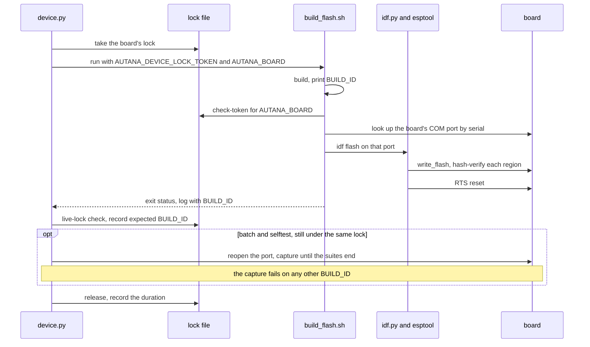

# Device lock

Nothing opens a board's USB serial port except `scripts/device/device.py`:
no monitor, capture helper, `esptool`, or direct pyserial command. Every
command takes the board's lock first, so sessions sharing a board queue for
it instead of fighting over the port.

Day-to-day use goes through `tools/autana` ([Autana-CLI.md](Autana-CLI.md)) -
every `autana` command calls `device.py`. This doc covers `device.py`
itself: its command line, for a script that names its own
`--owner`/`--purpose`, what the lock guarantees, and recovery when a lock will
not let go.

Run the tool with ESP-IDF's Python (the `python.exe` under
`%USERPROFILE%\.espressif\python_env\idf<version>_py<version>_env\Scripts\`
on Windows), so its pyserial installation is available; a different
interpreter re-runs it under that one. The examples write it as `python`.
It works the same from PowerShell, cmd or Git Bash: `flash`, `batch`, and
`selftest` run `build_flash.sh` with Git for Windows' own `bash.exe`, never
whatever `bash` is first on `PATH` - from a native shell that is WSL's
launcher, which cannot run ESP-IDF.

Every command but `report` takes `--owner` (defaults to
`AUTANA_DEVICE_OWNER`) and its own `--purpose` (each subcommand has a
sensible default - `flash`, `reset`, `run suite`, `send`, `screenshot`,
`batch capture` - override it to say why on a shared board).

```powershell
python scripts/device/device.py status
python scripts/device/device.py --owner sam flash --variant dev --worktree C:\path\to\engine
python scripts/device/device.py --owner sam run-suite sand --expect-build-id 0123456789ab-dev
python scripts/device/device.py --owner sam listen --seconds 30
```

`listen` takes `--follow` to run until Ctrl+C and `--echo` to print the full stream.

## Which board

A board is named by its USB serial number, which the ESP32-S3's USB
Serial/JTAG reports as the chip's MAC address (`90:70:69:FE:A3:08`, say).
It stays the same when a reset brings the board back on another COM
number, so the lock, the records and `status` all use it; COM numbers are
looked up again before every port open and every esptool call.

A command acts on the board named by `--board <serial>`, else by
`AUTANA_BOARD`, else on the only Espressif (VID `0x303A`) board plugged in.
Case does not matter. With several boards plugged in and none named, a
command fails and lists their serial numbers; each board has its own lock
and queue.

## What a flash proves

A flash succeeds when esptool's `write_flash` hash-verified every region it
wrote and the flash log carries the build's `BUILD_ID=` line; `flash` then
prints `flashed BUILD_ID=<id> (esptool hash verified; boot not verified)`.
It proves the write, not the boot, for every variant. What boots is proven
only by a console that names it: a `selftest` or `batch` capture, which fails
on any other `BUILD_ID`, or `autana buildid` on a development build.

`batch` and `selftest` hold one lock across the flash and the capture. A
separate `flash` and `run-suite` take two locks, and another session can
flash between them: `run-suite --expect-build-id <id>` fails if the board
reports another build, but `autana suite` passes no id, so after a separate
flash use `batch` or `selftest` when the capture must be of that image.



## Holding the board, and losing it

`flash`, `run-suite`, `selftest`, `batch`, `listen`, `reset`, `send`, and
`screenshot` take the lock before they touch the board and keep it for their
whole operation. A heartbeat renews it every 5 seconds. A lock is reclaimed
by the next waiter when its heartbeat is more than ten minutes old, or when
its holder's process on this host is dead; the acquirer logs
`reclaimed lock from <owner> for <purpose> (heartbeat expiry | dead process)`.
A process counts as dead only when the process table proves it: on Windows
`OpenProcess`/`GetExitCodeProcess`, never `os.kill(pid, 0)`, whose signal 0
is `CTRL_C_EVENT` there and misreports any process on another console.

The heartbeat refuses a lock that was replaced or has gone stale. From then
on the command has lost the board: a capture or `send` stops at its next
read, the next port open or esptool call refuses, a flash in progress is
stopped (its whole process tree), and the command fails with
`device lock was lost`. A command that finds its lock replaced when it ends
fails the same way, even if nothing else noticed. `build_flash.sh` checks
the live token for the named board just before `idf flash`; it cannot prove
ownership during the esptool write itself, which is what the heartbeat is
for.

After winning the lock a command also waits for the serial port itself to
come free, since a previous holder's reader can outlive its lock. The
default lock wait is ten minutes; `--wait 0` returns at once when the board
is busy, and a waiting command prints its queue place and estimated start at
most every 30 seconds.

## Status

`status` lists every board a lock, reservation or waiter names, and every
board plugged in; `--board` or `AUTANA_BOARD` narrows it to one. A board off
USB - unplugged, or mid-reset - is listed with no port. Text output gives,
per board, the holder with local start time, elapsed time and estimated free
time, a stale lock that is waiting to be reclaimed, and the waiters in FIFO
order with their estimated starts.

`status --json` prints `{"boards": [...]}`, one object per board. Times are
epoch seconds; an estimate without enough history is `null`.

| Field | |
|---|---|
| `board` | USB serial number |
| `port` | COM port now, `null` when the board is not on USB |
| `state` | `unlocked`, `held`, or `human` (a person's reservation) |
| `holder` | `{"owner", "purpose"}`, the purpose being a reservation's note; `null` when unlocked |
| `since`, `elapsed_seconds` | when the holder took the board, and for how long |
| `estimated_free` | when the holder should be done |
| `stale` | `{"owner", "purpose", "reason"}` of a lock the next waiter will reclaim, else `null` |
| `waiting` | `[{"owner", "purpose", "estimated_start"}]` in queue order |

Estimates come from `durations.jsonl` beside the lock files, one file shared
by every checkout and session on the machine. Each held command records how
long it held the board, nested `flash` and `run-suite` inside `batch` or
`selftest` included. A command that raises, exits non-zero, or loses its lock
is recorded with its error and never counts. An estimate is the median of a
command kind's last 30 successful runs, after at least three; a holder past
it is estimated free now, and a human reservation or an unknown duration
ahead of a waiter makes its estimate unknown. Past 400 lines the file is cut
back to the last 30 successful runs of each kind.

### Talking to a running device: `send`

`send` writes one console line and prints the device's replies to it, under
the lock like everything else. It is what live tuning uses - the firmware's
`util/tune` answers `SET <name> <value>`, `GET <name>` and `TUNE` on a
development build - and what `autana tune` calls:

```powershell
python scripts/device/device.py --owner maintainer send "SET ridge.trail 200"
python scripts/device/device.py --owner maintainer send TUNE
```

A reply is everything from `--reply` (default `TUNE`) to the end of its
line, since the console also carries the firmware's log lines; the answer
ends at a line starting with one of `--until` (default `TUNE_OK`, `TUNE_ERR`,
`TUNE_END`). It exits 1 on an `_ERR` reply, and says so when the build does
not know the command or nothing answers within `--seconds` (default 3).
`send` is not a capture: it adds no line to `index.jsonl`.

### Screenshots: `device.py screenshot`

`device.py screenshot [--as-shown|--framebuffer] [--out PATH]
[--timeout SECONDS]` takes the lock, requests the panel capture and writes a
`.png` plus a `.json` state snapshot; `autana screenshot` calls it the same
way. The wire protocol and the BMP-to-PNG decoder live in
`launcher/tools/device/screenshot.py`, imported as a library - it opens no
port itself.

### Measuring: use `batch`, not a sequence of commands

A measurement is `batch`: it takes the lock once, builds and flashes once,
captures every suite `--runs` times, and writes one summary across all runs.
`autana batch` calls it the same way ([Autana-CLI.md](Autana-CLI.md)):

```powershell
python scripts/device/device.py --owner sam batch --worktree C:\path\to\engine --suite run_sand_perf_suite --suite run_gfx_suite --runs 3
```

The summary (`<HHMMSS>_batch_<owner>.md` in the day's records folder) shows,
per suite: every timing per run with min, max and spread; every test whose
result changed between runs of the image - a test that flaps on one binary is
a finding, not noise; the tests that failed in every run; and each
`PERF TARGET` per run. A capture that errors is recorded and the batch
continues; only a failed build or flash stops it. `--perf-scope` builds the
perf-scoped image. `--out PATH` writes the one raw capture to `PATH` - only
with exactly one `--suite` and `--runs 1`, which is how `device_report.sh`'s
RUNSUITE-scoped reports (report_boot_anim_perf.sh) call it. `selftest`
builds the diagnostics+autorun image and captures the boot-time run until
`SELFTEST_COMPLETE`.

`run-suite` stops at the shell's `RUNSUITE_COMPLETE name=<suite>` line (or an
older build's `SUITE_DONE`), or after its non-`shell:` output is idle. A port
that disappears mid-capture ends it as `port lost` with what was read kept, so
a `batch` carries on with its next suite. It fails if the build has no suites,
does not contain the requested suite, or reports any failed test. `reset`
reboots with esptool and returns once the port is back; `reset --capture` and
`selftest` reopen the port if it vanishes or stays silent after the reset.

### Where a capture lands

No capture command needs `--out`: by default each writes to
`<records>/<YYYYMMDD>/<HHMMSS>_<kind>_<owner>.log` (`kind` is
`flash-<variant>`, `reset`, `runsuite-<suite>`, `selftest`, or `listen`). `<records>` is
`$AUTANA_RECORDS` when set, otherwise the checkout's own gitignored
`.records/device`, so nothing a commit can pick up by accident. A
default-path capture over 200 KB is gzipped in place (a flash log at
~270 KB usually is); pass `--out <path>` to write exactly there instead,
uncompressed:

```powershell
python scripts/device/device.py --owner sam run-suite sand --out C:\Temp\sand.log
```

Every invocation - default path or explicit `--out`, success or failure -
also appends one line to `<records>/index.jsonl`: the board, owner, purpose,
command, suite, build id (from the flash log for a flash, seen in the
capture otherwise), when the command started (`started_at`) and when it won
the lock (`acquired_at`), the worktree and commit involved, how the capture
ended, and any error. `device.py` never commits these records; whoever ran
the command commits the evidence with the work.

`run-suite` also writes a parsed `<same stem>.md` beside its capture -
suite PASS/FAIL counts, every failing test's Unity message, and any
`PERF TARGET` lines. When the manifest's `worktree` names a checkout with
exactly one app whose `tools/report_performance.py` registers the suite that
ran, that app's frame-budget table is appended too; zero or several matches,
or a reporter that fails, are noted in the report instead - a capture is
never failed over this. Rebuild a report for any existing capture:

```powershell
python scripts/device/device.py report .records/device/20260916/153113_runsuite-run_sand_perf_suite_sam.log
```

`report` touches no lock and no board.

### Lock files and recovery

The lock root is `%TEMP%/autana-device` (`AUTANA_DEVICE_LOCK_ROOT`
overrides it). Per board, with `:` in the serial number written as `_`:
`<serial>.json` is the lock - `board`, `owner`, `purpose`, `kind`,
`acquired_at`, `heartbeat_at`, `expected_build_id`, `host`, `pid`, and an
opaque `token`; `<serial>.queue/` holds the FIFO waiter tickets (a dead
waiter's is discarded); `<serial>.human.json` is a person's reservation.

`device.py --owner <owner> release --token <token>` releases a lock this
owner holds without touching the board - for a run that finished early and
wants to hand the board to the next waiter now. `autana release <token>`
calls it the same way. For inspection or emergency recovery, the lower-level
command takes the board's serial number:

```powershell
python scripts/device/device_lock.py --board 90:70:69:FE:A3:08 status
python scripts/device/device_lock.py --board 90:70:69:FE:A3:08 acquire --owner sam --purpose investigate --wait 60
python scripts/device/device_lock.py --board 90:70:69:FE:A3:08 heartbeat --token <token>
python scripts/device/device_lock.py --board 90:70:69:FE:A3:08 release --token <token>
```

The acquire result prints the token as JSON. Releasing requires that token, so
one owner cannot release another owner's active lock.

To reserve the board for a person, record the reservation before using it -
`autana hand <note>`, or `hand-to-human` directly with an active lock's own
token:

```powershell
python scripts/device/device.py --owner maintainer hand-to-human --token <token> --note "checking the panel"
```

When a session holds the board, its token releases that lock before the
reservation is recorded; without an active lock, omit `--token` (what
`autana hand` always does). The reservation appears in `status` and blocks
every acquisition until it is cleared - `autana take-back`, or
`device.py --owner maintainer take-back`, which prints the board's status
after. `device_lock.py --board <serial> clear-human` does the same for
recovery.

## Lock events

Set `AUTANA_LOCK_HOOK` to a shell command to run when a lock changes. The
command receives these environment variables: `AUTANA_LOCK_EVENT`,
`AUTANA_LOCK_BOARD` (the serial number), `AUTANA_LOCK_OWNER`,
`AUTANA_LOCK_PURPOSE`, and `AUTANA_LOCK_NOTE`. Purpose is empty for human
reservations; note carries the reclaim reason for `lost` and the reservation
note for human events. The command runs through `cmd.exe` on Windows
(`%VAR%`) and `/bin/sh` elsewhere (`$VAR`). Hooks run in separate processes
and are not ordered across them, so one holder's `released` can arrive after
the next holder's `acquired`. A hook has a three second timeout; a failed or
timed out hook is quiet and never changes the lock operation's outcome.

| Event | When |
|---|---|
| `acquired` | A ticket takes the lock, including reclaiming a stale lock. |
| `released` | The holder gives up the lock. |
| `waiting` | A ticket begins a real wait for a held or reserved board; once per ticket. |
| `gave-up` | A waiting ticket leaves without the lock. |
| `human-reserved` | A human reservation is recorded. |
| `human-cleared` | A human reservation is cleared. |
| `lost` | A stale lock is reclaimed; owner and purpose identify its former holder, and note gives the reclaim reason. |

`autana hand --wait <seconds> <note...>` waits without holding the device
lock; `human-reserved` fires when the reservation is recorded and
`human-cleared` when it is released. Release returns 0, timeout or Ctrl+C
returns 3, and a replacement reservation returns 4 without clearing it.

## Related

- [Autana-CLI.md](Autana-CLI.md) - the interactive `autana` command built on
  top of this lock.
- [Flashing-and-Toolchain.md](../notes/Flashing-and-Toolchain.md) - resets,
  download mode and recovery on this board.
