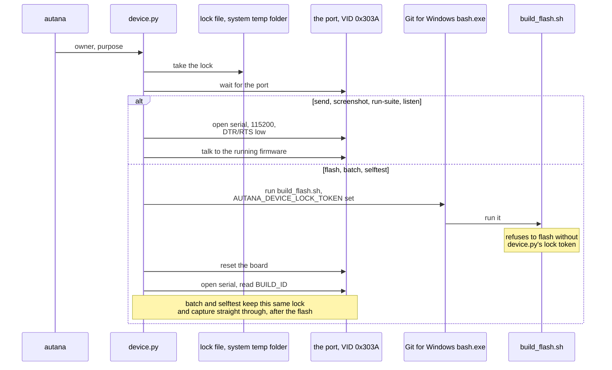

# Device lock

The shared board has one USB serial port. Nothing opens that port except
`scripts/device/device.py`: no monitor, capture helper, `esptool`, or direct
pyserial command. The tool finds the board by USB Serial/JTAG VID `0x303A`,
not a fixed COM number, and opens it at 115200 with DTR and RTS low.



Day-to-day interactive use goes through `tools/autana`
([Autana-CLI.md](Autana-CLI.md)) - every `autana` command calls `device.py`
for the lock and the port. This doc covers `device.py` itself: its own
command-line shape, for a script that names its own `--owner`/`--purpose`
rather than `autana`'s generated one, and recovery when a lock will not let
go.

Run the tool with ESP-IDF's Python (the `python.exe` under
`%USERPROFILE%\.espressif\python_env\idf<version>_py<version>_env\Scripts\`
on Windows), so its pyserial installation is available; the examples below
write it as `python`.
It works the same from PowerShell, cmd or Git Bash: `flash`, `batch`, and
`selftest` run `build_flash.sh` with Git for Windows' own `bash.exe`, never
whatever `bash` is first on `PATH` - from a native shell that is WSL's
launcher, which strips the backslashes out of the script path and could
not run ESP-IDF anyway.

Every command but `report` takes `--owner` (defaults to
`AUTANA_DEVICE_OWNER`) and its own `--purpose` (each subcommand has a
sensible default - `flash`, `reset`, `run suite`, `send`, `screenshot`,
`batch capture` - override it to say why on a shared board).

```powershell
python scripts/device/device.py status
python scripts/device/device.py --owner sam flash --variant dev --worktree C:\path\to\engine
python scripts/device/device.py --owner sam run-suite sand --expect-build-id 0123456789ab-dev
python scripts/device/device.py --owner sam listen --seconds 30
```

`listen` takes `--follow` to run until Ctrl+C and `--echo` to print the full stream.

### Talking to a running device: `send`

`send` writes one console line and prints the device's replies to it, under
the lock like everything else. It is what live tuning uses - the firmware's
`util/tune` answers `SET <name> <value>`, `GET <name>` and `TUNE` on a
development build - and what `autana tune` calls:

```powershell
python scripts/device/device.py --owner maintainer send "SET ridge.trail 200"
python scripts/device/device.py --owner maintainer send TUNE
```

A reply is everything from `--reply` (default `TUNE`) to the end of its
line, since the console also carries the firmware's log lines; the answer
ends at a line starting with one of `--until` (default `TUNE_OK`, `TUNE_ERR`,
`TUNE_END`). It exits 1 on an `_ERR` reply, and says so when the build does
not know the command or nothing answers within `--seconds` (default 3).

`send` is not a capture: it writes nothing under `records/` and adds no line
to `index.jsonl`. A tuning session is dozens of these, and none is evidence.

### Screenshots: `device.py screenshot`

`device.py screenshot [--as-shown|--framebuffer] [--out PATH] [--timeout SECONDS]` takes the lock,
requests the panel capture and writes a `.png` plus a `.json` state snapshot;
`autana screenshot` calls it the same way. A script that needs its own
`--owner`/`--purpose` calls `device.py screenshot` directly, the same way
it calls `run-suite` rather than `autana suite`. The wire protocol and the
BMP-to-PNG decoder
live in `launcher/tools/screenshot.py`, imported as a library - it opens no
port itself.

### Measuring: use `batch`, not a sequence of commands

A measurement is `batch`: it takes the lock ONCE, builds and flashes once,
captures every suite `--runs` times, and writes one summary across all runs.
Holding the board for the whole sequence means nobody else can flash
between two captures of the same image, and the command blocks until it is
done. `autana batch` calls
it the same way ([Autana-CLI.md](Autana-CLI.md)); a script with its
own `--owner`/`--purpose` calls `device.py batch` directly:

```powershell
python scripts/device/device.py --owner sam batch --worktree C:\path\to\engine --suite run_sand_perf_suite --suite run_gfx_suite --runs 3
```

The summary (`<HHMMSS>_batch_<owner>.md` in the day's records folder) shows,
per suite: every timing per run with min, max and spread; every test whose
result CHANGED between runs of the image - a test that flaps on one binary is
a finding, not noise; the tests that failed in every run; and each
`PERF TARGET` per run. A capture that errors is recorded and the batch
continues; only a failed build or flash stops it. `--perf-scope` builds the
perf-scoped image; build_flash.sh itself refuses an unsupported flag rather
than silently building the full image. `--out PATH` writes the one raw
capture to `PATH` instead of the default path - only with exactly one
`--suite` and `--runs 1`, which is how `device_report.sh`'s RUNSUITE-scoped
reports (report_boot_anim_perf.sh) call it.

`flash`, `run-suite`, `selftest`, `batch`, `listen`, and `reset` take the lock before
they touch the board, keep it through their whole operation, and renew it
every 30 seconds. `reset` reboots with esptool and returns once the port is
back. `reset --capture`, `selftest` and `flash`'s `BUILD_ID` check then
reopen the port for their capture: again if it vanishes mid-capture, and -
for the first ten seconds after the reset only - again if two seconds pass
without a byte, the stale handle a watchdog reset can leave. What the board
prints while USB re-enumerates may be lost. `selftest` builds the diagnostics+autorun image and
captures the boot-time run of every registered suite until
SELFTEST_COMPLETE; `autana selftest` calls it, and so does
`launcher/tools/device_report.sh` for a report with no single named suite
(report_test_results.sh and the frame-budget reports) - its RUNSUITE-scoped
report calls `batch --suite X --runs 1 --out PATH` instead, the same
build-then-capture-under-one-lock shape scoped to one suite and run. The
default wait is ten minutes; pass `--wait 0` to return immediately when the
board is busy. `flash` resets with esptool, then compares the boot
`BUILD_ID` with the `BUILD_ID=` line `build_flash.sh` printed into the flash
log; a board silent after that reset is restarted through the watchdog and
read again. When either value is missing, the command reports the image as
unverified instead of claiming success. `run-suite` stops at the shell's `RUNSUITE_COMPLETE
name=<suite>` line (or an older build's `SUITE_DONE`), or after its
non-`shell:` output is idle. A port that disappears mid-capture ends it as
`port lost` with what was read kept, so a `batch` carries on with its next
suite. It fails if the build has no suites,
does not contain the requested suite, or reports any failed test. It prints the number of `PASS` and
`FAIL` result lines when the capture ends, and fails if a different `BUILD_ID`
appears while capturing.

### Where a capture lands

No capture command needs `--out`: by default each writes to
`<records>/<YYYYMMDD>/<HHMMSS>_<kind>_<owner>.log` (`kind` is
`flash-<variant>`, `reset`, `runsuite-<suite>`, `selftest`, or `listen`). `<records>` is
`$AUTANA_RECORDS` when set, otherwise the checkout's own gitignored
`.records/device`, so nothing a commit can pick up by accident; the
maintainer's shell points `AUTANA_RECORDS` at the `.dev` checkout, where the
device history is tracked. A default-path capture over 200 KB is gzipped in
place (suite/listen captures rarely reach that; a flash log at ~270 KB usually
does); pass `--out <path>` to any of them to write exactly
there instead, uncompressed, e.g.:

```powershell
python scripts/device/device.py --owner sam run-suite sand --out C:\Temp\sand.log
python scripts/device/device.py --owner sam listen --seconds 30 --out C:\Temp\listen.log
```

Every invocation - default path or explicit `--out`, success or failure -
also appends one line to `<records>/index.jsonl`: owner, purpose,
port, the command and its arguments, the build id (verified for flash,
best-effort observed otherwise), the worktree and commit involved, how the
capture ended, and the error if it failed. `device.py` never commits any of
this itself - whoever ran the command commits the evidence with the work it
supports.

`run-suite` also writes a parsed `<same stem>.md` beside its capture -
suite PASS/FAIL counts, every failing test's Unity message, and any
`PERF TARGET` lines - so a result is readable without opening the raw log.
When the manifest's `worktree` names a checkout with exactly one app whose
`tools/report_performance.py` registers the suite that ran
(`SUITE_REGISTER(<suite>)` in that app's own `tests/suite_*.c`), that app's
frame-budget table is appended too; zero or several matches, or a reporter
that fails, are noted in the report instead of the table - a capture is
never failed over this. Rebuild a report for any existing capture without
re-running anything:

```powershell
python scripts/device/device.py report .records/device/20260916/153113_runsuite-run_sand_perf_suite_sam.log
```

`report` touches no lock and no port - it only reads a capture and
`index.jsonl` already on disk, so it works on any capture, including a
`flash` or `listen` one (both of these narrower reports: no suite was run,
so there is no PASS/FAIL table or app budget table to build).

The lock state is `%TEMP%/autana-device/<port>.json`. It is JSON containing
`owner`, `purpose`, `port`, `acquired_at`, `heartbeat_at`,
`expected_build_id`, `host`, `pid`, and an opaque `token`. FIFO waiter tickets
live in `%TEMP%/autana-device/<port>.queue/`; a dead waiter is discarded.
A lock is reclaimed when its heartbeat is more than ten minutes old, or when
its holder's process on this host is dead; the acquirer logs
`reclaimed lock from <owner> for <purpose> (heartbeat expiry | dead process)`.
A process counts as dead only when the process table proves it: on Windows
`OpenProcess`/`GetExitCodeProcess`, never `os.kill(pid, 0)`, whose signal 0
is `CTRL_C_EVENT` there and misreports any process on another console. After
winning the lock a command also waits for the serial port itself to come
free, since a previous holder's reader can outlive its lock.

`device.py --owner <owner> release --token <token>` releases a lock this
owner holds without touching the board - useful when a run finishes
early and wants to free the port for the next waiter immediately rather
than waiting out a command's own lifetime. `autana release <token>` calls it
the same way.

For inspection or emergency recovery, use the lower-level command:

```powershell
python scripts/device/device_lock.py --port COM5 status
python scripts/device/device_lock.py --port COM5 acquire --owner sam --purpose investigate --wait 60
python scripts/device/device_lock.py --port COM5 heartbeat --token <token>
python scripts/device/device_lock.py --port COM5 release --token <token>
```

The acquire result prints the token as JSON. Releasing requires that token, so
one owner cannot release another owner's active lock.

When the maintainer needs the board, record the reservation before using it -
`autana hand <note>`, or `hand-to-human` directly for an active lock's own
token:

```powershell
python scripts/device/device.py --owner maintainer hand-to-human --token <token> --note "checking the panel"
```

When a session holds the board, its token releases that lock before the command
creates the human reservation. Without an active lock, omit `--token` (what
`autana hand` always does). The reservation appears in `status` and prevents
future acquisitions. After the maintainer is done, clear it explicitly -
`autana take-back`, or:

```powershell
python scripts/device/device.py --port COM5 --owner maintainer take-back
```

This clears the reservation and prints the resulting lock status. The lower-level
`device_lock.py --port COM5 clear-human` command remains available for recovery.

## Related

- [Autana-CLI.md](Autana-CLI.md) - the interactive `autana` command built on
  top of this lock.
