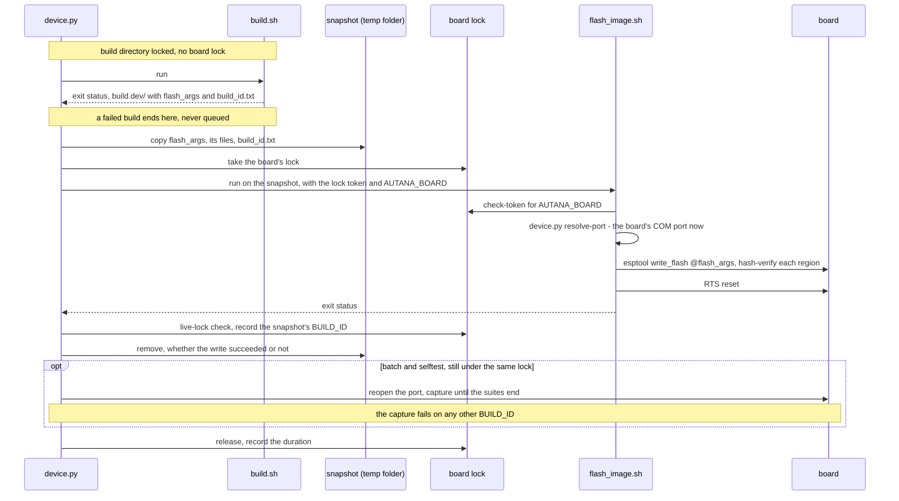
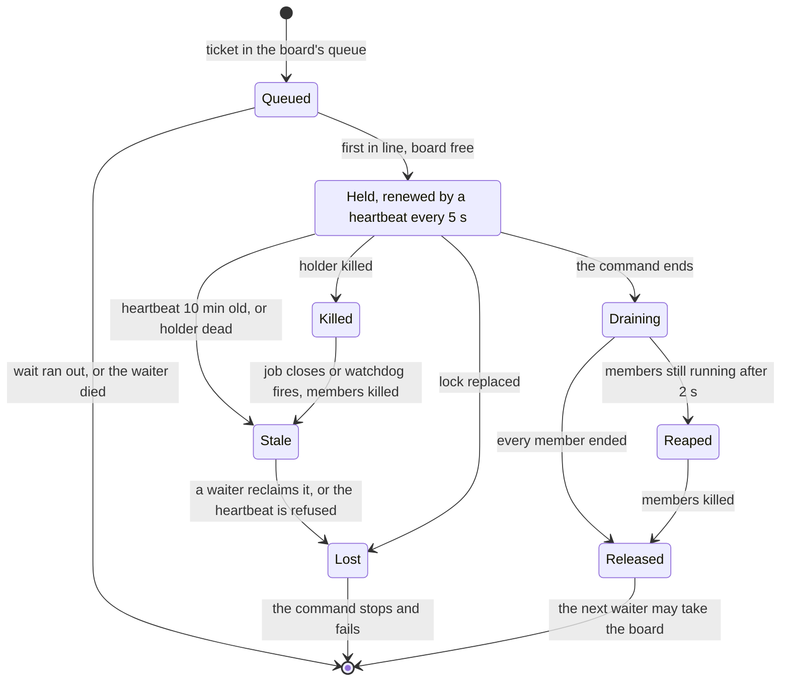

# Device lock

Nothing outside `scripts/device/` opens a board's USB serial port: no
monitor, capture helper, `esptool`, or direct pyserial command
(`scripts/gates/check_device_access.py` holds the tree to that). Every
command takes the board's lock before it opens the port, so sessions sharing
a board queue for it instead of fighting over the port.

Day-to-day use goes through `tools/autana` ([Autana-CLI.md](Autana-CLI.md)) -
every `autana` command calls `device.py`. This doc covers `device.py`
itself: its command line, for a script that names its own
`--owner`/`--purpose`, what the lock guarantees, and recovery when a lock will
not let go.

Run the tool with ESP-IDF's Python (the `python.exe` under
`%USERPROFILE%\.espressif\python_env\idf<version>_py<version>_env\Scripts\`
on Windows), so its pyserial installation is available; a different
interpreter re-runs it under that one. The examples write it as `python`.
It works the same from PowerShell, cmd or Git Bash: `flash`, `batch`, and
`selftest` run `build.sh` and `flash_image.sh` with Git for Windows'
own `bash.exe`, never
whatever `bash` is first on `PATH` - from a native shell that is WSL's
launcher, which cannot run ESP-IDF.

Every command but `report` takes `--owner` (defaults to
`AUTANA_DEVICE_OWNER`) and its own `--purpose` (each subcommand has a
sensible default - `flash`, `reset`, `run suite`, `send`, `screenshot`,
`batch capture` - override it to say why on a shared board).

```powershell
python scripts/device/device.py status
python scripts/device/device.py --owner sam flash --variant dev --worktree C:\path\to\engine
python scripts/device/device.py --owner sam run-suite run_gfx_suite --expect-build-id 0123456789ab-dev
python scripts/device/device.py --owner sam listen --seconds 30
```

`listen` takes `--follow` to run until Ctrl+C and `--echo` to print the full stream.

## Which board

A board is named by its USB serial number, which the ESP32-S3's USB
Serial/JTAG reports as the chip's MAC address (`90:70:69:FE:A3:08`, say).
It stays the same when a reset brings the board back on another COM
number, so the lock, the records and `status` all use it; COM numbers are
looked up again before every port open and every esptool call.

A command acts on the board named by `--board <serial>`, else by
`AUTANA_BOARD`, else on the only Espressif (VID `0x303A`) board plugged in.
With none plugged in it takes the only board a lock, reservation or waiter
names, so a command can queue while the holder's reset has the board off
USB. `hand` and `take-back` alone fall back once more, to the only board
this machine has ever found on USB, so a board that has dropped off with no
lock, reservation or waiter left to name it can still be handed to a human
or taken back; every other command leaves that fallback alone,
so an unplugged, idle board fails at once instead of queuing for a port
that will never open. Opening the port still waits for USB. Case and
surrounding spaces do not matter. With several candidates and none named, a
command fails and lists their serial numbers; each board has its own lock
and queue.

## One copy of the tools

Every checkout carries its own `scripts/device/`, but the lock is one set of
files on the machine, and two versions of the lock code can each believe
they hold the board. Nothing hands a checkout's invocation off to another one
at runtime any more - instead, always call `autana` (`tools/autana` on
`PATH`, `scripts/add-tools-to-path.sh`) rather than a checkout's own
`scripts/device/device.py` or `device_lock.py` directly. `autana` is one
script at one fixed location, so every call runs the same lock code
regardless of which checkout's shell invoked it; a report script such as
`launcher/tools/device/device_report.sh` calls `autana selftest`/`autana
suite`/`autana flash`, never a computed path to its own checkout's
`device.py`. What gets built and flashed still comes from the project named
by `--project` or the current directory (`autana help build`). LOCK_PROTOCOL
(below) is what keeps two differently-versioned copies from corrupting each
other's records on the rare path that still runs a checkout's own copy
directly - one machine can have several installs of different ages, and
nothing here is tied to git any more (`autana help`).

## What a flash proves

A flash succeeds when esptool's `write_flash` hash-verified every region it
wrote; `flash` then prints `flashed BUILD_ID=<id> (esptool hash verified;
boot not verified)`, the id read from the image it wrote. It proves the
write, not the boot, for every variant.

`BUILD_ID` is the first twelve lowercase hexadecimal characters of the
image's ELF hash, followed by its variant. It changes exactly when the image
does; the development build mark uses the first seven hash characters.

A flash is two halves in one log. `launcher/tools/build/build.sh` builds the
image with no board lock held, so other sessions keep the board meanwhile;
a file lock on the build directory keeps a second build of the same worktree
and variant out until this one is done. `device.py` then copies the image -
`flash_args`, every file it lists and `build_id.txt` - into a snapshot of its
own, a private temporary folder that no other flash shares and that is
removed once the write is done, has failed or was stopped; nothing
image-sized goes into the records. Only then does it queue for the board, and
under the lock `scripts/device/flash_image.sh` writes the snapshot with
esptool, never `idf.py flash`: nothing builds while the board is held, a later
build in that directory cannot change what is written, and the `BUILD_ID`
recorded is the snapshot's own. A build that fails never queues. When either
half fails, `flash` fails naming it, with the log's first error line
(esptool's `Could not open COM3 ...`, say) and the log's path. What boots is
proven only by a console that names it: a `selftest` or `batch` capture,
which fails on any other `BUILD_ID`, or `autana buildid` on a development
build.

`batch` and `selftest` build first, then hold one lock across the flash and
the capture. A separate `flash` and `run-suite` take two locks, and another
session can flash between them: `run-suite --expect-build-id <id>` (`autana
suite`'s own `--expect-build-id`) fails if the board reports another build;
without it, use `batch` or `selftest` when the capture must be of the image
`flash` just wrote. `batch`'s own `--expect-build-id` checks the image it
just flashed itself, before running any suite, against an id decided before
the flash - a different check from `run-suite`'s, which is against what the
board reports at capture time.


```mermaid
sequenceDiagram
    participant Dev as device.py
    participant Build as build.sh
    participant Snap as snapshot (temp folder)
    participant Lock as board lock
    participant Sh as flash_image.sh
    participant Board as board

    Note over Dev,Build: build directory locked, no board lock
    Dev->>Build: run
    Build-->>Dev: exit status, build.dev/ with flash_args and build_id.txt
    Note over Dev,Build: a failed build ends here, never queued
    Dev->>Snap: copy flash_args, its files, build_id.txt
    Dev->>Lock: take the board's lock
    Dev->>Sh: run on the snapshot, with the lock token and AUTANA_BOARD
    Sh->>Lock: check-token for AUTANA_BOARD
    Sh->>Sh: device.py resolve-port - the board's COM port now
    Sh->>Board: esptool write_flash @flash_args, hash-verify each region
    Sh->>Board: RTS reset
    Sh-->>Dev: exit status
    Dev->>Lock: live-lock check, record the snapshot's BUILD_ID
    Dev->>Snap: remove, whether the write succeeded or not
    opt batch and selftest, still under the same lock
        Dev->>Board: reopen the port, capture until the suites end
        Note over Dev,Board: the capture fails on any other BUILD_ID
    end
    Dev->>Lock: release, record the duration
```

## Holding the board, and losing it

`flash`, `run-suite`, `selftest`, `batch`, `listen`, `reset`, `send`, and
`screenshot` take the lock before they touch the board and keep it for their
whole operation. A heartbeat renews it every 5 seconds. A lock is reclaimed
by the next waiter when its heartbeat is more than ten minutes old, or when
its holder's process on this host is dead; the acquirer logs
`reclaimed lock from <owner> for <purpose> (heartbeat expiry | dead process)`.
A process counts as dead only when the process table proves it: on Windows
`OpenProcess`/`GetExitCodeProcess`, never `os.kill(pid, 0)`, whose signal 0
is `CTRL_C_EVENT` there and misreports any process on another console.

The lock is the promise of the port, and a child (esptool, a monitor) can
keep the port after its parent is gone, so the lock outlives every process the
command started. `lock_scope.py` gives every OS the same three calls, with one
mechanism each:

| OS | Members | A killed holder |
|---|---|---|
| Windows | a kill-on-close job object the holder joins when it takes the lock (`lock_job.py`); a process asking for `CREATE_BREAKAWAY_FROM_JOB` may leave | the kernel closes the job and kills every member |
| Linux | processes carrying the lock's token in `AUTANA_DEVICE_LOCK_TOKEN`, found in `/proc` (`lock_group.py`) | a watchdog the holder started sees the holder's pipe close and kills every tagged process |

The token, not parentage, is what names a member on Linux. It follows
inheritance through any number of exited parents, which a process tree cannot
(an orphan is reparented to init), and it beats `PR_SET_PDEATHSIG` (direct
children only) and a subreaper (it dies with the holder). A process that
scrubs its own environment or runs as another user is out of reach. `reset`'s esptool and
`run_to_end`'s flash are covered like anything else the holder starts.

A holder that ends normally gives the members that started under its lock two
seconds, stops the rest (through a handle on Windows, a pidfd that re-checks
the token on Linux) and prints their pids, then releases; work already running
before the lock was taken is left alone, and a survivor is printed. Jobs nest,
so a Windows holder already inside a launcher's or harness's job still gets its
own; if it cannot join one it says so and the lock works as before. The
watchdog is untagged, and a holder whose watchdog has died says so when it
releases.

On POSIX the port itself is opened exclusively (pyserial `exclusive`, an
advisory `flock`), as Windows does by itself, so a leftover holder makes the
next open fail as busy, which `open_when_free` retries, instead of two readers
splitting the byte stream. Being advisory, it excludes this tool's readers and
esptool but not `screen`, `minicom` or ModemManager. Where there is neither a
job nor `/proc`, this is the only protection.

The heartbeat refuses a lock that was replaced or has gone stale. From then
on the command has lost the board: a capture or `send` stops at its next
read, the next port open or esptool call refuses, a flash in progress is
stopped (its whole process tree), and the command fails with
`device lock was lost`. A command that finds its lock replaced when it ends
fails the same way, even if nothing else noticed. `flash_image.sh` checks
the live token for the named board just before its esptool write; it cannot
prove ownership during the write itself, which is what the heartbeat is
for.


```mermaid
stateDiagram-v2
    state "Held, renewed by a heartbeat every 5 s" as Held
    [*] --> Queued: ticket in the board's queue
    Queued --> Held: first in line, board free
    Queued --> [*]: wait ran out, or the waiter died
    Held --> Stale: heartbeat 10 min old, or holder dead
    Stale --> Lost: a waiter reclaims it, or the heartbeat is refused
    Held --> Lost: lock replaced
    Lost --> [*]: the command stops and fails
    Held --> Draining: the command ends
    Draining --> Reaped: members still running after 2 s
    Draining --> Released: every member ended
    Reaped --> Released: members killed
    Released --> [*]: the next waiter may take the board
    Held --> Killed: holder killed
    Killed --> Stale: job closes or watchdog fires, members killed
```

After winning the lock a command also waits for the serial port itself to
come free, since a previous holder's reader can outlive its lock. The
default lock wait is ten minutes; `--wait 0` returns at once when the board
is busy, and a waiting command prints its queue place and estimated start at
most every 30 seconds.

## Status

`status` lists every board a lock, reservation or waiter names, and every
board plugged in; `--board` or `AUTANA_BOARD` narrows it to one. A board off
USB - unplugged, or mid-reset - is listed with no port. Text output gives,
per board, the holder with local start time, elapsed time and estimated free
time, a stale lock that is waiting to be reclaimed, and the waiters in FIFO
order with their estimated starts.

`status --json` prints `{"boards": [...]}`, one object per board. Times are
epoch seconds; an estimate without enough history is `null`.

| Field | |
|---|---|
| `board` | USB serial number |
| `port` | COM port now, `null` when the board is not on USB |
| `state` | `unlocked`, `held`, or `human` (a person's reservation) |
| `holder` | `{"owner", "purpose"}`, the purpose being a reservation's note; `null` when unlocked |
| `since`, `elapsed_seconds` | when the holder took the board, and for how long |
| `estimated_free` | when the holder should be done |
| `stale` | `{"owner", "purpose", "reason"}` of a lock the next waiter will reclaim, else `null` |
| `waiting` | `[{"owner", "purpose", "estimated_start"}]` in queue order |

Estimates come from `durations.jsonl` beside the lock files, one file shared
by every checkout and session on the machine. Each held command records how
long it held the board, nested `flash` and `run-suite` inside `batch` or
`selftest` included. A `flash` holds the board only while esptool writes its
snapshot - the build and the snapshot come before the lock - so its recorded
duration, and the estimate a waiter behind it sees, is the write alone. A
command that raises, gets an error reply, or loses its lock is recorded with
its error and never counts. A suite that reports FAIL is a result, not a
broken run - a perf capture that trips a regression ceiling reports one - so
its duration counts. An estimate is the median of a command kind's last
`ESTIMATE_RECENT_RUNS` successful runs, after at least
`ESTIMATE_MINIMUM_RUNS` (constants in `device_lock.py`); a holder past it is
estimated free now, and a human reservation or an unknown duration ahead of
a waiter makes its estimate unknown. Past `DURATIONS_TRIM_LINES` lines the file is cut back to each
kind's last `ESTIMATE_RECENT_RUNS` successful runs, and then to the newest
`DURATIONS_TRIM_LINES` of those.

### Talking to a running device: `send`

`send` writes one console line and prints the device's replies to it, under
the lock like everything else. It is what live tuning uses - the firmware's
`util/tune` answers `SET <name> <value>`, `GET <name>` and `TUNE` on a
development build - and what `autana tune` calls:

```powershell
python scripts/device/device.py --owner maintainer send "SET ridge.theme_rgb 0x1199C8"
python scripts/device/device.py --owner maintainer send TUNE
```

A reply is everything from `--reply` (default `TUNE`) to the end of its
line, since the console also carries the firmware's log lines; the answer
ends at a line starting with one of `--until` (default `TUNE_OK`, `TUNE_ERR`,
`TUNE_END`). It exits 1 on an `_ERR` reply, and says so when the build does
not know the command or nothing answers within `--seconds` (default 3).
`send` is not a capture: it adds no line to `index.jsonl`.

### Screenshots: `device.py screenshot`

`device.py screenshot [--as-shown|--framebuffer] [--out PATH]
[--timeout SECONDS]` takes the lock, requests the panel capture and writes a
`.png` plus a `.json` state snapshot; `autana screenshot` calls it the same
way. The wire protocol and the BMP-to-PNG decoder live in
`launcher/tools/device/screenshot.py`, imported as a library - it opens no
port itself.

### Measuring: use `suite --flash`, not a sequence of commands

A measurement holds one lock across a flash and every capture: builds once, then
takes the lock once, flashes once, captures every suite `--runs` times, and writes
one summary across all runs. `autana suite <suite>... --runs N --flash` calls it
the same way ([Autana-CLI.md](Autana-CLI.md)); `autana batch` is its old spelling.

```powershell
python scripts/device/device.py --owner sam batch --worktree C:\path\to\engine --suite run_boot_anim_perf_suite --suite run_gfx_suite --runs 3
```

The summary (`<HHMMSS>_batch_<owner>.md` in the day's records folder) shows,
per suite: every timing per run with min, max and spread; every test whose
result changed between runs of the image - a test that flaps on one binary is
a finding, not noise; the tests that failed in every run; and each
`PERF TARGET` per run. A capture that errors or reports a failed test
is recorded and the batch continues, then exits 1; only a failed build or
flash stops it. `--perf-scope` builds the
perf-scoped image. `--out PATH` writes the one raw capture to `PATH` - only
with exactly one `--suite` and `--runs 1`, which is how `device_report.sh`'s
RUNSUITE-scoped reports (report_boot_anim_perf.sh) call it. `selftest`
builds the autorun diagnostics image and captures the boot-time run until
`SELFTEST_COMPLETE`.

`run-suite` stops at the shell's `RUNSUITE_COMPLETE name=<suite>` line (or an
older build's `SUITE_DONE`), or after its non-`shell:` output is idle. A port
that disappears mid-capture ends it as `port lost` with what was read kept, so
a `batch` carries on with its next suite. It fails if the build has no suites,
does not contain the requested suite, or reports any failed test. `reset`
reboots with esptool and returns once the port is back; `reset --capture` and
`selftest` reopen the port if it vanishes or stays silent after the reset.

### Where a capture lands

No capture command needs `--out`: by default each writes to
`<records>/<YYYYMMDD>/<HHMMSS>_<kind>_<owner>.log` (`kind` is
`flash-<variant>`, `reset`, `runsuite-<suite>`, `selftest`, or `listen`). `<records>` is
`$AUTANA_RECORDS` when set, otherwise the checkout's own gitignored
`.records/device`, so nothing a commit can pick up by accident. A
default-path capture over 200 KB is gzipped in place (a flash log at
~270 KB usually is); pass `--out <path>` to write exactly there instead,
uncompressed:

```powershell
python scripts/device/device.py --owner sam run-suite run_gfx_suite --out C:\Temp\gfx.log
```

Every invocation - default path or explicit `--out`, success or failure -
also appends one line to `<records>/index.jsonl`: the board, owner, purpose,
command, suite, build id (from the flash log for a flash, seen in the
capture otherwise), when the command started (`started_at`) and when it won
the lock (`acquired_at`), the worktree and commit involved, how the capture
ended, and any error. `device.py` never commits these records; whoever ran
the command commits the evidence with the work.

`run-suite` also writes a parsed `<same stem>.md` beside its capture -
suite PASS/FAIL counts, every failing test's Unity message, and any
`PERF TARGET` lines. When the manifest's `worktree` names a checkout with
exactly one app whose `tools/report_performance.py` registers the suite that
ran, that reporter's table is appended too; zero or several matches,
or a reporter that fails, are noted in the report instead - a capture is
never failed over this. Rebuild a report for any existing capture:

```powershell
python scripts/device/device.py report .records/device/20260916/153113_runsuite-run_boot_anim_perf_suite_sam.log
```

`report` touches no lock and no board.

### Lock files and recovery

The lock root is `%TEMP%/autana-device` (`AUTANA_DEVICE_LOCK_ROOT`
overrides it). Per board, with `:` in the serial number written as `_`:
`<serial>.json` is the lock - `board`, `owner`, `purpose`, `kind`,
`acquired_at`, `heartbeat_at`, `expected_build_id`, `host`, `pid`, `log`
(whom it was reclaimed from, if anyone), an opaque `token`, and `protocol`/
`autana_version` (next section); `<serial>.queue/` holds the FIFO waiter
tickets (a dead waiter's is discarded), each carrying the same `protocol`/
`autana_version`; `<serial>.human.json` is a person's reservation, likewise;
`<serial>.seen.json` just names a board once found on USB, written the
first time and never after - `hand`/`take-back` alone read it, to still
reach a board that has since dropped off with no lock, reservation or
waiter left to name it. There is no verb to forget one; delete the file
to make this machine stop offering that board as the fallback.

#### Lock protocol

The mutex is an OS-independent spinlock - an `O_CREAT|O_EXCL` guard file
`device_lock.py` creates and deletes around each read-modify-write, stale
after 30 s so a crashed holder cannot wedge it forever. The JSON files above
are the state that mutex protects, not locks themselves, and a machine can
have autana installs of different ages meeting at one board, so every record
carries `device_lock.LOCK_PROTOCOL`'s value as `"protocol"` (an integer, 0
when the field is absent - an autana from before this existed), alongside
`"autana_version"`. Neither is ever compared or refused on - two autanas of
different ages still have to work the same board, so a mismatch is only
ever shown as information, in `status` and while waiting:

```
held by sam for flash since ... (elapsed 12s; estimated free unknown; autana 0.4.1, lock protocol 2)
board held by sam (autana 0.4.1, lock protocol 2) - waiting
```

`PROTOCOL_CORE_FIELDS` names exactly what a reader must be able to get off
ANY record, of any age, without guessing - the fields that decide something:
`owner`, `pid`, `host`, `heartbeat_at` (a lock's liveness and staleness),
`ticket`/`sequence` (a waiter's identity and FIFO order), `board` (every
record names the board it is for, read by `boards()`), and `protocol`
itself. A dead or stale holder is judged from exactly these - `host`, `pid`
and `heartbeat_at` - so it is always reclaimed, whatever its protocol -
never wedges the board waiting for a peer that will never update it again.
Everything else (`purpose`, `acquired_at`, `since_at`, `note`, `kind`, ...)
is read with `.get()` wherever the record might not be one this autana just
wrote itself, the same way `kind` always has been - display information a
reader tolerates the absence of, never something a decision hinges on.

Bump `LOCK_PROTOCOL` whenever a record's fields change in a way an older
reader would misinterpret. `scripts/device/tests/test_device_lock.py` pins
every record's current keys as a golden set, keyed by protocol number: a
deliberate field change without also bumping `LOCK_PROTOCOL` and adding a
new entry there is the failure telling you to do both.

`device.py --owner <owner> release --token <token>` releases a lock this
owner holds without touching the board - for a run that finished early and
wants to hand the board to the next waiter now. `autana lock release <token>`
calls it the same way. For inspection or emergency recovery, the lower-level
command takes the board's serial number:

```powershell
python scripts/device/device_lock.py --board 90:70:69:FE:A3:08 status
python scripts/device/device_lock.py --board 90:70:69:FE:A3:08 acquire --owner sam --purpose investigate --wait 60
python scripts/device/device_lock.py --board 90:70:69:FE:A3:08 heartbeat --token <token>
python scripts/device/device_lock.py --board 90:70:69:FE:A3:08 release --token <token>
```

The acquire result prints the token as JSON. Releasing requires that token, so
one owner cannot release another owner's active lock.

To reserve the board for a person, record the reservation before using it -
`autana lock hand <note>`, or `hand-to-human` directly with an active lock's own
token:

```powershell
python scripts/device/device.py --owner maintainer hand-to-human --token <token> --note "checking the panel"
```

When a session holds the board, its token releases that lock before the
reservation is recorded; without an active lock, omit `--token` (what
`autana lock hand` always does). The reservation appears in `status` and blocks
every acquisition until it is cleared - `autana lock take-back`, or
`device.py --owner maintainer take-back`, which prints the board's status
after. `device_lock.py --board <serial> clear-human` does the same for
recovery.

## Lock events

Set `AUTANA_LOCK_HOOK` to a shell command to run when a lock changes. The
command receives these environment variables: `AUTANA_LOCK_EVENT`,
`AUTANA_LOCK_BOARD` (the serial number), `AUTANA_LOCK_OWNER`,
`AUTANA_LOCK_PURPOSE`, and `AUTANA_LOCK_NOTE`. Purpose is empty for human
reservations; note carries the reclaim reason for `lost` and the reservation
note for human events. The command runs through `cmd.exe` on Windows
(`%VAR%`) and `/bin/sh` elsewhere (`$VAR`). Hooks run in separate processes
and are not ordered across them, so one holder's `released` can arrive after
the next holder's `acquired`. A hook has a three second timeout; a failed or
timed out hook is quiet and never changes the lock operation's outcome.

| Event | When |
|---|---|
| `acquired` | A ticket takes the lock, including reclaiming a stale lock. |
| `released` | The holder gives up the lock. |
| `waiting` | A ticket begins a real wait for a held or reserved board; once per ticket. |
| `gave-up` | A waiting ticket leaves without the lock. |
| `human-reserved` | A human reservation is recorded. |
| `human-cleared` | A human reservation is cleared. |
| `lost` | A stale lock is reclaimed; owner and purpose identify its former holder, and note gives the reclaim reason. |

`autana lock hand --wait <seconds> <note...>` waits without holding the device
lock; `human-reserved` fires when the reservation is recorded and
`human-cleared` when it is released. Release returns 0, timeout or Ctrl+C
returns 3, and a replacement reservation returns 4 without clearing it.

## Related

- [Autana-CLI.md](Autana-CLI.md) - the interactive `autana` command built on
  top of this lock.
- [Flashing-and-Toolchain.md](../notes/Flashing-and-Toolchain.md) - resets,
  download mode and recovery on this board.
