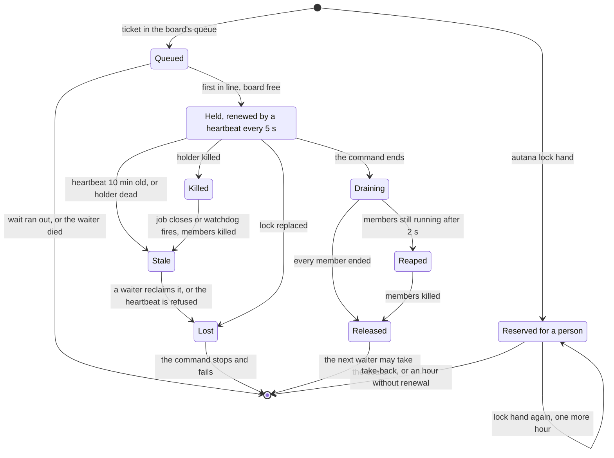

# Device lock

One board, one command at a time; the others queue.

Every command that touches the board - `flash`, `suite`, `selftest`,
`monitor`, `screenshot`, `tune`, `reset` - takes the board's lock first, so two
terminals, two agents or a CI job sharing one board wait for each other
instead of fighting over the USB serial port. Nothing outside
`scripts/device/` opens the port (`scripts/gates/check_device_access.py`
holds the tree to that).

```text
Terminal A                                  Terminal B
$ autana monitor 60
(holds the board)
                                            $ autana status
                                            board 90:70:69:FE:A3:08 (on COM5)
                                              held by sam@bench:4120 for autana monitor since 2026-09-29 16:42:51 (elapsed 6s; estimated free 2026-09-29 16:43:59; autana 0.1.0, lock protocol 2)
                                            $ autana monitor 5
                                            board held by sam@bench:4120 (autana 0.1.0, lock protocol 2) - waiting
                                            waiting for board: queue place 1; estimated start 2026-09-29 16:43:59
sam@bench:4188 is waiting for the board (autana monitor) - Ctrl+C to hand it over
^C
listen capture: .records/device/20260929/164251_listen_sam-bench-4120.log
listen capture ended: stopped
                                            listen capture: .records/device/20260929/164258_listen_sam-bench-4188.log
                                            listen capture ended: timeout
```

Ctrl+C in A ends its command and releases the lock; B, next in line, starts
by itself. Nothing needs cleaning up when a command is interrupted, and the
same holds when a terminal is closed or the process is killed: B then prints
`reclaimed lock from sam@bench:4120 for autana monitor (dead process)` and
carries on. Every command works the same way; the rest of this page is what
to do when the board does not come free, what is and is not promised, and
how it is built.

## Board busy?

Work down this list.

1. **See who has it.** `autana status` lists every board plugged in or named
   by a lock, and for each one of:

   ```text
   held by sam@bench:4120 for autana monitor since 2026-09-29 16:42:51 (elapsed 6s; estimated free 2026-09-29 16:43:59; autana 0.1.0, lock protocol 2)
   human reservation: sam@bench:39780: checking the panel (since 2026-09-29 16:45:43; 1s ago; 59m left, `autana lock hand` again renews it)
   unlocked - stale lock from sam@bench:25848 for autana monitor (dead process)
   unlocked - human reservation from sam@bench:11816: still checking expired 2m ago and is released
   unlocked
   ```

   Below a holder, `waiting:` lists the queue in order with each estimated
   start. An estimate is `unknown (no duration history)` until the command
   has run a few times on this machine. A `stale` or `expired` line needs
   nothing from you: the next command takes the board and says what it took.

2. **Wait.** A command that finds the board held queues and prints its place
   at most every 30 seconds; it gives up after 10 minutes. It starts as soon
   as the holder finishes:

   ```text
   board held by sam@bench:4120 (autana 0.1.0, lock protocol 2) - waiting
   waiting for board: queue place 1; estimated start 2026-09-29 16:43:59
   ```

   Behind a person's reservation the notice reads `board reserved by <owner>:
   <note> - waiting (the reservation ends in 59m unless renewed; ...)`.

3. **Do not wait.** For a script that should fail rather than queue, set the
   wait to zero (`AUTANA_DEVICE_WAIT` is in seconds):

   | Linux | Windows PowerShell |
   |---|---|
   | `AUTANA_DEVICE_WAIT=0 autana flash` | `$env:AUTANA_DEVICE_WAIT = "0"; autana flash` |

   ```text
   device: device lock was not acquired: board held by sam@bench:4120 for autana monitor since 2026-09-29 16:42:51; `autana status` shows the queue
   ```

   It exits 1. The same message ends a command whose 10-minute wait ran out.

4. **Read `stopped process(es)`.** When a command ends and something it
   started is still running (an `esptool` or a monitor that outlived its
   parent), the lock is not released while that could still hold the port:
   the command gives it two seconds, stops it, and prints

   ```text
   stopped process(es) still running under the device lock: 5120, 5133
   ```

   Those are processes your own command started; nothing else was touched.
   If one cannot be stopped it says `device lock released with process(es)
   still running that could not be stopped: ...`, and the next command's
   port open fails loudly instead of sharing the port (see the next step).

5. **The lock was yours but the port will not open.** A command that won the
   lock waits for the port itself to come free, up to 10 minutes, saying
   `waiting for the board port, held by another process`. If it never does:

   ```text
   device: board port still held by another process when the 600s wait ran out: <the OS's error>. The board's previous holder was sam@bench:4120 (autana monitor); its lock ended 3m ago. Still running from it: 5120 (python3), 5133 (esptool). autana never stops another holder's processes; end them yourself if you are sure they are not needed, or wait.
   ```

   The message names the holder before you and the processes of it that are
   still alive: on Linux every process that started under its lock, on
   Windows the holder's own pid while it runs. With none left it says a
   program outside autana (a serial terminal, a monitor) probably has the
   port open; close it.

6. **Ending a reservation or a lock.**
   - A reservation (`human reservation:` in `status`) is someone's `autana
     lock hand`; it lapses an hour after the last `hand`. `autana lock
     take-back` clears it now.
   - A held lock is a running command. End it with Ctrl+C in its terminal.
     Do not clear it from outside while the command lives; if it is truly
     stuck see [Forcing a stuck lock clear](#forcing-a-stuck-lock-clear).

## Guarantees and non-guarantees

> **Guaranteed**
>
> - One command per board, per user account, on one machine, at a time.
> - Commands take the board in first-come order: a FIFO queue.
> - The lock covers every process its command started: they are stopped when
>   the command ends normally, and on Windows and Linux also when the command
>   is killed.
> - The port is opened exclusively, so a leftover holder makes the next open
>   fail loudly instead of two readers splitting the byte stream.
> - A flash is hash-verified: esptool checked every region it wrote.
> - A holder that was paused (a suspended laptop, a debugger) stops its own
>   processes when it wakes and finds its lock gone.
> - A new holder never kills another holder's processes.
>
> **Not covered**
>
> - Sharing one board across machines. Not supported: the lock is files on
>   one machine's disk.
> - Two OS user accounts on one PC. Each account has its own lock folder on
>   Windows; on Linux both would use `/tmp/autana-device`, which the first
>   account created and the second typically cannot write. Give a board to one
>   account.
> - Programs that ignore the lock. On Linux the exclusive open is advisory,
>   so `screen`, `minicom` and ModemManager can still open a port autana
>   holds.
> - Boot correctness. A flash proves the write, not that the firmware boots.

## When something goes wrong

| What happened | What happens | How long | What you do |
|---|---|---|---|
| The holder was killed (terminal closed, `kill -9`, power off) | Windows: the kernel kills every process the command started. Linux: a watchdog the command started sees it end and kills every tagged process. The next waiter reclaims the lock (`reclaimed lock from ... (dead process)`). | Seconds | Nothing. |
| The holder is alive but stuck | A holder that keeps renewing its lock keeps the board, however long that is. One whose whole process stopped is reclaimed once its lock is 10 minutes old (`heartbeat expiry`); when it wakes it stops with `device lock was lost`. | While it lives; 10 minutes if stopped | `autana status` shows how long it has held. End it with Ctrl+C in its terminal, or kill it: the lock is reclaimed at once. |
| The laptop slept, or the clock jumped | A sleep or forward jump of over 10 minutes ages every lock past its expiry: a waiter takes the board, and the sleeper fails with `device lock was lost` on waking, even with nobody waiting. A jump back only makes a stale lock last longer. The clock also times a reservation's hour. | Up to 10 minutes extra | Re-run the command. |
| A terminal program has the port | Windows: the open fails and retries. Linux: `screen` and `minicom` ignore the lock and can open it alongside autana's readers, so both may read garbled output. | Up to 10 minutes (12 seconds for the flash write itself) | Close the other program. `previous holder` in the message tells you it was not autana. |
| The board was unplugged mid-flash | `esptool` fails, `flash` fails naming that half with the first error line and the log's path, and the lock is released. The board may hold a partial image. | Seconds | Plug it in, run `autana flash` again. If it will not boot, [Flashing-and-Toolchain.md](../notes/Flashing-and-Toolchain.md) has download mode and recovery. |
| Someone forgot `autana lock hand` | Every command is refused with `board reserved by ...` and the time left. A reservation has no heartbeat, so the hour after the last `hand` is the only thing that ends it; then it counts as released, and `status` and the `human-expired` event say so. | 1 hour | `autana lock take-back` if it is not yours to keep. |

## For a shared rig or CI

### Where the lock lives

One folder per machine and account, shared by every checkout and session:

| | Lock folder |
|---|---|
| Windows | `%TEMP%\autana-device`, usually `C:\Users\<you>\AppData\Local\Temp\autana-device` |
| Linux | `/tmp/autana-device`, or `$TMPDIR/autana-device` when `TMPDIR` is set |

`AUTANA_DEVICE_LOCK_ROOT` names another folder. Per board, with `:` in the
serial number written as `_`:

| File | What it is |
|---|---|
| `<serial>.json` | The lock: `owner`, `purpose`, `kind`, `acquired_at`, `heartbeat_at`, `host`, `pid`, `token`, `expected_build_id`, `log`, `protocol`, `autana_version`. |
| `<serial>.queue/` | One ticket per waiting command, in FIFO order; a dead waiter's is discarded. |
| `<serial>.human.json` | A person's reservation, with `expires_at`. |
| `<serial>.last.json` | The board's previous holder, for the message in step 5 above. |
| `<serial>.seen.json` | Names a board once found on USB, so `lock hand` and `lock take-back` can still reach it when it has since dropped off. Delete it to make this machine forget the board. |
| `durations.jsonl` | How long each kind of command held the board, for estimates ([Flash-and-Captures.md](Flash-and-Captures.md#wait-estimates)). |

### Which board

A board is named by its USB serial number (the ESP32-S3's MAC address,
`90:70:69:FE:A3:08`, say), so the lock and its queue survive a reset that
brings it back on another COM number. A command acts on `AUTANA_BOARD`
(or the one Espressif board plugged in, else the one board a lock,
reservation or waiter names, so it can queue while a holder's reset has the
board off USB). With several candidates and none named it fails and lists
them; each board has its own lock and queue. `lock hand` and `lock take-back`
alone fall back once more to the only board this machine has ever seen.

### Variables, exit codes and JSON status

| Variable | Effect |
|---|---|
| `AUTANA_DEVICE_OWNER` | The lock owner shown to others, as `<value>:<pid>`; `<user>@<host>:<pid>` when unset. Give each CI job its own. |
| `AUTANA_DEVICE_WAIT` | Seconds a command waits for the lock; 600 when unset, 0 fails at once. |
| `AUTANA_BOARD` | The board's USB serial number, when several are plugged in. |
| `AUTANA_DEVICE_LOCK_ROOT` | The lock folder. |
| `AUTANA_LOCK_HOOK` | A shell command run on lock events ([Lock events](#lock-events)). |
| `AUTANA_RECORDS` | Where captures and `index.jsonl` land ([Flash-and-Captures.md](Flash-and-Captures.md#where-a-capture-lands)). |

Exit codes: `0` success; `1` any failure, including `device lock was not
acquired` (busy) and `device lock was lost` - tell them apart by the message;
`130` for a second Ctrl+C on `monitor`. `device.py` itself exits `2` for a
bad command line. `lock hand --wait`
returns `0` when the reservation was released or expired, `3` when the wait
timed out or was interrupted (the reservation stays), and `4` when a later
reservation replaced it.

`autana status --json` prints `{"boards": [...]}`, one object per board.
Times are epoch seconds; an estimate without enough history is `null`.

| Field | |
|---|---|
| `board` | USB serial number |
| `port` | COM port now, `null` when the board is not on USB |
| `state` | `unlocked`, `held`, or `human` (a person's reservation) |
| `holder` | `{"owner", "purpose"}`, the purpose being a reservation's note; `null` when unlocked. A held lock's also carries `protocol` and `autana_version`. |
| `since`, `elapsed_seconds` | when the holder took the board, and for how long |
| `estimated_free` | when the holder should be done |
| `expires_at`, `remaining_seconds` | when a reservation lapses, and how long is left; else `null` |
| `stale` | `{"owner", "purpose", "reason"}` of a lock the next waiter will reclaim, else `null` |
| `expired` | `{"owner", "purpose", "expired_at", "ago_seconds"}` of a reservation that lapsed and is treated as released, else `null` |
| `waiting` | `[{"owner", "purpose", "estimated_start"}]` in queue order |

### Lock events

Set `AUTANA_LOCK_HOOK` to a shell command to run when a lock changes. It runs
through `cmd.exe` on Windows (`%VAR%`) and `/bin/sh` elsewhere (`$VAR`), with
`AUTANA_LOCK_EVENT`, `AUTANA_LOCK_BOARD` (the serial number),
`AUTANA_LOCK_OWNER`, `AUTANA_LOCK_PURPOSE` and `AUTANA_LOCK_NOTE` set. Purpose
is empty for reservations; note carries the reclaim reason for `lost` and the
reservation note for the `human-` events. Hooks run in separate processes and
are not ordered across them, so one holder's `released` can arrive after the
next holder's `acquired`. A hook has a three second timeout; a failed or
timed out hook is quiet and never changes the lock operation's outcome.

| Event | When |
|---|---|
| `acquired` | A ticket takes the lock, including reclaiming a stale lock. |
| `released` | The holder gives up the lock. |
| `waiting` | A ticket begins a real wait for a held or reserved board; once per ticket. |
| `gave-up` | A waiting ticket leaves without the lock. |
| `human-reserved` | A reservation is recorded. Renewing one records nothing new. |
| `human-cleared` | `lock take-back` cleared a reservation. |
| `human-expired` | A reservation lapsed unrenewed and was treated as released; the note is its own. |
| `lost` | A stale lock is reclaimed; owner and purpose identify its former holder, and note gives the reclaim reason. |

`autana lock hand --wait <seconds> <note...>` waits without holding the device
lock. Its exit codes are above.

### One copy of the tools

Every checkout carries its own `scripts/device/`, but the lock is one set of
files on the machine, and two versions of the lock code can each believe they
hold the board. Always call `autana` (`tools/autana` on `PATH`,
`scripts/add-tools-to-path.sh`) rather than a checkout's own `device.py` or
`device_lock.py`: it is one script at one fixed location, so every call runs
the same lock code whichever checkout's shell started it. What gets built and
flashed still comes from the project named by `--project` or the current
directory (`autana help build`). A report script calls `autana selftest`,
`autana suite` or `autana flash`, never a computed path to `device.py`.

Installs of different ages can still meet at one board. Every record carries
its `protocol` number and `autana_version`, and a difference is only shown
(`status` and the wait notice print `autana 0.1.0, lock protocol 2`), never
refused. A dead or stale holder is judged from `host`, `pid` and
`heartbeat_at` alone, so it is reclaimed whatever its protocol. An install
older than protocol 2 does not know a reservation lapses, so on a shared
machine update every copy.

### Forcing a stuck lock clear

Normally nothing needs forcing: a dead holder is reclaimed at once and a
silent one after 10 minutes. If a command's lock has to go now:

1. Read the `token` field of `<serial>.json` and run `autana lock release
   <token>`. It releases the lock without touching the board.
2. If the file cannot be read, delete it. Either way the holder, if it lives,
   fails with `device lock was lost` and stops its processes within about 5
   seconds:

   | Linux | Windows PowerShell |
   |---|---|
   | `rm /tmp/autana-device/90_70_69_FE_A3_08.json` | `Remove-Item "$env:TEMP\autana-device\90_70_69_FE_A3_08.json"` |

3. A `.guard` file left by a crash clears itself after 30 seconds. A reservation
   clears with `autana lock take-back`.

A leftover process of the previous holder is yours to end; nothing here kills
across holders.

### Calling `device.py` from a script

A script that wants its own owner and purpose runs `scripts/device/device.py`
under ESP-IDF's Python (a different interpreter re-runs it under that one).
On Windows, `flash`, `suite --flash` and `selftest` run `build.sh` and
`flash_image.sh` with Git for Windows' own `bash.exe`, never whatever `bash`
comes first on `PATH`, which from a native shell is WSL's launcher.

```sh
python scripts/device/device.py status
python scripts/device/device.py --owner ci-7 --wait 0 flash --variant dev --worktree /path/to/engine
python scripts/device/device.py --owner ci-7 --purpose "gfx suite" run-suite run_gfx_suite --expect-build-id 0123456789ab-dev
```

`--owner` defaults to `AUTANA_DEVICE_OWNER`, `--wait` is the lock wait in
seconds, and each subcommand's `--purpose` has a default (override it to say
why on a shared board). `release --token <t>`, `hand-to-human --token <t>
--note <n>` and `take-back` are what `autana lock` calls. For inspection or
emergency recovery `scripts/device/device_lock.py --board <serial>` takes
`status`, `acquire --owner ... --purpose ... --wait 60`, `heartbeat --token`,
`release --token`, `check-token --token`, `human --owner ... --note ...` and
`clear-human`.

## How it works

A lock is a file, taken in queue order, kept alive by a heartbeat, and tied to
the processes its command starts so that none of them can hold the port after
the lock is gone.

| | What the lock is tied to | If the holder is killed |
|---|---|---|
| Windows | A job object the holder joins when it takes the lock. Every process it starts inherits the job, grandchildren of dead parents included. | The kernel closes the job and kills every member. A process started with `CREATE_BREAKAWAY_FROM_JOB` can leave it. |
| Linux | A token: every process the holder starts carries the lock's token in `AUTANA_DEVICE_LOCK_TOKEN`, found through `/proc`. A small watchdog the holder starts holds the read end of a pipe. | The pipe closes, and the watchdog kills every process still carrying the token. A process that scrubs its environment or runs as another user is out of reach. |

A holder that ends normally gives the processes it started two seconds, stops
the rest and prints their pids, then releases. Work that was already running
before the lock was taken is left alone. If a holder cannot join a job (or
loses its watchdog) it says so, and the lock still works as a lock.

**Heartbeat and reclaim.** A held lock is renewed every 5 seconds. The next
waiter reclaims it when the holder's process on this machine is dead, or when
its heartbeat is more than 10 minutes old, and logs `reclaimed lock from
<owner> for <purpose> (dead process | heartbeat expiry)`. A holder whose
heartbeat is refused - its lock was replaced, or it went stale while it was
paused - has lost the board: a capture stops at its next read, the next port
open refuses, a flash in progress is stopped, and the command fails with
`device lock was lost`. A person's reservation has no heartbeat: it lapses one
hour after the last `lock hand`, and the next command takes it as released.


```mermaid
stateDiagram-v2
    state "Held, renewed by a heartbeat every 5 s" as Held
    state "Reserved for a person" as Reserved
    [*] --> Queued: ticket in the board's queue
    Queued --> Held: first in line, board free
    Queued --> [*]: wait ran out, or the waiter died
    Held --> Stale: heartbeat 10 min old, or holder dead
    Stale --> Lost: a waiter reclaims it, or the heartbeat is refused
    Held --> Lost: lock replaced
    Lost --> [*]: the command stops and fails
    Held --> Draining: the command ends
    Draining --> Reaped: members still running after 2 s
    Draining --> Released: every member ended
    Reaped --> Released: members killed
    Released --> [*]: the next waiter may take the board
    Held --> Killed: holder killed
    Killed --> Stale: job closes or watchdog fires, members killed
    [*] --> Reserved: autana lock hand
    Reserved --> Reserved: lock hand again, one more hour
    Reserved --> [*]: take-back, or an hour without renewal
```

## Related

- [Flash-and-Captures.md](Flash-and-Captures.md) - what a flash proves, how a
  measurement holds one lock, and where captures land.
- [Autana-CLI.md](Autana-CLI.md) - the `autana` command built on this lock.
- [Flashing-and-Toolchain.md](../notes/Flashing-and-Toolchain.md) - resets,
  download mode and recovery on this board.
