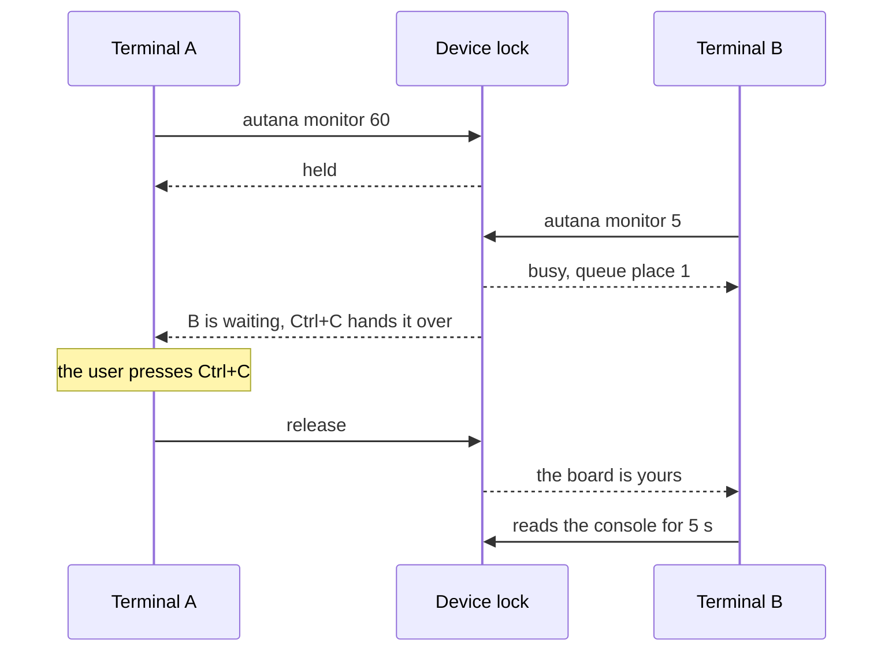
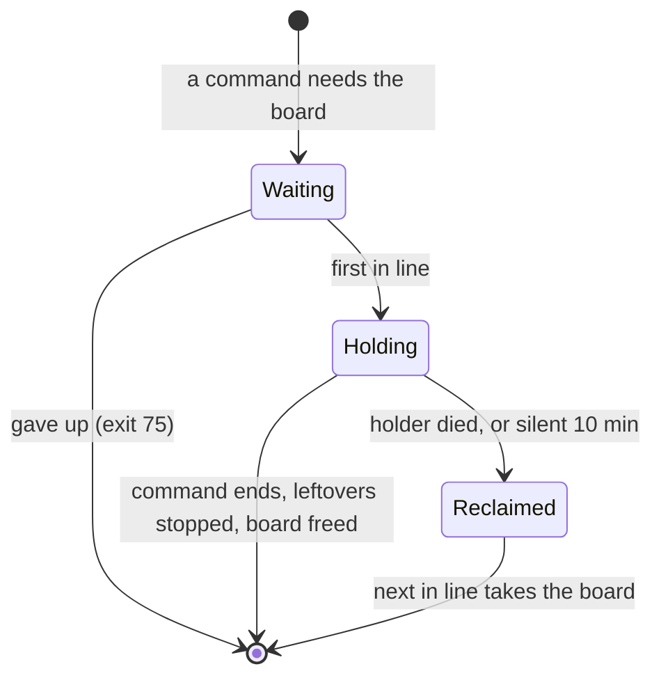

# Device lock

One board, one command at a time; the others queue. Windows and Linux differ
only in how autana finds and ends the processes a command leaves behind; what
you do is the same on both.

Every command that touches the board - `flash`, `suite`, `selftest`,
`monitor`, `screenshot`, `tune`, `reset` - takes the board's lock first, so two
terminals, two agents or a CI job sharing one board wait for each other
instead of fighting over the USB serial port.

A command is named `user@host:pid`: your login, the machine, and the
command's process id. That is who `status` says holds the board or waits for
it.

Two terminals, A and B, in the order things happen:

```text
A$ autana monitor 60
   ← A holds the board and reads the console
B$ autana status
B  board 90:70:69:FE:A3:08 (on COM5)
B    held by sam@bench:4120 for autana monitor since 16:42:51 ...
B$ autana monitor 5
B  board held by sam@bench:4120 (autana 0.1.0, ...) - waiting
B  waiting for board: queue place 1; estimated start 16:43:59
   ← B's command waits in the queue
A  sam@bench:4188 is waiting (...) - Ctrl+C to hand it over
   ← A is told, not interrupted
A^C
   ← A's user hands the board over
A  listen capture: .../164251_listen_sam-bench-4120.log
A  listen capture ended: stopped
B  listen capture: .../164258_listen_sam-bench-4188.log
B  listen capture ended: timeout
   ← B has the board and runs
```


```mermaid
sequenceDiagram
    participant A as Terminal A
    participant L as Device lock
    participant B as Terminal B

    A->>L: autana monitor 60
    L-->>A: held
    B->>L: autana monitor 5
    L-->>B: busy, queue place 1
    L-->>A: B is waiting, Ctrl+C hands it over
    Note over A: the user presses Ctrl+C
    A->>L: release
    L-->>B: the board is yours
    B->>L: reads the console for 5 s
```

- `autana 0.1.0, lock protocol 2` is the holder's tool version and lock-file
  format; it only matters when installs of different ages share a board.
- `monitor` appears as a `listen capture`: it is the console read.
- The line in A's terminal only tells its user someone is queued. Nothing
  interrupts A; Ctrl+C is A's user choosing to hand the board over.
- Ctrl+C ends A's command and releases the lock, and B, next in line, starts
  by itself. Nothing needs cleaning up after an interrupt. Closing the
  terminal or killing the process is the same: B prints
  `reclaimed lock from sam@bench:4120 for autana monitor (dead process)` and
  carries on.

## Board busy?

"Busy" means queued. Seeing `waiting` is the queue working, not an error: your
command starts by itself when the board is free, and the 30 seconds of
`monitor 30` count from when it gets the board. If you would rather not wait,
work down this list.

1. **See who has it.** `autana status` lists every board plugged in or named
   by a lock, and for each one of the held line above, or:

   ```text
   human reservation: sam@bench:39780: checking the panel (since 2026-09-29 16:45:43; 1s ago; 59m left, `autana lock hand` again renews it)
   unlocked - stale lock from sam@bench:25848 for autana monitor (dead process)
   unlocked - human reservation from sam@bench:11816: still checking expired 2m ago and is released
   unlocked
   ```

   `autana lock hand <note>` means "I am using the board by hand": it reserves
   the board so every command waits or fails until `autana lock take-back`,
   or until an hour after the last `hand`. Below a holder, `waiting:` lists
   the queue with each estimated start; an estimate is `unknown (no duration
   history)` until that command has run a few times on this machine. A
   `stale` or `expired` line needs nothing from you: the next command takes
   the board and says what it took.

2. **Wait.** A waiting command prints its place at most every 30 seconds
   (the two notices in the transcript) and gives up after 10 minutes. Behind a
   reservation the notice reads `board reserved by <owner>: <note> - waiting
   (59m left, unless renewed; ...)`.

3. **Do not wait.** For one command that should fail rather than queue,
   put `--wait 0` (seconds) before it; it covers every step the command
   runs, such as the flash inside `suite --flash`:

   ```text
   autana --wait 0 flash
   ```

   A CI job that should fail rather than queue writes `autana --wait 0
   <command>` on every board command; there is no environment setting.

   `--wait` is only accepted before the command (`autana --wait 0 monitor
   5`); after it, autana says so and does nothing.

   ```text
   device: device lock was not acquired: board held by sam@bench:4120 for autana monitor since 2026-09-29 16:42:51; `autana status` shows the queue
   ```

   It exits 75, the same status as a command whose 10-minute wait ran out, so
   a CI job can retry on the code alone.

4. **Read `stopped process(es)`.** When a command ends and something *it
   started* is still running (an `esptool` or a monitor that outlived its
   parent), autana does not release the lock while that could still hold the
   port: it gives the process two seconds, ends it, and prints

   ```text
   stopped process(es) still running under the device lock: 5120, 5133
   ```

   Only processes your own command started are ever ended. An `esptool` or a
   terminal program you started yourself is never touched: its port open
   fails, or the port open of your next command does. If autana cannot end
   one it says `device lock released with process(es) still running that could
   not be stopped: ...`.

5. **The lock was yours but the port will not open.** A command that won the
   lock waits for the port itself to come free, up to 10 minutes, saying
   `waiting for the board port, held by another process`. If it never does:

   ```text
   device: board port still held by another process when the 600s wait ran out: <the OS's error>. The board's previous holder was sam@bench:4120 (autana monitor); its lock ended 3m ago. Still running from it: 5120 (python3), 5133 (esptool). autana never stops another holder's processes; end them yourself if you are sure they are not needed, or wait.
   ```

   The message names the one holder before you and the processes of it that
   are still alive: its own process, and on Linux everything that started
   under its lock; on Windows only its own process. With none left it says a
   program outside autana (a serial terminal, a monitor) probably has the port
   open; close it. Only a person decides to end a process; autana does not.

6. **Ending a reservation or a lock.** A reservation is someone's
   `autana lock hand`; `autana lock take-back` clears it now. A held lock is a
   running command: end it with Ctrl+C in its terminal. Do not clear it from
   outside while the command lives; if it is truly stuck see [Forcing a stuck
   lock clear](#forcing-a-stuck-lock-clear).

## Guarantees and non-guarantees

> **Guaranteed**
>
> - One command per board, per user account, on one machine, at a time.
> - Commands take the board in first-come order: a FIFO queue.
> - The lock covers every process its command started: autana ends them when
>   the command ends normally, and on Windows and Linux also when the command
>   is killed (see the failure table for the one soft case).
> - The port is opened exclusively. On Windows any program holding it makes
>   the next open fail; on Linux the exclusive open is advisory, so it
>   excludes autana processes and `esptool`, not `screen`, `minicom` or
>   ModemManager. Either way a leftover autana process makes the next open
>   fail loudly instead of two readers splitting the byte stream.
> - A flash is hash-verified: esptool checked every region it wrote.
> - A holder that was paused (a suspended laptop, a debugger) ends its own
>   processes when it wakes and finds its lock gone.
> - A new holder never kills another holder's processes.
> - A process you started yourself (`esptool`, a terminal program) is never
>   ended by autana.
>
> **Not covered**
>
> - Sharing one board across machines. Not supported: the lock is files on
>   one machine's disk.
> - Two OS user accounts on one PC. Each account has its own lock folder, so
>   both would believe they hold the board. Give a board to one account.
> - Programs that ignore the lock: on Linux, `screen`, `minicom` and
>   ModemManager can open a port autana holds.
> - Boot correctness. A flash proves the write, not that the firmware boots.

## When something goes wrong

Timings are set in [How it works](#how-it-works): a heartbeat every 5 seconds,
and a lock is reclaimable when its holder is dead or has been silent 10
minutes.

| What happened | What happens | How long | What you do |
|---|---|---|---|
| The holder died (terminal closed, `kill -9`, power off) | Windows: the kernel ends every process the command started. Linux: a watchdog the command started sees it die and ends every tagged process. The next waiter reclaims the lock (`reclaimed lock from ... (dead process)`). The soft case: on Linux the watchdog is a separate process, so if it dies with the holder (logout, `kill -9 -1`, a stopped container) nothing ends the started processes; they keep the port until they exit and the next open fails with the previous-holder message naming them. | Seconds | Nothing, or end the named processes. |
| The holder is alive but stuck | A holder that keeps renewing its lock keeps the board however long that is. One whose whole process stopped is reclaimed once it has been silent 10 minutes (`heartbeat expiry`); when it wakes it fails with `device lock was lost`. | While it lives; 10 minutes if stopped | `autana status` shows how long it has held. End it with Ctrl+C in its terminal, or kill it: the lock is then reclaimed at once. |
| The laptop slept, or the clock jumped | A sleep or forward jump of over 10 minutes makes every lock reclaimable: a waiter takes the board, and the sleeper fails with `device lock was lost` on waking, even with nobody waiting. A jump back only makes a stale lock last longer. The same clock times a reservation's hour. | Up to 10 minutes extra | Re-run the command. |
| A terminal program has the port | Windows: the open fails and retries. Linux: `screen` and `minicom` ignore the lock and can open it alongside autana's readers, so both may read garbled output. autana ends nothing of yours. | Up to 10 minutes (12 seconds when a command reopens the port right after its own flash) | Close the other program. A message that names no previous-holder process says it was not autana. |
| The board was unplugged mid-flash | `esptool` fails, `flash` fails naming that half with the first error line and the log's path, and the lock is released. The board may hold a partial image. | Seconds | Plug it in, run `autana flash` again. If it will not boot, [Flashing-and-Toolchain.md](../notes/Flashing-and-Toolchain.md) has download mode and recovery. |
| Someone forgot `autana lock hand` | Every command is refused with `board reserved by ...` and the time left. A reservation has no heartbeat, so the hour after the last `hand` is the only thing that ends it. It then counts as released and `status` says so; the `human-expired` event fires at the next command or `hand` that finds it, not on the hour. | 1 hour | `autana lock take-back` if it is not yours to keep. |

## For a shared rig or CI

### Where the lock lives

One folder per user account and machine, shared by every checkout and
session:

| | Lock folder |
|---|---|
| Windows | `%TEMP%\autana-device`, usually `C:\Users\<you>\AppData\Local\Temp\autana-device` |
| Linux | `/tmp/autana-device-<uid>` (`id -u`), whatever `TMPDIR` is |

There is no setting for another folder: the lock is one per machine, and a
folder chosen per checkout or per shell would split it. Linux ignores `TMPDIR`
so two jobs with different temp folders still exclude each other; an install older
than this rule used `$TMPDIR/autana-device` there, and until every copy on the
machine is updated the two do not exclude each other (the lock protocol number
cannot help: an older install never looks in the new folder). Per board, with
`:` in the serial number written as `_`:

| File | What it is |
|---|---|
| `<serial>.json` | The lock: `owner`, `purpose`, `kind`, `acquired_at`, `heartbeat_at`, `host`, `pid`, `token`, `expected_build_id`, `log`, `protocol`, `autana_version`. The `token` is a random secret naming this one lock; the holder and every process it starts also carry it in their environment, which `autana lock release` uses when given none. `status` never prints it. |
| `<serial>.queue/` | One ticket per waiting command, in FIFO order; a dead waiter's is discarded. |
| `<serial>.human.json` | A person's reservation, with `expires_at`. |
| `<serial>.last.json` | The previous holder, one only: overwritten each time a lock ends, for the message in step 5. |
| `<serial>.seen.json` | Names a board once found on USB, so `lock hand` and `lock take-back` can still reach it when it has since dropped off. Delete it to make this machine forget the board. |
| `durations.jsonl` | How long each kind of command held the board, for estimates ([Flash-and-Captures.md](Flash-and-Captures.md#wait-estimates)). |

### Which board

A board is named by its USB serial number (the ESP32-S3's MAC address,
`90:70:69:FE:A3:08`, say), so the lock and its queue survive a reset that
brings it back on another COM number. A command acts on the board `--board`
names (or the one Espressif board plugged in, else the one board a lock,
reservation or waiter names, so it can queue while a holder's reset has the
board off USB). With several candidates and none named it fails and lists
them; each board has its own lock and queue. `lock hand` and `lock take-back`
alone fall back once more to the only board this machine has ever seen.

### Exit codes and JSON status

Which board, how long to wait and the lock's owner are the global options
`--board`, `--wait` and `--owner`; the hook and the records folder are keys of
`autana.local.toml` (see [Settings](Autana-CLI.md#settings)).

| Exit code | Meaning |
|---|---|
| `0` | Success. |
| `1` | Any other failure, including `device lock was lost`. |
| `75` | The board was busy: `device lock was not acquired`, fail-fast or after the wait ran out. Safe to retry. |
| `3`, `4` | `lock hand --until-back` only: `3` the wait timed out or was interrupted (the reservation stays), `4` the reservation was cleared and a new one made. `0` means it was released or expired. |
| `130` | A second Ctrl+C on `monitor`. |
| `2` | `device.py` itself, for a bad command line. |

`autana status --json` prints `{"boards": [...]}`, one object per board.
Times are epoch seconds; an estimate without enough history is `null`. Only timestamps
are stored, so subtract them from the current time for an age; the human text does that itself.

| Field | |
|---|---|
| `board` | USB serial number |
| `port` | COM port now, `null` when the board is not on USB |
| `state` | `unlocked`, `held`, or `human` (a person's reservation) |
| `holder` | `{"owner", "purpose"}`, the purpose being a reservation's note; `null` when unlocked. A held lock's also carries `protocol` and `autana_version`. |
| `since` | when the holder took the board |
| `estimated_free` | when the holder should be done |
| `expires_at` | when a reservation lapses; else `null` |
| `lapsed` | `{"owner", "purpose", "reason", "at"}` of the record an unlocked board still carries; else `null`. `reason` is `dead process` or `heartbeat expiry` (a lock the next waiter reclaims), or `reservation expired` (treated as released), the only one with an `at`: when it lapsed. |
| `waiting` | `[{"owner", "purpose", "estimated_start"}]` in queue order |

### Lock events

Set `lock_hook` in `autana.local.toml` to a shell command to run when a lock
changes. It fires only for a command run from a checkout whose file sets it, so
a hook meant for every command needs the key in every checkout. It runs
through `cmd.exe` on Windows (`%VAR%`) and `/bin/sh` elsewhere (`$VAR`), with
`AUTANA_LOCK_EVENT`, `AUTANA_LOCK_BOARD` (the serial number),
`AUTANA_LOCK_OWNER`, `AUTANA_LOCK_PURPOSE` and `AUTANA_LOCK_NOTE` set. Purpose
is empty for reservations; note carries the reclaim reason for `lost` and the
reservation note for the `human-` events. Hooks run in separate processes and
are not ordered across them, so one holder's `released` can arrive after the
next holder's `acquired`. A hook has a three second timeout; a failed or
timed out hook is quiet and never changes the lock operation's outcome.

| Event | When |
|---|---|
| `acquired` | A ticket takes the lock, including reclaiming a stale lock. |
| `released` | The holder gives up the lock. |
| `waiting` | A ticket begins a real wait for a held or reserved board; once per ticket. |
| `gave-up` | A waiting ticket leaves without the lock. |
| `human-reserved` | A reservation is recorded. Renewing one records nothing new. |
| `human-cleared` | `lock take-back` cleared a reservation. |
| `human-expired` | A lapsed reservation was found and treated as released, at the next claim or `hand`, not on the hour; the note is its own. |
| `lost` | A stale lock is reclaimed; owner and purpose identify its former holder, and note gives the reclaim reason. |

### One copy of the tools

Every checkout carries its own `scripts/device/`, but the lock is one set of
files on the machine, and two versions of the lock code can each believe they
hold the board. Call `autana` (`tools/autana` on `PATH`,
`scripts/add-tools-to-path.sh`), never a checkout's own `device.py`: it is one
script at one fixed location, so every call runs the same lock code whichever
checkout started it. Name a CI job with `autana --owner NAME`, run its commands as
`autana --wait 0 <command>`, and what gets built comes from `--project` or the
current directory (`autana help build`). A report script calls `autana
selftest`, `autana suite` or `autana flash`.

Installs of different ages can still meet at one board. Every record carries
its `protocol` number and `autana_version`, and a difference is only shown,
never refused. A dead or stale holder is judged from `host`, `pid` and
`heartbeat_at` alone, so it is reclaimed whatever its protocol. An install
older than protocol 2 does not know a reservation lapses, so on a shared
machine update every copy.

### Forcing a stuck lock clear

Normally nothing needs forcing: a dead holder is reclaimed at once and a
silent one after 10 minutes. If a lock has to go now:

1. Read the `token` field of `<serial>.json` and run `autana lock release
   <token>`. It releases the lock without touching the board.
2. If the file cannot be read, delete it. Either way the holder, if it lives,
   fails with `device lock was lost` and ends its own processes within about 5
   seconds:

   | Linux | Windows PowerShell |
   |---|---|
   | `rm /tmp/autana-device-$(id -u)/90_70_69_FE_A3_08.json` | `Remove-Item "$env:TEMP\autana-device\90_70_69_FE_A3_08.json"` |

3. A `.guard` file left by a crash clears itself after 30 seconds. A
   reservation clears with `autana lock take-back`.

**Never force-clear a lock during a flash.** The next command can start
writing at once, while the first flash keeps writing for up to one heartbeat
(about 5 seconds) before it notices. `flash_image.sh` checks the token just
before its write but cannot prove ownership during it; the heartbeat is what
does.

A leftover process of the previous holder is yours to end; nothing here kills
across holders.

### Calling `device.py` from a script

Prefer `autana --owner NAME`. Run `scripts/device/device.py`
directly only for what `autana` does not offer: a per-call `--purpose`, a
`send` with its own `--reply` and `--until`, or `report`. It runs under
ESP-IDF's Python (a different interpreter re-runs it under that one). On
Windows, `flash`, `suite --flash` and `selftest` run `build.sh` and
`flash_image.sh` with Git for Windows' own `bash.exe`, never whatever `bash`
comes first on `PATH`, which from a native shell is WSL's launcher.

```sh
python scripts/device/device.py --owner ci-7 --wait 0 --purpose "gfx suite" run-suite run_gfx_suite --expect-build-id 0123456789ab-dev
```

`--owner` defaults to `unknown`, and `--wait` is the lock wait in
seconds. `release --token <t>`, `hand-to-human --token <t> --note <n>` and
`take-back` are what `autana lock` calls. For inspection or emergency recovery
`scripts/device/device_lock.py --board <serial>` takes `status`, `acquire
--owner ... --purpose ... --wait 60`, `heartbeat --token`, `release --token`,
`check-token --token`, `human --owner ... --note ...` and `clear-human`.

## How it works

`scripts/device/` is the only code that opens the board's serial port
(`scripts/gates/check_device_access.py` holds the tree to that). A lock is a
file, taken in queue order, kept alive by a heartbeat, and tied to the
processes its command starts so that none of them can hold the port after the
lock is gone.

| | What the lock is tied to | If the holder dies |
|---|---|---|
| Windows | A job object the holder joins when it takes the lock. Every process it starts inherits the job, grandchildren of dead parents included. | The kernel closes the job and ends every member. A process started with `CREATE_BREAKAWAY_FROM_JOB` can leave it. |
| Linux | A token: every process the holder starts carries the lock's token in its environment, found through `/proc`. A small watchdog the holder starts holds the read end of a pipe. | The pipe closes, and the watchdog ends every process still carrying the token. A process that scrubs its environment or runs as another user is out of reach. |

A holder that ends normally gives the processes it started two seconds, ends
the rest and prints their pids, then releases. Work that was already running
before the lock was taken is left alone. If a holder cannot join a job (or
loses its watchdog) it says so, and the lock still works as a lock.

**Heartbeat and reclaim.** A running command renews its lock every 5 seconds:
its heartbeat. The next waiter reclaims a lock when its holder's process on
this machine is dead, or when its heartbeat is more than 10 minutes old, and
logs `reclaimed lock from <owner> for <purpose> (dead process | heartbeat
expiry)`. A holder whose heartbeat is refused - its lock was replaced, or it
went stale while it was paused - has lost the board: a capture stops at its
next read, the next port open refuses, a flash in progress is ended, and the
command fails with `device lock was lost`. A person's reservation has no
heartbeat: it lapses one hour after the last `lock hand`.


```mermaid
stateDiagram-v2
    [*] --> Waiting: a command needs the board
    Waiting --> Holding: first in line
    Waiting --> [*]: gave up (exit 75)
    Holding --> [*]: command ends, leftovers stopped, board freed
    Holding --> Reclaimed: holder died, or silent 10 min
    Reclaimed --> [*]: next in line takes the board
```

A person's reservation (`autana lock hand`) blocks every command until
`take-back` or an hour without renewal.

## Related

- [Flash-and-Captures.md](Flash-and-Captures.md) - what a flash proves, how a
  measurement holds one lock, and where captures land.
- [Autana-CLI.md](Autana-CLI.md) - the `autana` command built on this lock.
- [Flashing-and-Toolchain.md](../notes/Flashing-and-Toolchain.md) - resets,
  download mode and recovery on this board.
