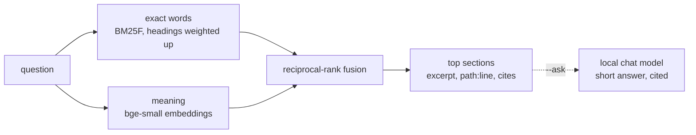

# Docs search

`autana docs <question>` answers a question from the repository's
documentation one section at a time: the three sections that answer it best,
excerpted to the paragraphs that carry the question, each with the
`path:line` range to read on and the code it cites, then five more places to
look. It runs locally, needs no board, and never sends anything off the
machine.

```sh
autana docs how do I add a material that burns
autana docs --section docs/sand/Adding-a-Material.md:293      # one section whole
autana docs --outline docs/Testing-Guide.md                   # headings, lines, sizes
autana docs --ask can an app call vTaskDelay inside frame     # a written answer, with sources
```

`python scripts/docs/docs_search.py` takes the same arguments, plus `--json`,
`--top N`, `--budget CHARS` and `--lexical`. `scripts/docs/docs_mcp.py` serves
the same search over the Model Context Protocol, and `.mcp.json` registers it,
so an editor that speaks MCP gets three tools: `docs_search`, `docs_section`
and `docs_outline`.

## What it reads

| Source | Unit |
|---|---|
| Every Markdown file git tracks or would track, except `third_party/`, `launcher/components/` and `.claude/skills/` | a heading and the text up to the next heading |
| `.dev/` Markdown when that checkout is linked in, except its records, agent definitions and datasheet text | the same |
| The module docstring or leading comment of each tracked `.py`, `.sh` or `.mjs` file under `scripts/`, `launcher/tools/`, `launcher/test/` and `launcher/main/apps/`, except tests | one section per script |

A section copied verbatim into two files is kept once. The index is rebuilt on
every run, so it is never stale; an edit is searchable at once.

## How it ranks



Plans, `.dev` notes and sections headed "Related" or "See also" rank below
documents of record: a plan describes code that does not exist yet, and a list
of links names every topic and answers none. A question whose words no
document uses says so, and a result that neither holds most of the question's
words nor is close in meaning is flagged as a weak match.

`scripts/docs/eval_questions.tsv` pairs questions with the section each should
retrieve, and `--eval` prints where each one ranks. The unit tests hold
exact-word retrieval to a floor on that set and check that every row still
names a real section, so a rename that orphans a question fails too.

## Requirements

| To get | Needs |
|---|---|
| Exact-word search | Python 3.9 or later and git. Nothing to install. |
| Search by meaning (`docs_llama.py setup`) | About 130 MB of disk and 200 MB of memory while in use. Any 64-bit CPU; no GPU. |
| Written answers (`setup --chat`) | About 2.5 GB more disk and 3 GB of free memory. Runs on a CPU; a GPU answers sooner. |

## Local models

Without them, search is exact words only and says so on its first line.
`python scripts/docs/docs_llama.py setup` adds meaning: a pinned
`llama-server` build (Vulkan on Windows, Metal on macOS, CPU on Linux) and the
bge-small-en-v1.5 embedding model. `setup --chat` adds Qwen3-4B-Instruct for
`--ask`. Every download is checked against the SHA-256 in
`scripts/docs/docs_llama.py` before use.

Everything installs in `%LOCALAPPDATA%/autana/llama` (`~/.cache/autana/llama`
elsewhere, `AUTANA_LLAMA_HOME` to move it), shared by every worktree. Setup
ends by embedding the documentation once; after that only a section whose text
changed is embedded again.

One `llama-server` in router mode serves both models on `127.0.0.1:8765`
(`AUTANA_LLAMA_PORT`). The first query starts it, it loads a model on first
use and unloads it after ten idle minutes. `docs_llama.py status` shows what
is installed and running; `docs_llama.py stop` ends the server it started and
no other.

`--ask` passes the four best sections to the chat model with an instruction
to answer from them alone and cite each claim. The source list names the
sections it was given; read one with `autana docs --section <path:line>` to
check the answer.
