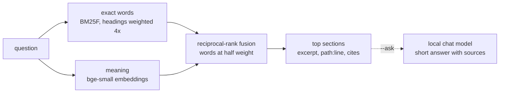

# Docs search

`autana docs <question>` answers a question from the repository's
documentation one section at a time: the three sections that answer it best,
excerpted to the paragraphs that carry the question, each with the
`path:line` range to read on and the code it cites, then five more places to
look. It runs locally, needs no board, and never sends anything off the
machine.

```sh
autana docs how do I add a material that burns
autana docs --section docs/sand/Adding-a-Material.md:293      # one section whole
autana docs --outline docs/Testing-Guide.md                   # headings, lines, sizes
autana docs --ask can an app call vTaskDelay inside frame     # a written answer, with sources
```

`python scripts/docs/docs_search.py` takes the same arguments, plus `--json`,
`--top N`, `--budget CHARS` and `--lexical`. `scripts/docs/docs_mcp.py` serves
the same search over the Model Context Protocol, and `.mcp.json` registers it,
so an editor that speaks MCP gets three tools: `docs_search`, `docs_section`
and `docs_outline`.

## What it reads

| Source | Unit |
|---|---|
| Every Markdown file git tracks or would track, except `third_party/`, `launcher/components/` and `.claude/skills/` | a heading and the text up to the next heading |
| `.dev/` Markdown when that checkout is linked in, except its records, agent definitions and datasheet text | the same |
| The header of every script under `scripts/`, `launcher/tools/`, `launcher/test/` and each app's `tools/` | the module docstring or leading comment |

A section copied verbatim into two files is kept once. The index is rebuilt on
every run, in about a second, so it is never stale; an edit is searchable at
once.

## How it ranks



Both rankings are scaled by a prior: a plan (`docs/plans/`) counts 0.8, a
`.dev` note 0.85, and a section headed "Related" or "See also" 0.25, since a
list of links names every topic and answers none. A question whose words no
document uses says so, and a result that neither holds most of the question's
words nor is close in meaning is flagged as a weak match.

`scripts/docs/eval_questions.tsv` holds 45 questions written without reading
the ranker, each naming the section that answers it. `--eval` scores them:

| Ranking | Answer in the top 3 | Answer first |
|---|---|---|
| Exact words only (`--lexical`) | 30 / 45 | 19 / 45 |
| Words and meaning | 36 / 45 | 30 / 45 |

`scripts/docs/tests/test_docs_search.py` fails if exact words alone drop below
half, so a change to the ranker or a large rewrite of the documents cannot
quietly break search for a machine without the models.

## Local models

Without them, search is exact words only and says so on its first line.
`python scripts/docs/docs_llama.py setup` adds meaning:

| What | Size | Pinned to |
|---|---|---|
| `llama-server`, llama.cpp release b11188 (Vulkan on Windows, Metal on macOS, CPU on Linux) | 12 to 32 MB | SHA-256 of the release archive |
| bge-small-en-v1.5, Q8_0 | 37 MB | SHA-256 of the GGUF |
| Qwen3-4B-Instruct-2507, Q4_K_M, only with `setup --chat` | 2.5 GB | SHA-256 of the GGUF |

Everything installs in `%LOCALAPPDATA%/autana/llama` (`~/.cache/autana/llama`
elsewhere, `AUTANA_LLAMA_HOME` to move it), shared by every worktree. Setup
ends by embedding the documentation once, 2 to 5 minutes; after that only a
section whose text changed is embedded again, and a query costs about a
second.

One `llama-server` in router mode serves both models on
`127.0.0.1:8765` (`AUTANA_LLAMA_PORT`). The first query starts it, it loads
a model on first use and unloads it after ten idle minutes.
`docs_llama.py status` shows what is installed and running;
`docs_llama.py stop` ends it.

`--ask` passes the four best sections to the chat model with an instruction
to answer from them alone and cite each claim. It takes 30 to 60 seconds on a
laptop GPU. The excerpts it was given are printed as its sources, and they,
not the model's sentence, are the answer to check.

## Rejected

Measured on the same 45 questions on a 12th-generation Core i7 laptop with
Iris Xe graphics:

| Candidate | Why not |
|---|---|
| Qwen3-Embedding-0.6B | On pace for about three hours to embed the documents on that CPU. |
| A cross-encoder reranker (bge-reranker-v2-m3) | Over a minute per question to rerank twenty sections. |
| Qwen3-1.7B as the chat model | Twice as fast, but told a reader an app may call `vTaskDelay` inside `frame()`. |
