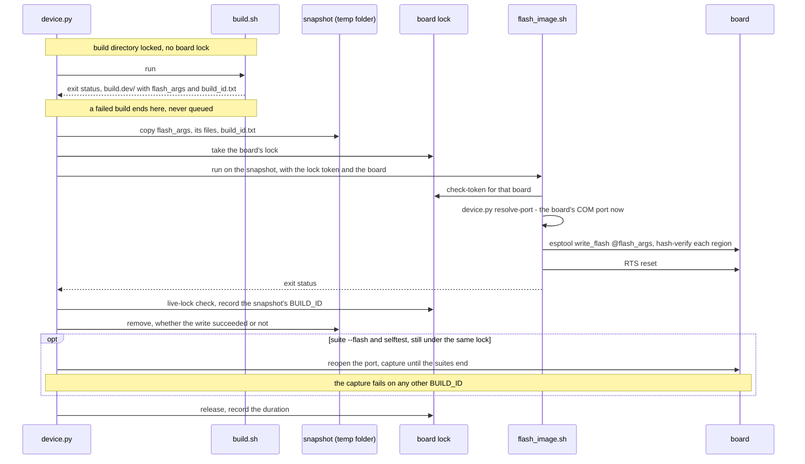

# Flashing, measuring and captures

What `autana flash`, `suite`, `selftest` and `monitor` do with the board once
they hold it: what a successful flash proves, how a measurement holds one
lock across a flash and its captures, and where every capture and record
lands. Who may hold the board, and what to do when it is busy, is
[Device-Lock.md](Device-Lock.md); the command list is
[Autana-CLI.md](Autana-CLI.md).

## What a flash proves

A flash succeeds when esptool's `write_flash` hash-verified every region it
wrote; `autana flash` then prints `flashed BUILD_ID=<id> (esptool hash
verified; boot not verified)`, the id read from the image it wrote. It proves
the write, not the boot, for every variant.

`BUILD_ID` is the first twelve lowercase hexadecimal characters of the
image's ELF hash, followed by its variant. It changes exactly when the image
does; the development build mark uses the first seven hash characters.

A flash is two halves in one log. `launcher/tools/build/build.sh` builds the
image with no board lock held, so other sessions keep the board meanwhile;
a file lock on the build directory keeps a second build of the same worktree
and variant out until this one is done. `device.py` then copies the image -
`flash_args`, every file it lists and `build_id.txt` - into a snapshot of its
own, a private temporary folder that no other flash shares and that is
removed once the write is done, has failed or was stopped; nothing
image-sized goes into the records. Only then does it queue for the board, and
under the lock `scripts/device/flash_image.sh` writes the snapshot with
esptool, never `idf.py flash`: nothing builds while the board is held, a later
build in that directory cannot change what is written, and the `BUILD_ID`
recorded is the snapshot's own. `flash_image.sh` checks the live lock token
just before its write; it cannot prove ownership during the write, which is
what the lock's heartbeat is for. A build that fails never queues. When either
half fails, `flash` fails naming it, with the log's first error line
(esptool's `Could not open COM3 ...`, say) and the log's path. What boots is
proven only by a console that names it: a `selftest` or `suite --flash`
capture, which fails on any other `BUILD_ID`, or `autana buildid` on a
development build.



A separate `flash` and `suite` take two locks, and another session can flash
between them. `suite --expect-build-id <id>` fails if the board reports
another build; without it, use `suite --flash` or `selftest` when the capture
must be of the image `flash` just wrote. With `--flash`, `--expect-build-id`
checks the image just flashed, before any suite runs, against an id decided
before the flash - a different check from the plain one, which is against
what the board reports at capture time.

## Measuring: `suite --flash`

A measurement holds one lock across a flash and every capture: it builds once,
takes the lock once, flashes once, captures every suite `--runs` times, and
writes one summary across all runs.

```sh
autana suite run_boot_anim_perf_suite run_gfx_suite --runs 3 --flash
```

The summary (`<HHMMSS>_batch_<owner>.md` in the day's records folder) shows,
per suite: every timing per run with min, max and spread; every test whose
result changed between runs of the image - a test that flaps on one binary is
a finding, not noise; the tests that failed in every run; and each
`PERF TARGET` per run. A capture that errors or reports a failed test
is recorded and the run continues, then exits 1; only a failed build or
flash stops it. `--perf-scope` builds the perf-scoped image. `--out PATH`
writes the one raw capture to `PATH`, only with exactly one suite and
`--runs 1`. `selftest` builds the autorun diagnostics image and captures the
boot-time run until `SELFTEST_COMPLETE`.

A suite capture stops at the shell's `RUNSUITE_COMPLETE name=<suite>` line
(or `SUITE_DONE`), or after its non-`shell:` output is idle. A port that
disappears mid-capture ends it as `port lost` with what was read kept, so a
multi-suite run carries on with its next suite. It fails if the build has no
suites, does not contain the requested suite, or reports any failed test.
`autana reset` reboots with esptool and returns once the port is back;
`reset --capture` and `selftest` reopen the port if it vanishes or stays
silent after the reset.

## Talking to a running device

A line typed in an `autana` session that is not a command goes to the board as
typed, and `autana tune` is built on the same call: it writes one console line
and prints the device's replies to it, under the lock like everything else.
The firmware's `util/tune` answers `SET <name> <value>`, `GET <name>` and
`TUNE` on a development build.

A reply is everything from `--reply` (default `TUNE`) to the end of its
line, since the console also carries the firmware's log lines; the answer
ends at a line starting with one of `--until` (default `TUNE_OK`, `TUNE_ERR`,
`TUNE_END`). It exits 1 on an `_ERR` reply, and says so when the build does
not know the command or nothing answers within `--seconds` (default 3). It is
not a capture: it adds no line to `index.jsonl`.

From a script that names its own owner, `device.py` takes the same
arguments (the interpreter is ESP-IDF's Python, and `--owner` names
the lock holder):

```sh
python scripts/device/device.py --owner maintainer send "SET ridge.theme_rgb 0x1199C8"
python scripts/device/device.py --owner maintainer send TUNE
```

## Screenshots

`autana screenshot [--as-shown|--framebuffer] [-o PATH]` takes the lock,
requests the panel capture over the serial port at 115200 baud and writes a
`.png` plus a `.json` state snapshot. The wire protocol and the BMP-to-PNG
decoder live in `launcher/tools/device/screenshot.py`, imported as a library -
it opens no port itself.

## Where a capture lands

No capture command needs `--out`: by default each writes to
`<records>/<YYYYMMDD>/<HHMMSS>_<kind>_<owner>.log` (`kind` is
`flash-<variant>`, `reset`, `runsuite-<suite>`, `selftest`, or `listen`).
`<records>` is the project's `records` setting when it has one, otherwise the checkout's own
gitignored `.records/device`, so nothing a commit can pick up by accident. Without a `records` key, captures land in the running autana's own checkout, whichever project a command acts on. A
default-path capture over 200 KB is gzipped in place (a flash log at about
270 KB usually is); `--out <path>` writes exactly there instead,
uncompressed.

Every invocation - default path or explicit `--out`, success or failure -
also appends one line to `<records>/index.jsonl`: the board, owner, purpose,
command, suite, build id (from the flash log for a flash, seen in the
capture otherwise), when the command started (`started_at`) and when it won
the lock (`acquired_at`), the worktree and commit involved, how the capture
ended, and any error. Nothing commits these records; whoever ran the command
commits the evidence with the work.

A suite capture also gets a parsed `<same stem>.md` beside it - suite
PASS/FAIL counts, every failing test's Unity message, and any `PERF TARGET`
lines. When the manifest's `worktree` names a checkout with exactly one app
whose `tools/report_performance.py` registers the suite that ran, that
reporter's table is appended too; zero or several matches, or a reporter that
fails, are noted in the report instead - a capture is never failed over this.
A report can be rebuilt for any existing capture, touching neither the lock
nor the board:

```sh
python scripts/device/device.py report .records/device/20260916/153113_runsuite-run_boot_anim_perf_suite_sam.log
```

## Wait estimates

`autana status` and a waiting command print when the board should be free.
The estimate comes from `durations.jsonl` in the lock folder, one file shared
by every checkout and session on the machine: each held command records how
long it held the board, by kind (`flash`, `run-suite`, `monitor`); a
`run-suite` row also names the suite and its `--test` filter, which is what
sizes a suite's wait ([`autana suite`](Autana-CLI.md#tests)). The estimate
is the median of that kind's recent successful runs, and is `unknown (no
duration history)` until there are a few. A command that fails or loses its
lock never counts; a suite that reports FAIL does, since a perf capture that
trips a regression ceiling reports one. A `flash` holds the board only while esptool
writes - the build and the snapshot come before the lock - so the estimate a
waiter sees behind a flash is the write alone. A person's reservation, or a
holder of unknown length, makes every estimate behind it unknown.
