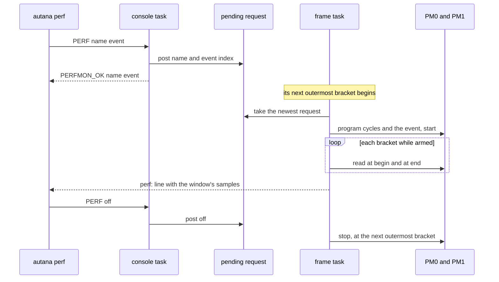

# Frame cost

`util/runtime/frame_cost.h` measures named stages of a frame. For how drawn
pixels reach the panel, see [`../Gfx-and-Presentation.md`](../Gfx-and-Presentation.md).

**Where a frame's time goes.** `util/runtime/frame_cost.h` brackets a stage of
a frame and charges its microseconds to a name:

```c
FRAME_COST_BEGIN(began);
draw_the_thing();
FRAME_COST_END(began, "thing.draw");
```

Every 1.5 s, under the shell's fps line, the console prints each name's
average milliseconds per frame over the window and the worst single bracket,
then the total those averages add up to (the numbers below show the line's
shape and are not measurements):

```
ms/frame avg/worst: ui.build 0.41/0.6  ui.paint 1.20/9.8  present 8.31/16.6  frame.rest 0.90/1.4 | total 10.82
```

Charges are exclusive: a bracket nested inside another is taken out of the
outer one, so nothing is counted twice. `frame.rest` is one whole-iteration bracket
around the frame loop's body; being exclusive of everything else, it is
whatever no other bracket claimed. A stage that did not run in a window is
not listed. A bracket is two clock reads, about a microsecond each: around a
stage, never around a pixel. `FRAME_COST_SLOTS` bounds the names; a
report flags a further one with ` +N dropped`, and a charge from any task but
the frame loop's own with ` +N foreign`. On a host and in release the
brackets compile to nothing.

## Hardware counters

One name at a time can also be read against the S3's two performance
counters, cycles and one event:

```
autana perf                             # the names seen so far, and the events
autana perf <name> [event] [seconds]    # arm, listen (10 s), disarm, summarise
autana perf off
```

`autana perf present insn 10` prints one line: cycles avg/min/max, the
event's average, the number of samples and cycles per event. The event
defaults to `insn` (retired instructions). A name is known once its bracket
has run. The command wraps the console's own `PERF <name|off|?> [event]`,
which replies `PERFMON_OK <name> <event>`, or `PERFMON_ERR` for an unknown
name or event or too many words. The newest request wins.

The counters start with the arm and run free. While one name is armed every
bracket reads them, and only that name's brackets keep a sample. The shell
prints the window's samples on a line of their own, ahead of the time line,
and `autana perf` sums them:

```
perf: stage cyc avg/min/max 112000/108000/179000 insn avg 64000 n=4
```

The counts follow the same rule as the time: own, exclusive of brackets
nested inside. They cover the frame task's core only; a pass that waits for
the other core counts that wait in its cycles. A change of arm drops the
samples of the old one, so a count is never labelled with another event. A
name longer than `FRAME_COST_NAME_MAX` fails to compile in a development
build; a name table that does not fit is counted in the listing rather than
ignored.

The console task posts the request and the frame loop, which runs in
`app_main` on CPU0, applies it between outermost brackets, so no bracket
begins under one configuration and ends under another:



## Related

- [`../Build-Variants.md`](../Build-Variants.md): development and release instrumentation
- [`../Firmware-Architecture.md`](../Firmware-Architecture.md): the shell frame loop
- [`../Gfx-and-Presentation.md`](../Gfx-and-Presentation.md): gfx send counters and overlays
