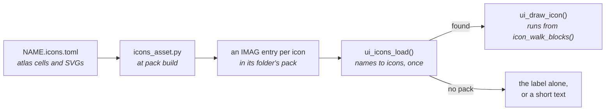

# Icons

Icons are pack content: a `NAME.icons.toml` describes one set, and when the
packs are built `launcher/tools/gfx/icons_asset.py` cuts each icon out and
bakes it into its own [image entry](../assets/README.md#the-image-entry), one
bit a pixel, named by the icon. Nothing about an icon is compiled into the
app. The code that draws an icon names it, and finds it by that name once,
when it loads its icons.



## Who owns which set

| Set | Lives in | Pack | Loaded |
|---|---|---|---|
| The system icons: check, close, chevrons, info, back and the like, meaning the same on every screen | `launcher/main/engine/icons/system.icons.toml` | `engine` | by `ui_icon()` on first use, kept |
| An app's own artwork | that app's folder, under its own `NAME.pack.toml` | the one the app names | when the app enters, released when it exits |

No pack depends on another: an app draws the system icons from `engine` and
its own from its pack. Deleting an app's folder takes its art, its manifest
and its pack with it.

## The source

```toml
atlas = "system.png"
cell_size = [16, 16]

[[icon]]
name = "check"
at = [0, 0]                 # column, row of the atlas

[[icon]]
name = "close"
svg = "system/close.svg"
upstream = "close"          # the pixelarticons icon it came from
commit = "8275e0af..."      # and the commit it was copied at
```

Every icon is an atlas cell or an SVG in pixelarticons' shape: one `<path>`
of `M`/`H`/`V`/`h`/`v`/`Z` rectangles on an integer grid. Sizes may differ
within a set. The baker refuses, naming the file and the place:

- a pixel that is not opaque black (ink) or opaque white: no antialiasing
  threshold;
- an SVG with a curve, an arc or a fraction: a rejection, not an
  approximation;
- a named cell that is empty, or a cell with ink and no name;
- a name used twice, or not `lower_snake_case` of at most 31 characters
  (an entry name). Entry names are unique across every pack, so an app's
  icon cannot share a name with a system icon;
- an SVG without its `upstream` and `commit`. **Provenance is a
  requirement**, so a re-bake years from now is reproducible and the licence
  stays checkable;
- a key it does not know.

## The pack entry

Each icon is an `IMAG` entry of format `GFX_IMAGE_MONO1`: one bit a pixel,
the most significant bit leftmost, 1 ink, and a stride rounded up to whole
bytes. The header and the checks `gfx_image_open()` makes are the image
entry's ([the layout](../assets/README.md#the-image-entry)); a loader that
finds an entry of another format treats the icon as missing.

## Drawing, and drawing without the pack

`icon_walk_blocks()` fits an icon's ink to a box at the largest whole scale,
centred, and emits each horizontal run; `ui_draw_icon()` (`ui/ui.h`) turns
the runs into rectangles. Without the pack, or with an icon missing,
the loader logs one line and every icon it loads is `NULL`:

- a control with a label beside its icon shows the label alone;
- an icon-only control draws its short text in the icon's box: a chevron is
  `v`, `^` or `>`, an info button `i` (`ui_icon_text()` holds the system
  set's).

No control is drawn blank. A render with no packs (`|nopacks` in a scene's
render list, see `tools/render/render_scene.sh`) shows each screen's fallback.

## Testing the shipped icons

The suites read the packs the build writes, never the baker: each icon's
pixels against rows transcribed by hand from the artwork it replaced, its ink
inside its box, the symmetry it is drawn with, and `icon_walk_blocks()`
against a reference walk (`suite_icons.c`, `suite_system_icons.c`, an app's
own `tests/`). `launcher/test/suites/suite_gfx_image.c` holds the reader to
hand-built one-bit entries and `tools/tests/test_icons_asset.py` the baker to
its refusals. **Do not
assert the baked bytes against a Python re-implementation of the packer**:
that tests the baker twice and the shipped icons never.
