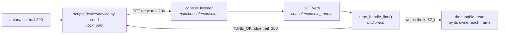

# Live tuning

Changing a number on a running device, by name, with no build and no flash.
For a constant that is judged by eye - how long a trail lasts, how high a
wave is - where each guess otherwise costs a build and a flash.

`autana` alone opens a console session with the device, and everything below
works in it without the prefix:

```
autana> tune wave                 # the tunables whose names contain "wave"
autana> trail                     # show one
autana> trail 200                 # change it: on the screen a frame later
autana> glow_halo_rgb 0xFF7A2A
autana> save                      # write the device's values into the source
autana> flash dev
```

Each is also a command of its own, for a script or a single change:

```sh
autana tune                       # every tunable, its value and its range
autana get trail
autana set trail 200
autana save
```

A name may drop its owner when that is unambiguous: `trail` for
`ridge.trail`. `autana` is the terminal command - every command it takes is
in [Autana-CLI.md](Autana-CLI.md). It calls `scripts/device/device.py send`,
which takes the device lock like everything else that touches the board. A
console session takes the lock for each line and lets go, so the board stays
free between two of them.

**Development builds only, and the device keeps nothing.** A release build
has no listener, no registry and no names: the same declaration compiles to
a plain constant there, and a value set on a device is gone at its next
reboot. The source stays the truth, and `save` is what puts a session's
values into it: it asks the device for every tunable and rewrites the
initial value in the `TUNE` line each was declared with, in the worktree
it is run from - those lines only, byte for byte otherwise. What it wrote is
an ordinary diff to review and commit, and the next build, release included,
is made with it.

## How it works



The console protocol is four lines, answered by `util/tune`:

| line | replies |
|---|---|
| `SET <name> <value>` | `TUNE_OK <name>=<value>`, or `TUNE_ERR <reason> ...` |
| `GET <name>` | `TUNE_OK <name>=<value>`, or `TUNE_ERR unknown <name>` |
| `RESET <name>` | the same as `SET`, the value being the declared one again |
| `TUNE` | `TUNE <name>=<value> min=<low> max=<high> default=<initial>` per tunable in name order, `TUNE_ERR clash <name>` per name declared twice, then `TUNE_END count=<n>` |

A value is a whole number, decimal or `0x` hex, and one outside the
tunable's range is refused rather than clamped. The protocol is pure: a line
comes in and replies go out through a callback, against a registry, so
`test/suites/suite_tune.c` drives all of it on a host with a registry of its
own. The console answers from the shared one, `tune_shared()`.

## Making something tunable

```c
#include "util/tune.h"

TUNE_OWNER(ridge);                    /* once per file, before its tunables */
TUNE(ridge, trail, 226, 0, 255);      /* where the #define was: `trail` */
```

- That one line is the whole declaration: the variable `trail`, its name
  `ridge.trail`, the value it ships with and its range. On a development
  build it is a `static int32_t` and an entry that joins the registry by
  itself before `app_main()`, the way `APP_REGISTER` works, so there is
  nothing to call and every tunable linked into the image is listed from
  boot. On a release build it is an `enum` constant and nothing else, so the
  code that reads it is the same in both and release pays nothing.
- The compiler refuses a value outside its own range and a name over 32
  characters (`<owner>.<what>`; a `SET` line has to fit the console's
  `CONSOLE_LINE_MAX`, 49).
- The registry is a list threaded through the entries, so there is no table
  to outgrow. Two declarations of one name are a mistake: the first keeps the
  name and `TUNE` reports the clash.
- A tunable is a variable in one build and a constant in the other, so it
  cannot size an array or label a `case`, and a development build does not
  fold it the way release does - a timing taken on one is a little
  pessimistic.
- A value read every frame takes effect at once. One baked into a table - a
  glow's ramp, a smoothed shape - needs its owner to notice:
  `TUNE_GENERATION(ridge)` goes up on every `SET` or `RESET` of one of that
  owner's tunables, and of no one else's, and the owner rebuilds when it
  differs from the one it last built for. It is the constant 0 in release.
  `ui/ui_ridge.c` is the model.
- A `SET` is written from the console listener's task, not the frame loop. A
  tunable is one aligned word, so its reader sees the old value or the new.

## Related

- [`../Gfx-and-Presentation.md`](../Gfx-and-Presentation.md) - the launcher's ridge, whose numbers are the first tunables
- [`../Build-Variants.md`](../Build-Variants.md) - what a development build is
