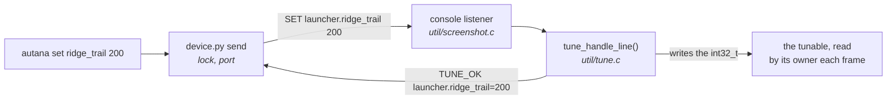

# Live tuning

Changing a number on a running device, by name, with no build and no flash.
For a constant that is judged by eye - how long a trail lasts, how high a
wave is - where each guess otherwise costs a build and a flash.

`autana` alone opens a console session with the device, and everything below
works in it without the prefix:

```
autana> tune wave                 # the tunables whose names contain "wave"
autana> ridge_trail               # show one
autana> ridge_trail 200           # change it: on the screen a frame later
autana> glow_halo_rgb 0xFF7A2A
autana> save                      # write the device's values into the source
autana> flash dev
```

Each is also a command of its own, for a script or a single change:

```sh
autana tune                       # every tunable, its value and its range
autana get ridge_trail
autana set ridge_trail 200
autana save
```

A name may drop its prefix when that is unambiguous: `ridge_trail` for
`launcher.ridge_trail`. `autana` is the maintainer's terminal command; it
calls `.dev/scripts/device/device.py send`, which takes the device lock like
everything else that touches the board. A console session takes the lock for
each line and lets go, so the board stays free between two of them.

**Development builds only, and the device keeps nothing.** A release build
has no listener, no registry and no names: the same declaration compiles to
a plain constant there, and a value set on a device is gone at its next
reboot. The source stays the truth, and `save` is what puts a session's
values into it: it asks the device for every tunable and rewrites the
initial value in the `TUNE_INT` line each was declared with, in the worktree
it is run from - those lines only, byte for byte otherwise. What it wrote is
an ordinary diff to review and commit, and the next build, release included,
is made with it.

## How it works



The console protocol is three lines, answered by `util/tune`:

| line | replies |
|---|---|
| `SET <name> <value>` | `TUNE_OK <name>=<value>`, or `TUNE_ERR <reason> ...` |
| `GET <name>` | `TUNE_OK <name>=<value>`, or `TUNE_ERR unknown <name>` |
| `TUNE` | `TUNE <name>=<value> min=<low> max=<high>` per tunable, then `TUNE_END count=<n>` |

A value is a whole number, decimal or `0x` hex, and one outside the
tunable's range is refused rather than clamped. `util/tune` is portable: a
line comes in and replies go out through a callback, so
`test/suites/suite_tune.c` drives the whole protocol on a host.

## Making something tunable

```c
#include "util/tune.h"

TUNE_INT(ridge_trail, 226);      /* where the #define was */

static void
register_tunables(void) {
    TUNE_REGISTER("launcher.ridge_trail", ridge_trail, 0, 255);
}
```

- `TUNE_INT` is a `static int32_t` on a development build and an `enum`
  constant on a release build, so the code that reads it is the same in both
  and release pays nothing.
- `TUNE_REGISTER` is a call on a development build and nothing on release.
  Call it when the owner starts; registering a name again moves it, so
  starting twice is harmless. A tunable does not show in `autana tune` until
  its owner has started - the launcher's appear once the home screen has
  drawn.
- A name is at most 32 characters, `<owner>.<what>`, so that a `SET` line
  fits the console's 48.
- A value read every frame takes effect at once. One baked into a table - a
  glow's ramp, a smoothed shape - needs its owner to notice:
  `tune_generation()` goes up on every `SET` that took, and the owner
  rebuilds when it differs from the one it last built for. `ui/ui_ridge.c`
  is the model.
- A `SET` is written from the console listener's task, not the frame loop. A
  tunable is one aligned word, so its reader sees the old value or the new.

## Related

- [`../Gfx-and-Presentation.md`](../Gfx-and-Presentation.md) - the launcher's ridge, whose numbers are the first tunables
- [`../Build-Variants.md`](../Build-Variants.md) - what a development build is
