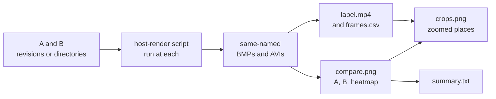

# The host render harness: real drawing code, real pixels, no board

Rendering a firmware screen into an image on a laptop: how a scene is
declared, what its pixels are pinned to, the same scenes under QEMU, and
diffing any of them against a device capture.
[`../Testing-Guide.md`](../Testing-Guide.md) is the host/device test split
this sits inside.

On Windows, run the `.sh` commands below in Git Bash. On Linux, use a
terminal. You need a host C compiler; [the README](../../README.md#try-it-without-a-board)
lists setup commands. A **scene** is a named screen and fixture input for the
host renderer.

```sh
./launcher/tools/render/scenes/launcher_home_render_host.sh
```

Open `launcher/tools/results/render/launcher_home/landscape.bmp`
for the home screen. The reference below explains how scenes are declared,
checked, and compared with device captures.

## Images in these docs

The CPU and GPU stages own the files under `docs/images/`, run from the
repository root. It makes the launcher's and the UI toolkit's images itself and runs each app's
`tools/doc_images.sh` for the app's own:

```sh
./launcher/tools/render/render_doc_images.sh           # rewrite images and tables
./launcher/tools/render/render_doc_images.sh --check   # report which would change
```

It needs host C and C++ compilers, Python with Pillow and numpy, and ffmpeg
5.1 or newer. Scratch bakes need the pinned meshoptimizer submodule:

```sh
git submodule update --init --depth 1 third_party/upstream/meshoptimizer
```

An app's `tools/doc_images.sh` may also need the packages in
`launcher/tools/r3d/requirements.txt` and the source model that the import fetches,
SHA-256 checked, into `launcher/tools/r3d/.cache`; the workflow caches it.
A render failure prints the failed command and the tails of its work logs,
including logs inside bake directories.
CPU `--check` renders into `launcher/tools/results/doc_images/out/cpu/`
and compares decoded pixels with `compare_images.py`, never bytes: another
ffmpeg or Pillow writes different GIF bytes for the same frames. It prints
`same` or `changed` per image, and `orphan` for a file nothing makes.
`--orphans` renders nothing and reports an image whose name no script
mentions; the Comment Rules workflow runs it on every pull request. The
`doc-images` workflow runs it on pushes to main that touch `launcher/` or
`docs/`, and opens one pull request when an image or table changed. It needs the
repository setting Actions > "Allow GitHub Actions to create and approve pull
requests".

| Image | Shows |
|---|---|
| `overview/launcher-home.png` | the launcher listing the release build's apps, read from the app folders |
| `overview/launcher-home.gif` | the same, rocking the board either way |
| `ui/*.png` | the UI toolkit's gallery views, portrait and landscape (`ui_widgets_render_host.sh`) |

Measured CPU tables are refreshed with the images. App scripts write Markdown
to out/tables/NAME.md. The shared writer replaces the body between an HTML
comment containing `generated: NAME sha256=HASH` and one containing
`/generated: NAME`, preserving the document's other text and line endings.
Names use lowercase letters, digits and hyphens and are unique
across documents. The SHA-256 covers the body,
including its boundary newlines, with CRLF normalized to LF.
`scripts/gates/check_doc_generated.py` discovers tracked Markdown blocks and
fails on a body hash mismatch or malformed boundaries, without rendering.
Change a measurement's source or generator and regenerate its block; a hash
verifies recorded content, while the render check detects stale measurements.
The image script rewrites blocks by default; --check reports
changed doc-path#block-name and exits 1. The refresh PR includes changed tables
and images together. `render_doc_images.sh --stage gpu` rebuilds fitted comparisons and sweeps in
the WSL CUDA environment; the board stage consumes a perf capture. Both use
this writer. The GPU and board stage commands, requirements and outputs are
in the [per-tool README][render-tool-commands].

[render-tool-commands]: ../../launcher/tools/render/README.md#refresh-commands
GPU images live under `docs/images/render/gpu/`; CPU checks leave that stage
to its own `--check`. GPU `--check` verifies the saved full run and its source
stamp without fitting again. `--smoke` writes only scratch data.
The `doc-images-gpu` workflow runs the full stage on the self-hosted Linux GPU
runner, weekly, on manual dispatch and on main pushes affecting GPU inputs.
It opens or updates "docs: refresh GPU-rendered images" on the separate
`feature/refresh-doc-images-gpu` branch. GPU runs are serialized and log GPU
memory use. The stage requires 6 GiB MemAvailable inside WSL and 2 GiB
available on the Windows host.

The rest belong to apps, and each app's `tools/README.md` says what its
images show.

---

The firmware's drawing code compiles on a host, so a screen can be rendered
into an image without a flash cycle. A **scene** is one thing to render: it
names the translation units it needs, the quarter turn, how many frames to
draw, and what synthetic touch to feed them.

```sh
./launcher/tools/render/render_all_scenes.sh          # every scene, and the standing check
./launcher/tools/render/scenes/post_ui_render_host.sh        # one scene, into its own results/render/
./launcher/tools/render/scenes/launcher_home_render_host.sh -o /tmp/home
```

Each writes a 24bpp BMP per declared render, plus a PNG beside it when
Pillow happens to be installed. Output lands in `results/render/<scene>/`
under whichever `tools/` folder owns the scene, which is gitignored.

**This is for correctness and code shape, never for cost.** Host wall-clock
is not a perf oracle: an x86 laptop's timings say nothing about what the
work costs on the chip, and even instruction counts only answer whether
work was removed (see
[`../notes/Debugging.md`](../notes/Debugging.md#performance-seems-off)).
Time a change on the device, or under QEMU's `--icount` for counts.

## Declaring a scene

Two files, the same declare-then-source shape a report script uses:

- **`<name>_render_host.c`** defines one `render_scene`; see
  `launcher/tools/render/render_host.h` for the fields: a setup hook that runs
  once after `gfx_init()`, a draw hook that runs once per frame, and an
  options hook taking whatever arguments the harness did not recognise.
- **`<name>_render_host.sh`** declares `scene_name`, `scene_sources` and
  `scene_renders`, then sources `launcher/tools/render/render_scene.sh` and calls
  `render_scene_run "$@"`. Everything else (finding a compiler, building,
  checking each image, converting to PNG) is that one procedure.

An engine scene lives in `launcher/tools/render/scenes/`; an app's scene lives
in that app's own `tools/`, so nothing in the engine's tooling names an app.
`render_all_scenes.sh` finds both by name, so a new scene is one pair of
files and deleting an app deletes its scenes.

An app's scene script may find its app's sources instead of listing them:
collect every `.c` in the app folder outside `tools/` and `tests/`,
excluding `suite_*.c`, and list only the shared engine and host-shim
sources by hand, so a new source file needs no edit to the script.

`render_host.c` calls `scene_shell_compose()` before each `draw()`, as the
shell does before an app's `frame()`. A scene whose sources include
`main/scene/scene_shell.c` gets the real one, which does nothing without an
active camera; any other scene gets a no-op.

Each line of `scene_renders` is `<label>|<arguments>|<width>x<height>`,
optionally followed by `|nopin`, and the declared size is checked against
what the binary reports it wrote. That
is what makes the sweep a check rather than a picture nobody looks at
twice.

## Frames, input and orientation

`.frames` is at least two for anything built through microui: a window is
clipped to the rect it had on the previous frame, and `ui_pointer.c`
holds a press back a frame for hover, so a settled screen is
never the first one. Touch is declared as `render_input_step_t` entries in
**panel** coordinates: where a finger lands, not where the rotated canvas
puts it, each holding until the next, so the harness derives the
pressed/released edges rather than the scene restating them.

An image comes out the way the board is READ at that quarter (448x368 for
a landscape one) unless `--panel` asks for the framebuffer the way the
panel holds it, 368x448. That second shape is what a device capture has.

A scene that leaves gfx in band mode is refused rather than rendered: the
band ring retains no frame to read back, the same reason a device capture
refuses one.

Every `draw()` is also a frame to the frame watch (`render_watch.h`), which
judges it by the board's rule; see
[Testing-Guide.md](../Testing-Guide.md#the-frame-watch-as-a-gate). A scene
declaring fewer frames than a warm-up and a window goes on drawing past its
image until it has them, so every scene is judged at rest; its pixels and
pins do not change. A finding fails the render: a heap site's `FRAME_WATCH`
line carries an `addr2line` command naming it, a stdout one shows what that
frame printed. Each render reports `watched <scene>/<render>: N frames
judged`.

## What each scene's pixels are pinned to

An image of the right size can still be the wrong picture, so every render's
content hash is pinned in a `<scene>_render_baseline.txt` beside the scene
that owns it, and `render_all_scenes.sh` fails on a change to the pixels.
Every render is bit-identical from run to run, which is what makes this
worth pinning at all.

Hashes rather than committed images: this repository commits a binary only
as a generator's input, and a rendered frame is neither that nor something
anyone reads a diff of. A render with no pin yet says `(not pinned)` and
passes, so a new scene is not blocked on one.

**A pin only holds where the pixels are integer-exact**, since CI renders on
a different compiler and C library than anyone's desk. The self-test report
and the home screen are pinned: `gfx.c` does no float maths, and the scroll
view's momentum, the one part of the UI that reaches the maths library, is
switched off at a zero time constant, so it is linked but never called. The
wire and cube scenes project in float (`util/math/`) and are pinned too:
their pixels are whole-pixel truncations of single-precision sums, built
without fast-math or FMA, and their rotations call `sinf` and `cosf`, whose
last bit differs between libms and moves a pixel only at a truncation
boundary. The boot animation's tracks also call `acosf` for the slerp and
are `|nopin`. A render that is not integer-exact ends its line
with `|nopin` and is checked for its declared size alone (`scene_pin=0` does
the same for a whole scene). Anything that formats a `double` for display
or rasterises in float belongs there. A scene whose pin can fail for a
reason nobody changed teaches the reader to ignore the pin.

Every scene is linked against the maths library regardless, last on the
line: the Windows toolchains fold those functions into libc, so a scene that
needs one links clean on a laptop and fails only on Linux.

```sh
./launcher/tools/render/render_all_scenes.sh --update-baseline   # re-pin, deliberately
```

Re-pin only after looking at the images and agreeing the pixels should have
changed. The failure names the file to look at and the command to run.

## Video

A BMP is one frame. `--video PATH` (`render_video.h`/`.c`) appends every
drawn frame instead, into an uncompressed RIFF AVI, so motion, a
transition, or a scene's settle time can be judged without a flash cycle,
the same reason the rest of this harness exists. The frame rate is
`1000 / --dt`, exact as a rational, not rounded. `-o` keeps working
unchanged alongside `--video`, or on its own.

```sh
./launcher/tools/render/scenes/boot_anim_render_host.sh --video   # every scene's script takes this,
                                                     # writing <label>.avi beside <label>.bmp
python launcher/tools/render/check_avi.py out.avi ...      # re-reads the header and index and
                                                     # checks frame count, size and rate agree
```

Players stop reading a RIFF AVI 1.0 file well short of its 32-bit size
field's 4 GB, so a run whose video would pass 1 GB is refused before
anything is drawn, with the frame count
that does fit stated in the refusal. `--video` never changes what a scene's
BMP pins: the same bytes are written whether or not it is given, so it adds
no baseline of its own.

A scene animates a `--video` run the way it animates any multi-frame
render: `boot_anim_render_host.c`'s `<now_ms>` is where the first frame
starts, and each later frame adds that frame's own `elapsed_ms` to it, the
harness's usual per-frame schedule. Like every other render this harness
writes, a video's frames are drawn from a scene's own fixture data, never a
reading from any board.

## The second backend: the real image under QEMU

The same scenes, the real Xtensa binary. `test/run_qemu_tests.sh` builds an
image that boots into the shell rather than running its suites, and its
console answers `screenshot` with the frame, the board tool's own protocol,
over a socket instead of USB.

```sh
./launcher/tools/render/render_qemu.sh -o /tmp/q \
    --row "<first row>" --row "<second row>"     # capture, then diff
./launcher/test/run_qemu_tests.sh --touch down,128,224 --touch up,128,224 \
    --screenshot /tmp/after_tap.png              # tap a row, capture the app
```

A capture takes about a minute and a half after the build, needs no board
and no lock, and any number of runs go at once. `render_qemu.sh` reads the
quarter from the capture's own sidecar, renders the home screen on the host
at that quarter, and diffs the two with the shell's chrome masked. The rows
have to be stated: only the image knows what registered itself, and its
console reports how many, never which.

**A touch goes in as a level, not an event.** `TOUCH <down|up> <x> <y>` on
the console reaches `touch_inject()`, which leaves a sample the polling task
reads ahead of the controller. With no controller answering there is nothing
else to read. That is enough to open an app and photograph it, which is the
only way to see a screen whose app cannot be linked on a host at all.

**Two limits worth knowing before comparing anything.**

*`dt` is real elapsed time.* The image runs its own frame loop against a
clock, so a QEMU run cannot reproduce a scene's declared frame schedule.
Only a screen that has SETTLED (one whose picture does not depend on how
many frames it took to get there) compares pixel-exact with a host render.
The home screen is such a screen. A scene stepped a fixed number of frames
for its animation is not: the same step count does not mean the same
accumulated time.

*Orientation comes from the injected IMU.* Until an `IMU` line
(`qemu_run.py --do "tilt ..."`) says otherwise, the stand-in reads upright
and still; set the pose before comparing at a given quarter.

## Diffing against a capture

```sh
autana screenshot --framebuffer -o shot.png                  # --dev build only
./launcher/tools/render/scenes/post_ui_render_host.sh -o /tmp/post
./launcher/tools/render/render_diff.sh shot.png /tmp/post/landscape-panel.bmp \
    --mask build_mark --mask home_hint --out /tmp/diff.png
```

It reports the first differing pixel, how many differ, and writes an image
with the differences in red and the masked regions in blue. Exit status is
0 only when nothing differs. Either side may be a host render, a QEMU
capture or a board capture.

**Orientation is declared, never guessed.** The capture for this comparison
uses `--framebuffer`, so it remains panel-native; its sidecar's
`orientation_quarter` says which rotation the shell used and is reported,
not applied. A render in the read orientation must say `--quarter-a` /
`--quarter-b` or it is refused rather than turned on a guess.

**Masks cover what the shell draws and a scene does not**: the development
build's corner mark, the swipe-home strip. They are declared per quarter in
`launcher/tools/render/render_masks.json` and named on the command line. If that
chrome moves, that file has to move with it.

## Comparing two revisions

```sh
./launcher/tools/render/render_compare.sh --script <host-render-script> \
    [-o DIR] [--clear RRGGBB] [--video [--fps N]] [--crops N] <A> <B> \
    [--render LABEL "<renderer arguments>" ...]
```



| Part | What it does |
|---|---|
| `A`, `B` | Revisions (each built in a temporary worktree, removed afterwards) or existing directories. |
| `--script` | The scene's own host-render script, so the tool names no scene. By default it runs at both revisions and the images of the same name are compared. |
| `--render` | Replaces that with ad-hoc renders: the script's `--build-only` builds the renderer, which runs with the arguments given. A revision from before `--build-only` runs its full script instead. |
| `--clear` | The colour the scene clears to. A pixel clear on one side and drawn on the other is red and counted as a hole on the side that left it clear. |
| sheet | `compare.png`, a row per render: A, B, then the absolute difference as a greyscale heatmap, amplified 8 times. `summary.txt` gives the resolved short hashes and per render the changed share, mean difference and holes. |
| `--video` | Records every render's frames on both sides through the renderer's own `--video` (with `--render`, put `--frames` and `--dt` in the arguments; a scene runs from time zero). Writes `<label>.mp4`, labelled with the short hashes and frame time, and `<label>.frames.csv` with per-frame changed share, mean difference and holes. ffmpeg packs the frames into H.264 because an uncompressed side-by-side is tens of megabytes; `--fps` sets playback (default `1000/dt`). |
| `--crops N` | `compare.crops.png` and `<label>.crops.png`: the `N` places the two differ most, A above B, enlarged 4 times without smoothing. Changed pixels (a channel off by more than 8, or a hole) within 3 px are one place; holes rank first, then total difference; a place over 64 px is cut to its strongest 64 px window. A video uses its two worst frames. Nothing is written where nothing differs. |

The renderer arguments are split on spaces and never expanded as patterns.

`--reference SCENE.scene.toml --poses FILE` (with one `A` and a `--render`) scores
a whole camera path against the scene's source model instead of a second
revision: `reference_render.py` draws the poses, `FILE` sampled at the renderer's
`--dt` by `tools/anim/sample_tracks.sh --every`, once per scene, poses and
`--samples`, and the render's frames are scored against them. It writes
`<label>.mp4` (reference, render, error heatmap, edge pixels) at `--fps`
30, 40, 60 or 80, and one reference line per frame in `summary.txt`. The
header of `render_compare.sh` has the details.
The tool needs Pillow and numpy (`launcher/tools/render/requirements.txt`).

---

## Related

- [`../Testing-Guide.md`](../Testing-Guide.md): the host and device test
  runners, runsuite, and the QEMU suite run this harness's second backend
  borrows its image from.
- [`../Building-a-Screen.md`](../Building-a-Screen.md): building the screen
  a scene renders.
- [`../notes/Debugging.md`](../notes/Debugging.md#performance-seems-off):
  why a host timing is not a cost.
