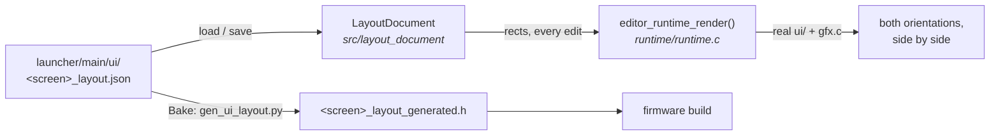

# Editor

The host-side authoring tool. It edits a firmware screen's layout and previews
it **through the firmware's own UI and gfx code**, compiled for the host, so
what it shows is what the device draws. UI layout is its first module; the
plan is [`docs/plans/UI-Editor-Plan.md`](../docs/plans/UI-Editor-Plan.md).

The device runtime stays under `launcher/`. SDL2, Dear ImGui and C++ are
host-only and never enter an ESP-IDF component graph.

## How a screen flows through it



- **The JSON is the source.** It names its screen and declares its elements
  (`id`, `label`, `interactive`), then gives one rect per element for
  `portrait` (368 x 448) and `landscape` (448 x 368). The editor writes it one
  rect per line, so an edit's diff is the rects that moved.
- **The header is output, never input.** `launcher/tools/gen_ui_layout.py` is
  the only thing that writes firmware geometry. The editor launches it on an
  explicit Bake and never reimplements it. The device links the baked table:
  no JSON, no parser, no layout solver.
- **Save and Bake are separate**, so a preview edit cannot silently change a
  device build. Both refuse a layout with problems.
- **The same rules in both places.** Inside the canvas, no overlap, and 44 px
  at least for an `interactive` element - enforced by the generator at bake
  time and by `LayoutDocument` while dragging.

## Layout

```
editor/
├── src/
│   ├── main.cpp              the window: hierarchy, previews, inspector, problems
│   ├── layout_document.*     one document type for every authored screen
│   └── core/                 reusable: dockspace, edit history, RGB565 texture
├── include/editor/runtime.h  the C boundary the editor renders through
├── runtime/runtime.c         firmware ui/ + gfx.c on the host; never an IDF component
└── tests/                    CTest: GoogleTest, a C smoke test, Python unittest
```

Control Center is the authored document. The launcher is listed beside it as
a preview only: it is a flowed scrolling list, which a table of fixed rects
cannot express.

## Adding a screen

1. Write `launcher/main/ui/<screen>_layout.json` and bake it.
2. Give the screen a draw function that takes the baked struct, split from
   its frame the way `ui_control_center_draw.c` is.
3. Add the screen to `editor_screen_t` and to `runtime.c`'s render and
   element-count switch, and its sources to `editor_runtime` in
   `CMakeLists.txt`.
4. Load its document in `load_system_screens()` in `main.cpp`.

## Build

```sh
cmake -S editor -B editor/build -G Ninja -DCMAKE_BUILD_TYPE=Debug
cmake --build editor/build
ctest --test-dir editor/build --output-on-failure
```

The executable is `editor/build/autana_editor`. SDL2, Dear ImGui, nlohmann/json and
GoogleTest are fetched by git at pinned tags into the untracked build
directory. `-DEDITOR_BUILD_GUI=OFF` builds and tests everything except the
window and fetches neither SDL2 nor Dear ImGui; CI uses it
(`.github/workflows/editor-tests.yml`).

On Windows with MinGW the binaries link statically: a MinGW executable
otherwise loads whichever `libstdc++-6.dll` `PATH` reaches first, and Git for
Windows ships an incompatible one.

## Tests and coverage

CTest is the single entry point.

| suite | covers |
|---|---|
| `editor_document.*` (GoogleTest) | load, validate, save; the checked-in JSON re-serialises byte for byte |
| `editor_core.*` (GoogleTest) | edit history: undo, redo, saved revision |
| `editor_navigation.*` (GoogleTest) | the firmware's `system_navigation.c`, all four rotations |
| `editor_runtime_smoke` (C) | both screens and orientations render; an authored rect reaches the pixels; bad layouts are refused |
| `ui_layout_generator` (unittest) | the generator's rules, and every checked-in header against its JSON |
| `editor_bake_check` | `autana_editor --check-bake`: the editor's own bake path finds nothing stale |

The window itself - SDL and Dear ImGui glue - has no automated coverage.

```sh
python -m pip install gcovr==8.6
cmake -S editor -B editor/build-coverage -G Ninja \
  -DCMAKE_BUILD_TYPE=Debug -DEDITOR_ENABLE_COVERAGE=ON
cmake --build editor/build-coverage --target editor_coverage
```

That runs the tests and fails under 80% line or 70% branch coverage of
`layout_document.cpp`, `core/edit_history.h`, `runtime.c` and
`system_navigation.c`, writing `coverage/index.html` and `coverage/coverage.xml`
into the build directory.
