# Render Lab tools

Host-only scripts; the firmware build skips this folder. The render harness
itself is [`docs/tools/Render-Harness.md`](../../../../../docs/tools/Render-Harness.md).

## Host renders

```sh
./launcher/main/apps/render_lab/tools/render_lab_render_host.sh
```

Writes every declared scene under `tools/results/render/render_lab/`:
`gouraud-landscape.bmp` is the shaded cube, `cornell-landscape.bmp` the
software ray-traced room. The integer scenes are pinned with the HUD hidden;
the HUD renders are `|nopin`, since its fps readout is a `double` printed
with `"%.1f"`, and so are the Cornell scenes, which are float throughout.
The fps text comes from the host fixture - time the board with a device
capture. The Gouraud scene rotates when stepped over several frames.

### Depth views

`--view shaded|depth|tiles` shows a lit-mesh scene's frame as the renderer
left it (`shaded`, the default), as its depth buffer, or as that depth
reduced to `RASTER_SHOW_TILE` squares. The depth is `raster_draw()`'s
own buffer, unchanged; `raster_show()` only colours it and takes each
tile's farthest depth, so the views are what the renderer holds at the
moment it upscales the frame. Near is bright and far dark, stretched over the
range that frame drew, so grey compares pixels within a frame, not across
frames; a pixel nothing reached takes the scene's clear colour, as the
shaded frame does, and a tile with one such pixel is empty.

They are ordinary renders: `sponza-depth-*.bmp` and `sponza-tiles-*.bmp`
beside `sponza-*.bmp`, each with a `.png` when Pillow is installed, turned to
the panel's orientation and the size the script declares. The picture is the
renderer's resolution, half the panel's each way, upscaled like the shaded
one. They are `|nopin`, like the shaded Sponza renders: the camera path is
float, so which pixels a triangle reaches can differ by compiler.
`--view` sets the tunable `render_lab.view`, so on a development build
`autana tune render_lab.view 2` switches the same views live. `--view` on a
scene with no lit mesh, an unknown name or no value fails the run.
`tests/test_render_views.py` checks the views against the shaded render.

A pose of the flythrough is `--frames` times `--dt`:

```sh
render_lab_render --scene sponza --frames 1 --dt 15000 --view depth -o depth.bmp
```

## Images in the docs

`doc_images.sh` here makes these in `docs/images/overview/` and `docs/images/render/`, run by
`launcher/tools/render/render_doc_images.sh`; see "Images in these docs" in
[`docs/tools/Render-Harness.md`](../../../../../docs/tools/Render-Harness.md).

| Image | Shows |
|---|---|
| `render-lab-cube.png`, `render-lab-cube.gif` | the Gouraud cube; the GIF plays the rotation forward and back |
| `render-lab-cornell.png` | the ray-traced Cornell box, fully resolved, no HUD |
| `render-lab-sponza.gif` | the start of the Sponza flythrough, on the fitted full mesh |
| `render/sponza-{full,lite,flat,fitted,fitted-full}.gif` | the same three seconds of the flythrough, one GIF per bake |
| `render/sponza-{depth,tiles}.gif` | those three seconds as the depth and depth-tile views of the full bake |
| `render/bake-fidelity-sheet.png` | the flat bake against the source model at two poses, with the error heatmap (see Fidelity against the source) |
| `render/bake-indirect-compare.png`, `render/bake-indirect-crops.png` | the reference beside the smooth bake without and with indirect light (from a bake of the import made without that field), each with its error heatmap against the reference at two poses, then the places the two bakes differ most with the reference above them (see Indirect light) |
| `render/bake-indirect-look.png` | the reference beside the indirect bake at intensity 1, 2 and 3 and at an albedo boost of 2, each with its error heatmap, then each look's own reference and the error against it (see Indirect look) |
| `render/compare-full-{lite,flat}.png`, `.crops.png` | full against lite and smooth against flat at the GIFs' last pose: both renders and their difference, then the places they differ most, enlarged |
| `render/compare-lite-fitted.png`, `.crops.png` | lite against the fitted mesh at that pose, the same way |
| `render/compare-full-fitted-full.png`, `.crops.png` | full against the fitted full mesh, the same way |
| `render/appearance-{chosen,fitted-full}-heat.png`, `-reference.crops.png` | each fitted mesh against the reference: its heatmap sheet and the places it differs most (fitted full also its `-reference.png` sheet) |

## The Sponza variants

The Sponza import makes five meshes, its `[[variants]]`
([Mesh-Import.md](../../../../../docs/render/Mesh-Import.md)): it bakes three,
and records the recipes of two more, culled to the camera's path, that the
appearance fit makes offline at lite's and full's budgets. The scenes `sponza`,
`sponza-lite`, `sponza-flat`, `sponza-fitted` and `sponza-fitted-full` each draw one. Every row plays the
same three seconds of the flythrough, so the rows compare. The last two rows
are the [view modes](../../../../../docs/render/Mesh-Rendering.md#view-modes)
over the full mesh.

| Variant | What it is | Triangles and vertices |
|---|---|---|
|  | **Full**: smooth, one colour per vertex, lit and interpolated | `SPONZA_TRIANGLE_COUNT`, `SPONZA_VERTEX_COUNT` |
|  | **Lite**: the same bake simplified to a smaller budget | `SPONZA_LITE_TRIANGLE_COUNT`, `SPONZA_LITE_VERTEX_COUNT` |
|  | **Flat**: the full mesh's triangles, one colour per face, no gradients | `SPONZA_FLAT_TRIANGLE_COUNT`, `SPONZA_FLAT_VERTEX_COUNT` |
|  | **Fitted**: lite's budget spent on what the flythrough draws, its vertices and colours fitted to the reference | the `sponza_fitted` entry's counts |
|  | **Fitted full**: the same recipe at full's budget | the `sponza_fitted_full` entry's counts |
|  | `RASTER_SHOW_DEPTH` over the full mesh | as full |
|  | `RASTER_SHOW_DEPTH_TILES` over the full mesh | as full |

The counts are those of the five meshes in `meshes/`.
`autana suite run_sponza_perf_suite` prints each variant's `both cores: mean`
line (`test_sponza_frame_cost_along_the_flythrough`). The GIFs are made by the
doc-images workflow
([Render-Harness.md](../../../../../docs/tools/Render-Harness.md#images-in-these-docs)).

Where the variants differ, at the pose the GIFs end on: each sheet is the two
renders and their amplified difference, and the crops below it are the places
that differ most, the first render above the second, enlarged.


Lite spends fewer triangles, so small shapes merge or drop and edges step; the
surfaces keep their colour.


Flat shows each face in one colour, so a curtain's fold reads as bands where
the smooth mesh blends.


The fitted mesh has lite's budget, moved off what the flythrough never draws
and fitted to the reference: arches, shadow edges and the banners' colours
come back.


The fitted full mesh is the same recipe at full's budget, so the same edges
and colours come back on full's finer geometry.

## Fidelity against the source

How far each Sponza bake is from the source model lit per pixel, over the eight
camera-path poses, and which flat-bake settings get closest. What the numbers
mean is in [Mesh-Import.md](../../../../../docs/render/Mesh-Import.md#fidelity-against-a-reference);
the commands, working directory `launcher/`, are in
[the r3d tools README](../../../../tools/r3d/README.md#fidelity-reference).
`PY` is the venv's interpreter. The tables here were measured on bakes with
direct light only (scene ambient 0.06), before indirect light; the current
bakes' scores are under Indirect light below.

```sh
M=main/apps/render_lab
H=$M/tools/render_lab_render_host.sh
tools/anim/sample_tracks.sh --tracks $M/flythrough_tracks_generated.c:flythrough --every 5000 --until 45000     --poses camera 184 224 0.62 6 > poses.txt
$PY tools/r3d/reference_render.py $M/meshes/sponza.scene.toml --poses poses.txt --skip 1 --out reference --samples 4
$PY tools/r3d/bake_fidelity.py $M/meshes/sponza.scene.toml --mesh sponza_flat --script $H     --render-args "--quarter 0 --no-hud --scene sponza-flat --frames 8 --dt 5000"     --reference reference --work scratch     --variant declared= --variant fixed1=samples=fixed:1 --variant fixed4=samples=fixed:4     --variant fixed8=samples=fixed:8 --variant fixed16=samples=fixed:16 --variant fixed32=samples=fixed:32     --variant fixed64=samples=fixed:64 --variant fixed2=samples=fixed:2     --variant min2=samples=auto:2:16:median --variant min4=samples=auto:4:16:median     --variant max4=samples=auto:1:4:median --variant max8=samples=auto:1:8:median     --variant max32=samples=auto:1:32:median --variant area0.25=samples=auto:1:16:median*0.25     --variant area0.5=samples=auto:1:16:median*0.5 --variant area2=samples=auto:1:16:median*2     --variant sky16=sky=16 --variant sky32=sky=32 --variant sky64=sky=64 --variant sky256=sky=256     --variant sky512=sky=512 --variant centroid=place=centroid --variant sun-centre=sun=centre     --variant fixed4-sun-centre=samples=fixed:4,sun=centre
```

It prints the sweep table below. The smooth and lite rows are the committed
scenes scored the same way: `sh $H -o host` renders each scene's video
(`render_lab_render --quarter 0 --no-hud --scene sponza --frames 8 --dt 5000
--video full.avi`, likewise `sponza-lite`) and `render_compare.py --reference-video`
scores it. The sheet is `--reference-sheet fidelity.png --sheet-frames 2,4` on
the committed flat render.

| Variant, direct light | Mean ΔE76 | p95 ΔE76 | Luma SSIM | Edge ΔE76 | Interior ΔE76 |
|---|---:|---:|---:|---:|---:|
| Full smooth | 6.654 | 21.46 | 0.696 | 13.64 | 5.53 |
| Lite smooth | 7.541 | 24.83 | 0.651 | 15.76 | 6.22 |
| Flat, 1 sample per face | 7.495 | 29.46 | 0.645 | 16.25 | 6.08 |
| Flat, 4 samples per face | 7.072 | 24.43 | 0.658 | 14.91 | 5.81 |
| Flat, committed (`auto` 1 to 16, median area) | 7.278 | 26.92 | 0.652 | 15.87 | 5.89 |
| Flat, 16 samples per face | 6.964 | 23.54 | 0.663 | 14.43 | 5.76 |

Flat against full smooth differs by mean ΔE76 5.54, p95 22.97 and SSIM 0.798:
the gap flat shading leaves between the two bakes.

The flat sweep, sorted by mean ΔE76; `min` and `max` are the `auto` bounds,
`area` a fraction or multiple of the median face:

| Setting | Mean ΔE76 | p95 ΔE76 | Luma SSIM | Edge ΔE76 |
|---|---:|---:|---:|---:|
| fixed 16 | 6.964 | 23.54 | 0.663 | 14.43 |
| fixed 64 | 6.968 | 23.45 | 0.663 | 14.41 |
| fixed 32 | 6.973 | 23.51 | 0.663 | 14.39 |
| fixed 8 | 7.014 | 23.82 | 0.660 | 14.61 |
| min 4 | 7.060 | 24.41 | 0.659 | 14.90 |
| fixed 4, sun centre only | 7.070 | 24.73 | 0.659 | 15.21 |
| fixed 4 | 7.072 | 24.43 | 0.658 | 14.91 |
| area 0.25 | 7.121 | 24.73 | 0.656 | 15.11 |
| min 2 | 7.158 | 25.41 | 0.657 | 15.33 |
| area 0.5 | 7.238 | 25.68 | 0.653 | 15.55 |
| fixed 2 | 7.248 | 26.21 | 0.654 | 15.41 |
| max 8 | 7.271 | 26.94 | 0.652 | 15.87 |
| sky 512 | 7.273 | 26.90 | 0.653 | 15.86 |
| max 32 | 7.277 | 26.92 | 0.652 | 15.87 |
| committed (min 1, max 16, area 1, sky 128) | 7.278 | 26.92 | 0.652 | 15.87 |
| sky 256 | 7.285 | 26.91 | 0.653 | 15.86 |
| max 4 | 7.290 | 27.02 | 0.652 | 15.88 |
| sky 64 | 7.383 | 26.95 | 0.651 | 15.90 |
| area 2 | 7.400 | 28.66 | 0.648 | 16.16 |
| sun centre only | 7.451 | 28.14 | 0.648 | 16.74 |
| centroid placement (any count) | 7.505 | 29.70 | 0.644 | 16.33 |
| sky 32 | 7.539 | 26.96 | 0.650 | 15.94 |
| sky 16 | 7.935 | 27.05 | 0.644 | 16.00 |

Sixteen fixed samples per face take the committed bake's mean from 7.278 to
6.964 and its p95 from 26.92 to 23.54, at no cost at run time: the mesh and its
frame cost are the same. They hold edge error to 14.43 against the smooth
bake's 13.64.

One sheet of two poses of the committed flat bake, left to right the reference,
the bake, the ΔE heatmap and the reference's edge pixels (magenta), with the
heatmap's scale below. The error sits at lit arch edges, shadow boundaries and
the foreground drapery. `doc_images.sh` regenerates the sheet.


### Outcome of the appearance fit

What the fitted and culled Sponza meshes achieve against the committed ones,
on seven held-out poses no fit trained on, board time from
`run_sponza_perf_suite --perf-scope`, five runs each. ΔE is lower-is-better.

| Mesh | Triangles | Held-out ΔE76 | Board ms | Against | ΔE change | ms change |
|---|---:|---:|---:|---|---:|---:|
| Lite, committed | 8,670 | 7.69 | 45.98 | | | |
| **Fitted lite** (`sponza-fitted`) | 8,672 | 4.93 | 46.07 | lite | **−36%** | +0.2% |
| Full, committed | 17,375 | 6.76 | 58.5 | | | |
| **Fitted full** (`sponza-fitted-full`) | 17,381 | 4.50 | 61.25 | full | **−33%** | +4.7% |
| **Full culled to the camera path** | 10,573 | unchanged (7.196 to 7.196)\* | 50.1 | full | 0% | **−14.5%** |
| Fitted lite with the cost term ($`\mu = 0.1`$) | 8,672 | 5.63\* | 41.0\* | fitted lite | +7.6% | −11% |

\* Scored earlier, on the same seven poses against a reference that did not
yet blend edges with the camera's background: lite was 8.13 there, not 7.69, so
only the change columns compare with the other rows, not the absolute ΔE. Full
culled was timed against full's 58.6 ms in that run (50.1 against 58.6).

Board builds: fitted lite 27117d209f43-diag against lite 45.98, full 58.51;
fitted full 3fe602bd20ed-diag against full 58.49, fitted lite 46.74, lite
45.98, flat 45.01; the cost-term and culled rows f0c7832ae9ae, a32452c07094 and
e5657d970e9c-diag.

- Fitting is the quality win at the same cost: the same triangles and time
  for about 36% less ΔE.
- Path culling is the speed win: dropping what the camera path never sees takes
  the full mesh from 58.6 to 50.1 ms, ΔE unchanged and no holes along the path.
- The cost term buys −11% in time at a cost in ΔE, no better than a smaller
  triangle budget.
- Fitted full cuts full's ΔE by a third (6.76 to 4.50) for +4.7%
  (58.49 to 61.25 ms); against fitted lite it buys 0.39 ΔE for 14.5 ms more, so
  lite stays the knee.
- Neither 30 fps (33.3 ms) nor 60 fps is reachable on this scene: the fixed
  cost alone is about 21 ms, and even 4,000 triangles draw in 37 ms.

### Appearance fit of the lite mesh

[`appearance_simplify.py`](../../../../tools/r3d/README.md#appearance-fit)
fits the lite mesh's vertex positions and colours to the reference, its
triangles unchanged. It trains on the flythrough sampled every second, less
the times scored, and is scored on the times 5 to 35 s every 5 s, which it
never saw (`--frames 7 --dt 5000` against the reference of those poses,
with the scene camera's background where nothing is drawn). Path-averaged is one mesh
trained on every training pose; per shot is one mesh per 10 s of the path,
each frame scored with its own segment's mesh. The unfitted rows differ from
the fidelity table above only because they average seven of its eight poses.

| Mesh | Triangles | Mean ΔE76 | p95 ΔE76 | Luma SSIM | Edge ΔE76 |
|---|---:|---:|---:|---:|---:|
| Full smooth | 17,375 | 7.197 | 22.38 | 0.687 | 14.63 |
| Flat, committed | 17,375 | 7.872 | 28.35 | 0.642 | 17.02 |
| Lite, simplifier | 8,670 | 8.133 | 26.25 | 0.643 | 16.83 |
| Lite, fitted, path-averaged (round one) | 8,670 | 5.732 | 15.03 | 0.754 | 10.85 |
| Lite, fitted, per shot (round one) | 8,670 | 6.270 | 17.51 | 0.748 | 11.69 |

The fitted lite mesh beats the full mesh at half its triangles. Per shot
trails path-averaged: each segment trains on eight poses, too few to
generalise to the poses between them.

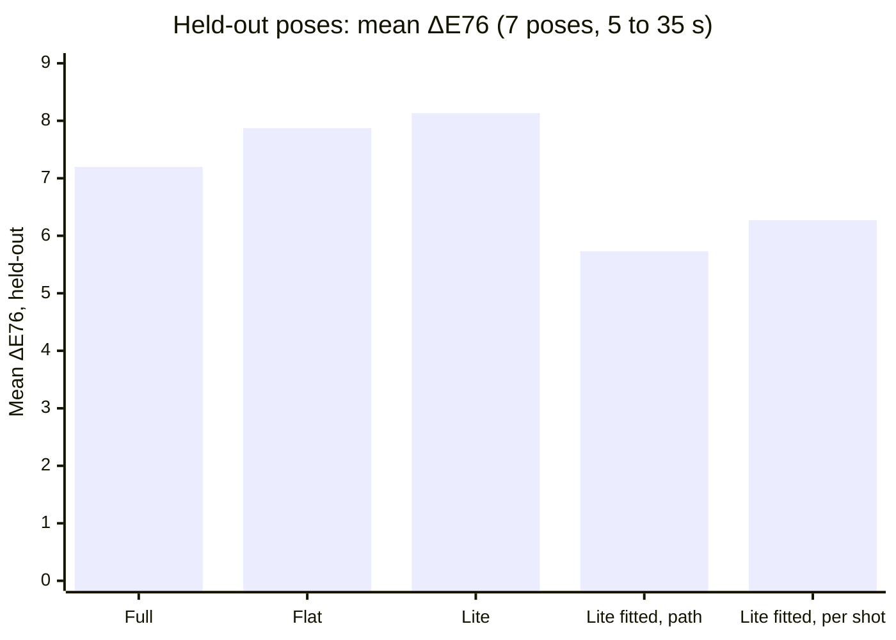
```mermaid
xychart-beta
    title "Held-out poses: mean ΔE76 (7 poses, 5 to 35 s)"
    x-axis ["Full", "Flat", "Lite", "Lite fitted, path", "Lite fitted, per shot"]
    y-axis "Mean ΔE76, held-out" 0 --> 9
    bar [7.197, 7.872, 8.133, 5.732, 6.270]
```

The path-averaged fit's loss on its training batches, each point the mean of
the 51 steps around it: most of the gain is in by step 100 and the curve is
flat by 300, so the 2000 steps run are many more than it needs. These are
training numbers, on the poses the fit sees; the table above is held-out.

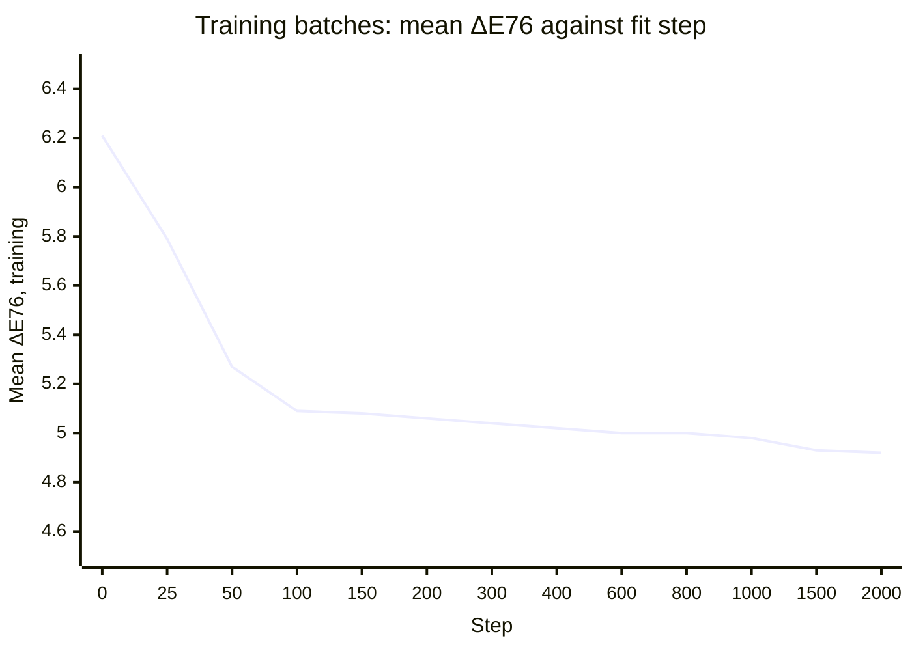
```mermaid
xychart-beta
    title "Training batches: mean ΔE76 against fit step"
    x-axis "Step" [0, 25, 50, 100, 150, 200, 300, 400, 600, 800, 1000, 1500, 2000]
    y-axis "Mean ΔE76, training" 4.5 --> 6.5
    line [6.21, 5.79, 5.27, 5.09, 5.08, 5.06, 5.04, 5.02, 5.00, 5.00, 4.98, 4.93, 4.92]
```

Two held-out poses, 5 s and 25 s. Left to right, the simplifier's lite mesh,
the fitted one and their difference; then the places they differ most,
enlarged, lite above fitted. The fit sharpens the sun's shadow edge on the
floor and the arches' edges, and puts the hangings' colours back.


The fitted mesh against the reference at the same poses, and where they
still differ most: the edge of the roof opening against the sky, and
texture detail no vertex colour holds.


The ΔE heatmap sheets of the same two poses, lite then fitted: reference,
render, heatmap, edge pixels, over the heatmap's scale.


The sheets and crops are `render_compare.py --row ... --crops 3` on frames
0 and 4 of the scored videos, the reference upscaled twice to the render
size; the heatmaps are `--reference-video ... --reference-sheet
--sheet-frames 0,4`. A whole-path video at 30 fps, lite against fitted, is
`render_compare.py --video` of the two meshes' `--frames 1200 --dt 33`
renders; it is not committed, and the reference has no frame between the
scored poses to put beside it. Nothing refreshes these images: the fit
needs the GPU environment.

### Cost-aware fit along the camera path

What [the cost-aware fit](../../../../tools/r3d/README.md#cost-aware-fit)
does to the Sponza bakes. Every held-out number below is on the same seven
poses (5 to 35 s), which no fit trained on. The training numbers are labelled
as such.

**Path visibility.** The source after alpha masking has 245,465 triangles.
The region box keeps 211,004; the camera path, sampled every 100 ms with
3 by 3 rays a pixel and an 8-pixel margin, keeps 116,917. Run on the
committed bakes, the same rule keeps the share of each mesh below.

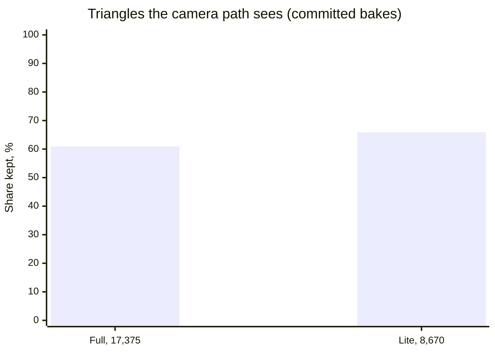
```mermaid
xychart-beta
    title "Triangles the camera path sees (committed bakes)"
    x-axis ["Full, 17,375", "Lite, 8,670"]
    y-axis "Share kept, %" 0 --> 100
    bar [60.9, 65.9]
```

Culling the committed full mesh to the 10,573 triangles the path sees leaves
its held-out mean ΔE76 at 7.196 (7.197 unculled). Over the whole path at
30 fps, 1200 frames between the 100 ms samples, `render_compare.py --video
--clear 9CC0E6` counts no hole pixel in the culled lite mesh. The culled full
one has a known limit: frames 838, 869 and 1146 (27.7, 28.7 and 37.8 s) show
4, 8 and 4 hole pixels, one or two device pixels each, where a sliver thinner
than the 3 by 3 rays a pixel slips between them. These counts trace the
portrait view alone, which a landscape panel outsees at its sides. The
shipped rule traces a square view as wide as the long side; on the committed
full mesh, against the portrait view widened by a 28-pixel margin instead:

| Path view | Kept of 17,375 | Hole pixels, portrait | Hole pixels, landscape |
|---|---:|---:|---:|
| Portrait, 28-pixel margin | 10,892 | 8, in 2 frames | 0 |
| Square, 8-pixel margin | 10,796 | 8, in 2 frames | 0 |

A fitted mesh changes its geometry, so its holes are counted against the
source instead: device pixels it leaves as background where a ray through
the pixel centre meets the source at least two pixels inside its silhouette,
over the whole path at 30 fps. Every simplified mesh leaves some, where its
edges fall short of the source's:

| Mesh | Hole pixels, portrait | Hole pixels, landscape |
|---|---:|---:|
| Full | 1,401 | 1,262 |
| Lite | 10,572 | 7,902 |
| Fitted's start, culled and simplified | 9,055 | 7,863 |
| Fitted, portrait references only | 6,237 | 12,594 |
| Fitted, both orientations (committed) | 4,436 | 5,218 |

Trained on portrait views alone, the fit pulled edges in where only a
landscape panel sees them; the committed mesh trains on both.

The culled triangles, magenta, from outside and from above with the roofs
cut away:


The places the culled lite mesh differs most from the uncut one over the whole
path, uncut above: coincident faces trading places, no hole.


**Budget against error.** Unfitted and fitted, from the import's region cull
and from the path cull (the path start simplified to 1.15 times the budget
and pruned back to it):

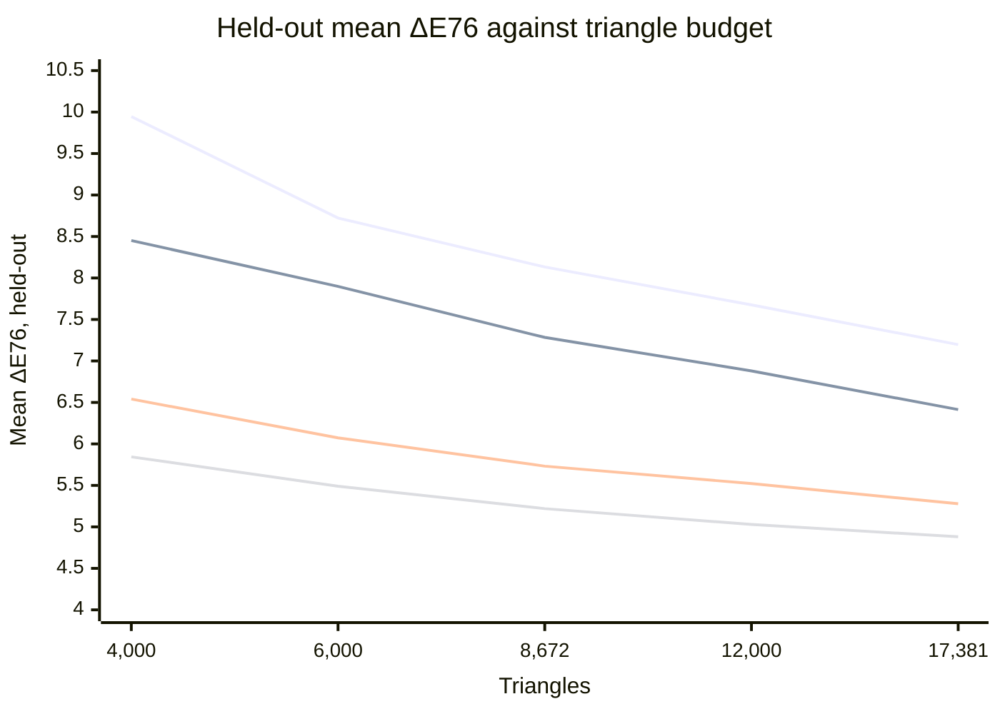
```mermaid
xychart-beta
    title "Held-out mean ΔE76 against triangle budget"
    x-axis "Triangles" ["4,000", "6,000", "8,672", "12,000", "17,381"]
    y-axis "Mean ΔE76, held-out" 4 --> 10.5
    line [9.946, 8.723, 8.133, 7.676, 7.197]
    line [8.452, 7.898, 7.284, 6.880, 6.414]
    line [6.541, 6.073, 5.732, 5.522, 5.279]
    line [5.844, 5.490, 5.220, 5.029, 4.881]
```

Top to bottom: region start, path start, region start fitted, path start
fitted. The same meshes' geometry, as the mean angle between their normals
and the source's over the pixels both cover:

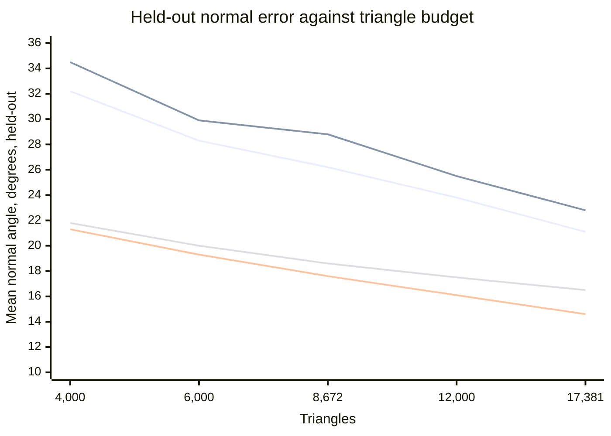
```mermaid
xychart-beta
    title "Held-out normal error against triangle budget"
    x-axis "Triangles" ["4,000", "6,000", "8,672", "12,000", "17,381"]
    y-axis "Mean normal angle, degrees, held-out" 10 --> 36
    line [32.2, 28.3, 26.2, 23.8, 21.1]
    line [34.5, 29.9, 28.8, 25.5, 22.8]
    line [21.3, 19.3, 17.6, 16.1, 14.6]
    line [21.8, 20.0, 18.6, 17.5, 16.5]
```

Top to bottom: region start fitted, region start, path start fitted, path
start. Fitting on colour alone moves geometry away from the source, by about
1 to 2 degrees; the normal term below takes it back.

| Mesh | Triangles | Mean ΔE76 | p95 ΔE76 | Normal error | Predicted ms |
|---|---:|---:|---:|---:|---:|
| Full, committed | 17,375 | 7.197 | 22.38 | 21.1° | 58.5 |
| Full, fitted (region start) | 17,375 | 5.279 | 13.29 | 22.8° | 59.2 |
| Full budget, path start, fitted | 17,381 | 4.881 | 11.77 | 16.5° | 59.4 |
| Lite, committed | 8,670 | 8.133 | 26.25 | 26.2° | 46.2 |
| Lite, fitted (region start, round one) | 8,670 | 5.732 | 15.03 | 28.8° | 46.8 |
| Lite budget, path start, fitted | 8,672 | 5.220 | 12.76 | 18.6° | 46.4 |
| Lite budget, path start, fitted with the normal term 1 | 8,672 | 5.232 | 12.94 | 14.8° | 46.7 |

Fitting helps at the full budget as much as at lite's (7.20 to 5.28, and to
4.88 from the path start). The curve flattens past 8,672: the last 8,700
triangles buy 0.34 ΔE.

**Normal term.** At the lite budget from the path start, sweeping the normal
weight $`\lambda_n`$:

| $`\lambda_n`$ | 0 | 0.1 | 0.3 | 1 |
|---|---:|---:|---:|---:|
| Held-out mean ΔE76 | 5.220 | 5.247 | 5.268 | 5.232 |
| Held-out normal error | 18.6° | 17.1° | 16.3° | 14.8° |

ΔE stays within 0.05 while the normal error drops 3.8 degrees, so the
chosen mesh uses $`\lambda_n = 1`$. Normal-angle heatmaps at 5 and 25 s, left to
right the committed lite, the colour-only fit and the fit with the normal
term, on the ΔE heatmaps' colours with degrees for ΔE:


**Warm starts.** Splitting the fitted 4,000-triangle mesh's worst triangles up
to 8,672 and 12,000 and fitting again gives 5.223 at 8,035 triangles and 5.153
at 10,382 (the splits leave triangles no pose shows, which pruning drops);
from the path start the same budgets give 5.220 and 5.029. The plateau does
not move.

**Cost.** The cost model's weights and the 16 board frames of the committed
full and lite bakes they were fitted to, five runs each, are
[`board_cost_weights.txt`](../../../../tools/r3d/board_cost_weights.txt).
In sample it is off by 1.02 ms on average (R² 0.983); fitted on one bake it
predicts the other's mean within 3.0 ms (full) and 0.8 ms (lite). On six meshes it was not fitted to, measured the same way
(`run_sponza_perf_suite --perf-scope`, five runs, each mesh built into one
of the suite's three slots), it is within 1.3 ms:

| Mesh | Triangles | Predicted ms | Measured ms |
|---|---:|---:|---:|
| Full, culled to the path | 10,573 | 50.7 | 50.1 |
| Lite, culled to the path | 5,714 | 42.3 | 41.7 |
| Lite, fitted (region start) | 8,670 | 46.7 | 48.0 |
| Path start fitted, 4,000 | 4,000 | 38.0 | 37.0 |
| Path start fitted with the cost term, 8,672 | 8,672 | 42.0 | 41.0 |
| Chosen: path start fitted with the normal term, 8,672 | 8,672 | 46.7 | 46.3 |

The Pareto curve, held-out ΔE against predicted board time, with the 30 and
60 fps budgets: neither is reached, because the constant alone, the clear and
the upscale, is 21 ms, and at 4,000 triangles the frame is still 35 ms.


`fitted_variant.py sweep` makes this Pareto image from the fitted variant's recipe.

The two-point smoke sweep is plotted below.

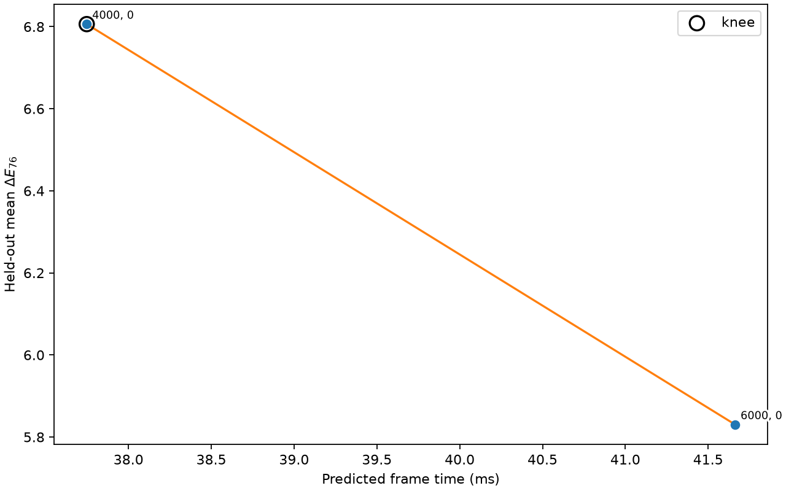

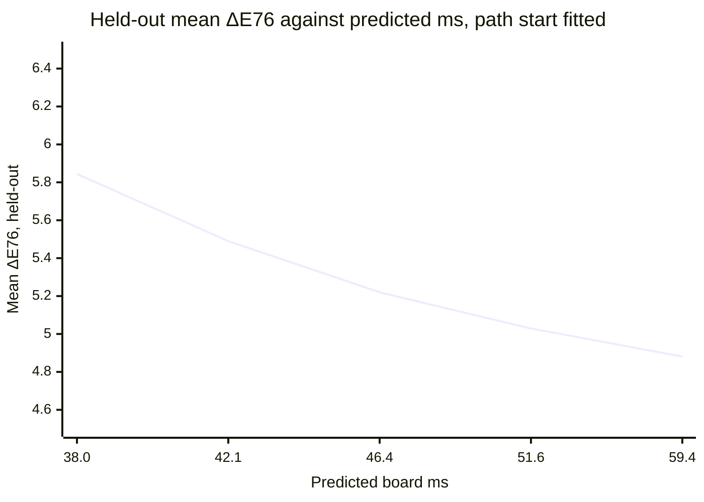
```mermaid
xychart-beta
    title "Held-out mean ΔE76 against predicted ms, path start fitted"
    x-axis "Predicted board ms" ["38.0", "42.1", "46.4", "51.6", "59.4"]
    y-axis "Mean ΔE76, held-out" 4.5 --> 6.5
    line [5.844, 5.490, 5.220, 5.029, 4.881]
```

The x-axis is spaced evenly, not to scale; the picture above is to scale.
The cost term (0.1 ΔE per ms) moves a mesh 4 to 7 ms left for 0.2 to 0.6 ΔE,
which a smaller budget does as cheaply: at 8,672 it gives 5.628 at 42.0 ms,
and the plain fit at 6,000 gives 5.490 at 42.1 ms. Its weight sweep at
8,672:

| Cost weight | 0 | 0.02 | 0.1 | 0.5 |
|---|---:|---:|---:|---:|
| Held-out mean ΔE76 | 5.220 | 5.262 | 5.628 | 7.887 |
| Predicted ms | 46.4 | 45.1 | 42.0 | 36.2 |

The knee is the fitted path start at 8,672 triangles; the chosen mesh is that
point with the normal term.

On the board, against the committed lite mesh's 46.05 ms: the chosen mesh
draws in 46.29 ms (+0.5%) for 36% less held-out ΔE (8.13 to 5.23) and 11.4
degrees less normal error. The cost-term fit at the same budget draws in
41.0 ms (−11%) at ΔE 5.63, and the full mesh culled to the path in 50.1 ms
against the full's 58.6 (−14.5%) at the same ΔE.

The committed `sponza-fitted` target, measured in the same image as the
others (`run_sponza_perf_suite --perf-scope`, five runs), draws in 46.75 ms
against lite's 46.00 (+1.6%), full's 58.52 and flat's 44.97.

The chosen recipe is committed as the `sponza-fitted` target, refitted by
`fitted_variant.py` from its entry in `meshes/sponza.import.toml`, its path
cull and pruning poses covering the panel held either way up. Scored on the same seven
held-out poses against the reference as it is now rendered, edges blended
with the camera's background, it is at mean ΔE76 4.89 (p95 13.18) against
lite's 7.69 and full's 6.76. Its sheet against lite is in
[The Sponza variants](#the-sponza-variants). Against the
reference at the bake fidelity sheet's last pose, where they still differ most:

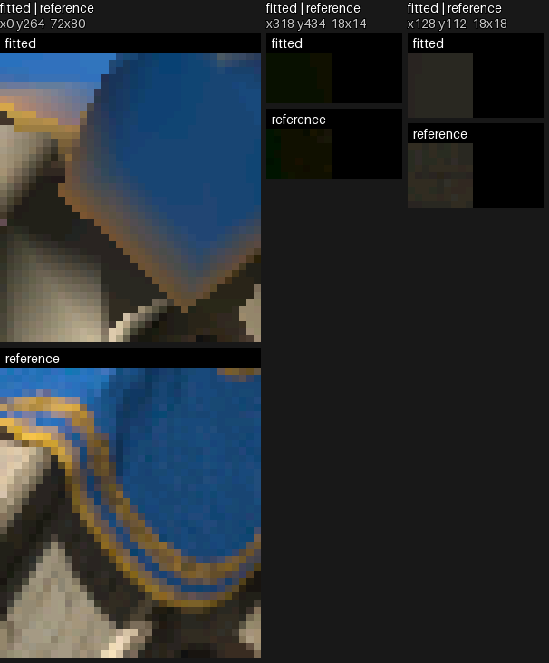

Each stage on its own, before above after, at the two held-out poses where
the pair differs most, enlarged where it differs most:

| Stage | Before | After | Where it shows |
|---|---|---|---|
| Fit | committed lite | path start fitted | arches' edges, the floor's shadow edge, the banners' colours |
| Normal term | fitted | fitted with the normal term | column edges and banner folds turned back toward the source |
| Path visibility | region start | path start | the floor's sun patch and the red banner's folds, given the budget hidden faces had |
| Pruning | path start, nothing pruned | 1.15 times the budget pruned back | the arch outline and the column beside the vase |
| Cost term | fitted | fitted with the cost term | coarser arch facets, and a banner corner pulled in far enough to open a hole |
| Path culling | committed full | full culled to the path | nothing but coincident faces trading places |

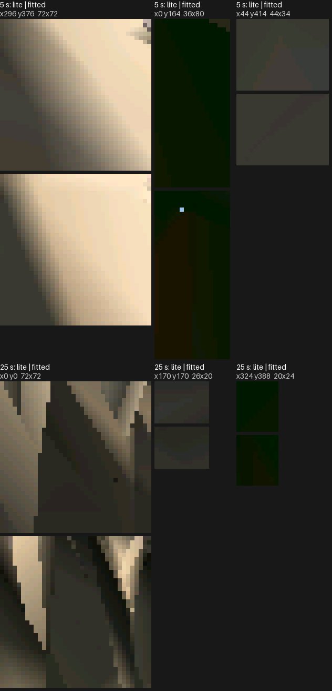
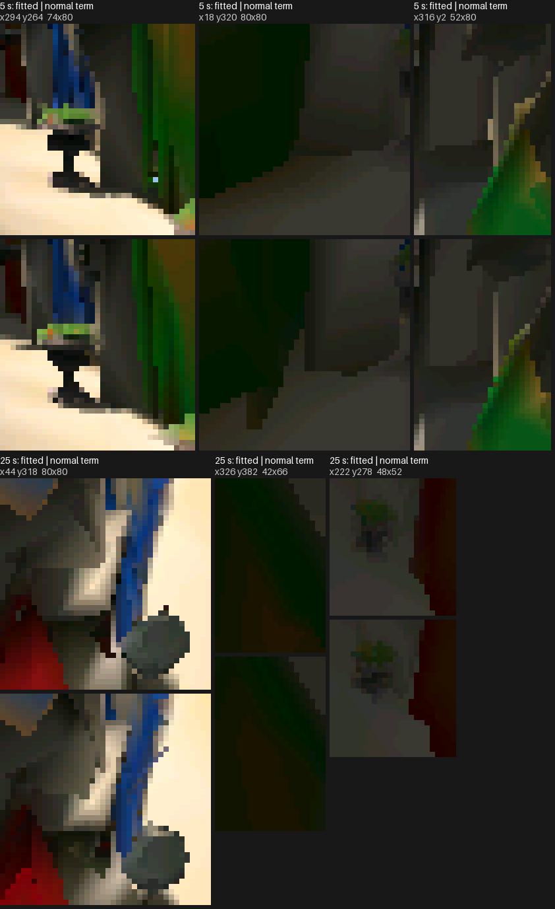
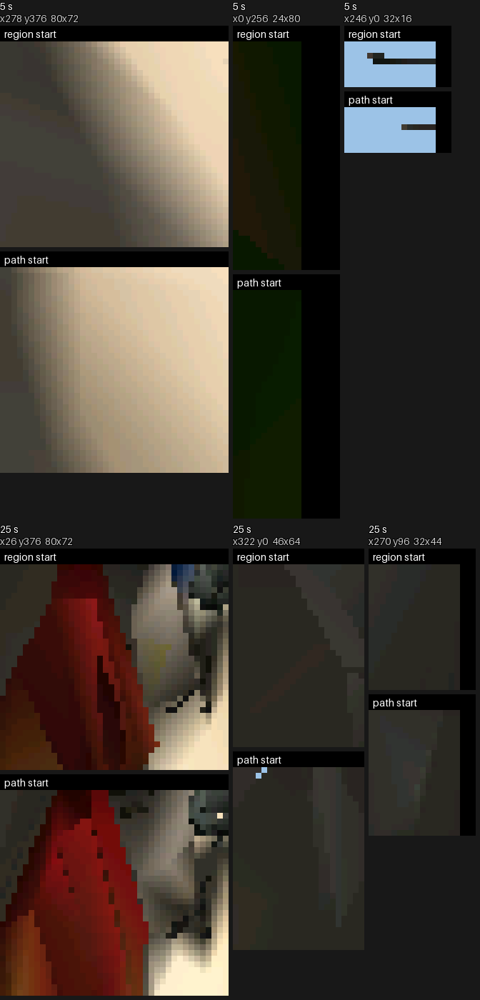
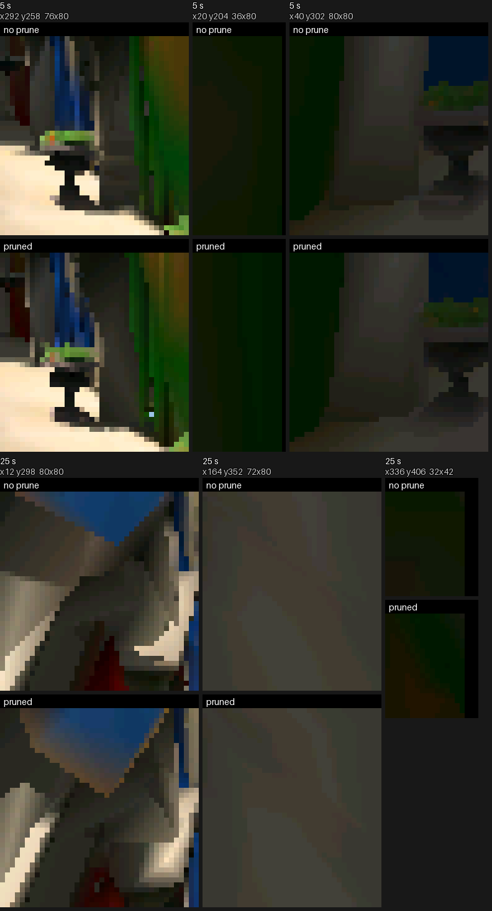
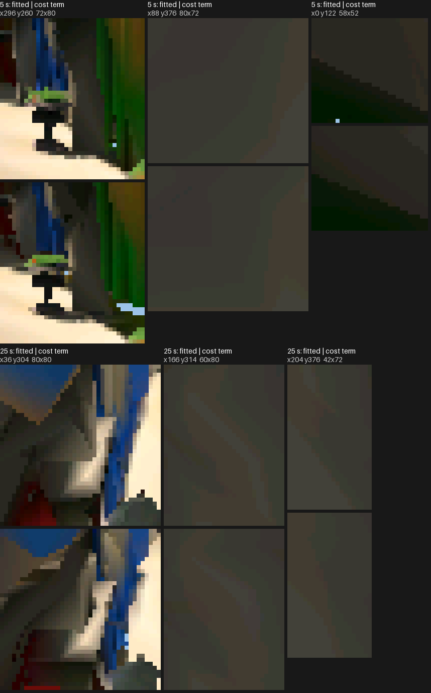
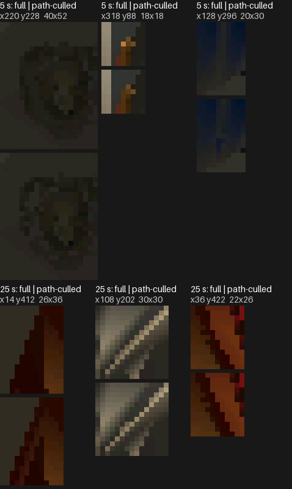

Its ΔE heatmap sheet at the bake fidelity sheet's two poses:


**Fitted full.** The chosen recipe at full's 17,381 triangles is committed as
the `sponza-fitted-full` target, refitted the same way from its own entry in
`meshes/sponza.import.toml`. On the same seven held-out poses it is at mean
ΔE76 4.50 (p95 11.47), against full's 6.76 and the fitted lite mesh's 4.89.
On the board, in the same image (`run_sponza_perf_suite --perf-scope`, five
runs), it draws in 61.25 ms against full's 58.49 (+4.7%): a third less error
than full for under 3 ms, and 0.39 ΔE better than fitted lite for 14.5 ms more.


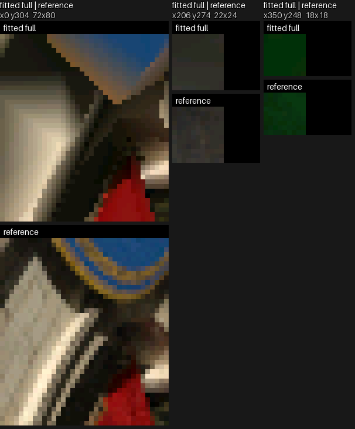
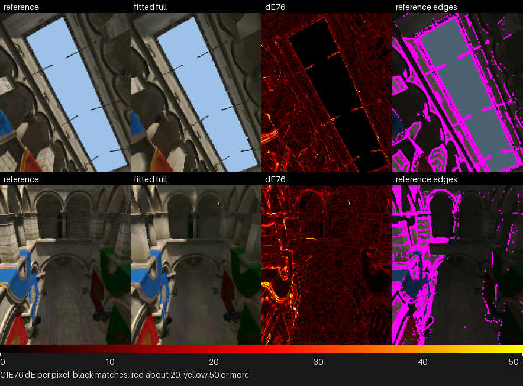

`doc_images.sh` makes the images of the committed fitted meshes against
the reference. The stage images are made from fitted meshes in a scratch
directory and nothing refreshes them: the fits need the GPU environment and
the cost weights a board capture. A 30 fps video of the whole path, the committed lite
against the chosen mesh, is `render_compare.py --video` of their
`--frames 1200 --dt 33` renders and is not committed.

## Indirect light

The Sponza import's `lighting.light.indirect = { bounces = 2, rays = 64,
cache_samples = 1 }` is described in
[Mesh-Import.md](../../../../../docs/render/Mesh-Import.md#indirect-light). It
lifts the shadowed arcade ceilings and the sides of the columns the sun does
not reach, and tints a column next to a banner with the banner's colour. The
three meshes keep their triangle budgets and cost the same to draw. The scene's
ambient light is 0.03.

The cache is validated in linear light by the closed diffuse furnace and
red-wall Cornell fixtures in
[`test_r3d_bake.py`](../../../../tools/tests/test_r3d_bake.py). The furnace
holds the finite bounce series, while the Cornell floor receives a stronger red
term next to its red wall. A Sponza cache measurement must use its
alpha-masked source and linear radiance, not source triangle counts or encoded
vertex colours.

The atrium's sunlit floor beneath a curtain is direct-light dominated. Its
small coloured indirect term can disappear through the tone map and RGB565
quantization even when the cache contains substantial bounce light elsewhere.
On a shaded column the indirect term can exceed direct light, but both terms
remain close to black. The source reference resolves those local changes more
finely than the vertex-colour mesh, so a per-pixel reference is the comparison
for a suspected colour-bleed loss.

How far each bake is from the source lit per pixel with the same bounces, over
the same eight poses as above. Mean ΔE76, p95 ΔE76 and luma SSIM; the
direct-light bakes are the same import with `indirect` removed:

| Bake | Against the indirect reference |
|---|---|
| Full smooth, direct light | 8.507, 21.96, 0.680 |
| Full smooth, two bounces | 6.645, 21.03, 0.684 |
| Lite smooth, direct light | 9.489, 26.65, 0.629 |
| Lite smooth, two bounces | 7.801, 25.19, 0.638 |
| Flat, direct light | 9.294, 28.99, 0.634 |
| Flat, two bounces | 7.680, 26.17, 0.623 |

The indirect reference is the ground truth for a bake that carries bounce
light, and the two-bounce bakes are 1.6 to 1.9 ΔE nearer to it than the direct
bakes. The reference resolves bounce detail finer than a triangle, which is the
error that remains.

The reference, the smooth bake with direct light only and the smooth bake with
two bounces at two poses, each bake with its ΔE heatmap against the reference
and the reference's edge pixels beside them. The error stays at silhouettes and
shadow edges; the bounces take the mean down by about a fifth.


The places the two bakes differ most, the reference above them: a banner's
colour on the column beside it, and the lit ceiling.


`doc_images.sh` regenerates the images, baking the import without `indirect`
for the direct-light side. It renders the source reference with and without
the import's indirect field before `render_compare.py` makes the sheets and
crops.

### Fitted variants against indirect light

Each fitted variant trains on the indirect reference. The table scores four
meshes per budget on the seven held-out poses, which the fit never saw,
against that reference: the smooth GI bake at the budget, the same bake made
with direct light only, the previous fitted mesh (fitted against direct light)
and the new one (fitted against GI). Mean and p95 ΔE76 are lower-is-better;
luma SSIM is higher-is-better. Normal angle is measured over pixels where the
mesh and source both cover the view.

| Budget | Mesh | Mean ΔE76 | p95 ΔE76 | Luma SSIM | Normal angle |
|---|---|---:|---:|---:|---:|
| Lite | GI bake | 7.956 | 25.94 | 0.6326 | 25.858° |
| Lite | Direct-light bake | 9.695 | 27.62 | 0.6245 | 25.720° |
| Lite | Fitted against direct light | 5.552 | 13.78 | 0.7773 | 14.841° |
| Lite | Fitted against GI | 4.945 | 13.17 | 0.7843 | 14.765° |
| Full | GI bake | 6.780 | 21.75 | 0.6796 | 20.834° |
| Full | Direct-light bake | 8.674 | 22.65 | 0.6751 | 21.150° |
| Full | Fitted against direct light | 5.192 | 12.22 | 0.8072 | 13.010° |
| Full | Fitted against GI | 4.516 | 11.52 | 0.8167 | 12.617° |

- GI bake against direct-light bake: the bounce light is worth 1.7 to 1.9 ΔE
  at the same triangle count, with the geometry unchanged.
- Fitted against GI against the GI bake: fitting takes the mean down by about
  3 ΔE and the normal error by 11 degrees at both budgets, which is the larger
  part of the gain.
- Fitted against GI against fitted against direct light: 0.6 to 0.7 ΔE better
  at both budgets, with p95 and SSIM also better and the normal angle within
  0.4 degrees.
- Held-out against training: the fit's training ΔE was 4.83 (lite) and 4.35
  (full), so held-out is 0.11 and 0.17 worse; the fits generalise to unseen
  poses and need no retrain.

The sheets show the reference, the GI bake, the previous fitted mesh and the
new one beside their ΔE heatmaps at two held-out poses; the crops show the
places where the three meshes differ most, with the reference above them.

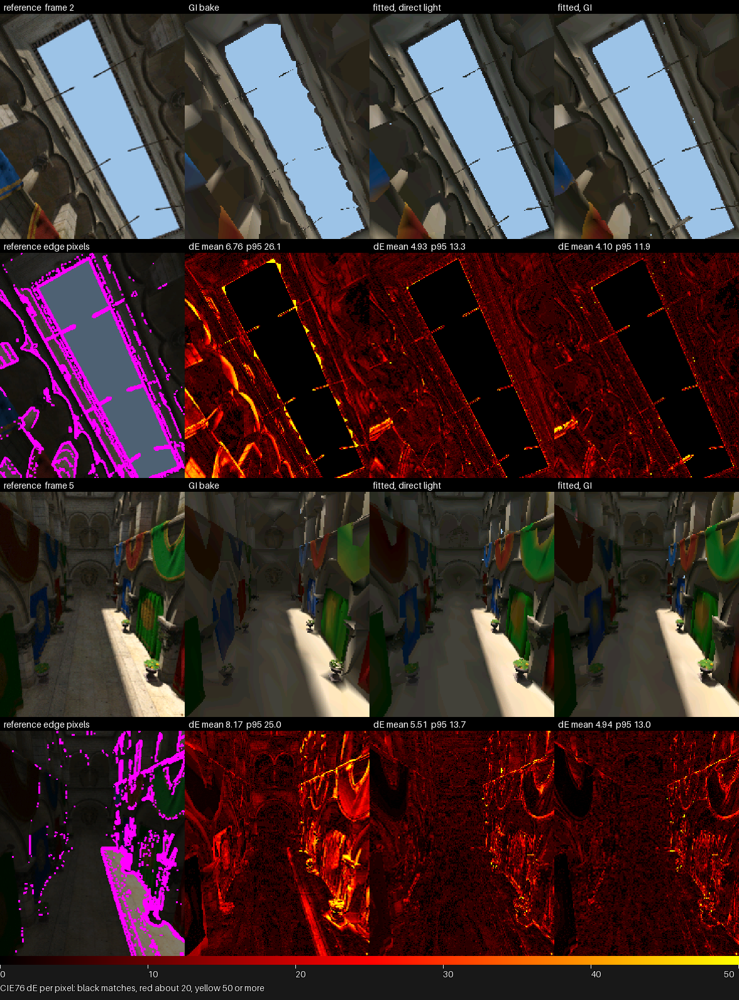
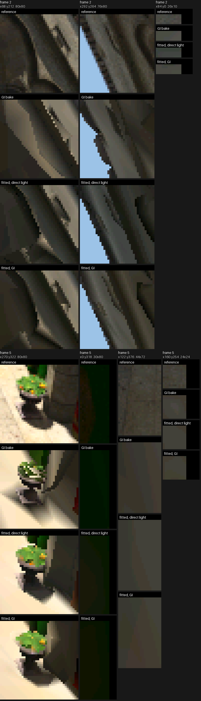
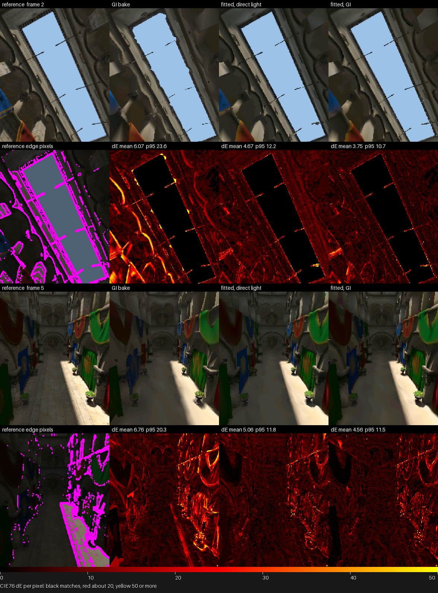
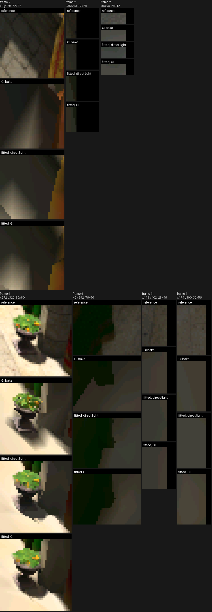

The previous fitted meshes cannot be remade by a script, so these images live
under `docs/render/images/`. Measure both new fitted variants on the board
against their predecessors. Their triangle budgets are unchanged, so a
material frame-time change is not expected.

### Indirect look

The scene's `[indirect]` table, described in
[Scene-Files.md](../../../../../docs/render/Scene-Files.md#indirect-look), sets
`intensity` (a multiplier on the gathered bounce light) and `albedo_boost` (a
multiplier on the reflectance bounces use, held below 1). The committed scene
leaves both at the physical 1.0. The reference reads the same table, so each
look has two references: the physical one and one made with the look's own
settings. The sheet bakes the same import at intensity 2 and 3 and at an albedo
boost of 2 and shows, at the last pose, the physical reference above the bakes
with their heatmaps against it, then each look's own reference with the
heatmap against that:


Over five poses, mean ΔE76 against the physical reference and against the
look's own, then p95 and luma SSIM against the physical one:

| Look | Mean ΔE76, physical | Mean ΔE76, own | p95, physical | SSIM, physical |
|---|---:|---:|---:|---:|
| Direct light only | 8.76 | | 23.14 | 0.675 |
| Intensity 1 | 6.80 | 6.80 | 22.14 | 0.679 |
| Intensity 2 | 7.60 | 7.25 | 22.45 | 0.667 |
| Intensity 3 | 9.25 | 7.64 | 23.63 | 0.648 |
| Albedo boost 2 | 8.36 | 7.45 | 23.03 | 0.656 |

The error against the physical reference is the look plus the bake; against the
look's own reference it is the bake alone, so the gap between the two columns is
what the look itself costs: most of intensity 3's rise from 6.80 to 9.25 is that
gap (1.6), the bake adding the other 0.8.

## Sponza poses

The flythrough is a glTF camera animation, `../assets/flythrough.glb`, baked
to `../flythrough_tracks_generated.c` by
[`tools/anim/bake_tracks.py`](../../../../tools/anim/README.md). Its poses for
[`tools/r3d/report_triangle_sizes.sh`](../../../../tools/r3d/README.md#triangle-sizes)
come from the generic track sampler, at the poses `suite_sponza_perf.c` times
(every `SPONZA_POSE_EVERY_MS`) and the size `sponza_flythrough.h` names and the lens of
the scene's camera object (`meshes/sponza.scene.toml`):

```sh
./launcher/tools/anim/sample_tracks.sh \
    --tracks launcher/main/apps/render_lab/flythrough_tracks_generated.c:flythrough \
    --every 5000 --poses camera 184 224 0.62 6 |
    ./launcher/tools/r3d/report_triangle_sizes.sh \
        --mesh sponza -
```

## The capybara test asset

`gen_capybara.py` writes `../assets/capybara.glb`, a rigged low-poly capybara
modelled entirely in code: 1336 triangles, 20 joints, and two looping clips at
30 fps, `idle` (3.5 s) and an in-place `walk` (1 s, no root motion). It is a
plain glTF 2.0 file, the input a skinned-mesh baker is tested with.

```sh
python launcher/main/apps/render_lab/tools/gen_capybara.py
python -m unittest discover -s launcher/main/apps/render_lab/tools/tests
```

The file is read back and posed with the engine's glTF tools in
[`launcher/tools/r3d/`](../../../../tools/r3d/README.md); to watch it:

```sh
python launcher/tools/r3d/gltf_preview.py launcher/main/apps/render_lab/assets/capybara.glb --gif walk --out walk.gif
```
