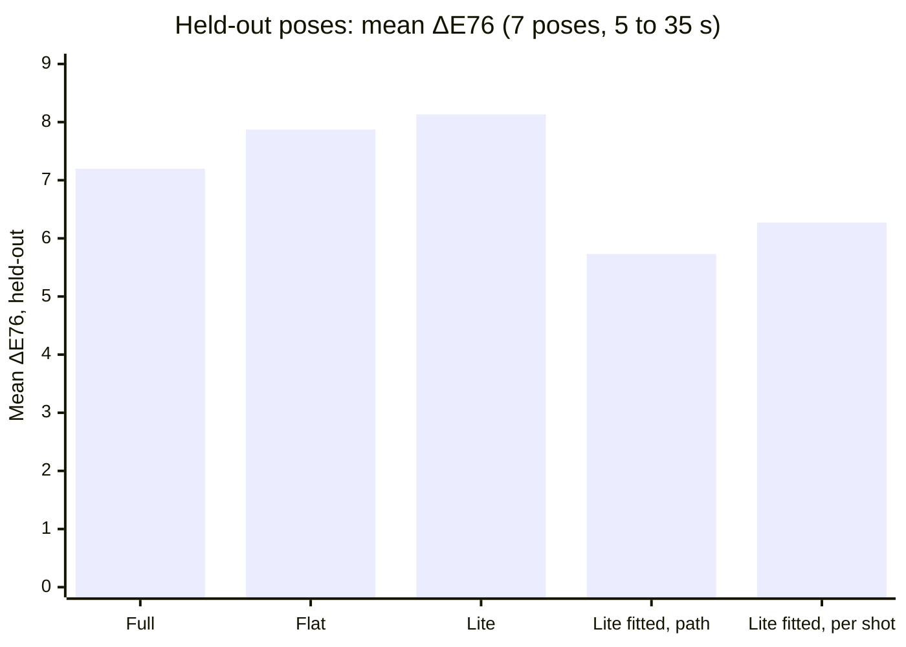
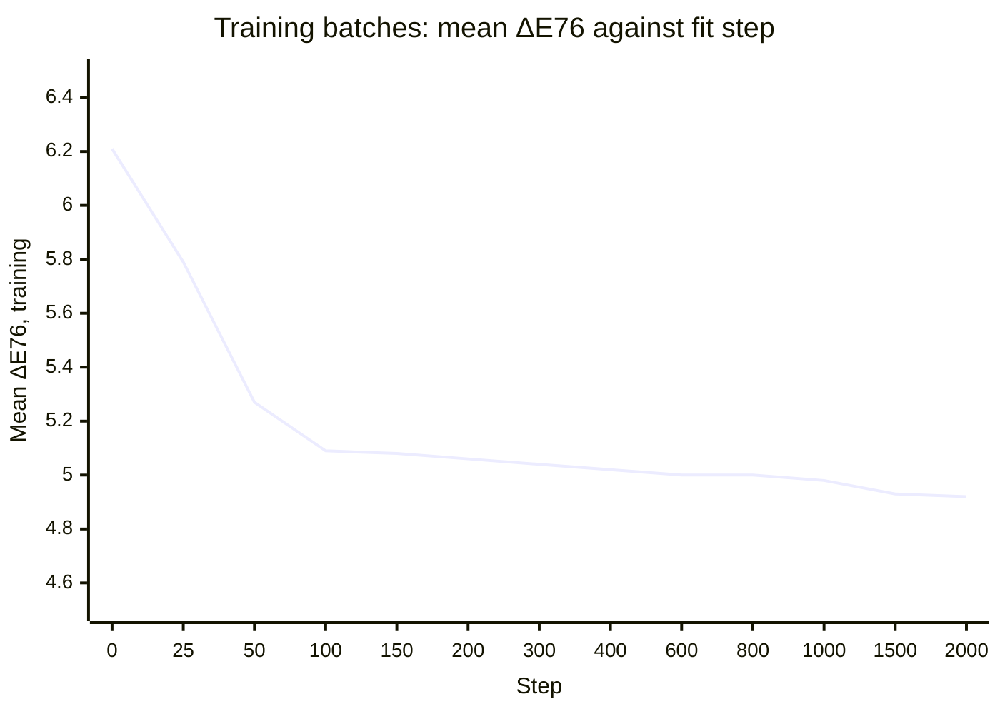
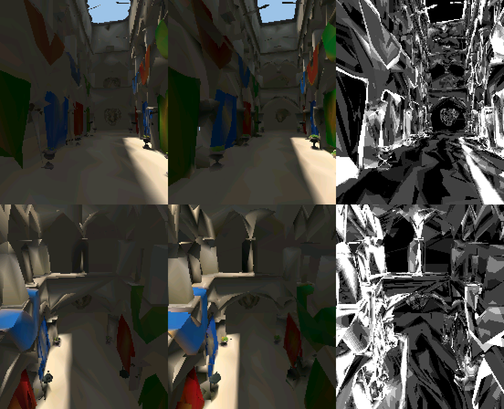
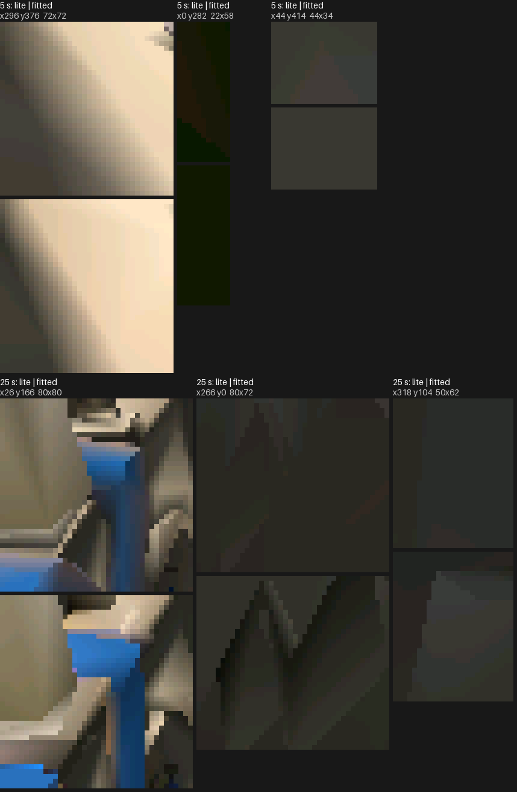
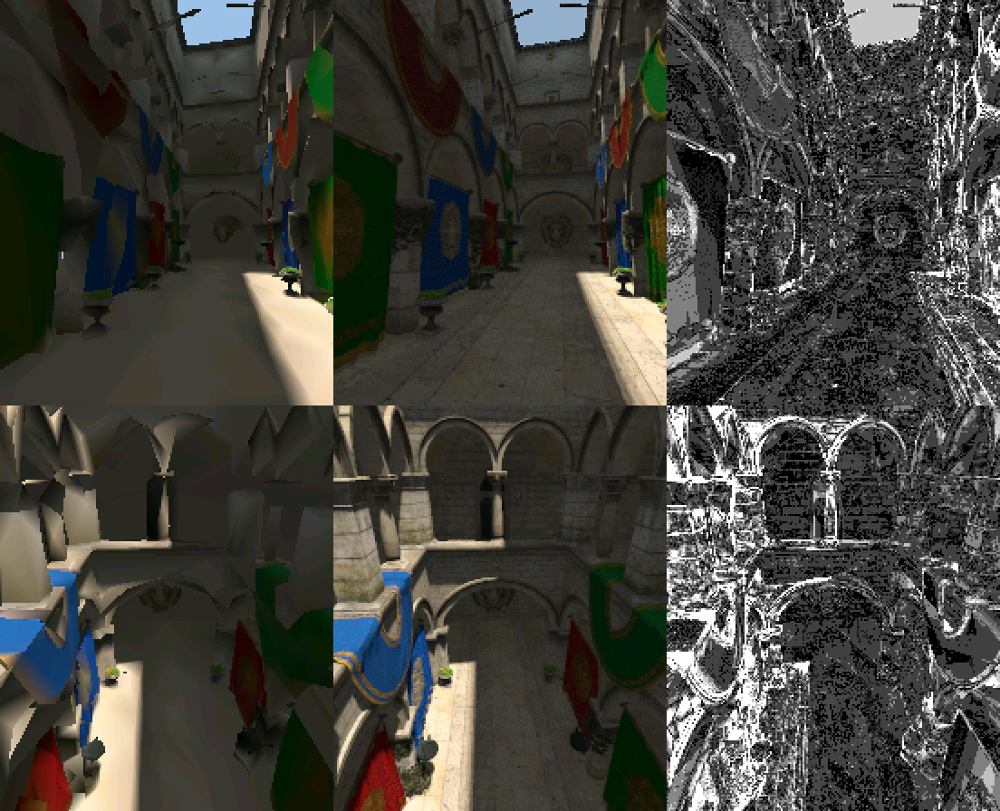
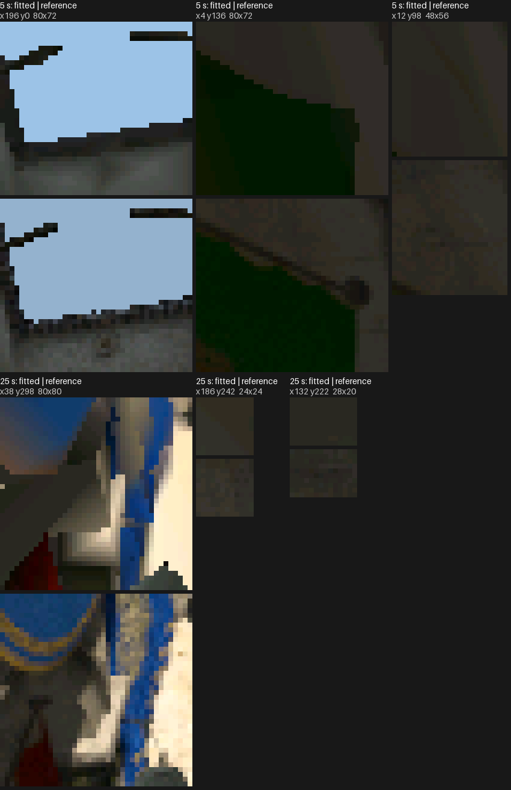
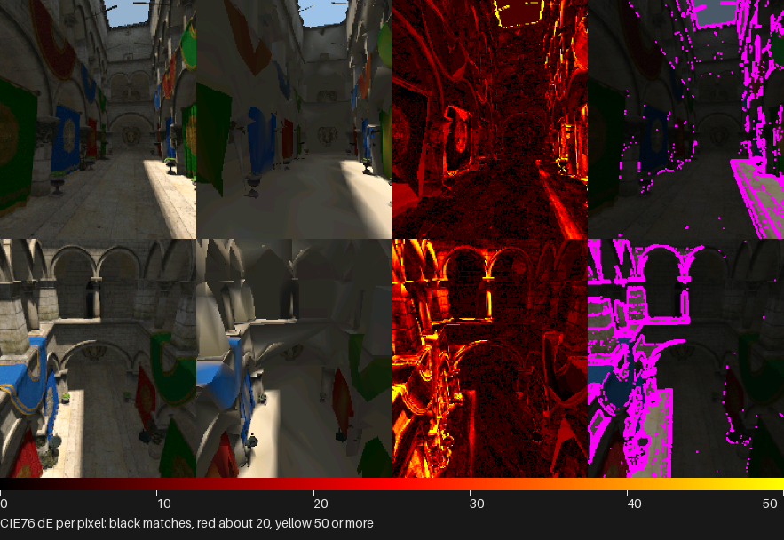
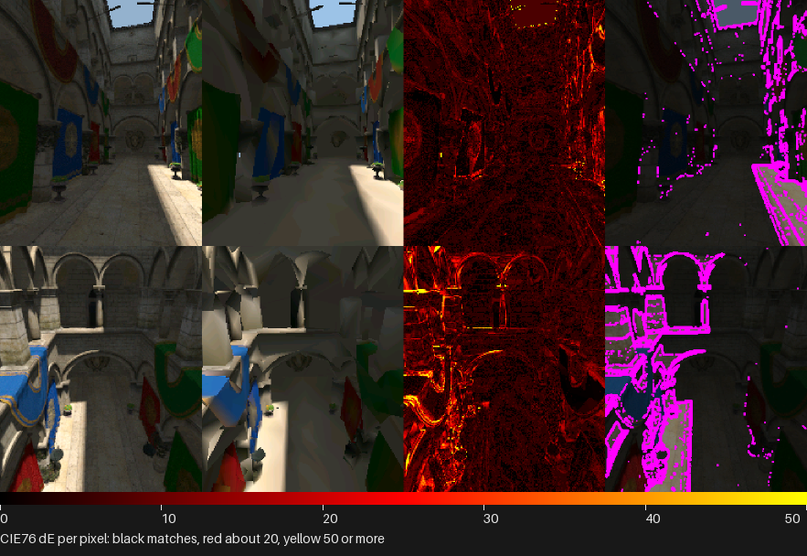

# Render Lab tools

Host-only scripts; the firmware build skips this folder. The render harness
itself is [`docs/tools/Render-Harness.md`](../../../../../docs/tools/Render-Harness.md).

## Host renders

```sh
./launcher/main/apps/render_lab/tools/render_lab_render_host.sh
```

Writes every declared scene under `tools/results/render/render_lab/`:
`gouraud-landscape.bmp` is the shaded cube, `cornell-landscape.bmp` the
software ray-traced room. The integer scenes are pinned with the HUD hidden;
the HUD renders are `|nopin`, since its fps readout is a `double` printed
with `"%.1f"`, and so are the Cornell scenes, which are float throughout.
The fps text comes from the host fixture - time the board with a device
capture. The Gouraud scene rotates when stepped over several frames.

### Depth views

`--view shaded|depth|tiles` shows a lit-mesh scene's frame as the renderer
left it (`shaded`, the default), as its depth buffer, or as that depth
reduced to `RASTER_SHOW_TILE` squares. The depth is `raster_draw()`'s
own buffer, unchanged; `raster_show()` only colours it and takes each
tile's farthest depth, so the views are what the renderer holds at the
moment it upscales the frame. Near is bright and far dark, stretched over the
range that frame drew, so grey compares pixels within a frame, not across
frames; a pixel nothing reached takes the scene's clear colour, as the
shaded frame does, and a tile with one such pixel is empty.

They are ordinary renders: `sponza-depth-*.bmp` and `sponza-tiles-*.bmp`
beside `sponza-*.bmp`, each with a `.png` when Pillow is installed, turned to
the panel's orientation and the size the script declares. The picture is the
renderer's resolution, half the panel's each way, upscaled like the shaded
one. They are `|nopin`, like the shaded Sponza renders: the camera path is
float, so which pixels a triangle reaches can differ by compiler.
`--view` sets the tunable `render_lab.view`, so on a development build
`autana tune render_lab.view 2` switches the same views live. `--view` on a
scene with no lit mesh, an unknown name or no value fails the run.
`tests/test_render_views.py` checks the views against the shaded render.

A pose of the flythrough is `--frames` times `--dt`:

```sh
render_lab_render --scene sponza --frames 1 --dt 15000 --view depth -o depth.bmp
```

## Images in the docs

`doc_images.sh` here makes these in `docs/images/overview/` and `docs/images/render/`, run by
`launcher/tools/render/render_doc_images.sh`; see "Images in these docs" in
[`docs/tools/Render-Harness.md`](../../../../../docs/tools/Render-Harness.md).

| Image | Shows |
|---|---|
| `render-lab-cube.png`, `render-lab-cube.gif` | the Gouraud cube; the GIF plays the rotation forward and back |
| `render-lab-cornell.png` | the ray-traced Cornell box, fully resolved, no HUD |
| `render-lab-sponza.gif` | the start of the Sponza flythrough |
| `render/sponza-{full,lite,flat}.gif` | the same three seconds of the flythrough, one GIF per bake |
| `render/sponza-{depth,tiles}.gif` | those three seconds as the depth and depth-tile views of the full bake |
| `render/bake-fidelity-sheet.png` | the flat bake against the source model at two poses, with the error heatmap (see Fidelity against the source) |
| `render/compare-full-{lite,flat}.png`, `.crops.png` | full against lite and smooth against flat at the GIFs' last pose: both renders and their difference, then the places they differ most, enlarged |

## The Sponza variants

One Sponza import bakes three meshes, its `[[variants]]`
([Mesh-Import.md](../../../../../docs/render/Mesh-Import.md)): the scenes
`sponza`, `sponza-lite` and `sponza-flat` each draw one. Every row plays the
same three seconds of the flythrough, so the rows compare. The last two rows
are the [view modes](../../../../../docs/render/Mesh-Rendering.md#view-modes)
over the full mesh.

| Variant | What it is | Triangles and vertices |
|---|---|---|
|  | **Full**: smooth, one colour per vertex, lit and interpolated | `SPONZA_TRIANGLE_COUNT`, `SPONZA_VERTEX_COUNT` |
|  | **Lite**: the same bake simplified to a smaller budget | `SPONZA_LITE_TRIANGLE_COUNT`, `SPONZA_LITE_VERTEX_COUNT` |
|  | **Flat**: the full mesh's triangles, one colour per face, no gradients | `SPONZA_FLAT_TRIANGLE_COUNT`, `SPONZA_FLAT_VERTEX_COUNT` |
|  | `RASTER_SHOW_DEPTH` over the full mesh | as full |
|  | `RASTER_SHOW_DEPTH_TILES` over the full mesh | as full |

The counts are those of the three baked meshes in `meshes/`.
`autana suite run_sponza_perf_suite` prints each variant's `both cores: mean`
line (`test_sponza_frame_cost_along_the_flythrough`). The GIFs are made by the
doc-images workflow
([Render-Harness.md](../../../../../docs/tools/Render-Harness.md#images-in-these-docs)).

Where the variants differ, at the pose the GIFs end on: each sheet is the two
renders and their amplified difference, and the crops below it are the places
that differ most, the first render above the second, enlarged.


Lite spends fewer triangles, so small shapes merge or drop and edges step; the
surfaces keep their colour.


Flat shows each face in one colour, so a curtain's fold reads as bands where
the smooth mesh blends.

## Fidelity against the source

How far each Sponza bake is from the source model lit per pixel, over the eight
camera-path poses, and which flat-bake settings get closest. What the numbers
mean is in [Mesh-Import.md](../../../../../docs/render/Mesh-Import.md#fidelity-against-a-reference);
the commands, working directory `launcher/`, are in
[the r3d tools README](../../../../tools/r3d/README.md#fidelity-reference).
`PY` is the venv's interpreter.

```sh
M=main/apps/render_lab
H=$M/tools/render_lab_render_host.sh
tools/anim/sample_tracks.sh --tracks $M/flythrough_tracks_generated.c:flythrough --every 5000 --until 45000     --poses camera 184 224 0.62 6 > poses.txt
$PY tools/r3d/reference_render.py $M/meshes/sponza.scene.toml --poses poses.txt --skip 1 --out reference --samples 4
$PY tools/r3d/bake_fidelity.py $M/meshes/sponza.scene.toml --mesh sponza_flat --script $H     --render-args "--quarter 0 --no-hud --scene sponza-flat --frames 8 --dt 5000"     --reference reference --work scratch     --variant declared= --variant fixed1=samples=fixed:1 --variant fixed4=samples=fixed:4     --variant fixed8=samples=fixed:8 --variant fixed16=samples=fixed:16 --variant fixed32=samples=fixed:32     --variant fixed64=samples=fixed:64 --variant fixed2=samples=fixed:2     --variant min2=samples=auto:2:16:median --variant min4=samples=auto:4:16:median     --variant max4=samples=auto:1:4:median --variant max8=samples=auto:1:8:median     --variant max32=samples=auto:1:32:median --variant area0.25=samples=auto:1:16:median*0.25     --variant area0.5=samples=auto:1:16:median*0.5 --variant area2=samples=auto:1:16:median*2     --variant sky16=sky=16 --variant sky32=sky=32 --variant sky64=sky=64 --variant sky256=sky=256     --variant sky512=sky=512 --variant centroid=place=centroid --variant sun-centre=sun=centre     --variant fixed4-sun-centre=samples=fixed:4,sun=centre
```

It prints the sweep table below. The smooth and lite rows are the committed
scenes scored the same way: `sh $H -o host` renders each scene's video
(`render_lab_render --quarter 0 --no-hud --scene sponza --frames 8 --dt 5000
--video full.avi`, likewise `sponza-lite`) and `render_compare.py --reference-video`
scores it. The sheet is `--reference-sheet fidelity.png --sheet-frames 2,4` on
the committed flat render.

| Variant | Mean ΔE76 | p95 ΔE76 | Luma SSIM | Edge ΔE76 | Interior ΔE76 |
|---|---:|---:|---:|---:|---:|
| Full smooth | 6.654 | 21.46 | 0.696 | 13.64 | 5.53 |
| Lite smooth | 7.541 | 24.83 | 0.651 | 15.76 | 6.22 |
| Flat, 1 sample per face | 7.495 | 29.46 | 0.645 | 16.25 | 6.08 |
| Flat, 4 samples per face | 7.072 | 24.43 | 0.658 | 14.91 | 5.81 |
| Flat, committed (`auto` 1 to 16, median area) | 7.278 | 26.92 | 0.652 | 15.87 | 5.89 |
| Flat, 16 samples per face | 6.964 | 23.54 | 0.663 | 14.43 | 5.76 |

Flat against full smooth differs by mean ΔE76 5.54, p95 22.97 and SSIM 0.798:
the gap flat shading leaves between the two bakes.

The flat sweep, sorted by mean ΔE76; `min` and `max` are the `auto` bounds,
`area` a fraction or multiple of the median face:

| Setting | Mean ΔE76 | p95 ΔE76 | Luma SSIM | Edge ΔE76 |
|---|---:|---:|---:|---:|
| fixed 16 | 6.964 | 23.54 | 0.663 | 14.43 |
| fixed 64 | 6.968 | 23.45 | 0.663 | 14.41 |
| fixed 32 | 6.973 | 23.51 | 0.663 | 14.39 |
| fixed 8 | 7.014 | 23.82 | 0.660 | 14.61 |
| min 4 | 7.060 | 24.41 | 0.659 | 14.90 |
| fixed 4, sun centre only | 7.070 | 24.73 | 0.659 | 15.21 |
| fixed 4 | 7.072 | 24.43 | 0.658 | 14.91 |
| area 0.25 | 7.121 | 24.73 | 0.656 | 15.11 |
| min 2 | 7.158 | 25.41 | 0.657 | 15.33 |
| area 0.5 | 7.238 | 25.68 | 0.653 | 15.55 |
| fixed 2 | 7.248 | 26.21 | 0.654 | 15.41 |
| max 8 | 7.271 | 26.94 | 0.652 | 15.87 |
| sky 512 | 7.273 | 26.90 | 0.653 | 15.86 |
| max 32 | 7.277 | 26.92 | 0.652 | 15.87 |
| committed (min 1, max 16, area 1, sky 128) | 7.278 | 26.92 | 0.652 | 15.87 |
| sky 256 | 7.285 | 26.91 | 0.653 | 15.86 |
| max 4 | 7.290 | 27.02 | 0.652 | 15.88 |
| sky 64 | 7.383 | 26.95 | 0.651 | 15.90 |
| area 2 | 7.400 | 28.66 | 0.648 | 16.16 |
| sun centre only | 7.451 | 28.14 | 0.648 | 16.74 |
| centroid placement (any count) | 7.505 | 29.70 | 0.644 | 16.33 |
| sky 32 | 7.539 | 26.96 | 0.650 | 15.94 |
| sky 16 | 7.935 | 27.05 | 0.644 | 16.00 |

Sixteen fixed samples per face take the committed bake's mean from 7.278 to
6.964 and its p95 from 26.92 to 23.54, at no cost at run time: the mesh and its
frame cost are the same. They hold edge error to 14.43 against the smooth
bake's 13.64.

One sheet of two poses of the committed flat bake, left to right the reference,
the bake, the ΔE heatmap and the reference's edge pixels (magenta), with the
heatmap's scale below. The error sits at lit arch edges, shadow boundaries and
the foreground drapery. `doc_images.sh` regenerates the sheet.


### Appearance fit of the lite mesh

[`appearance_simplify.py`](../../../../tools/r3d/README.md#appearance-fit)
fits the lite mesh's vertex positions and colours to the reference, its
triangles unchanged. It trains on the flythrough sampled every second, less
the times scored, and is scored on the times 5 to 35 s every 5 s, which it
never saw (`--frames 7 --dt 5000` against the reference of those poses,
with the scene camera's background where nothing is drawn). Path-averaged is one mesh
trained on every training pose; per shot is one mesh per 10 s of the path,
each frame scored with its own segment's mesh. The unfitted rows differ from
the fidelity table above only because they average seven of its eight poses.

| Mesh | Triangles | Mean ΔE76 | p95 ΔE76 | Luma SSIM | Edge ΔE76 |
|---|---:|---:|---:|---:|---:|
| Full smooth | 17,381 | 7.197 | 22.38 | 0.687 | 14.63 |
| Flat, committed | 17,381 | 7.872 | 28.35 | 0.642 | 17.02 |
| Lite, simplifier | 8,670 | 8.133 | 26.25 | 0.643 | 16.83 |
| Lite, fitted, path-averaged | 8,670 | 5.732 | 15.03 | 0.754 | 10.85 |
| Lite, fitted, per shot | 8,670 | 6.270 | 17.51 | 0.748 | 11.69 |

The fitted lite mesh beats the full mesh at half its triangles. Per shot
trails path-averaged: each segment trains on eight poses, too few to
generalise to the poses between them.



The path-averaged fit's loss on its training batches, each point the mean of
the 51 steps around it: most of the gain is in by step 100 and the curve is
flat by 300, so the 2000 steps run are many more than it needs. These are
training numbers, on the poses the fit sees; the table above is held-out.



Two held-out poses, 5 s and 25 s. Left to right, the simplifier's lite mesh,
the fitted one and their difference; then the places they differ most,
enlarged, lite above fitted. The fit sharpens the sun's shadow edge on the
floor and the arches' edges, and puts the hangings' colours back.




The fitted mesh against the reference at the same poses, and where they
still differ most: the edge of the roof opening against the sky, and
texture detail no vertex colour holds.




The ΔE heatmap sheets of the same two poses, lite then fitted: reference,
render, heatmap, edge pixels, over the heatmap's scale.




The sheets and crops are `render_compare.py --row ... --crops 3` on frames
0 and 4 of the scored videos, the reference upscaled twice to the render
size; the heatmaps are `--reference-video ... --reference-sheet
--sheet-frames 0,4`. A whole-path video at 30 fps, lite against fitted, is
`render_compare.py --video` of the two meshes' `--frames 1200 --dt 33`
renders; it is not committed, and the reference has no frame between the
scored poses to put beside it. Nothing refreshes these images: the fit
needs the GPU environment.

## Sponza poses

The flythrough is a glTF camera animation, `../assets/flythrough.glb`, baked
to `../flythrough_tracks_generated.c` by
[`tools/anim/bake_tracks.py`](../../../../tools/anim/README.md). Its poses for
[`tools/r3d/report_triangle_sizes.sh`](../../../../tools/r3d/README.md#triangle-sizes)
come from the generic track sampler, at the poses `suite_sponza_perf.c` times
(every `SPONZA_POSE_EVERY_MS`) and the size `sponza_flythrough.h` names and the lens of
the scene's camera object (`meshes/sponza.scene.toml`):

```sh
./launcher/tools/anim/sample_tracks.sh \
    --tracks launcher/main/apps/render_lab/flythrough_tracks_generated.c:flythrough \
    --every 5000 --poses camera 184 224 0.62 6 |
    ./launcher/tools/r3d/report_triangle_sizes.sh \
        --mesh sponza -
```

## The capybara test asset

`gen_capybara.py` writes `../assets/capybara.glb`, a rigged low-poly capybara
modelled entirely in code: 1336 triangles, 20 joints, and two looping clips at
30 fps, `idle` (3.5 s) and an in-place `walk` (1 s, no root motion). It is a
plain glTF 2.0 file, the input a skinned-mesh baker is tested with.

```sh
python launcher/main/apps/render_lab/tools/gen_capybara.py
python -m unittest discover -s launcher/main/apps/render_lab/tools/tests
```

The file is read back and posed with the engine's glTF tools in
[`launcher/tools/r3d/`](../../../../tools/r3d/README.md); to watch it:

```sh
python launcher/tools/r3d/gltf_preview.py launcher/main/apps/render_lab/assets/capybara.glb --gif walk --out walk.gif
```
