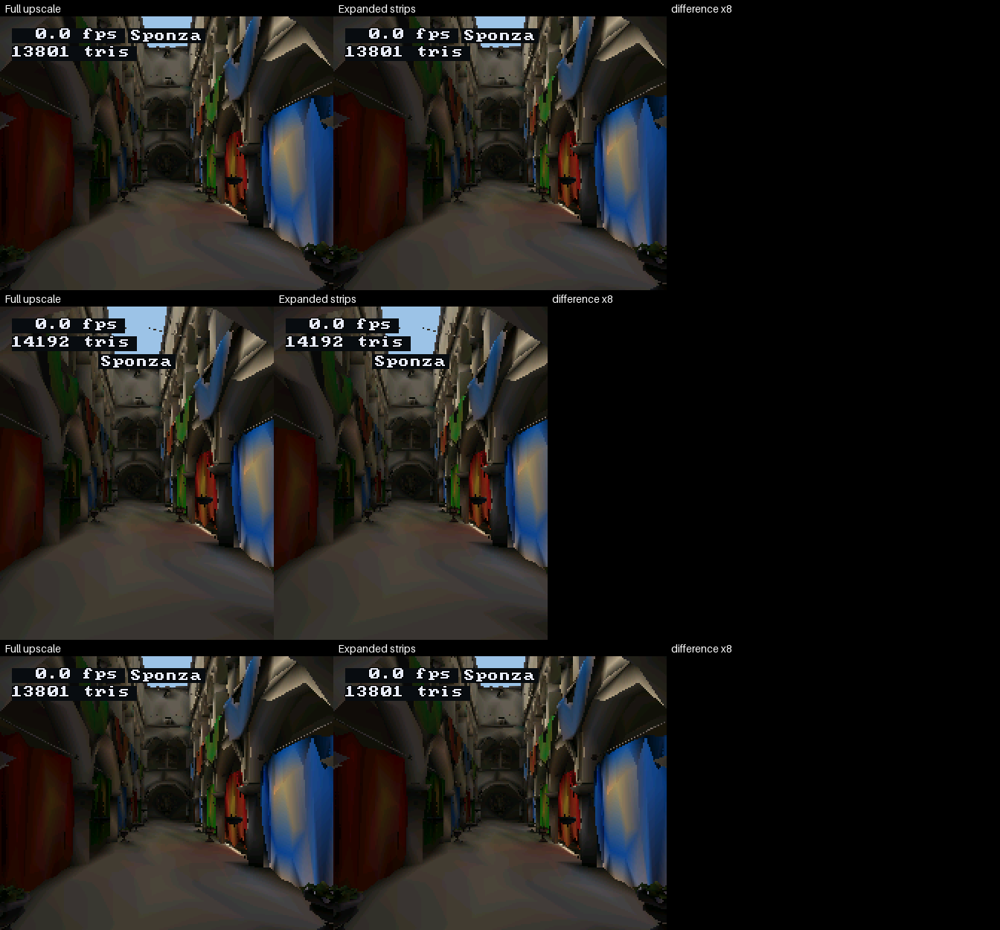

# Render Lab tools

Host-only scripts; the firmware build skips this folder. The render harness
itself is [`docs/tools/Render-Harness.md`](../../../../../docs/tools/Render-Harness.md).

Before a source bake or reference render, pull the
[mesh source files](../../../../tools/r3d/README.md).

## Host renders

```sh
./launcher/main/apps/render_lab/tools/render_lab_render_host.sh
```

Writes every declared scene under `tools/results/render/render_lab/`:
`gouraud-landscape.bmp` is the shaded cube, `cornell-landscape.bmp` the
software ray-traced room. The integer scenes are pinned with the HUD hidden;
the HUD renders are `|nopin`, since its fps readout is a `double` printed
with `"%.1f"`, and so are the Cornell scenes, which are float throughout.
The fps text comes from the host fixture - time the board with a device
capture. The Gouraud scene rotates when stepped over several frames.

### Expanded presentation

At exactly half the panel size, the scene composes a half picture and gfx
expands it while sending strips. The HUD replays over those strips. The host
harness uses `gfx_read_panel_row()`, so its captures include the expansion,
text halos and overlay order.



The full upscale and expanded readback produce identical pixels in the
pictured orientations. Compare the two paths with the existing revision
comparison tool; each reference can also be a checkout directory:

```sh
./launcher/tools/render/render_compare.sh \
  --script launcher/main/apps/render_lab/tools/render_lab_render_host.sh \
  --crops 4 -o /tmp/expanded-present FULL_UPSCALE_REF EXPANDED_REF \
  --render landscape "--quarter 1 --scene sponza --frames 2" \
  --render portrait "--quarter 0 --scene sponza --frames 2" \
  --render flipped "--quarter 3 --scene sponza --frames 2"
```

On development firmware, `autana tune gfx.half_separate 0` selects the
framebuffer's first quarter; `autana tune gfx.half_separate 1` selects a
separate PSRAM half picture. The separate allocation is freed on mode exit.
Release uses the framebuffer placement.

### Depth views

`--view shaded|depth|tiles` shows a lit-mesh scene's frame as the renderer
left it (`shaded`, the default), as its depth buffer, or as that depth
reduced to `RASTER_SHOW_TILE` squares. The depth is `raster_draw()`'s
own buffer, unchanged; `raster_show()` only colours it and takes each
tile's farthest depth, so the views are what the renderer holds at the
moment it upscales the frame. Near is bright and far dark, stretched over the
range that frame drew, so grey compares pixels within a frame, not across
frames; a pixel nothing reached takes the scene's clear colour, as the
shaded frame does, and a tile with one such pixel is empty.

They are ordinary renders: `sponza-depth-*.bmp` and `sponza-tiles-*.bmp`
beside `sponza-*.bmp`, each with a `.png` when Pillow is installed, turned to
the panel's orientation and the size the script declares. The picture is the
renderer's resolution, half the panel's each way, upscaled like the shaded
one. They are `|nopin`, like the shaded Sponza renders: the camera path is
float, so which pixels a triangle reaches can differ by compiler.
`--view` sets the tunable `render_lab.view`, so on a development build
`autana tune render_lab.view 2` switches the same views live. `--view` on a
scene with no lit mesh, an unknown name or no value fails the run.
`tests/test_render_views.py` checks the views against the shaded render.

A pose of the flythrough is `--frames` times `--dt`:

```sh
render_lab_render --scene sponza --frames 1 --dt 15000 --view depth -o depth.bmp
```

## On the board

A development build answers these from any shell, so a measurement selects
its scene by name rather than through the menu:

| Command | Does |
|---|---|
| `autana render scenes` | every scene's key and name, and which one is showing |
| `autana render scene <key>` | switches to the scene with exactly that key, such as `sponza` or `sponza-lite` |
| `autana render partial on\|off` | partial updates, as the menu's toggle sets them |
| `autana tune render_lab.scale <n>` | the fixed render scale in hundredths of the panel: 200 is half size |
| `autana tune render_lab.budget <ms>` | dynamic resolution on a lit-mesh scene; 0 turns it off |

A screenshot's state carries an `app` object naming the scene, whether the
menu is open, the layout, partial updates and the scale, so two captures can
be checked to have measured the same thing.

## Images in the docs

`doc_images.sh` here makes these in `docs/images/overview/` and `docs/images/render/`, run by
`launcher/tools/render/render_doc_images.sh`; see "Images in these docs" in
[`docs/tools/Render-Harness.md`](../../../../../docs/tools/Render-Harness.md).

| Image | Shows |
|---|---|
| `render-lab-cube.png`, `render-lab-cube.gif` | the Gouraud cube; the GIF plays the rotation forward and back |
| `render-lab-cornell.png` | the ray-traced Cornell box, fully resolved, no HUD |
| `render-lab-sponza.gif` | the start of the Sponza flythrough, on the fitted full mesh |
| `render/sponza-{full,lite,flat,fitted,fitted-full}.gif` | the same three seconds of the flythrough, one GIF per bake |
| `render/sponza-{depth,tiles,motion-vectors}.gif` | those three seconds as the depth, depth-tile and motion-vector views of the full bake |
| `render/bake-fidelity-sheet.png` | the flat bake against the source model at two poses, with the error heatmap ([Bake-Quality.md](../../../../../docs/render/Bake-Quality.md#fidelity-against-the-source)) |
| `render/bake-indirect-compare.png`, `render/bake-indirect-crops.png` | the physical reference beside the smooth bake without and with indirect light (the scene's physical look, bakes made without and with that field), each with its error heatmap against the reference at two poses, then the places the two bakes differ most with the reference above them ([Bake-Quality.md](../../../../../docs/render/Bake-Quality.md#indirect-light)) |
| `render/bake-indirect-look.png` | the physical reference beside the indirect bake at intensity 1, 2 and 3 and at an albedo boost of 2, each with its error heatmap, then each look's own reference and the error against it ([Bake-Quality.md](../../../../../docs/render/Bake-Quality.md#indirect-look)) |
| `render/bake-ao-compare.png`, `render/bake-ao-crops.png`, `render/bake-ao-map.png` | the reference beside the smooth bake without and with local occlusion at two poses with error heatmaps, the places they differ most, and the occlusion factor alone beside the reference ([Bake-Quality.md](../../../../../docs/render/Bake-Quality.md#local-occlusion)) |
| `render/compare-full-{lite,flat}.png`, `.crops.png` | full against lite and smooth against flat at the GIFs' last pose: both renders and their difference, then the places they differ most, enlarged |
| `render/compare-lite-fitted.png`, `.crops.png` | lite against the fitted mesh at that pose, the same way |
| `render/compare-full-fitted-full.png`, `.crops.png` | full against the fitted full mesh, the same way |
| `render/appearance-{chosen,fitted-full}-heat.png`, `-reference.crops.png` | each fitted mesh against the reference: its heatmap sheet and the places it differs most (fitted full also its `-reference.png` sheet) |
| `render/import-light.png`, `render/import-face-samples.png` | CPU albedo against baked light, and fixed face sampling against adaptive |
| `render/gpu/*.png` | GPU recipe comparisons, path-cull differences, normal heatmaps and the budget/cost Pareto sheet |

## Refreshing the bake comparisons

The measured comparisons of bakes are in
[Bake-Quality.md](../../../../../docs/render/Bake-Quality.md); these commands
regenerate its images and tables. The scenes `sponza`, `sponza-lite`,
`sponza-flat`, `sponza-fitted` and `sponza-fitted-full` each draw one variant.
`tests/test_sky_through_walls.py` flies the full, flat and lite bakes and fails
when more frames show sky through a wall than its ceiling allows.
`autana suite run_sponza_perf_suite` prints each variant's `both cores: mean`
line (`test_sponza_frame_cost_along_the_flythrough`), the reading the board
stage below takes.

The import-light and face-sampling examples are regenerated by the CPU stage
with its albedo bake and flat-sampling sweep.

The `doc-images-gpu` workflow runs the full GPU stage on the self-hosted
Linux GPU runner and opens or updates its own refresh PR,
"docs: refresh GPU-rendered images", on `feature/refresh-doc-images-gpu`.
It runs weekly, on manual dispatch, and on main pushes affecting its inputs.

For a local run from Git Bash, use the documented WSL Ubuntu CUDA environment
with both r3d requirements files installed. Host C/C++ compilers are needed
for scoring. Run one GPU job at a time. The guard checks memory at stage
start; later workers are admitted against live memory, as described in
[Render-Harness](../../../../../docs/tools/Render-Harness.md#images-in-these-docs).

```sh
DOC_PROJECT=$(pwd -W)
MSYS_NO_PATHCONV=1 wsl -d Ubuntu-24.04 --cd "$DOC_PROJECT" -- bash -lc 'sh launcher/tools/render/run_doc_gpu.sh'
MSYS_NO_PATHCONV=1 wsl -d Ubuntu-24.04 --cd "$DOC_PROJECT" -- bash -lc 'sh launcher/tools/render/run_doc_gpu.sh --check'
```

`--smoke` fits a few steps on a small reference set and writes scratch data
only. It cannot update or check doc images. Full output is under
`launcher/tools/results/doc_images/out/gpu/`; GPU images publish to
`docs/images/render/gpu/`. CPU refreshes neither check nor remove GPU output.
`--check` verifies the full stage's saved source stamp, tables and pixels,
without training a second stochastic fit.

Collect the perf-suite captures from the same diagnostics image, retaining
its build identity in each capture. Pass one `--capture` per run:

```sh
python launcher/tools/render/doc_stages.py --stage board --capture /path/to/run1.txt --capture /path/to/run2.txt
python launcher/tools/render/doc_stages.py --stage board --capture /path/to/run1.txt --capture /path/to/run2.txt --check
```

The stage rejects missing variants, per-pose timings, failed suites and
mismatched build identities. `--build-commit SHA` accepts a capture from that commit only when the firmware
sources still match; this lets a documentation-only commit retain its captures.
It rewrites the board tables and
`launcher/tools/r3d/board_cost_weights.txt`. Refresh GPU predictions after
changing those weights. Board readings for scratch budget-sweep meshes need
a firmware capture of those meshes; predicted ms is labelled separately.

## Sponza poses

The flythrough is a glTF camera animation,
`launcher/demo/sponza/flythrough.glb`, named by
`launcher/demo/sponza/flythrough.anim.toml`. Its poses for
[`report_triangle_sizes.sh`](../../../../tools/r3d/README.md#triangle-sizes)
come from [`tools/anim/track_host.py`](../../../../tools/anim/README.md),
which runs the device's track sampler over the clip, at the poses
`suite_sponza_perf.c` times (every `SPONZA_POSE_EVERY_MS`) and the size
`sponza_content.h` names and the lens of the scene's camera object
(`launcher/demo/sponza/sponza.scene.toml`):

```sh
python launcher/tools/anim/track_host.py \
    launcher/demo/sponza/flythrough.anim.toml \
    --every 5000 --poses camera 184 224 0.62 6 |
    ./launcher/tools/r3d/report_triangle_sizes.sh \
        --mesh sponza.atrium -
```

## The capybara asset

`launcher/demo/capybara/capybara.blend` is a hand-modelled low-poly capybara
with a control rig and in-place loops at 30 fps: `idle`, `walk`, `walk_fast`,
`gallop` and `half_bound`. It is the source asset for skinned-mesh import;
nothing in the build reads it.

`launcher/demo/capybara/capybara.glb` is its glTF export: deform bones only,
every loop as an animation, four influences per vertex. Host tools that read
glTF use it, such as the
[skinned-mesh lighting](../../../../../docs/render/Skinned-Lighting.md)
measurement. After editing the `.blend`, export it again with Blender
through the model-agnostic exporter, naming the loops (the file also
holds the rig's own `capyrigAction`):

```sh
blender --background --factory-startup --python launcher/tools/gltf/blend_skin_to_glb.py -- \
    launcher/demo/capybara/capybara.blend launcher/demo/capybara/capybara.glb \
    --clips idle,walk,walk_fast,gallop,half_bound
```

and measure the lighting again:

```sh
launcher/tools/r3d/skin_light/report_skin_light.sh launcher/demo/capybara/capybara.glb gallop
```
