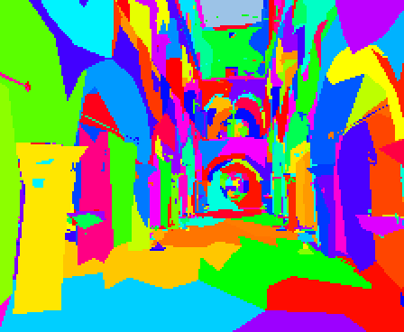

# Render Lab tools

Host-only scripts; the firmware build skips this folder. The render harness
itself is [`docs/tools/Render-Harness.md`](../../../../../docs/tools/Render-Harness.md).

Before a source bake or reference render, pull the
[mesh source files](../../../../tools/r3d/README.md).

## Host renders

```sh
./launcher/main/apps/render_lab/tools/render_lab_render_host.sh
```

Writes every declared scene under `tools/results/render/render_lab/`:
`sponza-landscape.bmp` is the atrium flythrough. These renders are
`|nopin`: their floating-point camera paths can reach different pixels
across compilers. HUD renders also format a `double` fps readout.
The fps text comes from the host fixture - time the board with a device
capture.

### Debug views

`--view shaded|depth|tiles|motion|meshlets` selects the declared context view.
Depth and tiles show a lit-mesh scene's depth buffer, or that depth
reduced to `RASTER_SHOW_TILE` squares. The depth is `raster_draw()`'s
own buffer, unchanged; `raster_show()` only colours it and takes each
tile's farthest depth, so the views are what the renderer holds at the
moment it upscales the frame. Near is bright and far dark, stretched over the
range that frame drew, so grey compares pixels within a frame, not across
frames; a pixel nothing reached takes the scene's clear colour, as the
shaded frame does, and a tile with one such pixel is empty.

They are ordinary renders: `sponza-depth-*.bmp` and `sponza-tiles-*.bmp`
beside `sponza-*.bmp`, each with a `.png` when Pillow is installed, turned to
the panel's orientation and the size the script declares. The picture is the
renderer's resolution, half the panel's each way, upscaled like the shaded
one. They are `|nopin` too.
`--view` sets the tunable `render_lab.view`, so on a development build
`autana tune render_lab.view N` selects view N: zero is shaded, and the remaining
values follow the render_view_t table order in render/context/render_context.c. `--view` on a
scene with no lit mesh, an unknown name or no value fails the run.
`tests/test_render_views.py` checks the views against the shaded render.
Motion paints offsets red for x and green for y. Meshlets paints each mesh
cluster a flat hue, with disjoint IDs across instances.



A pose of a camera path is `--frames` times `--dt`. `--camera NAME`
selects a scene camera; omitted, it draws the first camera.

`dynres_quality.sh WORK OUT.csv CAMERA WxH [WxH ...]` scores each size
against the reference along that camera's clip, at intervals taken from
the script and over the clip's full period. Per-path results belong in
`docs/render/data/dynamic-resolution-quality-CAMERA.csv`.

The tour is authored as camera keys in `launcher/demo/sponza/tour.keys.toml`;
the pack build bakes it, so an edit there needs nothing else.

A host pose can be drawn with:

```sh
render_lab_render --scene sponza --frames 1 --dt 15000 --view depth -o depth.bmp
```

## On the board

A development build answers these from any shell, so a measurement selects
its scene by name rather than through the menu:

| Command | Does |
|---|---|
| `autana render scenes` | every scene's key and name, and which one is showing |
| `autana render scene <key>` | switches to the scene with exactly that key, such as `sponza`, `sponza-lite` or `sponza-flat-fitted` |
| `autana tune render_lab.scale <n>` | the fixed render scale in hundredths of the panel: 200 is half size |
| `autana tune render_lab.budget <ms>` | dynamic resolution on a lit-mesh scene; 0 turns it off |

A screenshot's state carries an `app` object naming the scene, whether the
menu is open and the scale, so two captures can
be checked to have measured the same thing.

## Images in the docs

`doc_images.sh` here makes these in `docs/images/overview/`, run by
`launcher/tools/render/render_doc_images.sh`; see "Images in these docs" in
[`docs/tools/Render-Harness.md`](../../../../../docs/tools/Render-Harness.md).

| Image | Shows |
|---|---|
| `render-lab-sponza.gif` | the start of the Sponza flythrough, on the fitted full mesh |
| `render-lab-sponza-flat.gif` | the flythrough with the fitted flat-shaded bake |

Run the app shots from the repository root with Python, Pillow, numpy and ffmpeg:

```sh
PYTHON=python sh launcher/main/apps/render_lab/tools/doc_images.sh /path/to/out /path/to/work
```

`tests/test_sky_through_walls.py`
checks the app flythrough against its sky-through-wall ceilings.

## Sponza poses

The flythrough is a glTF camera animation, `launcher/demo/sponza/flythrough.glb`,
named by `launcher/demo/sponza/flythrough.anim.toml`. Its poses for
[`report_triangle_sizes.sh`](../../../../tools/r3d/README.md#triangle-sizes)
come from [`tools/anim/track_host.py`](../../../../tools/anim/README.md),
which runs the device's track sampler over the clip, at the poses
`suite_sponza_perf.c` times (every `SPONZA_POSE_EVERY_MS`) and the size
`sponza_content.h` names and the lens of the scene's camera object
(`launcher/demo/sponza/sponza.scene.toml`):

```sh
python launcher/tools/anim/track_host.py \
    launcher/demo/sponza/flythrough.anim.toml \
    --every 5000 --poses camera 184 224 0.62 6 |
    ./launcher/tools/r3d/report_triangle_sizes.sh \
        --mesh sponza.atrium -
```

## The capybara asset

`launcher/demo/capybara/capybara.blend` is a hand-modelled low-poly capybara
with a control rig and in-place loops at 30 fps: `idle`, `walk`, `walk_fast`,
`gallop` and `half_bound`. It is the source asset for skinned-mesh import;
nothing in the build reads it.

Its glTF export, `capybara.glb`, is a cached bake: deform bones only,
every loop as an animation, four influences per vertex. Host tools that read
glTF use it, such as the
[skinned-mesh lighting](../../../../../docs/render/Skinned-Lighting.md)
measurement; `bake.py path capybara.glb` prints where it is.
`capybara.import.toml` names the
`.blend` and the loops to export (the file also holds the rig's own
`capyrigAction`), and `launcher/tools/bake/bake.py` runs the model-agnostic
exporter in Blender. By hand, it is:

```sh
blender --background --factory-startup --python launcher/tools/gltf/blend_skin_to_glb.py -- \
    launcher/demo/capybara/capybara.blend capybara.glb \
    --clips idle,walk,walk_fast,gallop,half_bound
```

and measure the lighting again:

```sh
launcher/tools/r3d/skin_light/report_skin_light.sh "$(python launcher/tools/bake/bake.py path capybara.glb)" gallop
```
