# Render Lab tools

Host-only scripts; the firmware build skips this folder. The render harness
itself is [`docs/tools/Render-Harness.md`](../../../../../docs/tools/Render-Harness.md).

Before a source bake or reference render, pull the
[mesh source files](../../../../tools/r3d/README.md).

## Host renders

```sh
./launcher/main/apps/render_lab/tools/render_lab_render_host.sh
```

Writes every declared scene under `tools/results/render/render_lab/`:
`sponza-landscape.bmp` is the atrium flythrough. These renders are
`|nopin`: their floating-point camera paths can reach different pixels
across compilers. HUD renders also format a `double` fps readout.
The fps text comes from the host fixture - time the board with a device
capture. A release image draws only the scene title of the HUD: the fps
and status lines are development builds' alone.

`render_lab_render --tune NAME=VALUE` applies a console tuning before the scene
enters; repeat it for more settings. `--live-tune NAME=VALUE` applies it after
entry, so the frame hook changes the next frame without reloading the scene.

### Menu

The BOOT menu has a SCENE dropdown of scene families (`family` in
`render_lab_scene_t`), then a VARIANT dropdown when the family has several scenes (Sponza's
bakes, from `variant`), then the rows the showing scene declares in its
`controls` (Capybara's CLIP and BLEND). Order in `scenes[]` is the order of every list, and
index 0 (Sponza Fitted Full) is the scene a start with no key shows. Console
and host scene keys are unchanged.

### Water

The Water scene is a tank the size of the screen and as deep as the device
(`board/board_geometry.h`), filled by `flip3` and tipped by the device's gravity
and shake. The menu's WATER FILL sets the share of the tank's volume, 10 to
90 % in steps of 10.

| Command or tunable | Does |
|---|---|
| `render water fill <percent>` | sets the fill; the water refills on the next frame |
| `render water tour` | plays the scripted tour, for repeatable timings: upright, tipped right and left, laid back, flat, toward the viewer, upright, then shaken |
| `render water swing` | plays the swing the GIF below shows: rocked side to side, hard and then calmer, flipped over and straight back twice on the way, leaned back throughout |
| `water.gravity_mm_s2` | the gravity the water runs under; below Earth's, so a 35 mm tank sloshes at a pace a frame can follow |
| `water.substeps` | substeps per frame (1 to 4, default 2), each an equal share of the frame's simulated time, at most 32 ms |
| `water.two_core` | 1 (default) runs part of the particle passes, the surface field, its meshing and the shading on core 1, each cut to balance the two cores' times (`job_run_range()`); 0 keeps them on one core |
| `water.red_black` | 1 (default) solves the pressure in red-black order, each colour split across both cores; 0 in index order on one core |
| `water.samples_pct` | the surface field's density samples per cell, in hundredths (100 to 200, default 150): fewer mesh, build and draw fewer triangles and lose the smallest ripples |
| `water.plane` | 1 draws a plane at the fill's volume instead of flip3, its tilt following gravity's like a damped pendulum (`water.slosh_decihz`, `water.slosh_damping_pct`); much cheaper, but no crests or splash; 0 (default) is flip3 |

Each frame, while the last one goes out to the panel:

| Step | Owner |
|---|---|
| Gravity and shake, in g, box axes | `input/motion/gravity.h` |
| `water.substeps` substeps, none at rest | `physics/fluid/flip3.h` `flip3_step()` |
| The smoothed surface field | `flip3_field()` |
| Its surface, as triangles | `math/geometry/iso_surface.h` `iso_surface_nets()` |
| Shading per vertex, encoded through a table | the scene; `r3d_skin_light_encode()` |
| Clusters and a tree the raster walks | `render/dynamic/r3d_dynamic_mesh.h` |
| Drawn as the water entity | `scene_renderer_set_mesh()` |

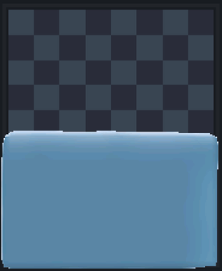

`run_water_perf_suite` plays the tour ([`tests/suite_water_perf.c`](../tests/suite_water_perf.c))
under each experiment's tunables and times every stage of the update, `flip3_step()`'s
own stages and r3d's; [`tools/water_tables.py`](water_tables.py) turns its capture into tables.

<!-- generated: water-stages check: python launcher/main/apps/render_lab/tools/water_tables.py --check -->
### Measured stages

The scripted tour at 33 ms of water per frame, one row per phase, from a board capture (2 runs: means are the runs' mean, p95 and worst their worst). Update is the simulation and the surface; draw is r3d drawing the water's dynamic mesh.

| Phase | Frames | Substeps/frame | Triangles | Particles | Frame mean / p95 ms | Update mean / p95 ms | Draw mean / p95 ms |
|---|---:|---:|---:|---:|---:|---:|---:|
| rest | 46 | 2.0 | 1265 | 1093 | 77.0 / 78.6 | 50.5 / 52.3 | 13.5 / 14.0 |
| tilt | 136 | 2.0 | 1352 | 1093 | 78.4 / 80.0 | 51.2 / 52.8 | 14.2 / 15.1 |
| flat | 91 | 2.0 | 1565 | 1093 | 81.3 / 87.9 | 52.7 / 55.4 | 15.7 / 19.4 |
| return | 46 | 2.0 | 1315 | 1093 | 77.4 / 78.8 | 51.0 / 52.2 | 13.5 / 13.9 |
| settle | 45 | 2.0 | 1250 | 1093 | 76.8 / 78.4 | 50.2 / 51.7 | 13.7 / 14.0 |
| shake | 60 | 2.0 | 1336 | 1093 | 78.0 / 79.6 | 51.0 / 52.5 | 14.1 / 14.6 |

Where the `base` update and draw go, ms per frame:

| Stage | rest | tilt | flat | return | settle | shake |
|---|---:|---:|---:|---:|---:|---:|
| water.field | 2.56 | 2.45 | 2.46 | 2.46 | 2.46 | 2.46 |
| water.through | 0.50 | 0.49 | 0.52 | 0.49 | 0.47 | 0.48 |
| water.nets | 4.83 | 4.76 | 5.32 | 4.72 | 4.56 | 4.85 |
| water.shade | 1.25 | 1.28 | 1.47 | 1.25 | 1.19 | 1.26 |
| water.build | 3.23 | 3.28 | 3.96 | 3.25 | 3.04 | 3.24 |
| water.step | 38.62 | 38.91 | 38.86 | 38.74 | 38.36 | 38.59 |
| step: p2g | 16.05 | 16.02 | 16.06 | 16.06 | 15.98 | 16.02 |
| step: accel | 0.38 | 0.38 | 0.38 | 0.38 | 0.38 | 0.38 |
| step: pressure | 9.97 | 10.29 | 10.24 | 10.07 | 9.79 | 10.00 |
| step: g2p | 11.02 | 11.01 | 10.98 | 11.03 | 11.02 | 10.99 |
| step: advect | 0.14 | 0.14 | 0.15 | 0.14 | 0.14 | 0.15 |
| step: collide | 0.55 | 0.55 | 0.55 | 0.55 | 0.55 | 0.55 |
| r3d.cull | 0.05 | 0.10 | 0.10 | 0.10 | 0.09 | 0.10 |
| r3d.transform | 0.36 | 0.71 | 0.85 | 0.72 | 0.69 | 0.70 |
| r3d.draw | 6.38 | 13.18 | 14.48 | 12.43 | 12.66 | 13.03 |
| r3d.upscale | 1.50 | 2.94 | 2.93 | 2.92 | 2.93 | 2.95 |

Each experiment against the base, update mean ms per frame:

| Configuration | rest | tilt | flat | return | settle | shake |
|---|---:|---:|---:|---:|---:|---:|
| base | 50.5 | 51.2 | 52.7 | 51.0 | 50.2 | 51.0 |
| one_core | 76.0 | 76.6 | 78.8 | 76.6 | 75.5 | 76.1 |
| sub4 | 88.6 | 89.8 | 91.5 | 89.0 | 88.6 | 89.6 |
| sub1 | 31.0 | 31.6 | 32.8 | 31.1 | 31.0 | 30.2 |
| index_order | 54.0 | 54.1 | 55.9 | 53.9 | 53.5 | 53.5 |
| samples2 | 58.9 | 60.1 | 62.6 | 59.6 | 58.7 | 60.0 |
| plane | 21.1 | 22.4 | 25.1 | 22.0 | 21.1 | 21.5 |

Internal RAM around each configuration, KB free / largest block:

| Configuration | before | running | after |
|---|---:|---:|---:|
| base | 62 / 31 | 58 / 31 | 59 / 31 |
| one_core | 59 / 31 | 58 / 31 | 59 / 31 |
| sub4 | 59 / 31 | 58 / 31 | 59 / 31 |
| sub1 | 59 / 31 | 58 / 31 | 59 / 31 |
| index_order | 59 / 31 | 58 / 31 | 59 / 31 |
| samples2 | 59 / 31 | 58 / 31 | 59 / 31 |
| plane | 59 / 31 | 58 / 31 | 59 / 31 |

Source: `water-stages-board.log`
<!-- /generated: water-stages -->

### Small fill

`render_lab.small_fill_ceiling`, `render_lab.small_fill_gate` and
`render_lab.small_fill_style` apply to the scene camera each frame.
The BOOT menu has a SMALL FILL dropdown with every `SMALL_FILL_` preset;
picking one sets the three tunables. Every menu option is in a release
image too.
The host renderer picks one by its menu label, as
`--small-fill "FAST - DITHER"`.

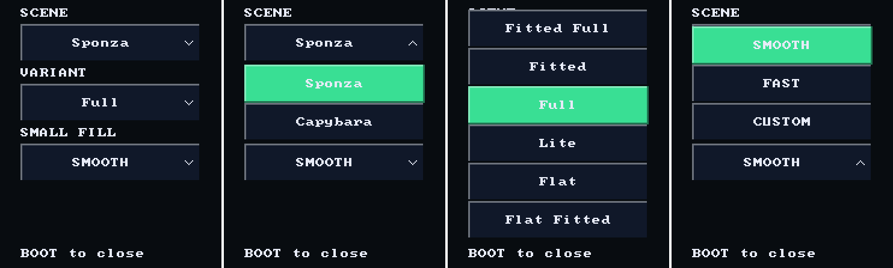

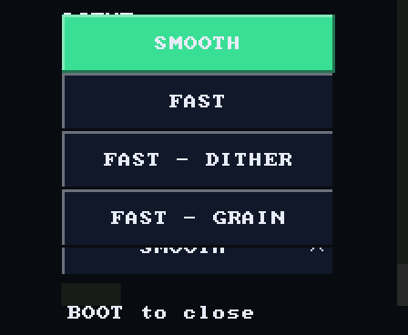

Below it, UPSCALE picks how a draw half the panel's width or less fills the panel:
SHARP repeats pixels (the default), SMOOTH blends within a surface and keeps
depth edges sharp
([Dynamic-Resolution.md](../../../../../docs/render/frame/Dynamic-Resolution.md#upscaling-within-a-surface)).
It sets `render_lab.upscale`.

The generic scene viewer accepts `--small-fill CEILING,GATE,STYLE`; its defaults
come from `SMALL_FILL_SMOOTH`. Styles use the `small_fill_style_t` values.
The [engine feature](../../../../../docs/render/Mesh-Rendering.md#small-fill)
defines the axes and defaults.

```sh
sh launcher/tools/render/scene_viewer.sh launcher/demo/sponza/sponza.scene.toml \
    --object atrium_fitted_full --small-fill 12,16,1 -o grain.bmp
```

The app host accepts `--tune` before entry or `--live-tune` after entry.

### Menu renders

`--menu` presses BOOT on the first frame, so the render shows the scene menu
instead of the scene. `--tap X,Y` adds one press and release there, in panel
pixels: `menu-capybara-clips` opens the clip list. The menu draws over a
solid background with no float on its path, so these renders are pinned in
`render_lab_render_baseline.txt`. Re-pin with `--update-baseline` after
looking at the images.

### Camera presentation

`render_lab.present` selects the scene camera's present mode: NEAREST (0, the
default), SCANLINE (1) or DOUBLE (2), in `camera_present_t` order. Both scenes
apply it every frame, and the perf suites size and compose the same way.

```sh
autana tune render_lab.present 1
autana suite run_sponza_perf_suite --set render_lab.present=1
sh launcher/main/apps/render_lab/tools/render_lab_render_host.sh --build-only -o /tmp/present
/tmp/present/render_lab_render --scene sponza-fitted-full --tune render_lab.present=1 --no-hud -o /tmp/present/scan.bmp
```

Seeded `perf_compare` on one board, eight seeds per side, ms per frame:

| Scene | NEAREST | SCANLINE | Δ |
|---|---:|---:|---:|
| sponza fitted-full | 45.4 | 32.9 | −27.7% |
| sponza full | 43.1 | 31.2 | −27.7% |
| sponza flat | 32.7 | 25.1 | −23.3% |
| sponza lite | 34.8 | 24.3 | −30.0% |
| sponza fitted | 35.2 | 24.8 | −29.5% |
| sponza flat-fitted | 32.9 | 25.4 | −22.7% |
| capybara render (paused) | 6.75 | 3.87 | −42.7% |

A separate scoped A/B on the same day (one flash, two interleaved repeats) timed
all three modes on sponza fitted-full, in ms:

| Quarter | NEAREST | DOUBLE | SCANLINE |
|---|---:|---:|---:|
| portrait | 45.4 | 31.9 | 32.7 |
| landscape | 42.4 | 30.3 | 31.1 |

The lines follow the panel's rows and darken the clear background too. The
engine page shows the [presentation GIFs](../../../../../docs/render/frame/Dynamic-Resolution.md#camera-presentation).

### Debug views

`--view shaded|depth|tiles|motion|meshlets` selects the declared context view.
Depth and tiles show a lit-mesh scene's depth buffer, or that depth
reduced to `RASTER_SHOW_TILE` squares. The depth is `raster_draw()`'s
own buffer, unchanged; `raster_show()` only colours it and takes each
tile's farthest depth, so the views are what the renderer holds at the
moment it upscales the frame. Near is bright and far dark, stretched over the
range that frame drew, so grey compares pixels within a frame, not across
frames; a pixel nothing reached takes the scene's clear colour, as the
shaded frame does, and a tile with one such pixel is empty.

They are ordinary renders: `sponza-depth-*.bmp` and `sponza-tiles-*.bmp`
beside `sponza-*.bmp`, each with a `.png` when Pillow is installed, turned to
the panel's orientation and the size the script declares. The picture is the
renderer's resolution, half the panel's each way, upscaled like the shaded
one. They are `|nopin` too.
`--view` sets the tunable `render_lab.view`, so on a development build
`autana tune render_lab.view N` selects view N: zero is shaded, and the remaining
values follow the render_debug_view_t table order in render/context/render_context.c. `--view` on a
scene with no lit mesh, an unknown name or no value fails the run.
`tests/test_render_views.py` checks the views against the shaded render.
Motion paints offsets red for x and green for y. Meshlets paints each mesh
cluster a flat hue, with disjoint IDs across instances.

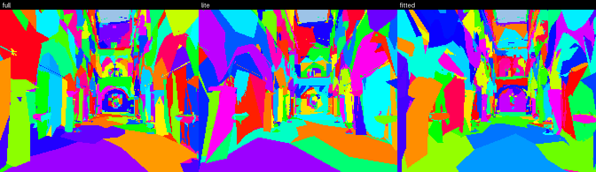

A pose of a camera path is `--frames` times `--dt`. `--camera NAME`
selects a scene camera; omitted, it draws the first camera.
`--console FRAME:WORDS` runs the board's `render WORDS` command, such as
`clip walk 400`, before frame FRAME draws; repeat it for a sequence.
`--dump DIR` writes each frame's raster colour and depth, before the
upscale, to `DIR/NNNN.raw` for the frame generation experiment
([Frame-Generation.md](../../../../../docs/render/frame/Frame-Generation.md)).

`dynres_quality.sh [--scene-file F --scene KEY] [--args "ARGS"] WORK OUT.csv CAMERA WxH [WxH ...]`
scores each size against the reference along that camera's clip, at
intervals taken from the script and over the clip's full period. Per-path
results belong in `docs/render/data/dynamic-resolution-quality-CAMERA.csv`.
`upscale_quality.sh` runs it per scene under each upscale filter, for
[Dynamic-Resolution.md](../../../../../docs/render/frame/Dynamic-Resolution.md#upscaling-within-a-surface):

```sh
sh launcher/main/apps/render_lab/tools/upscale_quality.sh /tmp/upscale docs/render/data/upscale-filter-quality.csv     docs/render/data/upscale-frames camera launcher/demo/bistro/bistro.scene.toml:bistro-fitted-full     launcher/demo/sponza/sponza.scene.toml:sponza-fitted-full launcher/demo/sponza/sponza.scene.toml:sponza-fitted     launcher/demo/sponza/sponza.scene.toml:sponza-flat-fitted launcher/demo/sponza/sponza.scene.toml:sponza     launcher/demo/sponza/sponza.scene.toml:sponza-flat launcher/demo/sponza/sponza.scene.toml:sponza-lite
```

The tour is authored as camera keys in `launcher/demo/sponza/tour.keys.toml`;
the pack build bakes it, so an edit there needs nothing else.

A host pose can be drawn with:

```sh
render_lab_render --scene sponza --frames 1 --dt 15000 --view depth -o depth.bmp
```

## On the board

A development build answers these from any shell, so a measurement selects
its scene by name rather than through the menu:

| Command | Does |
|---|---|
| `autana render clips` | the showing scene's clips, and which one the picker holds; a scene without a clip picker does not answer |
| `autana render clip <name> [blend_ms]` | plays that clip, blending over blend_ms, which the picker then keeps (its current blend when omitted) |
| `autana render scenes` | every scene's key and name, and which one is showing |
| `autana render scene <key>` | switches to the scene with exactly that key, such as `sponza`, `sponza-lite` or `sponza-flat-fitted` |
| `sh launcher/main/apps/render_lab/tools/floor_shots.sh [--flash] --out <dir>/shots.txt <scene>@<ms>...` | screenshots each pose at the chosen size and at the dynamic-resolution floor, into `<dir>` |
| `autana render pose <ms>` | holds a Sponza or Bistro scene's camera at that time along its path; `autana render pose play` lets it move again |
| `autana tune render_lab.scale <n>` | the fixed render scale in hundredths of the panel: 200 is half size |
| `autana tune render_lab.budget <ms>` | dynamic resolution on the scene showing; 0 turns it off, as does the menu's DYNAMIC RES |
| `autana tune render_lab.framegen 1` | every other frame is generated from the one before instead of drawn; 0 draws them all, as does the menu's FRAME GEN |
| `autana tune render_lab.orbit_ms <ms>` | turns the Capybara scene's camera once about the capybara every that many milliseconds; 0 stops it |

The Capybara scene's BOOT menu holds the same clip picker: the CLIP
dropdown plays the chosen clip over the BLEND slider's time.


A screenshot's state carries an `app` object naming the scene, whether the
menu is open and the scale, so two captures can
be checked to have measured the same thing.

## Images in the docs

`doc_images.sh` here makes these in `docs/images/overview/`, run by
`launcher/tools/render/render_doc_images.sh`; see "Images in these docs" in
[`docs/tools/Render-Harness.md`](../../../../../docs/tools/Render-Harness.md).

| Image | Shows |
|---|---|
| `render-lab-sponza.gif` | the start of the Sponza flythrough, on the fitted full mesh |
| `render-lab-capybara.gif` | every clip the capybara scene lists, in its order and for an equal time, each blended into the next and, more slowly, back to the first, as the camera turns once around it |
| `render-lab-water.gif` | the water scene's swing (`render water swing`): rocked side to side, hard and then calmer, flipped over and straight back twice on the way, leaned back so the surface shows, in the `FAST - DITHER` small fill; landscape, as the other clips |

Run the app shots from the repository root with Python, Pillow, numpy and ffmpeg:

```sh
PYTHON=python sh launcher/main/apps/render_lab/tools/doc_images.sh /path/to/out /path/to/work
```

`tests/test_sky_through_walls.py`
checks the app flythrough against its sky-through-wall ceilings.

## Sponza poses

The flythrough is a glTF camera animation, `launcher/demo/sponza/flythrough.glb`,
named by `launcher/demo/sponza/flythrough.anim.toml`. Its poses for
[`report_triangle_sizes.sh`](../../../../tools/r3d/README.md#triangle-sizes)
come from [`tools/anim/track_host.py`](../../../../tools/anim/README.md),
which runs the device's track sampler over the clip, at the poses
`suite_sponza_perf.c` times (every `SPONZA_PERF_POSE_EVERY_MS`) and the size
`sponza_content.h` names and the lens of the scene's camera object
(`launcher/demo/sponza/sponza.scene.toml`):

```sh
pose_every_ms=$(python -c \
    'import sys; sys.path.insert(0, "launcher/tools"); from build.c_header import read_define; print(read_define("launcher/main/apps/render_lab/sponza_content.h", "SPONZA_PERF_POSE_EVERY_MS"))')
python launcher/tools/anim/track_host.py \
    launcher/demo/sponza/flythrough.anim.toml \
    --every "$pose_every_ms" \
    --poses camera 184 224 0.62 6 |
    ./launcher/tools/r3d/report_triangle_sizes.sh \
        --mesh sponza.atrium -
```

## The capybara asset

`launcher/demo/capybara/capybara.blend` is a hand-modelled low-poly capybara
with a control rig and in-place loops at 30 fps: `idle`, `walk`, `walk_fast`,
`gallop` and `half_bound`. It is the source asset for skinned-mesh import;
nothing in the build reads it.

Its glTF export, `capybara.glb`, is a cached bake: deform bones only,
every loop as an animation, four influences per vertex. Host tools that read
glTF use it, such as the
[skinned-mesh lighting](../../../../../docs/render/animation/Skinned-Lighting.md)
measurement; `bake.py path capybara.glb` prints where it is.
`capybara.import.toml` names the
`.blend` and the loops to export (the file also holds the rig's own
`capyrigAction`), and `launcher/tools/bake/bake.py` runs the model-agnostic
exporter in Blender. By hand, it is:

```sh
blender --background --factory-startup --python launcher/tools/gltf/blend_skin_to_glb.py -- \
    launcher/demo/capybara/capybara.blend capybara.glb \
    --clips idle,walk,walk_fast,gallop,half_bound
```

and measure the lighting again:

```sh
launcher/tools/r3d/skin_light/report_skin_light.sh "$(python launcher/tools/bake/bake.py path capybara.glb)" gallop
```

## Meshlet size captures

Use the [meshlet capture recipe](../../../../tools/render/README.md#meshlet-size-captures)
with `--scene launcher/demo/sponza/sponza.scene.toml` and
`--suite run_sponza_perf_suite --size-tune sponza_perf.shipped_meshlet`. Its fixed flythrough samples measure the selected
renderer with both culling settings. The generated table belongs to
[Baked-Mesh](../../../../../docs/render/offline/Baked-Mesh.md#meshlets).

## Skinned frame comparison

The model-independent skin-frame tool compares scene-controlled C skinning
with the glTF reference and generates a sheet of two versus four influences.
The selected source vertices are marked red in enlarged crops. All panels use
bind colours, so the comparison isolates deformation rather than lighting.

```sh
python launcher/tools/r3d/skin/skin_frame.py "$(python launcher/tools/bake/bake.py path capybara.glb)" \
  --poses gallop:200 half_bound:200 \
  --vertices 7,11,44,54,77,129,171,205,211,260,302 \
  --out launcher/main/apps/render_lab/tools/images/skin-frame
```

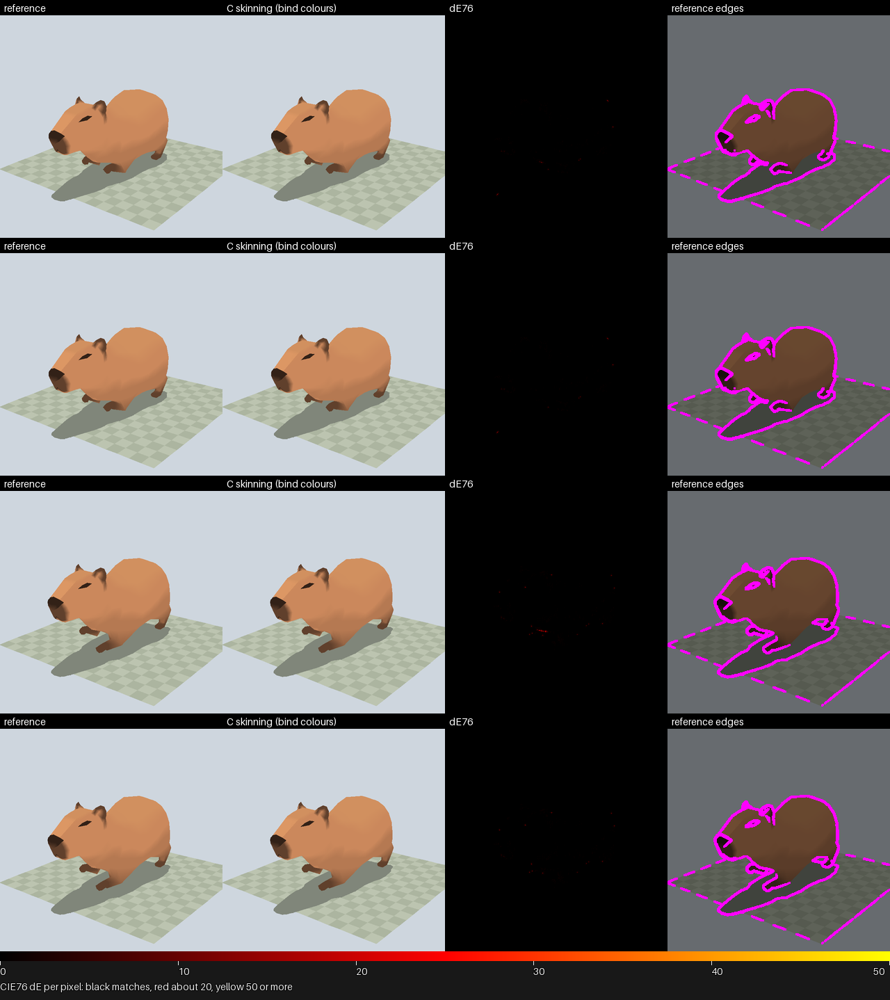

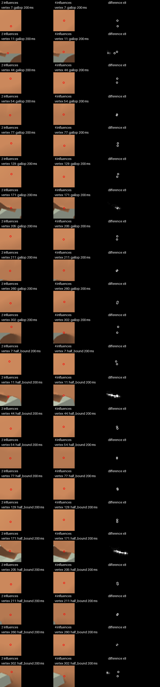

The circles locate the corresponding posed vertex in each panel; a crop may
show a vertex through an occluding surface. The image difference is amplified
by the comparison tool. Exact packed-weight reference errors and per-vertex
influence-limit displacements are in
[`measurements.json`](images/skin-frame/measurements.json). This tool bakes its
own LMSH with the meshlet writer, so its vertex layout is independent
of a scene pack's bake. The sheets use the poses named on the command line.

## Perf capture quarters

The render perf suites use the shared `tests/r3d_perf_quarters.h` table.
Every timed render window runs with an explicit portrait or landscape
viewport; full-frame windows hold the display quarter. Rows include
`quarter=portrait` or `quarter=landscape`.
The skin, animate and animation-step windows have no quarter because they
do not render. The frame harness requires a held quarter and its
fixture releases the hold at exit. Raster sizes stay in physical panel
axes; the camera viewport applies the quarter turn.

`report_performance.py` reports each render quarter separately. The skin
budget is `SKIN_PERF_BUDGET_NS_PER_VERTEX` in `tests/skin_perf_log.h`.
Meshlet and reference-quality report readers select portrait for their
matching reference views.

## Frame timing profiles

`run_sponza_perf_suite` measures fixed camera poses at the spacing in
`SPONZA_PERF_POSE_EVERY_MS`. Each frame-cost row reports mean, worst,
median and p95 before presentation, with stage splits at those same poses.
The pixel-equivalence checks in that suite and the camera checks in
`suite_sponza.c` use `SPONZA_POSE_EVERY_MS`.

`run_render_lab_frame_profile_suite` plays each Sponza scene's camera clip,
Bistro fitted-full's camera clip and the capybara gallop for one clip period in each perf quarter. It times
update, render, compose and present with the HUD hidden.

After each playback the suite finds its frame peaks: the path is a loop, so
a peak across its end is one. A peak counts when it stands
`FRAME_PROFILE_PEAK_PERCENT` of its height above the higher of
its two saddles, and its slowest frame stands for it. The suite then replays
poses paused: `FRAME_PROFILE_PATH_POSES` spread evenly along the path, then
every frame peak's, highest first.
Each replay draws one frame through the `cull` view for its counts and
`FRAME_PROFILE_REPLAY_DRAWS` shaded frames for their frame-cost report.
A paused frame does not skin again, so capybara's replayed split has no
skinning in it. `report_performance.py` ranks the frame peaks with those
splits and counts. Its "why" names the stage that most exceeds the path's
median pose and the count furthest above its median.

The [perf tools](../../../../tools/perf/README.md#real-time-playback)
define playback timing and the `frame_profile:` line format.

Each suite owns a table of mean goals and p95 ceilings per row and quarter.
Zero means unpegged: it logs without enforcing a budget. Board ceilings
are reported without enforcement under QEMU.

<!-- generated: frame-timing-profiles check: python launcher/main/apps/render_lab/tools/frame_profile_tables.py --peak-board 1 --scenes sponza-fitted-full,sponza-fitted,sponza,sponza-lite,sponza-flat,sponza-flat-fitted,capybara,bistro-fitted-full --check -->
### Measured frame rate

Cells list board 1 / board 2.
Playback includes update, render, compose and present.

| Scene | Quarter | Mean fps | p50 ms | p95 ms | Worst ms |
|---|---|---:|---:|---:|---:|
| sponza-fitted-full | portrait | 20.9 / 20.9 | 48.5 / 48.5 | 59.8 / 60.0 | 61.2 / 61.3 |
| sponza-fitted-full | landscape | 22.1 / 22.0 | 45.9 / 45.9 | 55.4 / 55.5 | 57.8 / 58.0 |
| sponza-fitted | portrait | 25.2 / 25.1 | 40.1 / 40.3 | 47.0 / 47.1 | 48.1 / 48.2 |
| sponza-fitted | landscape | 26.4 / 26.4 | 38.4 / 38.4 | 43.9 / 43.9 | 44.8 / 44.8 |
| sponza | portrait | 20.7 / 20.7 | 48.9 / 48.9 | 58.5 / 58.6 | 60.1 / 60.3 |
| sponza | landscape | 21.5 / 21.4 | 46.8 / 46.8 | 55.5 / 55.7 | 57.5 / 57.4 |
| sponza-lite | portrait | 24.2 / 24.2 | 42.0 / 42.1 | 47.3 / 47.4 | 48.4 / 48.5 |
| sponza-lite | landscape | 24.9 / 24.9 | 40.5 / 40.7 | 45.5 / 45.6 | 46.4 / 46.5 |
| sponza-flat | portrait | 24.5 / 24.5 | 41.0 / 40.9 | 49.7 / 49.8 | 50.6 / 50.6 |
| sponza-flat | landscape | 24.9 / 24.9 | 40.4 / 40.4 | 48.2 / 48.2 | 49.3 / 49.4 |
| sponza-flat-fitted | portrait | 25.2 / 25.1 | 40.3 / 40.4 | 49.9 / 49.9 | 51.4 / 51.4 |
| sponza-flat-fitted | landscape | 26.1 / 26.1 | 38.8 / 38.9 | 47.5 / 47.5 | 49.3 / 49.2 |
| capybara | portrait | 47.8 / 47.7 | 20.9 / 20.9 | 21.4 / 21.3 | 21.8 / 21.9 |
| capybara | landscape | 46.6 / 46.6 | 21.5 / 21.5 | 22.0 / 21.8 | 22.2 / 21.9 |
| bistro-fitted-full | portrait | 26.4 / 26.4 | 37.9 / 37.9 | 57.9 / 58.0 | 62.8 / 63.1 |
| bistro-fitted-full | landscape | 25.2 / 25.1 | 40.0 / 40.0 | 56.8 / 56.9 | 59.2 / 59.5 |

### Frame peaks along the path

Board 1. Each scene's played frames over path time, its frame peaks ranked,
above what the cull counted at poses replayed paused along the path.

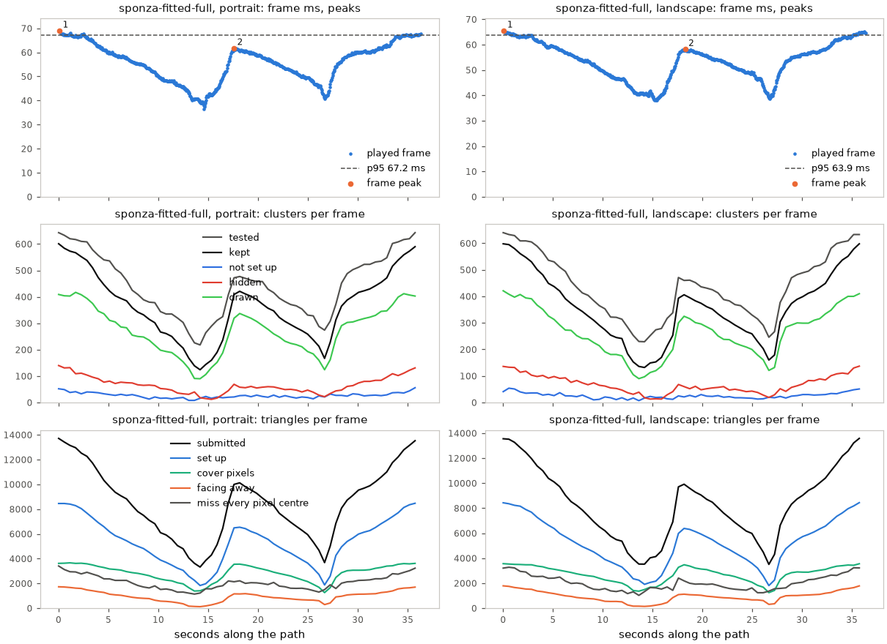
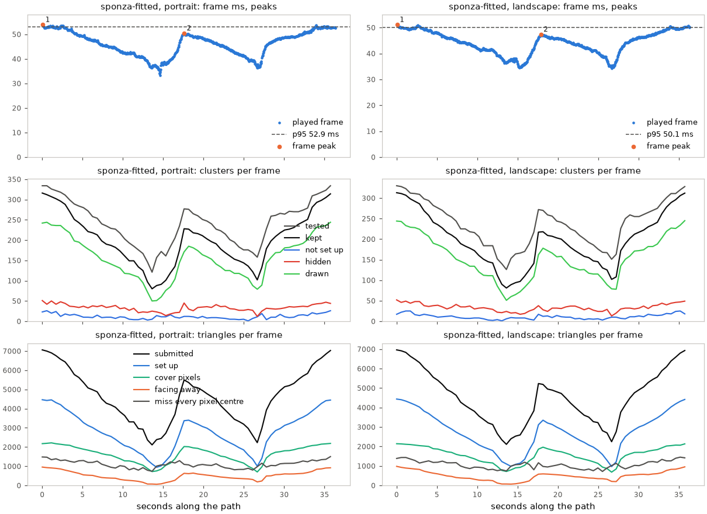
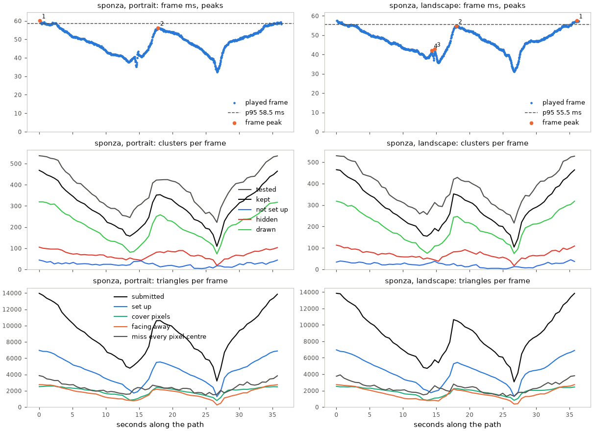
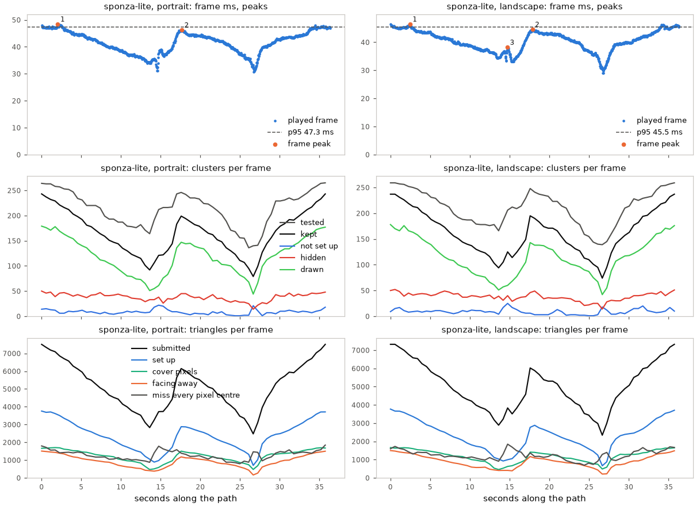
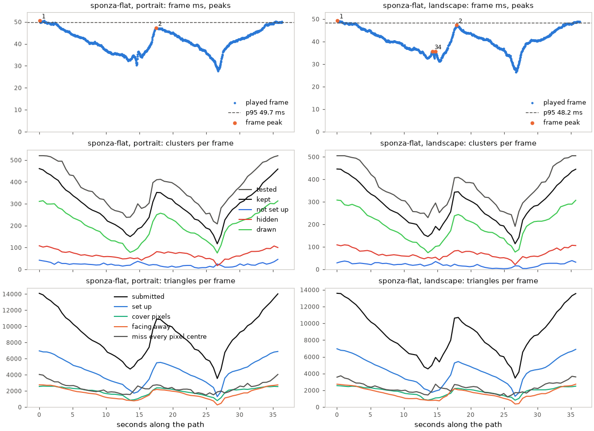
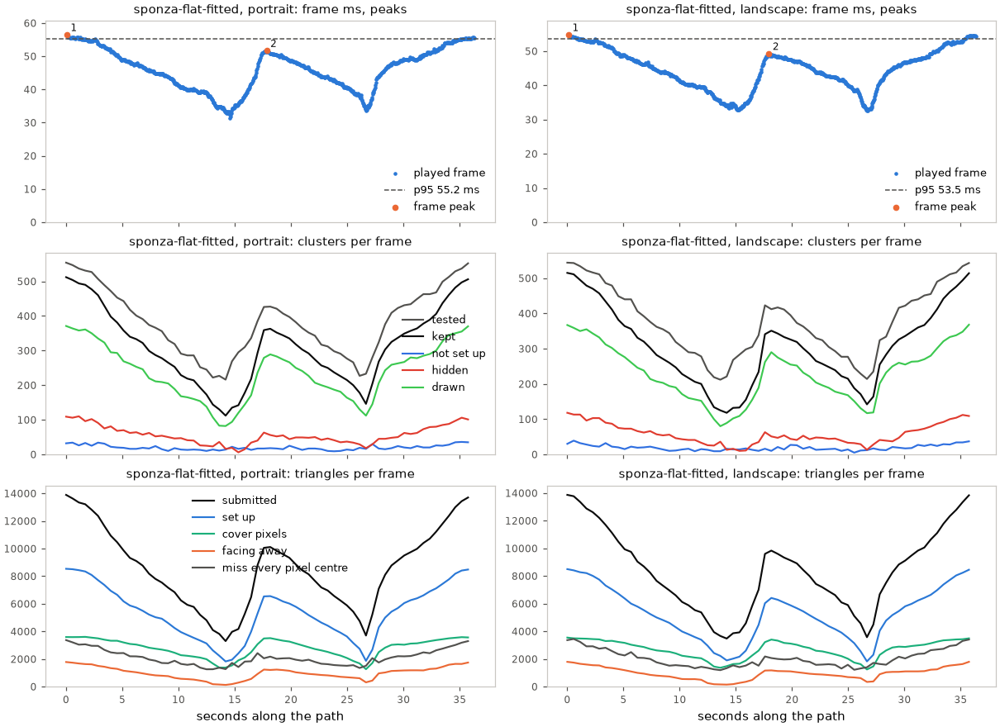
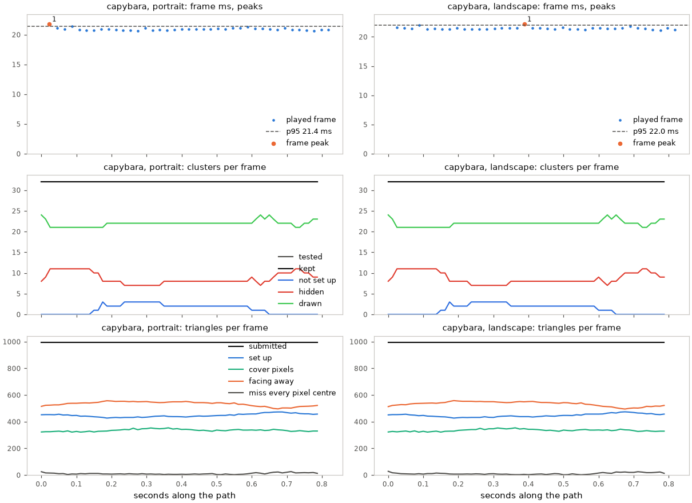
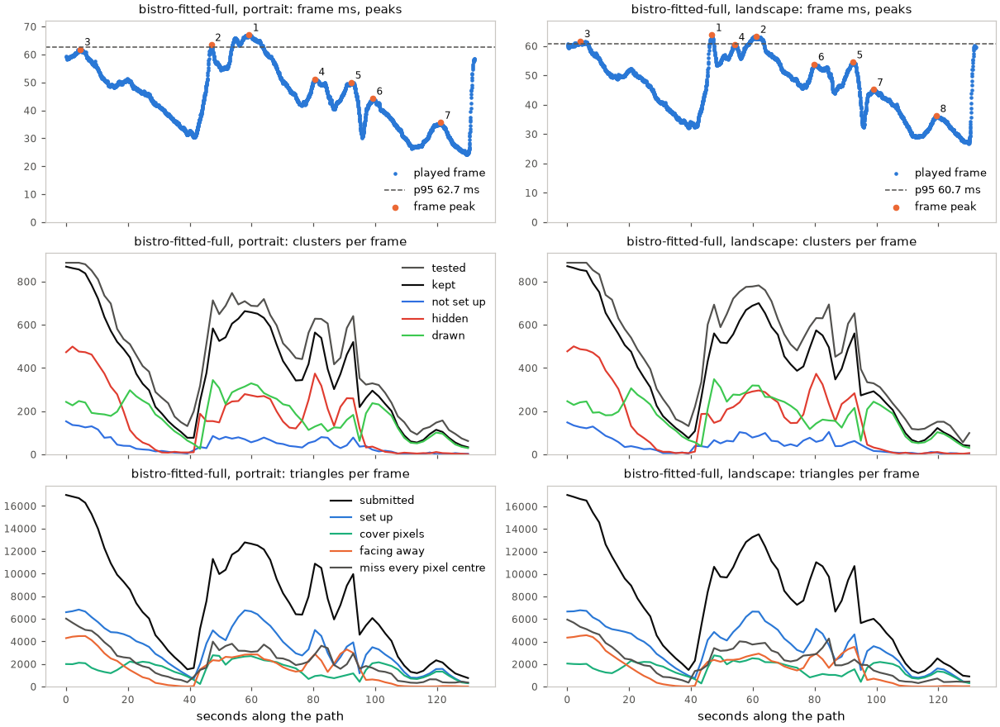

#### Frame peaks, ranked

One played frame per peak along the looping path, its slowest, ranked by wall time. A peak counts
when it stands 8% of its height above the higher of its two saddles.
Stage ms and counts come from replaying each pose paused;
Why compares them with the median of the 64 poses spaced evenly along the path (1024 of 1024 read).

| Scene | Quarter | Rank | Path s | Frame ms | Prominence ms | r3d.cull ms | r3d.transform ms | r3d.draw ms | r3d.upscale ms | Clusters tested / kept / hidden / drawn | Triangles submitted / set up / cover / miss / away | Why |
|---|---|---:|---:|---:|---:|---:|---:|---:|---:|---|---|---|
| sponza | portrait | 1 | 0.07 | 60.1 | 27.9 | 0.73 | 4.82 | 40.81 | 2.54 | 537 / 467 / 104 / 319 | 13927 / 6944 / 2516 / 3859 / 2737 | r3d.draw +7.2 ms; triangles missed ×1.66 median |
| sponza | portrait | 2 | 17.82 | 56.2 | 21.0 | 0.63 | 3.66 | 39.55 | 2.57 | 423 / 354 / 81 / 260 | 10690 / 5541 / 2412 / 2619 / 2114 | r3d.draw +5.9 ms; triangles facing away ×1.24 median |
| sponza | landscape | 1 | 36.07 | 57.5 | 26.4 | 0.68 | 4.77 | 39.13 | 2.58 | 530 / 465 / 112 / 319 | 13848 / 6991 / 2517 / 3703 / 2751 | r3d.draw +7.8 ms; triangles facing away ×1.73 median |
| sponza | landscape | 2 | 17.97 | 54.8 | 19.0 | 0.63 | 3.62 | 37.98 | 2.57 | 425 / 351 / 88 / 247 | 10609 / 5452 / 2277 / 2635 / 2093 | r3d.draw +6.7 ms; triangles facing away ×1.32 median |
| sponza | landscape | 3 | 14.73 | 42.9 | 5.8 | 0.57 | 1.98 | 27.29 | 2.57 | 309 / 192 / 46 / 108 | 5793 / 1946 / 1105 / 2588 / 846 | r3d.cull -0.0 ms; triangles missed ×1.14 median |
| sponza | landscape | 4 | 14.29 | 42.2 | 4.1 | 0.54 | 1.70 | 26.75 | 2.61 | 286 / 172 / 47 / 92 | 5200 / 1760 / 958 / 2094 / 817 | r3d.upscale +0.0 ms; triangles missed ×0.93 median |
| sponza-lite | portrait | 1 | 2.03 | 48.4 | 17.7 | 0.41 | 2.25 | 32.45 | 2.66 | 258 / 227 / 47 / 170 | 7050 / 3537 / 1698 / 1585 / 1387 | r3d.draw +4.3 ms; triangles facing away ×1.48 median |
| sponza-lite | portrait | 2 | 17.65 | 46.2 | 15.1 | 0.44 | 1.93 | 31.51 | 2.70 | 245 / 199 / 42 / 149 | 6146 / 2903 / 1502 / 1386 / 1149 | r3d.draw +3.4 ms; triangles facing away ×1.23 median |
| sponza-lite | landscape | 1 | 2.46 | 46.4 | 17.3 | 0.40 | 2.17 | 30.69 | 2.70 | 252 / 219 / 45 / 164 | 6774 / 3437 / 1628 / 1438 / 1335 | r3d.draw +4.2 ms; triangles facing away ×1.53 median |
| sponza-lite | landscape | 2 | 17.86 | 44.5 | 11.5 | 0.42 | 1.89 | 29.91 | 2.62 | 246 / 193 / 42 / 147 | 5977 / 2889 / 1444 / 1271 / 1112 | r3d.draw +3.4 ms; clusters drawn ×1.30 median |
| sponza-lite | landscape | 3 | 14.70 | 38.2 | 4.8 | 0.40 | 1.15 | 23.29 | 2.59 | 211 / 120 / 36 / 60 | 3680 / 996 / 626 / 1680 / 425 | r3d.cull +0.0 ms; triangles missed ×1.38 median |
| sponza-flat | portrait | 1 | 0.05 | 50.6 | 23.0 | 0.66 | 4.52 | 31.89 | 2.59 | 520 / 461 / 105 / 313 | 14083 / 6933 / 2545 / 4083 / 2731 | r3d.draw +6.0 ms; triangles missed ×1.81 median |
| sponza-flat | portrait | 2 | 17.48 | 47.2 | 16.9 | 0.62 | 3.44 | 30.84 | 2.56 | 410 / 355 / 84 / 250 | 10991 / 5533 / 2369 / 2739 / 2250 | r3d.draw +4.9 ms; triangles facing away ×1.32 median |
| sponza-flat | landscape | 1 | 0.05 | 49.3 | 22.8 | 0.64 | 4.29 | 30.86 | 2.56 | 505 / 446 / 110 / 307 | 13586 / 6933 / 2560 / 3604 / 2723 | r3d.draw +6.1 ms; triangles facing away ×1.71 median |
| sponza-flat | landscape | 2 | 17.86 | 47.3 | 16.1 | 0.63 | 3.33 | 30.40 | 2.63 | 407 / 348 / 91 / 243 | 10776 / 5492 / 2268 / 2640 / 2091 | r3d.draw +5.7 ms; clusters hidden ×1.38 median |
| sponza-flat | landscape | 3 | 14.27 | 35.7 | 3.0 | 0.54 | 1.54 | 20.63 | 2.58 | 277 / 163 / 43 / 91 | 5077 / 1758 / 960 / 1992 / 815 | r3d.cull -0.0 ms; triangles missed ×0.88 median |
| sponza-flat | landscape | 4 | 14.75 | 35.6 | 3.0 | 0.59 | 1.81 | 20.42 | 2.43 | 295 / 191 / 54 / 102 | 5927 / 1916 / 1088 / 2734 / 817 | r3d.cull +0.0 ms; triangles missed ×1.21 median |
| sponza-fitted | portrait | 1 | 0.05 | 48.1 | 20.3 | 0.42 | 2.72 | 31.17 | 2.57 | 280 / 260 / 33 / 217 | 7259 / 4527 / 2258 / 1737 / 846 | r3d.draw +4.9 ms; triangles facing away ×2.33 median |
| sponza-fitted | portrait | 2 | 17.73 | 44.6 | 15.0 | 0.41 | 2.09 | 29.67 | 2.64 | 264 / 201 / 22 / 173 | 5605 / 3497 / 2063 / 1205 / 610 | r3d.draw +3.4 ms; triangles facing away ×1.68 median |
| sponza-fitted | landscape | 1 | 0.05 | 44.8 | 16.7 | 0.38 | 2.70 | 28.39 | 2.63 | 279 / 254 / 29 / 222 | 7079 / 4530 / 2231 / 1537 / 863 | r3d.draw +4.0 ms; triangles facing away ×2.37 median |
| sponza-fitted | landscape | 2 | 18.03 | 41.7 | 12.9 | 0.38 | 2.01 | 26.72 | 2.68 | 248 / 194 / 21 / 167 | 5403 / 3413 / 1928 / 1141 / 582 | r3d.draw +2.4 ms; triangles facing away ×1.60 median |
| sponza-fitted-full | portrait | 1 | 0.07 | 61.2 | 30.8 | 0.64 | 5.64 | 41.48 | 2.59 | 550 / 499 / 72 / 410 | 13854 / 8041 / 3563 / 4146 / 1507 | r3d.draw +7.7 ms; triangles facing away ×2.22 median |
| sponza-fitted-full | portrait | 2 | 17.70 | 56.5 | 24.0 | 0.63 | 3.93 | 38.76 | 2.63 | 457 / 363 / 47 / 305 | 10386 / 6606 / 3502 / 2588 / 1022 | r3d.draw +5.0 ms; triangles facing away ×1.51 median |
| sponza-fitted-full | landscape | 1 | 0.06 | 57.8 | 25.5 | 0.63 | 5.43 | 38.41 | 2.59 | 539 / 496 / 80 / 406 | 13748 / 8075 / 3553 / 3951 / 1549 | r3d.draw +7.7 ms; triangles facing away ×2.45 median |
| sponza-fitted-full | landscape | 2 | 17.97 | 51.9 | 19.3 | 0.61 | 3.82 | 34.95 | 2.56 | 447 / 351 / 40 / 300 | 10018 / 6359 / 3275 / 2530 / 984 | r3d.draw +4.2 ms; triangles facing away ×1.55 median |
| sponza-flat-fitted | portrait | 1 | 0.06 | 51.4 | 24.8 | 0.62 | 5.06 | 32.06 | 2.58 | 542 / 488 / 72 / 393 | 14179 / 8272 / 3533 / 4251 / 1520 | r3d.draw +7.1 ms; triangles facing away ×2.20 median |
| sponza-flat-fitted | portrait | 2 | 17.87 | 45.5 | 17.4 | 0.58 | 3.73 | 28.31 | 2.63 | 446 / 359 / 55 / 294 | 10657 / 6578 / 3427 / 2750 / 1078 | r3d.draw +3.4 ms; triangles facing away ×1.56 median |
| sponza-flat-fitted | landscape | 1 | 0.05 | 49.3 | 22.8 | 0.66 | 5.01 | 30.07 | 2.63 | 540 / 485 / 73 / 400 | 14011 / 8301 / 3539 / 4014 / 1551 | r3d.draw +6.5 ms; triangles facing away ×2.38 median |
| sponza-flat-fitted | landscape | 2 | 18.35 | 42.7 | 14.9 | 0.56 | 3.48 | 25.86 | 2.64 | 418 / 337 / 34 / 286 | 10063 / 6285 / 3228 / 2575 / 1004 | r3d.draw +2.3 ms; triangles facing away ×1.54 median |
| capybara | portrait | 1 | 0.02 | 21.8 | 1.1 | 0.05 | 0.30 | 5.78 | 2.65 | 32 / 32 / 11 / 21 | 994 / 449 / 327 / 21 / 522 | r3d.upscale +0.0 ms; triangles missed ×2.47 median |
| capybara | landscape | 1 | 0.39 | 22.2 | 1.1 | 0.05 | 0.30 | 6.47 | 2.78 | 32 / 32 / 8 / 22 | 994 / 438 / 348 / 5 / 549 | r3d.draw +0.1 ms; triangles covering ×1.04 median |
| bistro-fitted-full | portrait | 1 | 59.27 | 62.8 | 42.8 | 0.74 | 7.34 | 42.05 | 2.56 | 656 / 622 / 252 / 332 | 12749 / 6618 / 2609 / 3246 / 2820 | r3d.draw +17.5 ms; clusters hidden ×2.01 median |
| bistro-fitted-full | portrait | 2 | 46.99 | 58.5 | 8.1 | 0.87 | 7.68 | 37.32 | 2.47 | 768 / 651 / 200 / 349 | 13498 / 5533 / 2746 / 5035 / 2926 | r3d.draw +12.7 ms; triangles missed ×2.54 median |
| bistro-fitted-full | portrait | 3 | 4.71 | 58.1 | 31.5 | 0.80 | 9.49 | 34.82 | 2.50 | 854 / 818 / 448 / 248 | 16813 / 6807 / 2154 / 5378 / 4477 | r3d.draw +10.2 ms; clusters hidden ×3.57 median |
| bistro-fitted-full | portrait | 4 | 80.47 | 46.6 | 9.4 | 0.65 | 6.17 | 26.89 | 2.50 | 605 / 534 / 350 / 127 | 10986 / 5021 / 1001 / 2981 / 2893 | r3d.draw +2.3 ms; clusters hidden ×2.79 median |
| bistro-fitted-full | portrait | 5 | 93.02 | 45.2 | 8.9 | 0.71 | 5.68 | 26.54 | 2.51 | 605 / 490 / 226 / 186 | 10006 / 3917 / 1349 / 3031 / 2926 | r3d.draw +2.0 ms; triangles facing away ×1.96 median |
| bistro-fitted-full | portrait | 6 | 99.61 | 39.9 | 13.6 | 0.41 | 3.27 | 23.06 | 2.44 | 330 / 291 / 34 / 236 | 6060 / 3405 / 2121 / 1755 / 657 | r3d.upscale -0.1 ms; triangles covering ×1.37 median |
| bistro-fitted-full | portrait | 7 | 121.17 | 31.5 | 9.3 | 0.22 | 1.35 | 17.19 | 2.57 | 157 / 118 / 9 / 103 | 2413 / 1635 / 1382 / 646 / 44 | r3d.upscale +0.0 ms; triangles covering ×0.89 median |
| bistro-fitted-full | landscape | 1 | 59.92 | 59.2 | 36.6 | 0.80 | 7.66 | 38.11 | 2.44 | 735 / 651 / 279 / 313 | 13322 / 6615 / 2383 / 3855 / 2758 | r3d.draw +12.0 ms; clusters hidden ×2.14 median |
| bistro-fitted-full | landscape | 2 | 46.62 | 58.9 | 10.0 | 0.89 | 7.85 | 37.17 | 2.53 | 777 / 673 / 200 / 351 | 13977 / 5654 / 2719 / 5196 / 3102 | r3d.draw +11.0 ms; triangles missed ×2.38 median |
| bistro-fitted-full | landscape | 3 | 5.23 | 58.0 | 29.6 | 0.77 | 9.57 | 35.29 | 2.49 | 848 / 814 / 455 / 240 | 16737 / 6809 / 2032 / 5336 / 4500 | r3d.draw +9.1 ms; clusters hidden ×3.49 median |
| bistro-fitted-full | landscape | 4 | 54.23 | 57.0 | 5.4 | 0.80 | 6.42 | 36.69 | 2.43 | 697 / 548 / 181 / 287 | 11305 / 4947 / 2083 / 4018 / 2332 | r3d.draw +10.5 ms; triangles missed ×1.84 median |
| bistro-fitted-full | landscape | 5 | 92.96 | 50.6 | 10.9 | 0.75 | 6.14 | 32.97 | 2.58 | 625 / 524 / 246 / 224 | 10638 / 4673 / 1785 / 2428 / 3409 | r3d.draw +6.8 ms; triangles facing away ×2.07 median |
| bistro-fitted-full | landscape | 6 | 79.84 | 49.8 | 8.4 | 0.72 | 6.43 | 30.76 | 2.48 | 624 / 555 / 350 / 144 | 11390 / 5261 / 1061 / 2970 / 3048 | r3d.draw +4.6 ms; clusters hidden ×2.68 median |
| bistro-fitted-full | landscape | 7 | 99.31 | 41.3 | 12.9 | 0.39 | 3.46 | 24.48 | 2.48 | 332 / 293 / 34 / 241 | 6091 / 3530 / 2146 / 1596 / 718 | r3d.upscale -0.0 ms; triangles covering ×1.30 median |
| bistro-fitted-full | landscape | 8 | 120.03 | 32.0 | 7.4 | 0.25 | 1.34 | 17.60 | 2.64 | 152 / 120 / 6 / 103 | 2447 / 1634 / 1368 / 696 / 24 | r3d.upscale +0.1 ms; triangles covering ×0.83 median |

Sources:

- `frame-profile-1-board.log`
- `frame-profile-2-board.log`
<!-- /generated: frame-timing-profiles -->
