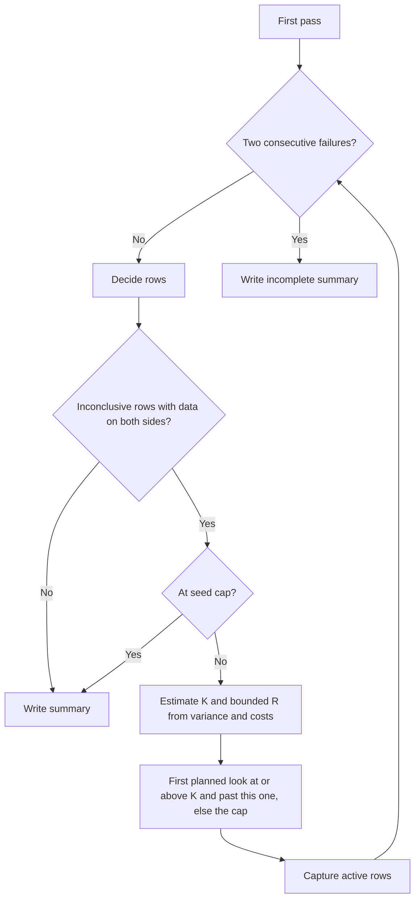

# Performance comparison

`perf_compare.sh A B` compares revisions using independent, random positive
layout seeds on each side. `A A` calibrates the same source with two distinct
seed sets. Arguments accept revisions or existing project directories.
The wrapper restores `origin/main`'s release image afterwards;
`--no-restore` omits that flash.

Each `--suite NAME TESTS TABLE` takes a registered suite name, comma-separated
test patterns (`-` for all), and a table command (`-` reads timing rows from
the capture). Commands run from the current repository: `@CAPTURE@` and
`@TABLE@` become this flash's capture and table files, `@PROJECT@` the revision's
project tree. A table command requiring budgets must read them from that tree,
for example with `--source @PROJECT@/path/to/suite.c`.

```sh
launcher/tools/perf/perf_compare.sh A B -o comparison --rng-seed 42 \
  --suite run_sponza_perf_suite flythrough -

launcher/tools/perf/perf_compare.sh A A -o calibration \
  --suite run_sand_perf_suite frame_budget \
  'python3 launcher/main/apps/sand/tools/report_performance.py @CAPTURE@ @TABLE@ --source @PROJECT@/launcher/main/apps/sand/tests/suite_sand_perf.c'
```

`--perf-scope` is forced for every seeded flash.
Captures, status checks and restore use `autana` on PATH; `--autana COMMAND`
overrides all three for a host replay.

## Measurement plan

The default RNG seed is a fresh draw. `--rng-seed` replays a recorded draw;
`plan.json`, `summary.md` and `comparison.json` record it. Every A/B pair
randomises which side flashes first, with distinct seeds across both sides.
`plan.json` records each flash's seed, side, runs, suites and any capture error.

The first pass takes the seed count needed for exact permutation resolution
at nominal alpha, repeats a subset to estimate run variance, and captures
the remaining seeds once. The summary states actual first-pass size, runs
per look, cap and run clamp. Run variance is pooled from repeated seeds;
every complete seed contributes a mean and layout estimate.



Planned looks double towards `--max-seeds` and end at the cap. Nominal alpha
is divided across planned looks, then split equally between Welch difference
and TOST equivalence families. Each family uses Holm adjustment across rows,
including rows decided earlier. Permutation is an AND cross-check at nominal
alpha. Its Monte Carlo resample count keeps the add-one floor well below that
alpha; settings exceeding the supported resample budget are refused before
measurement.

Measured build/flash/boot and run costs, sigma_run and sigma_flash feed
Kalibera-Jones R and required K. K uses the per-look Holm share and one-sided
TOST alpha. R is clamped between 1 and `MAX_RUNS`; the summary states the
clamp, including when estimated layout variance is zero. A later flash uses
the largest R recommendation among active rows. Capture test ownership maps
active rows to the shortest unique substrings. An unknown owner or a test
without a substring that fits falls back to the whole suite. Filter width
and pattern count limits are read from each project's `launcher/test/suites.h`; requests over
the pattern count are split across invocations on the same flash.

Each suite's deadline is `--timeout` per requested run plus `--wait`.
Table commands also run with a deadline of `--timeout`. Status logs
bracket each flash; the boot id must match its project's seeded build id.
Later suites request that build id. Complete captures exiting 1 are kept;
other exit codes, incomplete captures, wrong builds and table errors are
failures. Two consecutive failures stop measurement and write an incomplete
summary with decisions and errors. A success resets the failure count.
Failed attempts consume the cap.

## Reading the result

Each complete seed mean is one independent observation. A row missing from
any run of a seed excludes that seed for that row; expected rows remain
visible even when a later flash omits them. The table shows arithmetic means,
medians of seed means, B/A, delta time and a Welch interval on log seed means.
The interval describes a geometric ratio, whereas B/A uses arithmetic means.
Instruction deltas use complete, unambiguous, non-overflowing counter pairs.

No change means Holm-adjusted TOST equivalence within +/-threshold; regressed
or improved means a significant Welch difference with permutation agreement
that is not shown equivalent, so a move smaller than the threshold can still
be regressed.

Both arithmetic and log-difference signs must agree on direction. **Added**
means B only and **removed** A only when successful captures on the other
side list the suite's tests without that row. **Not measured** means missing
or zero timings or no complete seed. These rows receive no extra seeds.
**Inconclusive** rows with data on both sides alone receive more measurements,
and remain inconclusive when the cap is reached. Permutation n/a means there
is too little positive timing data to compute it. A/A calibration allows
inconclusive noisy rows; lack of significance does not establish equivalence.

Statistics, variance estimates, seed/build identities and capture records
are preserved beside the summary. Host tests use an injected runner:

```sh
python -m unittest discover -s launcher/tools/perf/tests
```

See [Layout-Noise.md](../../../docs/tools/Layout-Noise.md) for seeded builds
and pilot variance definitions.
